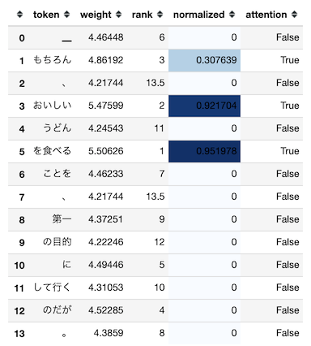
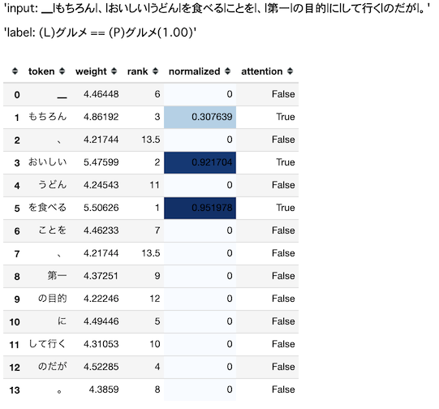
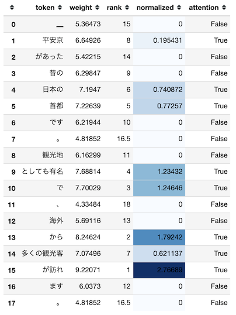

# 自然言語処理で使われるAttentionのWeightを可視化する

## TL;DR

自然言語処理で使われるAtentionのAttention Weight(Attention Weightを加味した入力シーケンス毎の出力)を可視化します。
これにより、モデルが推論を行った際に入力のどこに注目していたのかをユーザに表示することが可能です。



### ベンチマーク用データ

[京都大学情報学研究科--NTTコミュニケーション科学基礎研究所 共同研究ユニット](http://nlp.ist.i.kyoto-u.ac.jp/kuntt/index.php)が提供するブログの記事に関するデータセットを利用しました。 このデータセットでは、ブログの記事に対して以下の4つの分類がされています。

* グルメ
* 携帯電話
* 京都
* スポーツ

### 実行環境

* [Keras](https://keras.io/ja/)
* [keras-self-attention](https://github.com/CyberZHG/keras-self-attention)

## ソースコード

### モジュールの準備

```python
import pandas as pd
import numpy as np
import keras
from keras.layers import Dense, Dropout, LSTM, Embedding
from keras.layers.wrappers import Bidirectional
from keras.callbacks import EarlyStopping, ModelCheckpoint
from keras import Input, Model, utils
from keras.preprocessing.sequence import pad_sequences
from keras.callbacks import EarlyStopping
import subprocess
from text_vectorian import SentencePieceVectorian
from keras_self_attention import SeqSelfAttention

# 以下は別途コーパスを利用する場合の指定です。
tokenizer_filename = '../train-nlp-models/models/wikija_bccwj-sentencepiece_300.model'
vectorizer_filename = '../train-nlp-models/models/wikija_bccwj-sentencepieced_word2vec_300.model'

version = 'v4'
vectorian = SentencePieceVectorian(tokenizer_filename=tokenizer_filename, vectorizer_filename=vectorizer_filename)
# 別途コーパスを指定しない場合は、以下の様にfilenameの指定は不要です。
# vectorian = SentencePieceVectorian()
```

### 関数の準備

```python
def _load_labeldata(train_dir):
    features_df = pd.read_csv(f'{train_dir}/features.csv')
    labels_df = pd.read_csv(f'{train_dir}/labels.csv')
    label2index = {k: i for i, k in enumerate(labels_df['label'].unique())}
    index2label = {i: k for i, k in enumerate(labels_df['label'].unique())}
    class_count = len(label2index)
    labels = utils.np_utils.to_categorical([label2index[label] for label in labels_df['label']], num_classes=class_count)

    features = []

    for feature in features_df['feature']:
        features.append(vectorian.fit(feature).indices)

    features = pad_sequences(features, maxlen=vectorian.max_tokens_len)

    print(f'データ数: {len(features_df)}, ラベル数: {class_count}, Labels Shape: {labels.shape}, Features Shape: {features.shape}')

    return {
        'class_count': class_count,
        'label2index': label2index,
        'index2label': index2label,
        'labels': labels,
        'features': features,
        'input_len': vectorian.max_tokens_len
    }
```

```python
def _create_model(input_shape, hidden, class_count):
    input_tensor = Input(input_shape)
    common_input = vectorian.get_keras_layer(trainable=True)(input_tensor)
    x1 = SeqSelfAttention(name='attention')(common_input)
    x1 = Bidirectional(LSTM(hidden))(x1)
    output_tensor = Dense(class_count, activation='softmax', name='class')(x1)

    model = Model(input_tensor, output_tensor)
    model.compile(loss='categorical_crossentropy', optimizer='nadam', metrics=['acc', 'mse', 'mae'])

    return model
```

### 学習の実行

```python
data = _load_labeldata('data/trains')
hidden = 356
model = _create_model(data['features'][0].shape, hidden, data['class_count'])
model.summary()
```

```
_________________________________________________________________
Layer (type)                 Output Shape              Param #
=================================================================
input_1 (InputLayer)         (None, 66)                0
_________________________________________________________________
embedding_1 (Embedding)      (None, 66, 300)           58875900
_________________________________________________________________
attention (SeqSelfAttention) (None, 66, 300)           19265
_________________________________________________________________
bidirectional_1 (Bidirection (None, 712)               1871136
_________________________________________________________________
class (Dense)                (None, 4)                 2852
=================================================================
Total params: 60,769,153
Trainable params: 60,769,153
Non-trainable params: 0
_________________________________________________________________
```

```python
train_features = data['features']
train_labels = data['labels']
tests_features_df = pd.read_csv(f'data/tests/features.csv')
tests_labels_df = pd.read_csv(f'data/tests/labels.csv')
tests_features = []
for feature in tests_features_df['feature']:
    tests_features.append(vectorian.fit(feature).indices)
tests_features = pad_sequences(tests_features, maxlen=data['input_len'])
tests_labels = utils.np_utils.to_categorical([data['label2index'][label] for label in tests_labels_df['label']], num_classes=data['class_count'])

model_filename=f'models/model_{version}.h5'
history = model.fit(train_features, train_labels,
                    epochs=50,
                    batch_size=256,
                    validation_data=(tests_features, tests_labels),
                    shuffle=False,
                    callbacks = [
                        EarlyStopping(patience=5, monitor='val_acc', mode='max'),
                        ModelCheckpoint(filepath=model_filename, monitor='val_acc', mode='max', save_best_only=True)
                    ])
```

```
Train on 3767 samples, validate on 419 samples
Epoch 1/50
3767/3767 [==============================] - 11s 3ms/step - loss: 1.5711 - acc: 0.5904 - mean_squared_error: 0.1444 - mean_absolute_error: 0.2480 - val_loss: 0.6378 - val_acc: 0.7637 - val_mean_squared_error: 0.0813 - val_mean_absolute_error: 0.1644
Epoch 2/50
3767/3767 [==============================] - 6s 2ms/step - loss: 0.4803 - acc: 0.8224 - mean_squared_error: 0.0630 - mean_absolute_error: 0.1363 - val_loss: 0.5856 - val_acc: 0.7852 - val_mean_squared_error: 0.0736 - val_mean_absolute_error: 0.1379

[省略]

Epoch 19/50
3767/3767 [==============================] - 6s 2ms/step - loss: 0.0036 - acc: 0.9979 - mean_squared_error: 5.9641e-04 - mean_absolute_error: 0.0012 - val_loss: 1.3261 - val_acc: 0.7852 - val_mean_squared_error: 0.0911 - val_mean_absolute_error: 0.1114
Epoch 20/50
3767/3767 [==============================] - 6s 2ms/step - loss: 0.0036 - acc: 0.9979 - mean_squared_error: 6.0128e-04 - mean_absolute_error: 0.0011 - val_loss: 1.3428 - val_acc: 0.7852 - val_mean_squared_error: 0.0917 - val_mean_absolute_error: 0.1117
Epoch 21/50
3767/3767 [==============================] - 6s 2ms/step - loss: 0.0036 - acc: 0.9979 - mean_squared_error: 6.0739e-04 - mean_absolute_error: 0.0011 - val_loss: 1.3664 - val_acc: 0.7852 - val_mean_squared_error: 0.0923 - val_mean_absolute_error: 0.1118
```

### 推論時にAttention Weightを出力するようにモデルをロードする

```python
from keras.models import load_model

model = load_model(model_filename, custom_objects=SeqSelfAttention.get_custom_objects())
model = Model(inputs=model.input, outputs=[model.output, model.get_layer('attention').output])
model.summary()
```

```
_________________________________________________________________
Layer (type)                 Output Shape              Param #
=================================================================
input_1 (InputLayer)         (None, 66)                0
_________________________________________________________________
embedding_1 (Embedding)      (None, 66, 300)           58875900
_________________________________________________________________
attention (SeqSelfAttention) (None, 66, 300)           19265
_________________________________________________________________
bidirectional_1 (Bidirection (None, 712)               1871136
_________________________________________________________________
class (Dense)                (None, 4)                 2852
=================================================================
Total params: 60,769,153
Trainable params: 60,769,153
Non-trainable params: 0
```

### 推論時にAttention Weightを可視化する

```python
input_index = 83

input_text = tests_features_df['feature'][input_index]
tokens = vectorian.tokenizer._tokenizer.encode_as_pieces(input_text)

test_feature = vectorian.fit(input_text).indices
test_feature = pad_sequences([test_feature], maxlen=data['input_len'])
predict = model.predict(test_feature)

display('input: ' + '|'.join(tokens))
prob = predict[0][0].max()
display('label: (L)' + tests_labels_df['label'][input_index] + ' == (P)' +
        data['index2label'][predict[0][0].argmax()] + f'({prob:.2f})')

# 入力シーケンスはpad_sequenceにより、以下の様に0でpre paddingしています。
# [0 0 0 0 x1(300) x2(300) x3(300)]
# Attention Weightは入力シーケンスに対応して計算されるため、
# 入力シーケンスのpadding分シフトします。
weights = [w.max() for w in predict[1][0][-len(tokens):]]
df = pd.DataFrame([tokens, weights], index=['token', 'weight']).T

mean = np.asarray(weights).mean()
df['rank'] = df['weight'].rank(ascending=False)
df['normalized'] = df['weight'].apply(lambda w: max(w - mean, 0))
df['weight'] = df['weight'].astype('float32')
df['attention'] = df['normalized'] > 0
df = df.style.background_gradient(cmap='Blues', subset=['normalized'])

display(df)
```

## まとめ

[推論時にAttention Weightを可視化する](#attention-weight_1)の実行結果は以下の通りです。
`input`は推論時に入力するテキスト、`label`の`(L)`は正解ラベル、`(P)`は推論結果となるラベルです(括弧内は確率)。

その下の表が入力テキストのトークン毎にAttention Weightを考慮した出力結果の一覧です。



`attention`が`True`の行が推論結果となる`グルメ`に対して、Attentionとして意味のあるWeightとして処理されたトークンです。
`グルメ`を推論した際に、以下のトークンに注目していたということになります。

* もちろん
* おいしい
* を食べる

`平安京があった昔の日本の首都です。観光地としても有名で、海外から多くの観光客が訪れます。`を入力テキストとした場合の出力結果は以下のとおりです(推論したラベルは`京都`)。



## 参考文献

* [Stack Overflow - How to visualize attention weights?](https://stackoverflow.com/questions/53867351/how-to-visualize-attention-weights)
* [GitHub - keras-self-attention](https://github.com/CyberZHG/keras-self-attention)