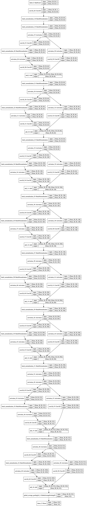

# Auto-Kerasを使って見る

## TL:DR

AutoML実装の一つである[Auto-Keras](https://autokeras.com/)を使ってみました。
Auto-Kerasのインストールから、チュートリアルにある[MNIST](http://yann.lecun.com/exdb/mnist/)の分類モデルの作成までです。

## AutoMLとは

`AutoML(Automated Machine Learning)`は、機械学習プロセスの自動化を目的とした技術のことです。
以下のQiitaの記事がとてもわかりやすいです。

* [Qiita - その機械学習プロセス、自動化できませんか？](https://qiita.com/Hironsan/items/30fe09c85da8a28ebd63)

商用では[DataRobot](https://www.datarobot.com/jp/)や[GCP AutoML](https://cloud.google.com/automl/)などがありますが、
OSSとしての実装も存在します。

今回はAutoMLのOSS実装の一つである`Auto-Keras`を使ってみました。
バージョンは`autokeras-0.3.5`を使用しました。

## インストール方法

### PyTorchをインストールする

Auto-Kerasは[PyTorch](https://pytorch.org/)を利用しています。
このため、PyTorchをインストールする必要があります。

PyTorchのインストール方法は[公式サイト](https://pytorch.org/)に従ってください。

### モジュールの依存関係解決

公式サイトでは以下のpipコマンドでインストール可能となっていますが、私の環境ではモジュールの依存関係からうまくいきませんでした。

```bash
pip install autokeras
```

このため、以下よりモジュールをダウンロードしてモジュールの依存関係を定義している`setup.py`を変更します。

* <https://pypi.org/project/autokeras/#files>

`tar.gz`を解凍して`setup.py`を以下の様に編集します。

```python
setup(
    name='autokeras',
    packages=find_packages(exclude=('tests',)),
    install_requires=['scipy==1.1.0',
                      'torch>=0.4.1', # == を >= に変更します。
                      'torchvision>=0.2.1', # == を >= に変更します。
                      'numpy==1.14.5',
                      'keras==2.2.2',
                      'scikit-learn==0.20.1',
                      'scikit-image==0.13.1',
                      'tqdm==4.25.0',
                      'tensorflow==1.10.0',
                      'imageio==2.4.1',
                      'requests==2.20.1',
                      'GPUtil==1.3.0',
                      'lightgbm==2.2.2',
                      'pandas==0.23.4'],
```

変更後は再度`tar.gz`で圧縮してください。

### Auto-Kerasのインストール

前述で`tar.gz`形式で圧縮したファイルのフォルダに移動し、以下のコマンドでインストールができます。

```bash
pip install autokeras-0.3.5.tar.gz --user
```

## 利用方法

### Windows環境でGPUを利用する場合の注意事項

`autokeras-0.3.5`では、そのままではWindows環境ではGPUを利用できませんでした。
CPUかGPUかの判定を行っている`utils.py`において、Windows環境では動作しないコマンドが指定されているためです。

このため、`utils.py`を以下の様に変更します。`utils.py`は`--user`付きでインストールしているのであれば、以下のパスに存在します。

* %HOME%\Roaming\Python\Python36\site-packages\autokeras\utils.py

`utils.py`は無条件で最初のGPUを指定するようにしています。複数のGPUを利用する場合は、適宜修正してください。

```python
def get_device():
    """ If CUDA is available, use CUDA device, else use CPU device.

    When choosing from CUDA devices, this function will choose the one with max memory available.

    Returns: string device name.
    """
    # TODO: could use gputil in the future
    # fix begin.
    #device = 'cpu'
    device = 'cuda:0'
    print(device)

    return device
    # fix end.
    '''
    if torch.cuda.is_available():
        try:
            # smi_out=
            #       Free                 : xxxxxx MiB
            #       Free                 : xxxxxx MiB
            #                      ....
            smi_out = subprocess.check_output('nvidia-smi -q -d Memory | grep -A4 GPU|grep Free', shell=True)
            print(smi_out)
            if isinstance(smi_out, bytes):
                smi_out = smi_out.decode('utf-8')
        except subprocess.SubprocessError:
            warnings.warn('Cuda device successfully detected. However, nvidia-smi cannot be invoked')
            return 'cpu'
        visible_devices = os.getenv('CUDA_VISIBLE_DEVICES', '').split(',')
        if len(visible_devices) == 1 and visible_devices[0] == '':
            visible_devices = []
        visible_devices = [int(x) for x in visible_devices]
        memory_available = [int(x.split()[2]) for x in smi_out.splitlines()]
        for cuda_index, _ in enumerate(memory_available):
            if cuda_index not in visible_devices and visible_devices:
                memory_available[cuda_index] = 0

        if memory_available:
            if max(memory_available) != 0:
                device = 'cuda:' + str(memory_available.index(max(memory_available)))
    return device
    '''
```

### 学習の実行

AutoMLなので学習の実行は非常に簡単です。以下のコードでMNISTのデータセットのダウンロードから最適なモデルの探索までが実行されます。
実行時間は`time_limit`で指定した時間が使用されます。今回であれば12時間で最適なモデル探索を行いました。

```python
from keras.datasets import mnist
import autokeras
from autokeras.image.image_supervised import ImageClassifier

(x_train, y_train), (x_test, y_test) = mnist.load_data()
x_train = x_train.reshape(x_train.shape + (1,))
x_test = x_test.reshape(x_test.shape + (1,))

clf = ImageClassifier(verbose=True)
clf.fit(x_train, y_train, time_limit=12 * 60 * 60)
clf.final_fit(x_train, y_train, x_test, y_test, retrain=True)
y = clf.evaluate(x_test, y_test)
print(y)
```

### 学習結果

自動的に検証されたモデルは30個でした。
その中で恐らく`Accuracy(正答率)`だと思いますが、最高値は以下でした。

* 0.9946

#### モデル詳細

モデルの詳細は以下で確認しました。

```python
from keras.utils import plot_model
from keras.models import load_model

model_filename = 'models/my_model.h5'
clf.export_keras_model(model_filename)

model = load_model(model_filename)
plot_model(model, to_file='my_model.png')
```



## 使って見た感想

MNISTのように特定のデータセットに対して、ベストに近いモデルが検証済みである問題では効果を実感することができませんが、
汎用的には`Xception`をベースラインとして、Auto-Kerasで改善を探索するということが可能になります。

当然計算に時間はかかりますが、GCP AutoMLと違ってモデルの詳細を取得出来るので、転移学習などで応用も可能です。

今後、日本語を含めたNLPの実装についても検証したいと考えています。