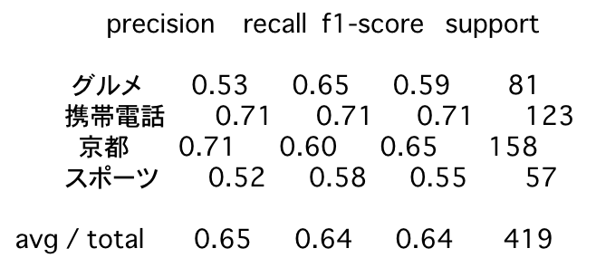
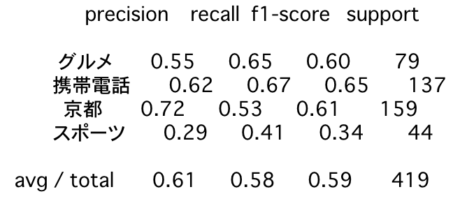

# 各種Tokenize手法に依存したベクトル化手法の比較

## TL;DR

以下のベクトル化手法を比較しました。

* [wikipedia2vec](https://wikipedia2vec.github.io/wikipedia2vec/)
* [sentencepieces + word2vec](https://github.com/google/sentencepiece/blob/master/python/README.md)
* [char2vec](https://qiita.com/youwht/items/0b204c3575c94fc786b8)

ベクトル化するための学習データとして日本語Wikipediaを使用しました。

### wikipedia2vec


```python
from wikipedia2vec import Wikipedia2Vec

word2vec_filename = 'models/jawiki_20180420_300d.pkl'
word2vec = Wikipedia2Vec.load(word2vec_filename)

test_word = '脂'

print(len(word2vec.dictionary))
print(word2vec.most_similar(word2vec.get_word(test_word), 10))
```

    1593143
    [(<Word 脂>, 0.99999994), (<Word 脂肪>, 0.60400623), (<Word 血合>, 0.59330285), (<Word 牛脂>, 0.5907982), (<Word グアヤク>, 0.5891678), (<Word 肪織>, 0.5861825), (<Word グリセリド>, 0.5824453), (<Word ガラスープ>, 0.5739102), (<Word 血合い>, 0.56854814), (<Word 臭み>, 0.5571986)]
    

### sentencepieces + word2vec


```python
from gensim.models.word2vec import Word2Vec
import sentencepiece as spm

sp = spm.SentencePieceProcessor()
sp.Load('models/wikisentence-piece.model')

test_word = '脂'
tokenized = sp.EncodeAsPieces(test_word)

sentencepieced_word2vec_filename = 'models/sentencepieced_word2vec_allwiki.model'
sentencepieced_word2vec = Word2Vec.load(sentencepieced_word2vec_filename)

print(len(sentencepieced_word2vec.wv.vocab))
print(tokenized)
print(sentencepieced_word2vec.most_similar(tokenized[1]))
```

    C:\Users\hidek\Anaconda3\lib\site-packages\gensim\utils.py:1212: UserWarning: detected Windows; aliasing chunkize to chunkize_serial
      warnings.warn("detected Windows; aliasing chunkize to chunkize_serial")
    

    171118
    ['▁', '脂']
    

    C:\Users\hidek\Anaconda3\lib\site-packages\ipykernel_launcher.py:15: DeprecationWarning: Call to deprecated `most_similar` (Method will be removed in 4.0.0, use self.wv.most_similar() instead).
      from ipykernel import kernelapp as app
    C:\Users\hidek\Anaconda3\lib\site-packages\gensim\matutils.py:737: FutureWarning: Conversion of the second argument of issubdtype from `int` to `np.signedinteger` is deprecated. In future, it will be treated as `np.int32 == np.dtype(int).type`.
      if np.issubdtype(vec.dtype, np.int):
    

    [('ニンニク', 0.8067691922187805), ('肉', 0.8009461760520935), ('脂肪', 0.7919986248016357), ('ゼリー', 0.786160945892334), ('ゼラチン', 0.7856716513633728), ('臭', 0.7705897688865662), ('粉末状', 0.7692583799362183), ('苦味', 0.7675473093986511), ('ニンジン', 0.7648000717163086), ('汁', 0.7606260776519775)]
    

### char2vec


```python
from gensim.models.word2vec import Word2Vec

char2vec_filename = 'models/mychar2vec_fromWikiALL.model'
char2vec = Word2Vec.load(char2vec_filename)

test_word = '脂'

print(len(char2vec.wv.vocab))
print(char2vec.most_similar(test_word))
```

    14535
    

    C:\Users\hidek\Anaconda3\lib\site-packages\ipykernel_launcher.py:9: DeprecationWarning: Call to deprecated `most_similar` (Method will be removed in 4.0.0, use self.wv.most_similar() instead).
      if __name__ == '__main__':
    C:\Users\hidek\Anaconda3\lib\site-packages\gensim\matutils.py:737: FutureWarning: Conversion of the second argument of issubdtype from `int` to `np.signedinteger` is deprecated. In future, it will be treated as `np.int32 == np.dtype(int).type`.
      if np.issubdtype(vec.dtype, np.int):
    

    [('糖', 0.9036800861358643), ('繊', 0.7795820832252502), ('剤', 0.7757814526557922), ('汁', 0.7682333588600159), ('酢', 0.7667589783668518), ('塩', 0.7649936676025391), ('酸', 0.7632763981819153), ('粉', 0.7586979269981384), ('菌', 0.751047670841217), ('臭', 0.7475357055664062)]
    

## ベンチマーク用データ

[京都大学情報学研究科--NTTコミュニケーション科学基礎研究所 共同研究ユニット](http://nlp.ist.i.kyoto-u.ac.jp/kuntt/index.php)が提供するブログの記事に関するデータセットを利用しました。 このデータセットでは、ブログの記事に対して以下の4つの分類がされています。

* グルメ
* 携帯電話
* 京都
* スポーツ


```python
import pandas as pd

gourmet_df = pd.read_csv('data/KNBC_v1.0_090925/corpus2/Gourmet.tsv', delimiter='\t', header=None).drop(columns=[0, 2, 3, 4, 5])
keitai_df = pd.read_csv('data/KNBC_v1.0_090925/corpus2/Keitai.tsv', delimiter='\t', header=None).drop(columns=[0, 2, 3, 4, 5])
kyoto_df = pd.read_csv('data/KNBC_v1.0_090925/corpus2/Kyoto.tsv', delimiter='\t', header=None).drop(columns=[0, 2, 3, 4, 5])
sports_df = pd.read_csv('data/KNBC_v1.0_090925/corpus2/Sports.tsv', delimiter='\t', header=None).drop(columns=[0, 2, 3, 4, 5])

gourmet_df['label'] = 'グルメ'
keitai_df['label'] = '携帯電話'
kyoto_df['label'] = '京都'
sports_df['label'] = 'スポーツ'

display(gourmet_df.head())
display(keitai_df.head())
display(kyoto_df.head())
display(sports_df.head())
```


<div>
<style scoped>
    .dataframe tbody tr th:only-of-type {
        vertical-align: middle;
    }

    .dataframe tbody tr th {
        vertical-align: top;
    }

    .dataframe thead th {
        text-align: right;
    }
</style>
<table border="1" class="dataframe">
  <thead>
    <tr style="text-align: right;">
      <th></th>
      <th>1</th>
      <th>label</th>
    </tr>
  </thead>
  <tbody>
    <tr>
      <th>0</th>
      <td>［グルメ］烏丸六角のおかき屋さん</td>
      <td>グルメ</td>
    </tr>
    <tr>
      <th>1</th>
      <td>六角堂の前にある、蕪村庵というお店に行ってきた。</td>
      <td>グルメ</td>
    </tr>
    <tr>
      <th>2</th>
      <td>おかきやせんべいの店なのだが、これがオイシイ。</td>
      <td>グルメ</td>
    </tr>
    <tr>
      <th>3</th>
      <td>のれんをくぐると小さな庭があり、その先に町屋風の店内がある。</td>
      <td>グルメ</td>
    </tr>
    <tr>
      <th>4</th>
      <td>せんべいの箱はデパートみたいな山積みではなく、間隔をあけて陳列されているのがまた良い。</td>
      <td>グルメ</td>
    </tr>
  </tbody>
</table>
</div>


<div>
<style scoped>
    .dataframe tbody tr th:only-of-type {
        vertical-align: middle;
    }

    .dataframe tbody tr th {
        vertical-align: top;
    }

    .dataframe thead th {
        text-align: right;
    }
</style>
<table border="1" class="dataframe">
  <thead>
    <tr style="text-align: right;">
      <th></th>
      <th>1</th>
      <th>label</th>
    </tr>
  </thead>
  <tbody>
    <tr>
      <th>0</th>
      <td>［携帯電話］プリペイドカード携帯布教。</td>
      <td>携帯電話</td>
    </tr>
    <tr>
      <th>1</th>
      <td>もはや’今さら’だが、という接頭句で始めるしかないほど今さらだが、私はプリペイド携帯をずっと...</td>
      <td>携帯電話</td>
    </tr>
    <tr>
      <th>2</th>
      <td>犯罪に用いられるなどによりかなりイメージを悪化させてしまったプリペイド携帯だが、一ユーザーと...</td>
      <td>携帯電話</td>
    </tr>
    <tr>
      <th>3</th>
      <td>かつてはこのような話を友人に振っても、「携帯電話の料金は親が払っているから別に．．．」という...</td>
      <td>携帯電話</td>
    </tr>
    <tr>
      <th>4</th>
      <td>そこで、携帯電話の料金を自分の身銭で払わざる得ない、あるいは得なくなったが所得が少ない、或い...</td>
      <td>携帯電話</td>
    </tr>
  </tbody>
</table>
</div>


<div>
<style scoped>
    .dataframe tbody tr th:only-of-type {
        vertical-align: middle;
    }

    .dataframe tbody tr th {
        vertical-align: top;
    }

    .dataframe thead th {
        text-align: right;
    }
</style>
<table border="1" class="dataframe">
  <thead>
    <tr style="text-align: right;">
      <th></th>
      <th>1</th>
      <th>label</th>
    </tr>
  </thead>
  <tbody>
    <tr>
      <th>0</th>
      <td>［京都観光］時雨殿に行った。</td>
      <td>京都</td>
    </tr>
    <tr>
      <th>1</th>
      <td>しぐれでん</td>
      <td>京都</td>
    </tr>
    <tr>
      <th>2</th>
      <td>２００６年１０月０９日。</td>
      <td>京都</td>
    </tr>
    <tr>
      <th>3</th>
      <td>時雨殿に行った。</td>
      <td>京都</td>
    </tr>
    <tr>
      <th>4</th>
      <td>８月に嵐山へドクターフィシュ体験で行った時に残念ながら閉館していたのでいつか行こうと思ってい...</td>
      <td>京都</td>
    </tr>
  </tbody>
</table>
</div>


<div>
<style scoped>
    .dataframe tbody tr th:only-of-type {
        vertical-align: middle;
    }

    .dataframe tbody tr th {
        vertical-align: top;
    }

    .dataframe thead th {
        text-align: right;
    }
</style>
<table border="1" class="dataframe">
  <thead>
    <tr style="text-align: right;">
      <th></th>
      <th>1</th>
      <th>label</th>
    </tr>
  </thead>
  <tbody>
    <tr>
      <th>0</th>
      <td>［スポーツ］私の生きがい</td>
      <td>スポーツ</td>
    </tr>
    <tr>
      <th>1</th>
      <td>入部３ヶ月目にはじめてのレースを経験した。</td>
      <td>スポーツ</td>
    </tr>
    <tr>
      <th>2</th>
      <td>今の１回生では１番漕暦が浅いのに持ち前の体力と精神力でレース出場権を手にした。</td>
      <td>スポーツ</td>
    </tr>
    <tr>
      <th>3</th>
      <td>そのレースは東大戦。</td>
      <td>スポーツ</td>
    </tr>
    <tr>
      <th>4</th>
      <td>２回生の中に混じっての初レース。</td>
      <td>スポーツ</td>
    </tr>
  </tbody>
</table>
</div>


```python
features_readable = []
labels = []

for p in gourmet_df.values:
    features_readable.append(p[0])
    labels.append([1, 0, 0, 0])
for p in keitai_df.values:
    features_readable.append(p[0])
    labels.append([0, 1, 0, 0])
for p in kyoto_df.values:
    features_readable.append(p[0])
    labels.append([0, 0, 1, 0])
for p in sports_df.values:
    features_readable.append(p[0])
    labels.append([0, 0, 0, 1])

print(len(features_readable))
print(len(labels))
```

    4186
    4186
    

## ベクトル化

### wordのベクトル化

#### Tokenize

word単位のtokenizeは[janome](https://github.com/mocobeta/janome)を使用しました。[NEologd](https://github.com/neologd/mecab-ipadic-neologd)を使用しました。組み込み手順として以下を参考にさせて頂きました。

* (very experimental) NEologd 辞書を内包した janome をビルドする方法
    * https://github.com/mocobeta/janome/wiki/(very-experimental)-NEologd-%E8%BE%9E%E6%9B%B8%E3%82%92%E5%86%85%E5%8C%85%E3%81%97%E3%81%9F-janome-%E3%82%92%E3%83%93%E3%83%AB%E3%83%89%E3%81%99%E3%82%8B%E6%96%B9%E6%B3%95

#### ベクトル化

[wikipedia2vec](https://wikipedia2vec.github.io/wikipedia2vec/)を使用しました。


```python
from janome.tokenizer import Tokenizer
import re
import pandas as pd

tokenizer = Tokenizer(mmap=True)

def get_word_tokens(df):
    all_tokens = []
    for sentence in df[:][0]:
        tokens = tokenizer.tokenize(sentence)
        base_forms = [token.base_form for token in tokens]
        all_tokens.append(base_forms)

    return all_tokens

word_tokenized_features = get_word_tokens(pd.DataFrame(features_readable))
display(pd.DataFrame(word_tokenized_features).head(5))
```


<div>
<style scoped>
    .dataframe tbody tr th:only-of-type {
        vertical-align: middle;
    }

    .dataframe tbody tr th {
        vertical-align: top;
    }

    .dataframe thead th {
        text-align: right;
    }
</style>
<table border="1" class="dataframe">
  <thead>
    <tr style="text-align: right;">
      <th></th>
      <th>0</th>
      <th>1</th>
      <th>2</th>
      <th>3</th>
      <th>4</th>
      <th>5</th>
      <th>6</th>
      <th>7</th>
      <th>8</th>
      <th>9</th>
      <th>...</th>
      <th>118</th>
      <th>119</th>
      <th>120</th>
      <th>121</th>
      <th>122</th>
      <th>123</th>
      <th>124</th>
      <th>125</th>
      <th>126</th>
      <th>127</th>
    </tr>
  </thead>
  <tbody>
    <tr>
      <th>0</th>
      <td>［</td>
      <td>グルメ</td>
      <td>］</td>
      <td>烏丸</td>
      <td>六角</td>
      <td>の</td>
      <td>おかき</td>
      <td>屋</td>
      <td>さん</td>
      <td>None</td>
      <td>...</td>
      <td>None</td>
      <td>None</td>
      <td>None</td>
      <td>None</td>
      <td>None</td>
      <td>None</td>
      <td>None</td>
      <td>None</td>
      <td>None</td>
      <td>None</td>
    </tr>
    <tr>
      <th>1</th>
      <td>六角堂</td>
      <td>の</td>
      <td>前</td>
      <td>に</td>
      <td>ある</td>
      <td>、</td>
      <td>蕪村</td>
      <td>庵</td>
      <td>という</td>
      <td>お</td>
      <td>...</td>
      <td>None</td>
      <td>None</td>
      <td>None</td>
      <td>None</td>
      <td>None</td>
      <td>None</td>
      <td>None</td>
      <td>None</td>
      <td>None</td>
      <td>None</td>
    </tr>
    <tr>
      <th>2</th>
      <td>おかき</td>
      <td>や</td>
      <td>せんべい</td>
      <td>の</td>
      <td>店</td>
      <td>だ</td>
      <td>の</td>
      <td>だ</td>
      <td>が</td>
      <td>、</td>
      <td>...</td>
      <td>None</td>
      <td>None</td>
      <td>None</td>
      <td>None</td>
      <td>None</td>
      <td>None</td>
      <td>None</td>
      <td>None</td>
      <td>None</td>
      <td>None</td>
    </tr>
    <tr>
      <th>3</th>
      <td>のれん</td>
      <td>を</td>
      <td>くぐる</td>
      <td>と</td>
      <td>小さな</td>
      <td>庭</td>
      <td>が</td>
      <td>ある</td>
      <td>、</td>
      <td>その</td>
      <td>...</td>
      <td>None</td>
      <td>None</td>
      <td>None</td>
      <td>None</td>
      <td>None</td>
      <td>None</td>
      <td>None</td>
      <td>None</td>
      <td>None</td>
      <td>None</td>
    </tr>
    <tr>
      <th>4</th>
      <td>せんべい</td>
      <td>の</td>
      <td>箱</td>
      <td>は</td>
      <td>デパート</td>
      <td>みたい</td>
      <td>だ</td>
      <td>山積み</td>
      <td>で</td>
      <td>は</td>
      <td>...</td>
      <td>None</td>
      <td>None</td>
      <td>None</td>
      <td>None</td>
      <td>None</td>
      <td>None</td>
      <td>None</td>
      <td>None</td>
      <td>None</td>
      <td>None</td>
    </tr>
  </tbody>
</table>
<p>5 rows × 128 columns</p>
</div>


```python
import logging
import numpy as np

words_maxlen = len(max(word_tokenized_features, key = (lambda x: len(x))))

word_features_vector = np.zeros((len(word_tokenized_features), words_maxlen, word2vec.get_word_vector('脂').shape[0]), dtype = np.int32)
for i, tokens in enumerate(word_tokenized_features):
    for t, token in enumerate(tokens):
        if not token or token == ' ':
            continue
        try:
            word_features_vector[i, t] = word2vec.get_word_vector(token.lower())
        except:
            #logging.warn(f'{token} is skipped.')
            continue

print(word_features_vector.shape)
```

    (4186, 128, 300)
    

### sentencepieceのベクトル化

#### Tokenize

[sentencepiece + word2vec](https://github.com/google/sentencepiece/blob/master/python/README.md)を使用しました。
sentencepieceの学習には日本語Wikipediaを使用しています。

#### ベクトル化

sentencepiecesでtokenizeした上で、日本語Wikipediaを対象にword2vecで学習しました。


```python
import sentencepiece as spm

def get_sentencepieced_word_tokens(df):
    all_tokens = []
    for sentence in df[:][0]:
        tokens = sp.EncodeAsPieces(sentence)
        all_tokens.append(tokens)

    return all_tokens

sentencepieced_word_tokenized_features = get_sentencepieced_word_tokens(pd.DataFrame(features_readable))
display(pd.DataFrame(sentencepieced_word_tokenized_features).head(5))
```


<div>
<style scoped>
    .dataframe tbody tr th:only-of-type {
        vertical-align: middle;
    }

    .dataframe tbody tr th {
        vertical-align: top;
    }

    .dataframe thead th {
        text-align: right;
    }
</style>
<table border="1" class="dataframe">
  <thead>
    <tr style="text-align: right;">
      <th></th>
      <th>0</th>
      <th>1</th>
      <th>2</th>
      <th>3</th>
      <th>4</th>
      <th>5</th>
      <th>6</th>
      <th>7</th>
      <th>8</th>
      <th>9</th>
      <th>...</th>
      <th>86</th>
      <th>87</th>
      <th>88</th>
      <th>89</th>
      <th>90</th>
      <th>91</th>
      <th>92</th>
      <th>93</th>
      <th>94</th>
      <th>95</th>
    </tr>
  </thead>
  <tbody>
    <tr>
      <th>0</th>
      <td>▁[</td>
      <td>グルメ</td>
      <td>]</td>
      <td>烏丸</td>
      <td>六角</td>
      <td>のお</td>
      <td>かき</td>
      <td>屋さん</td>
      <td>None</td>
      <td>None</td>
      <td>...</td>
      <td>None</td>
      <td>None</td>
      <td>None</td>
      <td>None</td>
      <td>None</td>
      <td>None</td>
      <td>None</td>
      <td>None</td>
      <td>None</td>
      <td>None</td>
    </tr>
    <tr>
      <th>1</th>
      <td>▁</td>
      <td>六角</td>
      <td>堂</td>
      <td>の前</td>
      <td>にある</td>
      <td>、</td>
      <td>蕪</td>
      <td>村</td>
      <td>庵</td>
      <td>という</td>
      <td>...</td>
      <td>None</td>
      <td>None</td>
      <td>None</td>
      <td>None</td>
      <td>None</td>
      <td>None</td>
      <td>None</td>
      <td>None</td>
      <td>None</td>
      <td>None</td>
    </tr>
    <tr>
      <th>2</th>
      <td>▁</td>
      <td>おか</td>
      <td>き</td>
      <td>や</td>
      <td>せんべい</td>
      <td>の</td>
      <td>店</td>
      <td>な</td>
      <td>のだが</td>
      <td>、</td>
      <td>...</td>
      <td>None</td>
      <td>None</td>
      <td>None</td>
      <td>None</td>
      <td>None</td>
      <td>None</td>
      <td>None</td>
      <td>None</td>
      <td>None</td>
      <td>None</td>
    </tr>
    <tr>
      <th>3</th>
      <td>▁</td>
      <td>の</td>
      <td>れん</td>
      <td>をくぐる</td>
      <td>と</td>
      <td>小さな</td>
      <td>庭</td>
      <td>があり</td>
      <td>、</td>
      <td>その先に</td>
      <td>...</td>
      <td>None</td>
      <td>None</td>
      <td>None</td>
      <td>None</td>
      <td>None</td>
      <td>None</td>
      <td>None</td>
      <td>None</td>
      <td>None</td>
      <td>None</td>
    </tr>
    <tr>
      <th>4</th>
      <td>▁</td>
      <td>せんべい</td>
      <td>の</td>
      <td>箱</td>
      <td>は</td>
      <td>デパート</td>
      <td>みたいな</td>
      <td>山</td>
      <td>積み</td>
      <td>ではなく</td>
      <td>...</td>
      <td>None</td>
      <td>None</td>
      <td>None</td>
      <td>None</td>
      <td>None</td>
      <td>None</td>
      <td>None</td>
      <td>None</td>
      <td>None</td>
      <td>None</td>
    </tr>
  </tbody>
</table>
<p>5 rows × 96 columns</p>
</div>


```python
import logging

sentencepieced_word_maxlen = len(max(sentencepieced_word_tokenized_features, key = (lambda x: len(x))))

sentencepieced_word_features = np.zeros((len(sentencepieced_word_tokenized_features), sentencepieced_word_maxlen, sentencepieced_word2vec.wv.vectors.shape[1]), dtype = np.int32)
for i, tokens in enumerate(sentencepieced_word_tokenized_features):
    for t, token in enumerate(tokens):
        if not token or token == ' ' :
            continue
        try:
            sentencepieced_word_features[i, t] = sentencepieced_word2vec[token.lower()]
        except:
            #logging.warn(f'{type(token)}->{token} is skipped.')
            continue

print(sentencepieced_word_features.shape)
```

    C:\Users\hidek\Anaconda3\lib\site-packages\ipykernel_launcher.py:11: DeprecationWarning: Call to deprecated `__getitem__` (Method will be removed in 4.0.0, use self.wv.__getitem__() instead).
      # This is added back by InteractiveShellApp.init_path()
    

    (4186, 96, 50)
    

### characterのベクトル化

#### Tokenize

単純に1文字ずつ分解しました。

#### ベクトル化

[char2vec](https://qiita.com/youwht/items/0b204c3575c94fc786b8)を参考に、日本語Wikipediaを対象にword2vecで学習しました。


```python
import logging

chars_maxlen = len(max(features_readable, key = (lambda x: len(x))))

char_features_vector = np.zeros((len(features_readable), chars_maxlen, char2vec.wv.vectors.shape[1]), dtype = np.int32)
for i, text in enumerate(features_readable):
    for t, token in enumerate(text):
        if token == ' ':
            continue
        try:
            char_features_vector[i, t] = char2vec[token.lower()]
        except:
            #logging.warn(f'{char} is skipped.')
            continue

print(char_features_vector.shape)
```

    C:\Users\hidek\Anaconda3\lib\site-packages\ipykernel_launcher.py:11: DeprecationWarning: Call to deprecated `__getitem__` (Method will be removed in 4.0.0, use self.wv.__getitem__() instead).
      # This is added back by InteractiveShellApp.init_path()
    

    (4186, 228, 30)
    

## 学習データと検証データの分割


```python
from sklearn.model_selection import train_test_split

idx_features = range(len(features_readable))
idx_labels = range(len(labels))
tmp_data = train_test_split(idx_features, idx_labels, train_size = 0.9, test_size = 0.1)

train_char_features = np.array([char_features_vector[i] for i in tmp_data[0]])
valid_char_features = np.array([char_features_vector[i] for i in tmp_data[1]])
train_word_features = np.array([word_features_vector[i] for i in tmp_data[0]])
valid_word_features = np.array([word_features_vector[i] for i in tmp_data[1]])
train_sentencepieced_word_features = np.array([sentencepieced_word_features[i] for i in tmp_data[0]])
valid_sentencepieced_word_features = np.array([sentencepieced_word_features[i] for i in tmp_data[1]])
train_labels = np.array([labels[i] for i in tmp_data[2]])
valid_labels = np.array([labels[i] for i in tmp_data[3]])

print(train_word_features.shape)
print(valid_word_features.shape)
print(train_sentencepieced_word_features.shape)
print(valid_sentencepieced_word_features.shape)
print(train_char_features.shape)
print(valid_char_features.shape)
print(train_labels.shape)
print(valid_labels.shape)
```

    (3767, 128, 300)
    (419, 128, 300)
    (3767, 96, 50)
    (419, 96, 50)
    (3767, 228, 30)
    (419, 228, 30)
    (3767, 4)
    (419, 4)
    

## ネットワーク設計

比較できるようにBi-LSTM+全結合で統一しました。


```python
from keras.layers import Dense, Dropout, LSTM, Bidirectional
from keras import Input, Model

def create_model(train_features):
    class_count = 4

    input_tensor = Input(train_features[0].shape)
    x1 = Bidirectional(LSTM(512))(input_tensor)
    x1 = Dense(2048)(x1)
    x1 = Dropout(0.5)(x1)
    output_tensor = Dense(class_count, activation='softmax')(x1)

    model = Model(input_tensor, output_tensor)
    model.compile(loss='categorical_crossentropy', optimizer='rmsprop', metrics=['mae'])
    model.summary()
    
    return model
```

    C:\Users\hidek\Anaconda3\lib\site-packages\h5py\__init__.py:36: FutureWarning: Conversion of the second argument of issubdtype from `float` to `np.floating` is deprecated. In future, it will be treated as `np.float64 == np.dtype(float).type`.
      from ._conv import register_converters as _register_converters
    Using TensorFlow backend.
    

## 学習と評価

### word単位のベクトル化


```python
from keras.callbacks import EarlyStopping, ModelCheckpoint, TensorBoard

model = create_model(train_word_features)
history = model.fit(train_word_features,
          train_labels,
          epochs = 100,
          batch_size = 128,
          validation_split = 0.1,
          verbose = 0,
          callbacks = [
              TensorBoard(log_dir = 'tflogs'),
              EarlyStopping(patience=3, monitor='val_mean_absolute_error'),
          ])
```

    _________________________________________________________________
    Layer (type)                 Output Shape              Param #   
    =================================================================
    input_1 (InputLayer)         (None, 128, 300)          0         
    _________________________________________________________________
    bidirectional_1 (Bidirection (None, 1024)              3330048   
    _________________________________________________________________
    dense_1 (Dense)              (None, 2048)              2099200   
    _________________________________________________________________
    dropout_1 (Dropout)          (None, 2048)              0         
    _________________________________________________________________
    dense_2 (Dense)              (None, 4)                 8196      
    =================================================================
    Total params: 5,437,444
    Trainable params: 5,437,444
    Non-trainable params: 0
    _________________________________________________________________
    


```python
df = pd.DataFrame(history.history)
display(df)
```


<div>
<style scoped>
    .dataframe tbody tr th:only-of-type {
        vertical-align: middle;
    }

    .dataframe tbody tr th {
        vertical-align: top;
    }

    .dataframe thead th {
        text-align: right;
    }
</style>
<table border="1" class="dataframe">
  <thead>
    <tr style="text-align: right;">
      <th></th>
      <th>val_loss</th>
      <th>val_mean_absolute_error</th>
      <th>loss</th>
      <th>mean_absolute_error</th>
    </tr>
  </thead>
  <tbody>
    <tr>
      <th>0</th>
      <td>11.50071</td>
      <td>0.356764</td>
      <td>2.960723</td>
      <td>0.357099</td>
    </tr>
    <tr>
      <th>1</th>
      <td>11.50071</td>
      <td>0.356764</td>
      <td>11.206593</td>
      <td>0.347640</td>
    </tr>
    <tr>
      <th>2</th>
      <td>11.50071</td>
      <td>0.356764</td>
      <td>11.206593</td>
      <td>0.347640</td>
    </tr>
    <tr>
      <th>3</th>
      <td>11.50071</td>
      <td>0.356764</td>
      <td>11.206593</td>
      <td>0.347640</td>
    </tr>
  </tbody>
</table>
</div>


#### クラシフィケーションレポート


```python
from sklearn.metrics import classification_report, confusion_matrix

predicted_valid_labels = model.predict(valid_word_features).argmax(axis=1)
numeric_valid_labels = np.array(valid_labels).argmax(axis=1)
print(classification_report(numeric_valid_labels, predicted_valid_labels, target_names = ['グルメ', '携帯電話', '京都', 'スポーツ']))
```

    C:\Users\hidek\Anaconda3\lib\site-packages\sklearn\metrics\classification.py:1135: UndefinedMetricWarning: Precision and F-score are ill-defined and being set to 0.0 in labels with no predicted samples.
      'precision', 'predicted', average, warn_for)
    

                 precision    recall  f1-score   support
    
            グルメ       0.00      0.00      0.00        79
           携帯電話       0.33      1.00      0.49       137
             京都       0.00      0.00      0.00       159
           スポーツ       0.00      0.00      0.00        44
    
    avg / total       0.11      0.33      0.16       419
    
    

### sentencepiece単位のベクトル化


```python
from keras.callbacks import EarlyStopping, ModelCheckpoint, TensorBoard

model = create_model(train_sentencepieced_word_features)
history = model.fit(train_sentencepieced_word_features,
          train_labels,
          epochs = 100,
          batch_size = 128,
          validation_split = 0.1,
          verbose = 0,
          callbacks = [
              TensorBoard(log_dir = 'tflogs'),
              EarlyStopping(patience=3, monitor='val_mean_absolute_error'),
          ])
```

    _________________________________________________________________
    Layer (type)                 Output Shape              Param #   
    =================================================================
    input_2 (InputLayer)         (None, 96, 50)            0         
    _________________________________________________________________
    bidirectional_2 (Bidirection (None, 1024)              2306048   
    _________________________________________________________________
    dense_3 (Dense)              (None, 2048)              2099200   
    _________________________________________________________________
    dropout_2 (Dropout)          (None, 2048)              0         
    _________________________________________________________________
    dense_4 (Dense)              (None, 4)                 8196      
    =================================================================
    Total params: 4,413,444
    Trainable params: 4,413,444
    Non-trainable params: 0
    _________________________________________________________________
    


```python
df = pd.DataFrame(history.history)
display(df)
```


<div>
<style scoped>
    .dataframe tbody tr th:only-of-type {
        vertical-align: middle;
    }

    .dataframe tbody tr th {
        vertical-align: top;
    }

    .dataframe thead th {
        text-align: right;
    }
</style>
<table border="1" class="dataframe">
  <thead>
    <tr style="text-align: right;">
      <th></th>
      <th>val_loss</th>
      <th>val_mean_absolute_error</th>
      <th>loss</th>
      <th>mean_absolute_error</th>
    </tr>
  </thead>
  <tbody>
    <tr>
      <th>0</th>
      <td>0.956627</td>
      <td>0.221953</td>
      <td>1.326010</td>
      <td>0.247198</td>
    </tr>
    <tr>
      <th>1</th>
      <td>0.797366</td>
      <td>0.184630</td>
      <td>0.707562</td>
      <td>0.179766</td>
    </tr>
    <tr>
      <th>2</th>
      <td>0.955078</td>
      <td>0.184920</td>
      <td>0.575998</td>
      <td>0.149156</td>
    </tr>
    <tr>
      <th>3</th>
      <td>0.816159</td>
      <td>0.160946</td>
      <td>0.460184</td>
      <td>0.119154</td>
    </tr>
    <tr>
      <th>4</th>
      <td>0.892578</td>
      <td>0.161730</td>
      <td>0.374453</td>
      <td>0.098004</td>
    </tr>
    <tr>
      <th>5</th>
      <td>1.044131</td>
      <td>0.153019</td>
      <td>0.235490</td>
      <td>0.065125</td>
    </tr>
    <tr>
      <th>6</th>
      <td>1.193457</td>
      <td>0.154924</td>
      <td>0.148180</td>
      <td>0.040250</td>
    </tr>
    <tr>
      <th>7</th>
      <td>1.323699</td>
      <td>0.154288</td>
      <td>0.114584</td>
      <td>0.029999</td>
    </tr>
    <tr>
      <th>8</th>
      <td>1.507059</td>
      <td>0.158151</td>
      <td>0.098657</td>
      <td>0.024973</td>
    </tr>
  </tbody>
</table>
</div>


#### クラシフィケーションレポート


```python
from sklearn.metrics import classification_report, confusion_matrix

predicted_valid_labels = model.predict(valid_sentencepieced_word_features).argmax(axis=1)
numeric_valid_labels = np.array(valid_labels).argmax(axis=1)
print(classification_report(numeric_valid_labels, predicted_valid_labels, target_names = ['グルメ', '携帯電話', '京都', 'スポーツ']))
```

                 precision    recall  f1-score   support
    
            グルメ       0.55      0.71      0.62        79
           携帯電話       0.86      0.70      0.77       137
             京都       0.72      0.72      0.72       159
           スポーツ       0.60      0.66      0.63        44
    
    avg / total       0.73      0.71      0.71       419
    
    

### character単位のベクトル化


```python
from keras.callbacks import EarlyStopping, ModelCheckpoint, TensorBoard

model = create_model(train_char_features)
history = model.fit(train_char_features,
          train_labels,
          epochs = 100,
          batch_size = 128,
          validation_split = 0.1,
          verbose = 0,
          callbacks = [
              TensorBoard(log_dir = 'tflogs'),
              EarlyStopping(patience=3, monitor='val_mean_absolute_error'),
          ])
```

    _________________________________________________________________
    Layer (type)                 Output Shape              Param #   
    =================================================================
    input_3 (InputLayer)         (None, 228, 30)           0         
    _________________________________________________________________
    bidirectional_3 (Bidirection (None, 1024)              2224128   
    _________________________________________________________________
    dense_5 (Dense)              (None, 2048)              2099200   
    _________________________________________________________________
    dropout_3 (Dropout)          (None, 2048)              0         
    _________________________________________________________________
    dense_6 (Dense)              (None, 4)                 8196      
    =================================================================
    Total params: 4,331,524
    Trainable params: 4,331,524
    Non-trainable params: 0
    _________________________________________________________________
    


```python
df = pd.DataFrame(history.history)
display(df)
```


<div>
<style scoped>
    .dataframe tbody tr th:only-of-type {
        vertical-align: middle;
    }

    .dataframe tbody tr th {
        vertical-align: top;
    }

    .dataframe thead th {
        text-align: right;
    }
</style>
<table border="1" class="dataframe">
  <thead>
    <tr style="text-align: right;">
      <th></th>
      <th>val_loss</th>
      <th>val_mean_absolute_error</th>
      <th>loss</th>
      <th>mean_absolute_error</th>
    </tr>
  </thead>
  <tbody>
    <tr>
      <th>0</th>
      <td>1.133514</td>
      <td>0.260941</td>
      <td>1.511209</td>
      <td>0.294927</td>
    </tr>
    <tr>
      <th>1</th>
      <td>1.031117</td>
      <td>0.242494</td>
      <td>0.885137</td>
      <td>0.223371</td>
    </tr>
    <tr>
      <th>2</th>
      <td>1.033733</td>
      <td>0.213774</td>
      <td>0.670592</td>
      <td>0.172283</td>
    </tr>
    <tr>
      <th>3</th>
      <td>1.134447</td>
      <td>0.195758</td>
      <td>0.465304</td>
      <td>0.123497</td>
    </tr>
    <tr>
      <th>4</th>
      <td>1.322540</td>
      <td>0.190850</td>
      <td>0.323370</td>
      <td>0.085696</td>
    </tr>
    <tr>
      <th>5</th>
      <td>1.444636</td>
      <td>0.186323</td>
      <td>0.211693</td>
      <td>0.057552</td>
    </tr>
    <tr>
      <th>6</th>
      <td>1.454644</td>
      <td>0.194053</td>
      <td>0.462514</td>
      <td>0.064610</td>
    </tr>
    <tr>
      <th>7</th>
      <td>1.364223</td>
      <td>0.188317</td>
      <td>0.375528</td>
      <td>0.064455</td>
    </tr>
    <tr>
      <th>8</th>
      <td>1.542475</td>
      <td>0.182408</td>
      <td>0.132808</td>
      <td>0.033755</td>
    </tr>
    <tr>
      <th>9</th>
      <td>1.684466</td>
      <td>0.187286</td>
      <td>0.104973</td>
      <td>0.024736</td>
    </tr>
    <tr>
      <th>10</th>
      <td>1.561364</td>
      <td>0.170014</td>
      <td>0.079682</td>
      <td>0.018421</td>
    </tr>
    <tr>
      <th>11</th>
      <td>1.958930</td>
      <td>0.185263</td>
      <td>0.071481</td>
      <td>0.014887</td>
    </tr>
    <tr>
      <th>12</th>
      <td>2.003443</td>
      <td>0.184295</td>
      <td>0.078971</td>
      <td>0.015059</td>
    </tr>
    <tr>
      <th>13</th>
      <td>2.181898</td>
      <td>0.188742</td>
      <td>0.077126</td>
      <td>0.014577</td>
    </tr>
  </tbody>
</table>
</div>


#### クラシフィケーションレポート


```python
from sklearn.metrics import classification_report, confusion_matrix

predicted_valid_labels = model.predict(valid_char_features).argmax(axis=1)
numeric_valid_labels = np.array(valid_labels).argmax(axis=1)
print(classification_report(numeric_valid_labels, predicted_valid_labels, target_names = ['グルメ', '携帯電話', '京都', 'スポーツ']))
```

                 precision    recall  f1-score   support
    
            グルメ       0.55      0.65      0.60        79
           携帯電話       0.62      0.67      0.65       137
             京都       0.72      0.53      0.61       159
           スポーツ       0.29      0.41      0.34        44
    
    avg / total       0.61      0.58      0.59       419
    
    

## 総括

それぞれクラシフィケーションレポートの結果は以下の通りです。
今回の結果からは`sentencepiece`の優位性が確認できました。

`word`、`character`の順になっているところも直感的な理解と合致します。

### word



### sentencepiece


### character



## ToDo

[国立国語研究所](https://www.ninjal.ac.jp/)のコーパスを使って比較してみたいと考えています。
良い結果が得られるようであれば、学習済みモデルも公開したいです。

## 参考文献

* [wikipedia2vec](https://wikipedia2vec.github.io/wikipedia2vec/)
* [sentencepieces + word2vec](https://github.com/google/sentencepiece/blob/master/python/README.md)
* [char2vec](https://qiita.com/youwht/items/0b204c3575c94fc786b8)
* [janome](https://github.com/mocobeta/janome)
* [NEologd](https://github.com/neologd/mecab-ipadic-neologd)
* (very experimental) NEologd 辞書を内包した janome をビルドする方法
    * https://github.com/mocobeta/janome/wiki/(very-experimental)-NEologd-%E8%BE%9E%E6%9B%B8%E3%82%92%E5%86%85%E5%8C%85%E3%81%97%E3%81%9F-janome-%E3%82%92%E3%83%93%E3%83%AB%E3%83%89%E3%81%99%E3%82%8B%E6%96%B9%E6%B3%95

## Jupyter Notebook

* [check-vectorizer](check-vectorizer.ipynb)

## Editor's Note

### 2018/12/06

入力ベクトルを初期化する際に`int32`としていたためword2vecでベクトル化した値がほとんど0になっていました。
このため、`float32`にするように修正したところ、`word`についても適切に学習が進むようになりました。