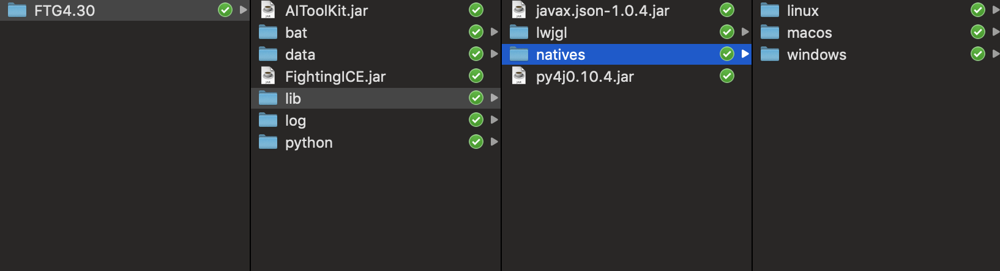
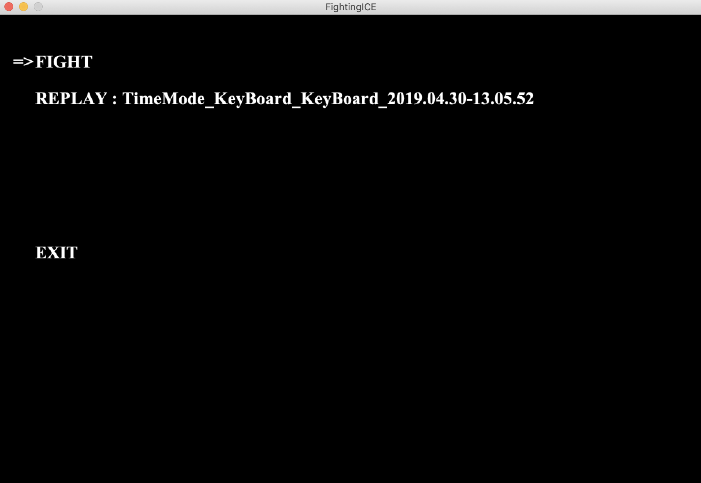
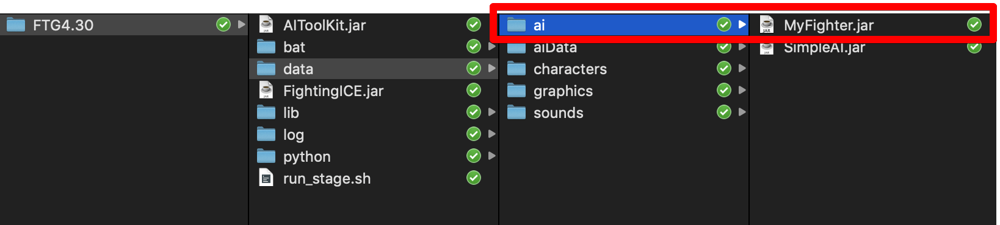
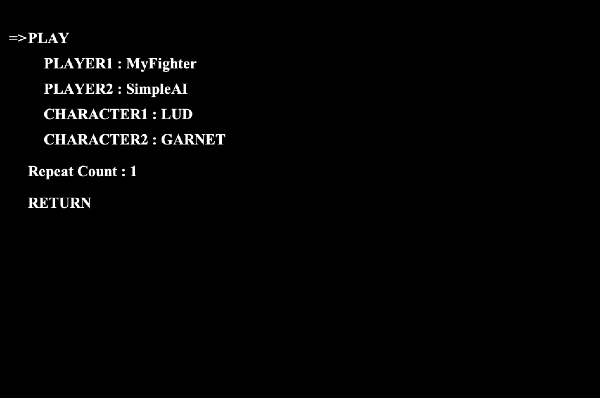

# Fighting ICEを動かしてみる

## TL;DR

格闘ゲームを題材にAIによるゲーム操作を試してみることができる[Fighting ICE](http://www.ice.ci.ritsumei.ac.jp/~ftgaic/index.htm)を動かしてみました。
強化学習を利用すると面白いところですが、今回はとりあえず動かしてみるというところまでです。

## Fighting ICEとは

[Fighting ICE](http://www.ice.ci.ritsumei.ac.jp/~ftgaic/index.htm)は、格闘ゲームに対してAIによるゲーム操作の開発および実行環境を提供してくれます。

強化学習の実行環境としては[OpenAI Gym](https://gym.openai.com/)が有名ですが、見た目に地味なゲームが多いため、格ゲーで動かせるのは視覚的にも楽しいです。


## インストール方法

基本的には[Get started - Install](http://www.ice.ci.ritsumei.ac.jp/~ftgaic/index-2.html)に従って必要なファイルをダウンロードします。
必要なファイルは以下の通りです。

* JDK・・・後述の注意事項があります。
* Eclipse・・・Eclipseである必要はありませんが、IDEはあった方が便利です。
* Fighting ICE・・・今回は`Version 4.30`を使用しました。

`Fighting ICE`を適当なフォルダにダウンロードしたら、解凍してください。

### JDKの注意事項

[ホームページ](http://www.ice.ci.ritsumei.ac.jp/~ftgaic/index-2h.html)にも記載がありますが、JDKの選択は注意点があり、`JDK 1.8`ではないと動作しません(私は`Oracle JDK`で試しましたが、1.8であれば`OpneJDK`でも動作するかもしれません)。

`JDK 11`をインストールし、ライブラリだけ`JDK 1.8`を指定しても動作しないため注意してください。

## 動かしてみる

`Fighting ICE`を解凍すると以下の様なフォルダ構成になっています。



Eclipseからの動かし方は[Get Started - First Step](http://www.ice.ci.ritsumei.ac.jp/~ftgaic/index-2h.html)を参照してください。

ただ、開発時はともかく動かしてみる場合にEclipse経由では面倒ですので、ここではシェルスクリプトから起動出来るようにします。
`Fighting ICE`を解凍したフォルダ直下に`run_stage.sh`という名前で以下の内容のシェルスクリプトを作成します。

```shell
#!/bin/sh

JAVA_HOME=/Library/Java/JavaVirtualMachines/jdk1.8.0_211.jdk/Contents/Home
JAVA_COMMAND=$JAVA_HOME/bin/java

$JAVA_COMMAND -cp "FightingICE.jar:lib/*:lib/lwjgl/*:lib/natives/macos/*" -XstartOnFirstThread Main
```

`run_stage.sh`を実行すると以下の様に`Fighting ICE`の起動画面が表示されます。



### OSによって異なるライブラリ

今回実行環境がMacOSでしたので`lib/natives/macos/*`を指定しました。この指定は実行環境となるOSによって異なります。
対応しているのは`macos`の他に、`linux`、`windows`です。

### MacOSで実行する際のVMオプションの指定

MacOSで実行する場合は`-XstartOnFirstThread`の指定が必要でした。
他の環境では確認していないため、起動時にエラーがでたら同オプションの指定を試してみてください。

## AIを作成してみる

開発はEclipseで行います。[Get Started - First Step](http://www.ice.ci.ritsumei.ac.jp/~ftgaic/index-2h.html)に記載のあるとおり、Javaプロジェクトとして作成し、ライブラリとして`AIToolKit.jar`を指定します。

後は新規クラスとして`aiinterface.AIInterface`を継承したクラスを実装します。
インターフェイスとして定義されているメソッドをオーバーライドして独自のAIを実装します。

以下の実装は、単純に敵に向かって進み、近距離になったらランダムでパンチやキックを繰り出すプログラムになっています。

```java
import aiinterface.AIInterface;
import struct.FrameData;
import struct.GameData;
import struct.Key;
import aiinterface.CommandCenter;
import java.util.Random;

public class MyFighter implements AIInterface {
	private Key inputKey;
	private boolean playerNumber;
	private FrameData frameData;
	private CommandCenter cc;
	private int lastDistance;
	private Random randomizer = new Random();
	private boolean isLastActionMoved = false;

	@Override
	public int initialize(GameData gameData, boolean playerNumber) {
		this.playerNumber = playerNumber;
		this.inputKey = new Key();
		this.cc = new CommandCenter();
		this.frameData = new FrameData();

		return 0;
	}

	@Override
	public void close() {
		// NOP
	}

	@Override
	public void getInformation(FrameData frameData) {
		this.frameData = frameData;
		this.cc.setFrameData(this.frameData, this.playerNumber);
	}

	@Override
	public Key input() {
		return this.inputKey;
	}

	@Override
	public void processing() {
		if (this.frameData.getEmptyFlag() || this.frameData.getRemainingFramesNumber() <= 0) {
			return;
		}

		// コマンドが入力済みの場合は、コマンドの内容を実行します。
		if (this.cc.getSkillFlag()) {
			this.inputKey = cc.getSkillKey();

			return;
		}

		this.lastDistance = frameData.getDistanceX();

		// 全開のコマンドが移動で、距離が引き続き離れている場合、移動を継続します。
		if (this.lastDistance >= 100 && this.isLastActionMoved) {
			return;
		}

		// 上記でコマンドが入力済みの場合は、継続してそのコマンドを実行する指定をしているため、
		// 別のコマンドを入力したい場合は、毎回手動でクリアーする必要があります。
		this.inputKey.empty();
		this.cc.skillCancel();

		if (this.lastDistance < 100) {
			int nextActionInt = this.randomizer.nextInt(3) + 1;

			switch (nextActionInt) {
			case 1:
				this.cc.commandCall("A");
				break;
			case 2:
				this.cc.commandCall("B");
				break;
			case 3:
				this.cc.commandCall("C");
				break;
			}

			this.isLastActionMoved = false;

			return;
		}

		if (this.lastDistance >= 100) {
			this.cc.commandCall("FORWARD_WALK");
			this.isLastActionMoved = true;

			return;
		}
	}

	@Override
	public void roundEnd(int arg0, int arg1, int arg2) {
		// NOP
	}

}
```

クラス名の指定や後述のexport時のJARファイル名については、以下の様な注意事項があります。

* `aiinterface.AIInterface`を継承したクラス名がそのまま実行時に指定するAI名になります。
* `aiinterface.AIInterface`を継承したクラスがデフォルトパッケージ以外に所属すると実行時に見つけられません。
* クラス名とJARファイル名は一致している必要があります。

後はJARファイルとしてexportして`Fighting ICE`の所定のフォルダに配置することで、対戦時のAIとして選択することが可能になります。
exportで必要なのは`*.class`ファイルのみです。

Eclpseでのexport方法は[Get Started - First Step](http://www.ice.ci.ritsumei.ac.jp/~ftgaic/index-2h.html)を参照してください。

## 対戦してみる

exportしたJARファイルは`Fighting ICR`の`data/ai`フォルダに配置してください。



対戦相手として[2018 Competition Results](http://www.ice.ci.ritsumei.ac.jp/~ftgaic/index-R.html)の`SimpleAI`を拝借しました。
同ページからall AIsをダウンロードして解凍し、`Bots&Slides/simpleai/SimpleAI.jar`を`data/ai`に配置してください。

後は`run_stage.sh`を起動してAIとキャラクターを選択します。ちなみに決定キーは`Zキー`です。



あとは`Play`にカーソルを合わせて決定キーを押下すると対戦が始まります。

