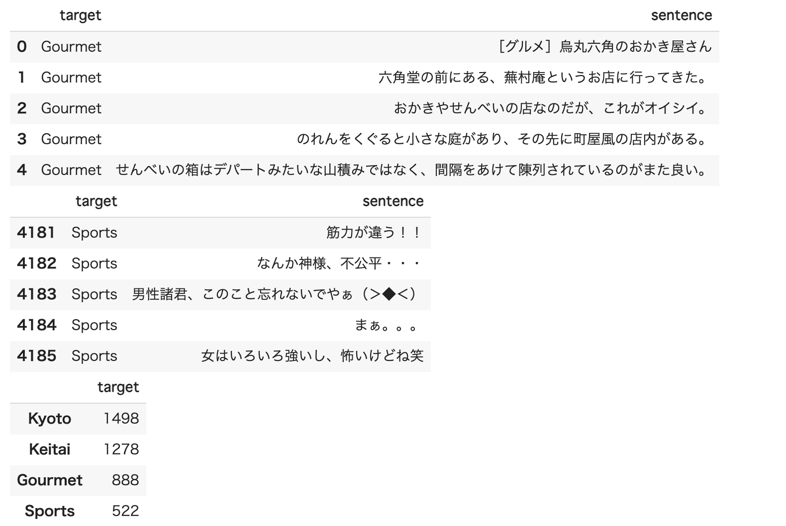

# Huggingface TransformersでBERTをFine Tuningしてみる

## TL;DR

様々な自然言語処理モデルをお手軽に使える[Huggingface Transformers](https://github.com/huggingface/transformers)を利用し、日本語の事前学習済みBERTモデルのFine Tuningを試してみました。

例によってはテストで利用したデータセットは[京都大学情報学研究科--NTTコミュニケーション科学基礎研究所 共同研究ユニット](http://nlp.ist.i.kyoto-u.ac.jp/kuntt/index.php)が提供するブログの記事に関するデータセットを利用しました。

Transformers 4.5.1時点では、公式ドキュメントのままでは上手くいなかったので注意事項を含めて記載しています。

### ベンチマーク用データ

[京都大学情報学研究科--NTTコミュニケーション科学基礎研究所 共同研究ユニット](http://nlp.ist.i.kyoto-u.ac.jp/kuntt/index.php)が提供するブログの記事に関するデータセットを利用しました。 このデータセットでは、ブログの記事に対して以下の4つの分類がされています。

* グルメ
* 携帯電話
* 京都
* スポーツ

## 事前準備

以下のようにデータを準備します。

```python
!mkdir data
!wget http://nlp.ist.i.kyoto-u.ac.jp/kuntt/KNBC_v1.0_090925_utf8.tar.bz2 -O data/KNBC_v1.0_090925_utf8.tar.bz2
```

```python
%cd data
!tar xvf KNBC_v1.0_090925_utf8.tar.bz2
%cd ..
```

```python
import re

def get_sentences_from_text(filename):
  sentences = []
  with open(filename, 'r') as f:
    for i, line in enumerate(f):
      sentence = line.split('\t')[1].strip()
      if sentence == '': # 空文字を除去。
        continue
      if re.match('^http.*$', sentence): # URLを除去。
        continue
      sentences.append(sentence)
  return sentences
```

```python
import os
import pandas as pd

root_dir = 'data/KNBC_v1.0_090925_utf8/corpus2'
targets = ['Gourmet', 'Keitai', 'Kyoto', 'Sports']

original_data = []
for target in targets:
  filename = os.path.join(root_dir, f'{target}.tsv')
  sentences = get_sentences_from_text(filename)
  for sentence in sentences:
    original_data.append([target, sentence])

original_df = pd.DataFrame(original_data, columns=['target', 'sentence'])
```

```python
display(original_df.head())
display(original_df.tail())
display(pd.DataFrame(original_df['target'].value_counts()))
```

```python
from sklearn.model_selection import train_test_split

train_df, test_df = train_test_split(original_df, test_size=0.1)
```



## ソースコード

Google Colabを利用することを前提としています。

### モジュールのインストール

Transformersと今回使用する学習済みBERTモデルが要求するモジュールをインストールします。

```python
!pip install transformers
!apt install aptitude
!aptitude install mecab libmecab-dev mecab-ipadic-utf8 git make curl xz-utils file -y
!pip install mecab-python3==0.7
!pip install fugashi
!pip install ipadic
```

### データのロード

```python
import pandas as pd

data_root = 'Your Own Drive/data'

train_df = pd.read_csv(f'{data_root}/knbc-train.csv', index_col=0)
test_df = pd.read_csv(f'{data_root}/knbc-test.csv', index_col=0)
```

### データの変換

```python
from transformers import pipeline
from transformers import AutoTokenizer

tokenizer = AutoTokenizer.from_pretrained('cl-tohoku/bert-base-japanese-whole-word-masking')
```

```python
train_encodings = tokenizer(train_df['sentence'].to_list(), truncation=True, padding=True)
test_encodings = tokenizer(test_df['sentence'].to_list(), truncation=True, padding=True)
```

```python
import tensorflow as tf

label2index = {
    'Kyoto': 0,
    'Keitai': 1,
    'Gourmet': 2,
    'Sports': 3,
}

train_dataset = tf.data.Dataset.from_tensor_slices((
    dict(train_encodings),
    train_df['target'].map(lambda x: label2index[x]).to_list()
))
test_dataset = tf.data.Dataset.from_tensor_slices((
    dict(test_encodings),
    test_df['target'].map(lambda x: label2index[x]).to_list()
))
```

### 学習の実行

Transformersが用意するTrainer(TensorFlow用はTFTrainer)を利用して学習を実行します。

`compute_metrics`は必須ではありません。追加のMetricsを取得するために設定しています。
注意すべきは`model.classifier`の設定です。公式ドキュメント上は不要なはずですが、損失関数で期待する活性化関数が設定されていないため、設定しないと学習が進みませんでした。今後改善される可能性もあるため、4.5.1時点でのTipsとなります。


```python
from transformers import TFTrainer, TFTrainingArguments, TFBertForSequenceClassification
from sklearn.metrics import accuracy_score, precision_recall_fscore_support
import tensorflow as tf

def compute_metrics(pred):
    labels = pred.label_ids
    preds = pred.predictions.argmax(-1)
    precision, recall, f1, _ = precision_recall_fscore_support(labels, preds, average='weighted')
    acc = accuracy_score(labels, preds)
    return {
        'accuracy': acc,
        'f1': f1,
        'precision': precision,
        'recall': recall
    }

training_args = TFTrainingArguments(
    output_dir='./results',          # output directory
    num_train_epochs=3,              # total number of training epochs
    per_device_train_batch_size=16,  # batch size per device during training
    per_device_eval_batch_size=64,   # batch size for evaluation
    warmup_steps=500,                # number of warmup steps for learning rate scheduler
    weight_decay=0.01,               # strength of weight decay
    logging_dir='./logs',            # directory for storing logs
    logging_steps=10
)

with training_args.strategy.scope():
    model = TFBertForSequenceClassification.from_pretrained('cl-tohoku/bert-base-japanese-whole-word-masking')
    # Transformers 4.5.1のTFBertForSequenceClassificationでは
    # classifierにactivationが設定されておらず、多項分類でlossが計算出来ないため、
    # 差し替えています。
    model.classifier = tf.keras.layers.Dense(
            units=4, # クラス数を指定します。
            activation='softmax',
            name='classifier',
        )

trainer = TFTrainer(
    model=model,                         # the instantiated 🤗 Transformers model to be trained
    args=training_args,                  # training arguments, defined above
    train_dataset=train_dataset,         # training dataset
    eval_dataset=test_dataset,             # evaluation dataset
    compute_metrics=compute_metrics
)

trainer.train()
```

### 評価

Trainerのevaluateメソッドで評価を実行出来ます。

```python
trainer.evaluate()
```

以下は実行結果の例です。

```
{'eval_accuracy': 0.8370535714285714,
 'eval_f1': 0.8375614865485349,
 'eval_loss': 0.4905424118041992,
 'eval_precision': 0.8416657684509984,
 'eval_recall': 0.8370535714285714}
```

以下を実行するとTensorBoardでも確認ができます。

```python
%load_ext tensorboard
%tensorboard --logdir logs
```

## まとめ

[Huggingface Transformers](https://github.com/huggingface/transformers)を使う事で、データ以外の準備が不要になり、かなり簡単に最新モデルを使った自然言語処理を行うことができます。

TrainerのようにTransfomersが用意する抽象化レイヤーを利用することで、事前学習モデルを切り替えるだけで精度の確認を行うことができると思いますので、BERT以外にALBERTやT5との比較なども試してみたいと思います。

## 参考文献

* [Huggingface - Training and fine-tuning](https://huggingface.co/transformers/training.html)
* [cl-tohoku/bert-base-japanese-whole-word-masking](https://huggingface.co/cl-tohoku/bert-base-japanese-whole-word-masking)
* [京都大学情報学研究科--NTTコミュニケーション科学基礎研究所 共同研究ユニット](http://nlp.ist.i.kyoto-u.ac.jp/kuntt/index.php)