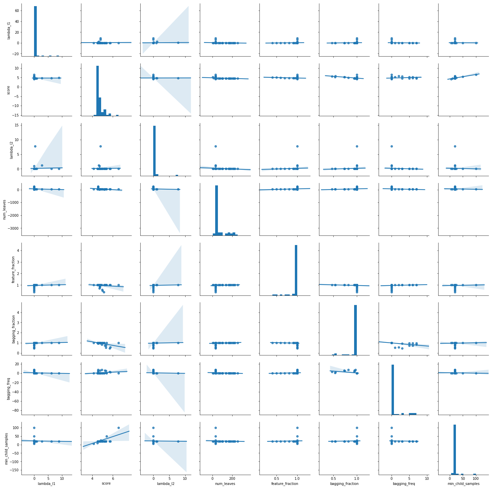

# LightGBMをOptunaでパラメータチューニングする

## TL;DR

[LightGBM](https://lightgbm.readthedocs.io/en/latest/index.html)のパラメータを[OptunaのLightGBM Tuner](https://tech.preferred.jp/ja/blog/)でチューニングします。
`OptunaのLightGBM Tuner`はOptunaに組み込まれているLightGBM用のパラメータチューナーです。

ベンチマーク用データとしては[ボストン住宅価格データセット](https://scikit-learn.org/stable/modules/generated/sklearn.datasets.load_boston.html)を使用します。

XGBoostに対するOptunaは[XGBoostをOptunaでパラメータチューニングする](https://www.inoue-kobo.com/ai_ml/xgboost-with-optuna/index.html)をご覧下さい。

## データ準備

```python
from sklearn import datasets, model_selection

features, labels = datasets.load_boston(return_X_y =True)
train_features, test_features, train_labels, test_labels = model_selection.train_test_split(features, labels, test_size=0.2)
train_features, valid_features, train_labels, valid_labels = model_selection.train_test_split(train_features, train_labels, test_size=0.1)

print(train_features.shape)
print(train_labels.shape)
print(valid_features.shape)
print(valid_labels.shape)
print(test_features.shape)
print(test_labels.shape)
```

```python
import lightgbm as lgb

trains = lgb.Dataset(train_features, train_labels)
valids = lgb.Dataset(valid_features, valid_labels)
tests = lgb.Dataset(test_features, test_labels)
```

## ハイパーパラメータ最適化

```python
import optuna.integration.lightgbm as lgb

params = {
    'objective': 'mean_squared_error',
    'metric': 'rmse'
}
best_params, history = {}, []
model = lgb.train(params, trains, valid_sets=valids,
                    verbose_eval=False,
                    num_boost_round=100,
                    early_stopping_rounds=5,
                    best_params=best_params,
                    tuning_history=history)
```

```python
best_params
```

```
{'lambda_l1': 0.5180093752159527,
 'lambda_l2': 0.018791253111455634,
 'num_leaves': 31,
 'feature_fraction': 1.0,
 'bagging_fraction': 1.0,
 'bagging_freq': 0,
 'min_child_samples': 5}
```

```python
param_defaults = {
    'lambda_l1': 0.0,
    'lambda_l2': 0.0,
    'num_leaves': 31,
    'feature_fraction':  1.0,
    'bagging_fraction':  1.0,
    'bagging_freq': 0,
    'min_child_samples': 20
}
```

```python
%matplotlib inline
import pandas as pd
import seaborn as sns

study_vals = []
for h in history:
    vals = {}
    for k, v in best_params.items():
        if k in h['value']:
            dic = eval(h['value'])
            col = k
            val = dic[k]
        else:
            col = k
            val = param_defaults[k]
        vals[col] = val
        vals['score'] = h['val_score']
    study_vals.append(vals)

study_df = pd.DataFrame(study_vals)
sns.pairplot(study_df, kind='reg')
```



## 見つけたパラメータでモデル作成

```python
import lightgbm as lgb_original
from sklearn.metrics import r2_score

model = lgb_original.train(params, trains, num_boost_round=100)
predicts = model.predict(test_features)
base_r2 = r2_score(test_labels, predicts)
```

```python
model = lgb_original.train(best_params, trains, num_boost_round=100)
predicts = model.predict(test_features)
best_r2 = r2_score(test_labels, predicts)
```

```python
print(f'Base params: {params}')
print(f'Best params: {merged_params}')
print(f'Base: {base_r2}, Best: {best_r2}, Diff: {best_r2 - base_r2}')
```

```
Base params: {'objective': 'mean_squared_error', 'metric': 'rmse'}
Best params: {'objective': 'mean_squared_error', 'metric': 'rmse', 'lambda_l1': 0.5180093752159527, 'lambda_l2': 0.018791253111455634, 'num_leaves': 31, 'feature_fraction': 1.0, 'bagging_fraction': 1.0, 'bagging_freq': 0, 'min_child_samples': 5}
Base: 0.8711808181814997, Best: 0.9004158293791359, Diff: 0.029235011197636163
```

## まとめ

Optunaによりハイパーパラメータを探索することで以下の様に改善する事ができました。

* デフォルト: 0.87
* 最適化後: 0.90
* 改善値: 0.03

LightGBM専用のハイパーパラメータチューナーがOptunaに組み込まれたことにより、普通にLightGBMとしてトレーニングするだけでパラメータの最適化が可能になりました。
モデル探索の最初の一手としては最適だと思われます。

## 参考文献

* [Optuna の拡張機能 LightGBM Tuner によるハイパーパラメータ自動最適化](https://tech.preferred.jp/ja/blog/hyperparameter-tuning-with-optuna-integration-lightgbm-tuner/)
* [Add automatic LightGBM tuner with stepwise logic.](https://github.com/optuna/optuna/pull/549)
* [LightGBM](https://lightgbm.readthedocs.io/en/latest/index.html)