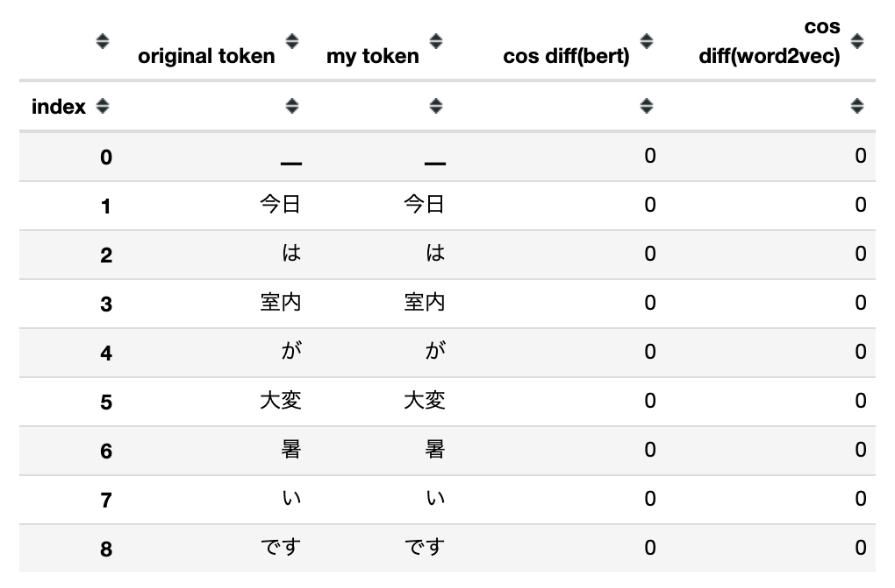
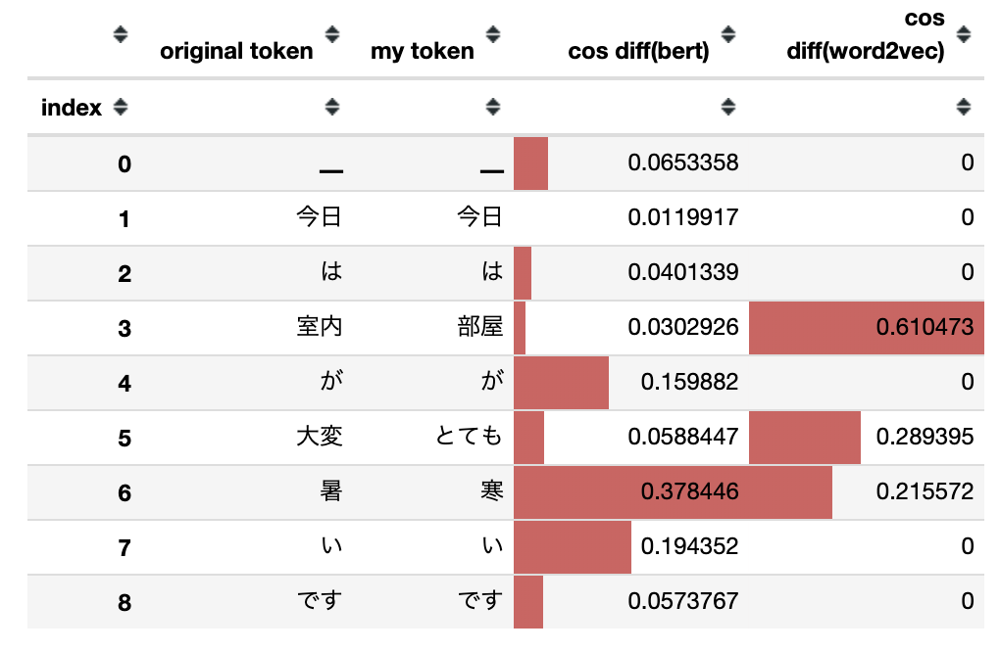

# BERTおよびWord2Vecで文の類似性を確認する

## TL;DR

文の類似性を確認する方法として`BERT`と`Word2Vec`を比較します。
文全体の類似性ではなくトークン単位での比較です。

BERTとWord2Vecによるベクトル化には[text-vectorian](https://pypi.org/project/text-vectorian/)を使用します。

## ソースコード

```python
from text_vectorian import SpBertVectorian

tokenizer_filename = '../bert-japanese/model/wiki-ja.model'
vectorizer_filename = '../bert-japanese/model/model.ckpt-1400000'

bert_vectorian = SpBertVectorian(
    tokenizer_filename=tokenizer_filename,
    vectorizer_filename=vectorizer_filename
)
```

```python
from text_vectorian import SentencePieceVectorian

word2vec_vectorian = SentencePieceVectorian()
```

```python
import numpy as np
import pandas as pd

def cossim(v1, v2):
    return np.dot(v1, v2) / (np.linalg.norm(v1) * np.linalg.norm(v2))

def get_vectors(vectorian, text):
    vectors = vectorian.fit(text).vectors
    tokens = vectorian._tokenizer._tokenize(text)

    return tokens, vectors

def get_df(original_text, my_text):
    data = []

    original_bert = get_vectors(bert_vectorian, original_text)
    original_word2vec = get_vectors(word2vec_vectorian, original_text)
    my_bert = get_vectors(bert_vectorian, my_text)
    my_word2vec = get_vectors(word2vec_vectorian, my_text)

    for i, token in enumerate(original_word2vec[0]):
        original_token = original_bert[0][i]
        original_bert_vector = original_bert[1][i]
        original_word2vec_vector = original_word2vec[1][i]
        my_token = my_bert[0][i]
        my_bert_vector = my_bert[1][i]
        my_word2vec_vector = my_word2vec[1][i]

        bert_sim = cossim(original_bert_vector, my_bert_vector)
        word2vec_sim = cossim(original_word2vec_vector, my_word2vec_vector)

        data.append((i, original_token, my_token, bert_sim, word2vec_sim))

        df = pd.DataFrame(data, columns=('index', 'original token', 'my token', 'cos diff(bert)', 'cos diff(word2vec)')).set_index('index')
        df['cos diff(bert)'] = 1- df['cos diff(bert)']
        df['cos diff(bert)'] = df['cos diff(bert)'].clip(0.01, 1).replace(0.01, 0)
        df['cos diff(word2vec)'] = 1- df['cos diff(word2vec)']
        df['cos diff(word2vec)'] = df['cos diff(word2vec)'].clip(0.01, 1).replace(0.01, 0)

    return df
```

```python
original_text = '今日は室内が大変暑いです。'
same_text = '今日は室内が大変暑いです。'
my_text = '今日は部屋がとても寒いです。'

same_df = get_df(original_text, same_text)
diff_df = get_df(original_text, my_text)

display(same_df.style.bar())
display(diff_df.style.bar())
```

## まとめ

同一の文の場合は差異がありません。



一部が異なる文の場合は以下の様に差異が確認できます。



`BERT`の場合はトークンの前後の関係を考慮するためトークン毎の比較では単純な違いを確認することができません。
`Word2Vec`であれば、単純なトークン単位での違いを確認することが可能です。

## 参考文献

* [自然言語ベクトル化用Pythonモジュール(text-vectorian)をリリースしました](https://www.inoue-kobo.com/ai_ml/text-vectorian/index.html)
* [もっと簡単に Keras BERT でファインチューニングしてみる](https://www.inoue-kobo.com/ai_ml/keras-bert-with-text-vectorian/index.html)