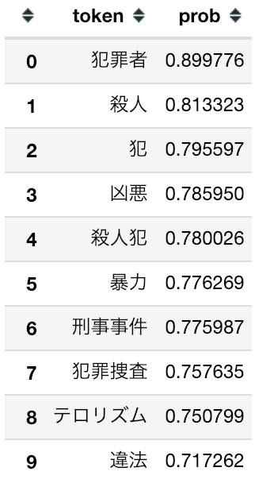
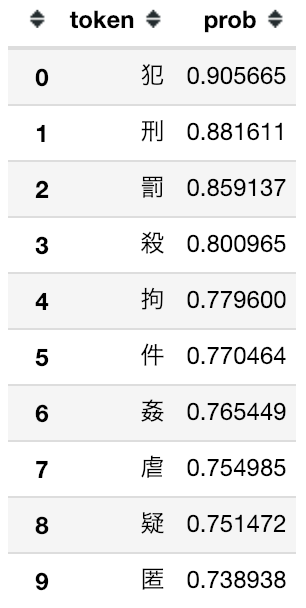
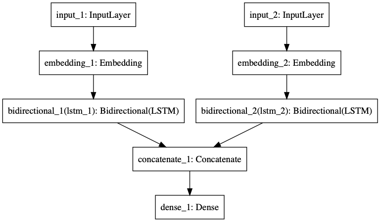

# 自然言語処理の分類問題の入力信号に、単語単位の入力だけではなく文字単位の入力を使用する

## TL;DR

自然言語処理の分類問題の入力信号では、単語単位での入力が一般的です。
但し、日本語のような表意文字圏では文字単位での入力にも意味があります。

LSTMを利用したネットワーク構造を利用して、単語単位であるか、文字単位であるか、それぞれ入力信号の違いでどのように結果に違いが出るかを比較してみました。

なお、単語、文字それぞれのTokenizeとベクトル表現の取得には[text-vectorian](https://pypi.org/project/text-vectorian/)を使用しました。
このため、単語のTokenizeには形態素解析ではなく[SentencePiece](https://github.com/google/sentencepiece)を利用しています。

### ベンチマーク用データ

[京都大学情報学研究科--NTTコミュニケーション科学基礎研究所 共同研究ユニット](http://nlp.ist.i.kyoto-u.ac.jp/kuntt/index.php)が提供するブログの記事に関するデータセットを利用しました。 このデータセットでは、ブログの記事に対して以下の4つの分類がされています。

* グルメ
* 携帯電話
* 京都
* スポーツ

## 文字単位のベクトル表現を得る意味

単語単位のベクトル表現を利用すると、ある単語と似た意味の(同じ様なコンテキストで使用される確率の高い)別の単語をリストアップすることができます。

```python
from text_vectorian import SentencePieceVectorian
import pandas as pd

sp_vectorian = SentencePieceVectorian()

pd.DataFrame(sp_vectorian.vectorizer.model.most_similar('犯罪'), columns=['token', 'prob'])
```

{style=max-width:25%}

日本語の漢字のように文字単独で意味を持つ表意文字では、単語と同じように似たような意味の文字をリストアップすることができます。
つまり表意文字では、文字単位で取り扱っても単語と同じ様な効果を期待出来るということになります。

```python
from text_vectorian import Char2VecVectorian
import pandas as pd

char_vectorian = Char2VecVectorian()

pd.DataFrame(char_vectorian.vectorizer.model.most_similar('罪'), columns=['token', 'prob'])
```

{style=max-width:25%}

## データの準備

予め学習用とテスと用でデータを分類しておきます。比率は9:1です。
入力となる文章とラベルとなる分類結果のサンプルは以下の通りです。

### 入力となる文章のサンプル

一行目はヘッダーです。

```
feature
そう思いたくなることがある。
今日の構内の紅葉はきれいだったので、たくさんの人が見て、きれいだなあという感覚を共有したい気持ちはありますが・・・。
恐ろしく心臓に悪いです。
僕は別にｄｏｃｏｍｏにもａｕにも移る気はなくＳｏｆｔＢａｎｋのまま。
誕生日割りなど
今まで使っていたのはＪ－ＰＨＯＮＥ。
[省略]
```

### ラベルとなる分類結果のサンプル

一行目はヘッダーです。

```
label
京都
京都
携帯電話
携帯電話
携帯電話
携帯電話
[省略]
```

## 単語単位の入力で分類してみる

まずは普通に単語単位で入力してモデルを学習してみます。

### 学習

```pytyhon
import pandas as pd
import numpy as np
import keras
from keras.layers import Dense, Dropout, LSTM
from keras.layers.wrappers import Bidirectional
from keras.callbacks import LambdaCallback, EarlyStopping, ModelCheckpoint
from keras import Input, Model, utils
from keras.preprocessing.sequence import pad_sequences
from text_vectorian import SentencePieceVectorian

vectorian = SentencePieceVectorian()
```

```python
def _load_labeldata(train_dir, test_dir):
    train_features_df = pd.read_csv(f'{train_dir}/features.csv')
    train_labels_df = pd.read_csv(f'{train_dir}/labels.csv')
    test_features_df = pd.read_csv(f'{test_dir}/features.csv')
    test_labels_df = pd.read_csv(f'{test_dir}/labels.csv')
    label2index = {k: i for i, k in enumerate(train_labels_df['label'].unique())}
    index2label = {i: k for i, k in enumerate(train_labels_df['label'].unique())}
    class_count = len(label2index)
    train_labels = utils.np_utils.to_categorical([label2index[label] for label in train_labels_df['label']], num_classes=class_count)
    test_label_indices = [label2index[label] for label in test_labels_df['label']]
    test_labels = utils.np_utils.to_categorical(test_label_indices, num_classes=class_count)

    train_features = []
    test_features = []
    
    for feature in train_features_df['feature']:
        train_features.append(vectorian.fit(feature).indices)
    for feature in test_features_df['feature']:
        test_features.append(vectorian.fit(feature).indices)
    train_features = pad_sequences(train_features, maxlen=vectorian.max_tokens_len)
    test_features = pad_sequences(test_features, maxlen=vectorian.max_tokens_len)

    print(f'Trainデータ数: {len(train_features_df)}, Testデータ数: {len(test_features_df)}, ラベル数: {class_count}')

    return {
        'class_count': class_count,
        'label2index': label2index,
        'index2label': index2label,
        'train_labels': train_labels,
        'test_labels': test_labels,
        'test_label_indices': test_label_indices,
        'train_features': train_features,
        'test_features': test_features,
        'input_len': vectorian.max_tokens_len
    }
```

```python
def _create_model(input_shape, hidden, class_count):
    input_tensor = Input(input_shape)
    common_input = vectorian.get_keras_layer(trainable=True)(input_tensor)
    x1 = Bidirectional(LSTM(hidden))(common_input)
    output_tensor = Dense(class_count, activation='softmax')(x1)

    model = Model(input_tensor, output_tensor)
    model.compile(loss='categorical_crossentropy', optimizer='nadam', metrics=['acc', 'mse', 'mae'])

    return model
```

```python
data = _load_labeldata('data/trains', 'data/tests')
hidden = 356
model = _create_model(data['train_features'][0].shape, hidden, data['class_count'])
model.summary()
```

```python
history = model.fit(data['train_features'], data['train_labels'],
                    epochs=50,
                    batch_size=256,
                    validation_data=(data['test_features'], data['test_labels']),
                    shuffle=False,
                    callbacks = [
                        EarlyStopping(patience=3, monitor='val_acc', mode='max'),
                    ])
```

### クラシフィケーションレポート

```python
from sklearn.metrics import classification_report, confusion_matrix
from keras.models import load_model

predicted_labels = model.predict(data['test_features']).argmax(axis=1)
print(classification_report(data['test_label_indices'], predicted_labels, target_names=data['index2label'].values()))
```

```
              precision    recall  f1-score   support

          京都       0.69      0.78      0.74       137
        携帯電話       0.82      0.77      0.79       145
        スポーツ       0.73      0.79      0.76        47
         グルメ       0.88      0.76      0.81        90

   micro avg       0.77      0.77      0.77       419
   macro avg       0.78      0.77      0.77       419
weighted avg       0.78      0.77      0.77       419
```

## 文字単位の入力で分類してみる

次に文字単位で入力して分類してみます。

### 学習

Tokenizeとベクトル表現の取得に`text-vectorian`を利用しているため、
単語単位から文字単位への変更は`SentencePieceVectorian`を`Char2VecVectorian`に変更するだけです。

ユニット数(hidden)も変更ありません。

```python
import pandas as pd
import numpy as np
import keras
from keras.layers import Dense, Dropout, LSTM
from keras.layers.wrappers import Bidirectional
from keras.callbacks import LambdaCallback, EarlyStopping, ModelCheckpoint
from keras import Input, Model, utils
from keras.preprocessing.sequence import pad_sequences
from text_vectorian import Char2VecVectorian

vectorian = Char2VecVectorian()
```

### クラシフィケーションレポート

```python
from sklearn.metrics import classification_report, confusion_matrix
from keras.models import load_model

predicted_labels = model.predict(data['test_features']).argmax(axis=1)
print(classification_report(data['test_label_indices'], predicted_labels, target_names=data['index2label'].values()))
```

```
              precision    recall  f1-score   support

          京都       0.56      0.80      0.66       137
        携帯電話       0.76      0.72      0.74       145
        スポーツ       0.60      0.60      0.60        47
         グルメ       0.79      0.34      0.48        90

   micro avg       0.65      0.65      0.65       419
   macro avg       0.68      0.62      0.62       419
weighted avg       0.69      0.65      0.64       419
```

## 単語単位と文字単位の入力の比較結果

今回のデータセットでは単語単位の入力の方が高い精度を得られました。

* 単語単位(Weighted Avg F1): **0.77**
* 文字単位(Weighted Avg F1): 0.64

入力となる特徴量が文であるため、文字単位では分類に関係の無いノイズが多くなりすぎ、単語単位の方が意味のあるベクトル表現を適切に選択できるためでは無いかと考えられます。

但し、入力となる特徴量が2〜3単語の組み合わせのように短い場合、単語単位では十分な量のベクトル表現を得る事ができず、文字単位の入力の方が高い精度を得られることがあります。

## 両方入力してみる

では、いっそのこと単語の入力と、文字の入力の両方を使って見たらどうなるでしょうか。
ここでは単純に、単語・文字でそれぞれLSTMを通した結果の直和して見ます。

### 学習

元の入力は1つですが、単語単位、文字単位の2つそれぞれに別けて準備する必要があります。
モデルでは単語単位、文字単位の2つの入力を受け取って学習を行います。

なお、今回もユニット数(hidden)は変更していません。

```python
def _create_model(sp_input_shape, char_input_shape, hidden, class_count):
    sp_input_tensor = Input(sp_input_shape)
    char_input_tensor = Input(char_input_shape)
    sp_input = sp_vectorian.get_keras_layer(trainable=True)(sp_input_tensor)
    sp_x1 = Bidirectional(LSTM(hidden))(sp_input)
    char_input = char_vectorian.get_keras_layer(trainable=True)(char_input_tensor)
    char_x1 = Bidirectional(LSTM(hidden))(char_input)
    x2 = layers.concatenate([sp_x1, char_x1])
    output_tensor = Dense(class_count, activation='softmax')(x2)

    model = Model([sp_input_tensor, char_input_tensor], output_tensor)
    model.compile(loss='categorical_crossentropy', optimizer='nadam', metrics=['acc', 'mse', 'mae'])

    return model
```

{style=max-width:70%}

### クラシフィケーションレポート

```python
from sklearn.metrics import classification_report, confusion_matrix
from keras.models import load_model

predicted_labels = model.predict([data['test_sp_features'], data['test_char_features']]).argmax(axis=1)
print(classification_report(data['test_label_indices'], predicted_labels, target_names=data['index2label'].values()))
```

```
              precision    recall  f1-score   support

          京都       0.74      0.79      0.76       137
        携帯電話       0.82      0.81      0.82       145
        スポーツ       0.70      0.74      0.72        47
         グルメ       0.86      0.76      0.80        90

   micro avg       0.79      0.79      0.79       419
   macro avg       0.78      0.78      0.78       419
weighted avg       0.79      0.79      0.79       419
```

## まとめ

良い感じで単語+文字で一番高い精度を得ることができました。

* 単語単位(Weighted Avg F1): 0.77
* 文字単位(Weighted Avg F1): 0.64
* 単語+文字(Weighted Avg F1): **0.79**

総合的な精度では文字単位よりも単語単位の方が高かったのですが、(単語単位では分類できずに)文字単位でのみ分類できた対象がおり、それぞれの特徴量を直和することで、お互いの欠損を補完できた結果だと考えられます。

但し、逆に特徴量を打ち消しあっているものもあると思われるため、これが常に有効な手段になるわけでは無い点には注意が必要です。

## 参考文献

* [Neural Networks for Joint Sentence Classification in Medical Paper Abstracts](https://arxiv.org/abs/1612.05251)
* [自然言語ベクトル化用Pythonモジュール(text-vectorian)をリリースしました](http://localhost:8080/ai_ml/text-vectorian/index.html)