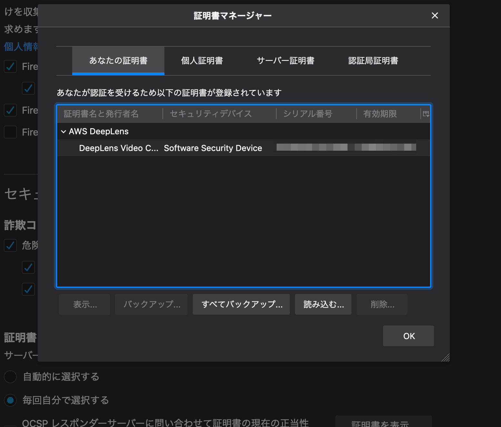

# AWS DeepLens Tips

## TL;DR

[AWS DeepLens](https://aws.amazon.com/jp/deeplens/)がやっと届いたので動かしてました。
挙動を掴むまで結構ハマったので、注意点とか確認方法などのTipsを纏めてみました。

## トラブルシューティング

### DeepLensのセットアップ中にインターネットに接続できない

手順にも記載されていますが仕様です。DeepLensのセットアップ時には`Registration用のUSBポート`でセットアップで使用するPCに接続しますが、この際有線LANとして認識されます。
無線LANの設定よりも有線されるため、セットアップで使用しているPCが一時的に通常利用しているネットワークから切り離されます。

注意書きを読み飛ばしているとびっくりするのでご注意を。

### SSHでログインできない

初期設定ではSSHでログインできません。SSHサーバは別途設定を行って有効化する必要があります。

### SSHの有効化をしても保存ができない

ネットで調べると、以下の`reset pinhole`でセットアップ用のアクセスポイントを有効化して設定する方法がでてくる事がありますが、なぜかこの方法だとSSHの設定を変更しても保存ができません(なぜか保存ボタンが存在しない)。

* [Connect to Your AWS DeepLens Device's Wi-Fi Network](https://github.com/awsdocs/aws-deeplens-user-guide/blob/master/doc_source/deeplens-getting-started-connect.md)

`Registration用のUSBポート`でUSB接続した上で、AWSコンソールからデバイスの設定を変更する手順であればSSHを有効化して保存が可能です。

### ビデオストリームを表示するための4000ポートで待ち受けているサービスがない

色々いじっているとこの状態になることがあります。
ビデオストリームは`videoserver`というプログラムが4000ポートでサービスしています。

`videoserver`は以下が本体です。

```
/opt/awscam/awsmedia/video_server.py
```

`videoserver`が稼働しているかどうかは以下で確認ができます。

```bash
sudo service videoserver status
```

動いていないようであれば、以下の様に実行してみるとSSLエラーと表示されることがあります。

```
sudo /opt/awscam/awsmedia/video_server.py
```

なんらかの原因で証明書がおかしくなるらしく、この状態であれば以下のコマンドでawscamを再インストールすると直ります。

```bash
sudo apt-get install awscam --reinstall
sudo apt-get install awscam-webserver --reinstall
```

### 証明書をインストールしたのにChromeでビデオストリームが表示できない

Macの場合の話ですが、証明書をキーチェーンに登録した後にChromeは一度完全に終了させる必要があります。

### Firefoxでビデオストリームを表示できない

手順にもありますがFirefoxはキーチェーンではなく、Firefox固有の設定画面で設定する必要があります。
以下の画面です。



### 一番上のLEDが点灯しない

プロジェクトをデプロイしていない、あるいはデプロイしたプロジェクトが正しく起動していません。
デプロイしたプロジェクトはDeepLens上でLambdaとして起動します。DeepLens上のLambdaはpython2のプロセスとして表示されます。

```bash
ps aux | grep python2
```

これで表示されないようであれば、以下の様に`awscam`関連のサービスを再インストールしてみると直るかもしれません。


```bash
sudo apt-get install awscam --reinstall
sudo apt-get install awscam-webserver --reinstall
```

### ステルスSSIDの無線LANに接続したい

AWSコンソールからは設定できません。SSHで接続して設定する必要があります。

```bash
nmcli dev wifi connect "your-ssid" password "your-password" hidden yes
```

### とりあえずgreengrassdを再起動してみる

プロジェクトのデプロイが進まない場合や、デプロイしたプロジェクトが起動しない場合(AWSコンソール上でオンラインにならない場合)は、`greengrassd`を再起動してみると改善するかもしれません。

```bash
sudo service greengrassd restart
```

### deeplens用のsource.listが無効になっている

原因が不明ですが、私の場合は`apt`用のsourcelistが不完全な形で保存されていました。
`apt`が参照するリポジトリは`/etc/apt/sources.list`に設定されています。

DeepLens固有のリポジトリは`aws_deeplens.list`というファイル名で存在するはずですが、私の場合はなぜか`aws_deeplens.list.save`だけ存在するという状態でした。

この状態の場合、以下のコマンドでファイル名を変更してから`apt`を実行する必要があるかも知れません。

```bash
cd /etc/apt/sources.list
sudo mv aws_deeplens.list.save aws_deeplens.list
sudo apt-get update
```

### 一番下のLEDが点滅している

`awscam-intel-dldt`というパッケージを再インストールすると治るかも知れません。

```bash
sudo apt-get install awscam-intel-dldt --reinstall
```

### なぜか`videoserver.service`のパーミッションが変

`/var/log/syslog`を見ていたら`videoserver.service`のパーミッションが変だと警告が出ていました。
ほっといてもいいような気がしますが、以下のコマンドで修正できます。

```bash
sudo chmod 644 /etc/systemd/system/videoserver.service
```

### 工場出荷状態に戻したい

工場出荷状態に戻すためにはブート用のUSBメモリ(16GB以上)を用意し、ブートイメージと初期設定用のファイルをダウンロードして設定する必要があります。
以下の手順を参照してください。

* [Preparing for the Factory Reset of Your AWS DeepLens Device](https://docs.aws.amazon.com/deeplens/latest/dg/deeplens-device-factory-reset-preparation.html)

USBメモリのパーティション分割に指定があり、さらに一部のファイルシステムにNTFSを要求します。
MacでもWindowsでも簡単に必要な準備ができないので、(手元にあれば)Ubuntuマシンで行うかDeepLensにモニタとキーボード、マウスを接続して準備する必要があります。

## 情報の確認

### 待ち受けているポート一覧を表示する

```bash
ss -antp | grep -i LISTEN
```

### デーモンのステータスを確認する

```bash
service [デーモン名] status
```

```bash
service greengrassd status
```

### デーモンの一覧を確認する

```bash
service --status-all
```

### ファイアウォールを無効化する

普通に使っている限りは必要ありません。

```bash
sudo ufw disable
```

有効化する場合は以下を実行してください。

```bash
sudo ufw enable
```

### DeepLensの温度を確認する

DeepLensは推論まで行うためかなり機体の温度が高くなります。
熱のせいか不意に再起動するため、温度を確認したくなるかもしれません。

```bash
grep temperature /var/log/syslog
```

## 参考文献

* [AWS DeepLens](https://aws.amazon.com/jp/deeplens/)
* [AWS DeepLens ドキュメント](https://docs.aws.amazon.com/deeplens/index.html)
* [Discussion Forums - AWS DeepLens](https://forums.aws.amazon.com/forum.jspa?forumID=275)