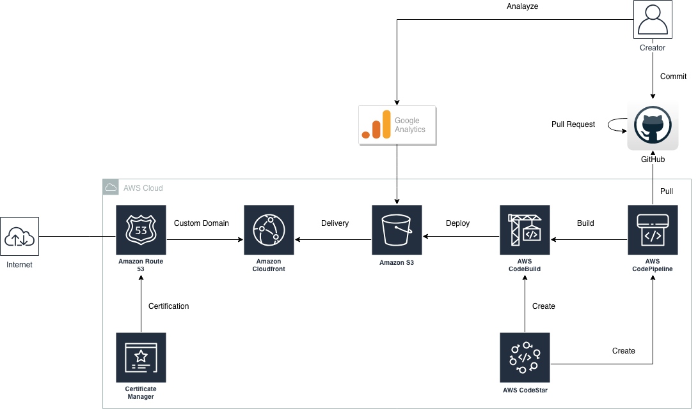

# Mkdocs と S3/Cloudfront によるドキュメント公開システムの構築

## TL;DR

Markdown で記載したドキュメントを GitHub にコミットすると、
CodePipeline と CodeBuild により自動的に HTML に変換して S3/CloudFront にデプロイして公開します。

HTML への変換は[mkdocs](https://www.mkdocs.org/)により行います。



## 環境

| No. | Resource            | Purpose                                                     | Note                  |
| --- | ------------------- | ----------------------------------------------------------- | --------------------- |
| 1   | GitHub              | Makrdown で記載したドキュメントを管理します。                                 | -                     |
| 2   | AWS CodeStar        | CodePipeline/CodeBuildを生成します。                               | -                     |
| 3   | AWS CodePipeline    | GitHubのmasterブランチにソースコードがコミットされるのを検知し、AWS CodeBuildをキックします。 | -                     |
| 4   | AWS CodeBuild       | Markdownドキュメントについて、MkdocsによりHTML形式に変換し、Amazon S3にデプロイします。   | -                     |
| 5   | Amazon S3           | HTML形式に変換したドキュメントを配置します。ここに配置したドキュメントが公開されます。               | -                     |
| 6   | Amazon Cloudfront   | S3に配置されたドキュメントをCDNで配信します。                                   | -                     |
| 7   | Amazon Route 53     | Cloudfrontのカスタムドメイン管理に使用します。                                | -                     |
| 8   | Certificate Manager | カスタムドメイン用にSSL/TLS証明書を発行します。                                 | -                     |
| 9   | AWS WAF             | ドキュメントに対するアクセス管理を行います。                                      | Optionalです。今回は使用しません。 |
| 10  | Google Analytics    | 公開ドキュメントのアクセスログを分析します。                                      | -                     |

## 構築

### 概要

1. AWS CodeStarでプロジェクトを作成する。
2. S3バケットを作成する。
3. ドメインの発行とSSL/TLS証明書を発行する。
4. Cloudfrontを設定する。
5. DNSを設定する。
6. git cloneする。
7. mkdocsを設定する。
8. CodeBuildによるビルド内容を設定する。
9. CodePipelineを設定する。
10. IAM Roleのポリシーを変更する。

### AWS CodeStarでプロジェクトを作成する

AWS CodeStarでプロジェクトを作成します。
使用するのはAWS CodeBuildとAWS CodePipelineだけなのですが、それだけのテンプレートは存在しないので、作成されるリソースが少ない`Node.js/AWS Lambda`を選択します。


AWS CodeStarを使用するとGitHubのリポジトリと、今回利用するAWS CodePipeline、CodeBuildのリソースが自動的に作成されます。
AWS LambdaやAPI Gateway、S3バケットも自動的に作成されますが、利用しなければ削除しても構いません。

### S3バケットを作成する

CodeStarでは以下のS3バケットが自動的に作成されます。

* [プロジェクト名]-pipe・・・CodePipelineがArtifactを配置するためのバケットです。
* [プロジェクト名]-app・・・Webアプリに必要な静的コンテンツ(HTMLなど)を配置するためのバケットです。

`[プロジェクト名]-app`をそのまま利用してもいいのですが、最小限の設定のバケットで運用するために新規にバケットを作成します。

### ドメインの発行とSSL/TLS証明書を発行する

必要に応じてドメインの発行と、ACM(AWS Certificate Manager)を利用してSSL/TLS証明書を発行します。

なお、ACMは`バージニア北部`リージョンで作成することに注意してください。
東京リージョンなどのACMに登録したSSL/TLS証明書はCloudfrontに設定することができません。

### Cloudfrontを設定する

Cloudfrontを設定します。Cloudfrontでは以下の設定を行います。

* カスタムドメイン
* S3バケットへのアクセス権設定
* Default Root Objectの設定


Originには今回作成したS3バケットを指定します。
`mkdocs`を利用する場合には、`Origin Path`に`docs`を設定しておくと`mkdocs`のデフォルトと一致するため余計な設定変更を省くことができます。

`Restrict Bucket Access`では、このCloudfrontのディストリビューションからのみS3バケットのアクセスを許可する設定を行います。
これによりS3バケット個別の公開設定は不要になります。


`Alternate Domain Names`にはドキュメントを公開するドメインを指定します。
SSL証明書もここで指定するためACMで先に作成しておく必要があります。

`Default Root Object`には`index.html`を指定します。
これを設定しないとブラウザで`https://www.example.com`のようにFQDNだけ指定した場合にコンテンツを表示することができません。

### DNSを設定する

Cloudfrontの設定が完了しデプロイが済んだら、カスタムドメインでアクセスできるように、
対象のCloudfrontのDistributionのDomain NameをDNSのAliasとして登録します。

### git cloneする

AWS CodeStarによるプロジェクト作成が完了すると、GitHub上にリポジトリが作成されているのでgit cloneします。

### mkdocsを設定する

git cloneした直下に新しく`mkdocs.yml`というファイルを作成します。
作成する内容は以下の様なものです。

```yaml
# web site setting
site_name: EXAMPLE.COM
site_url: https://www.example.com/
google_analytics: ['UA-XXXXXXXXX-1', 'auto']

# search engin
extra:
  search:
    language: 'jp'

## othters
use_directory_urls: false
```

`use_directory_urls`を`false`にするのはポイントです。
AWS S3とCloudfrontでWebページを公開すると、`/example/`のようなディレクトリ止まりのURIだと自動的に`index.html`を補完してくれません(Cloudfrontの`Default Root Object`が有効なのはFQDN直下だけです)。

Google Analytics用の設定も行っています。

### CodeBuildによるビルド内容を設定する。

CodeBuildでは以下のことを行います。

* MkdocsによるMarkdownドキュメントのHTML変換
* S3へのアップロード
* CloudfrontのInvalidation(キャッシュクリア)

CodeBuildによるビルド内容は`buildspec.yml`に記載します。

```yaml
version: 0.2

env:
  variables:
    HOMEPAGE_S3_BUCKET: "www.example.com"

phases:
  install:
    commands:
      - pip install --upgrade pip
      - pip install --upgrade awscli
      - aws --version
      - pip install mkdocs
      - mkdocs --version
  pre_build:
    commands:
  build:
    commands:
      - mkdocs build
  post_build:
    commands:
      - cd site
      - pwd
      - echo $HOMEPAGE_S3_BUCKET
      - aws s3 sync . s3://$HOMEPAGE_S3_BUCKET/docs --delete
      - aws cloudfront create-invalidation --region ap-northeast-1 --distribution-id XXXXXXXXXXXXXX --paths "/*"
```

`distribution-id`には先に設定したCloudfrontのDistributionのIDを設定します。
この設定を行わないと、ドキュメントを更新してもCDNのキャッシュによりすぐに反映されないため注意してください。

### CodePipelineを設定する

CodeStarにより自動的に作成されたLambda/API Gatewayを削除した場合は、CodePipelineを変更してDeployステージを削除します。
削除しない場合は、そのままでも構いません。

### IAM Roleのポリシーを変更する

CodeStarでは以下の様な命名規約でプロジェクト毎のRoleが作成されています。

* CodeStarWorker-[プロジェクト名]-[AWSリソース名]

CodeBuild実行時に公開ドキュメント管理用のS3へのアップロードと、CloudfrontのInvalidation(キャッシュクリア)を行えるようにポリシーの変更を行います。
`CodeStarWorker-[プロジェクト名]-CodeBuild`というIAM Roleに対し、以下のポリシーを追加してください。

```json
        {
            "Sid": "XXXXXXXXXX",
            "Effect": "Allow",
            "Action": [
                "cloudfront:CreateInvalidation"
            ],
            "Resource": "*"
        },
        {
            "Sid": "XXXXXXXXXX",
            "Effect": "Allow",
            "Action": [
                "s3:GetObject",
                "s3:PutObject*",
                "s3:GetObjectVersion",
                "s3:List*"
            ],
            "Resource": [
                "arn:aws:s3:::www.example.com",
                "arn:aws:s3:::www.example.com/*"
            ]
        }
```

## 運用

あとはMarkdownでドキュメントを作成してGitHubにコミットすると、自動的にCodePipelineが検知してCodeBuildによりHTML変換、
S3経由でCloudfrontによる配信が行われます。

S3でコンテンツを管理しているため安価な上に、Cloudfrontによりキャッシュされるためレスポンスも悪くありません。

## Editors Note

### 2018/11/26

たぶん[AWS Amplify Console](https://dev.classmethod.jp/cloud/aws/aws-amplify-console-reinvent/)を利用する方が早いと思います。記事作成から間もなく新サービス発表とは悲しいやら嬉しいやら。