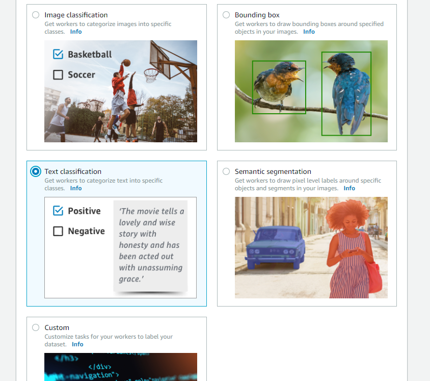

# AWS SageMaker Ground Truthでテキストのラベリングを試してみる

## TL;DR

AWS SageMaker Ground Truthは、機械学習用のラベルデータ作成を行うためのプラットフォームです。
SageMaker Ground Truthでは、以下の種類のラベルデータを作成することができます。

* Image Classification
* Bounding Box
* Text Classification
* Semantic (Image) Segmentation
* Custom

ラベルデータの作成は非常に多くの時間を要するため、外注するための機能も組み込まれています。
自分で作る他に、Amazon Mechanical Turkを利用したり、別途指定のベンダーに依頼する事ができます。

今回はテキストのラベリングを試してみました。
ジョブの作成からラベリングまで、大まかな流れについて紹介します。

なお、2018/11/29にリリースされたばかりサービスですので、内容がすぐに変更になる可能性がある点はご注意ください。

## 利用方法

### 操作の流れ

1. ラベリング対象データのアップロード
2. ラベリングジョブの作成
3. Workerとしてログイン
4. ラベリング
5. ラベリング結果の確認

### ラベリング対象データのアップロード

ラベリング対象のデータはAWS S3にアップロードしておく必要があります。
今回はテキスト分類ですので、テキストデータをアップロードしますが、この際、拡張子が以下である必要があります。

* *.txt
* *.csv

他でも大丈夫かも知れませんが、`*.tsv`では後述のラベリングジョブの作成で問題が発生するため注意してください。
その他、ファイルは複数でも問題ありませんが、複数ディレクトリに跨がっても問題無いかは確認していません。

### ラベリングジョブの作成

AWSコンソールからAWS SageMakerのコンソールを表示します。
画面左側の`Ground Truth -> ラベリングジョブ`を選択するとラベリングジョブの作成画面になります。

`Input dataset location`に`Manifestファイル`を指定するのですが、初回は未作成だと思いますので、説明文にある`Create manifest fileリンク`を押下します。

すると以下の画面が表示されます。

`Input dataset location`に`ラベリング対象データのアップロード`でデータをアップロードしたS3のバケット(+ディレクトリ)を指定します。
テキスト分類ですので`Data Type`は`Text`を指定し、`Createボタン`を押下すると`Manifestファイル`が作成されます。

この際、アップロードしたファイルの拡張子が`*.txt`もしくは`*.csv`以外だと`Manifestファイル`の作成に失敗するので注意してください。
作成が完了したら、`Use this manifestボタン`を押下すると、ラベリングジョブ作成画面の`Input dataset location`が入力されます。

`Task type`は、`Text Classification`を選択します。
なお、`Custom`では自作のHTMLをアップロードして独自のラベルデータ作成画面を指定できるようです。

次にラベルデータの作成者を選択します。
今回は自分自身でラベルデータを作成するため`Private`を選択します。

`Public`や`Vendor managed`を選択するとラベルデータ作成を外注することができます。
うかつに選択すると外注してしまうので注意してください。

ラベルデータ作成者が見る画面をデザインします。
作業者に対してどのような基準でラベリングするのか明確になるように説明を記述します。

`Select an option`には分類先の選択肢を指定しますが、日本語が利用できませんでした。
そもそもMechanical Turkで日本人がいるのかという疑問もあるので、あまり困ることはないと思いますが、一応注意事項です。

以上でラベリングジョブが作成できます。
作成後は以下の様にジョブの一覧が表示されます。

### Privateラベリングチームの作成

ラベリングジョブで`Private`を選択した場合は、初回作成時に`Privateラベリングチーム`を作成する必要があります。
入力するのはチーム名と作業者のメールアドレスです。

チームメンバーの管理は`Amazon Cognito`で行われます。Cognitoのセットアップなどは全てSageMaker Ground Truthが行ってくれます。

### Workerとしてログイン

画面左側の`Ground Truth -> ラベリング労働力`より、ラベリングチームの画面を表示すると以下の内容が表示されます。

上記の`Labeling portal sign-in URLリンク`を押下すると、ラベリング用のポータルを表示することができます。
この際、`Privateラベリングチーム`に指定した作業者としてログインすることになります。

セッションの問題でAWSコンソールを開いているのt同じブラウザだと操作に問題が生じる可能性があるため、別のブラウザかシークレットウィンドウを利用してリンクを開いてください。

ポータルのログイン画面で入力するのは、作業者のメールアドレスとパスワードです。
初期パスワードは、Cognitoから作業者に対してメールが送信されています。

### ラベリング

作業者用のポータルにログインすると作業できるジョブの一覧が表示されています。
ジョブを選択すると以下の様な画面が表示され、ラベリングを行うことができます。

### ラベリング結果の確認

データの一部あるいは全部にラベリングすると、SageMakerのコンソールからラベリングジョブ毎の状況を確認することができます。
なお、一覧に表示されるまで少し(30分くらい?)時間がかかるため注意してください。

ラベリングジョブを選択すると、ラベリングしたデータの一覧を確認することができます。

個々のデータの詳細画面は以下の通りです。
複数人で作業している場合は、付けられたラベルのリストが表示されるのだと思われます。

## 使って見た感想

今回試したようにテキスト分類用のラベルデータ作成だけであれば、Privateチームで利用する限り、SageMaker Ground Truthを利用する価値はあまりないと思われますが、画像系は環境を揃える手間が省けるため便利かもしれません。

ただ、やはり本来の価値はPublic/Venndorによるラベルデータ作成にあると思います。

なお、現在のバージョンではラベリング作業者が見る画面の説明について、ラベリングジョブ作成後に変更することができませんでした。一発勝負になってしまうため、説明文は慎重に検討する必要がありそうです。

## 参考文献

* [Amazon SageMaker Ground Truth — 高い精度のデータセットを構築し、ラベル付けのコストを最大70%削減](https://aws.amazon.com/jp/blogs/news/amazon-sagemaker-ground-truth/)
* [Amazon SageMaker Ground Truth](https://aws.amazon.com/jp/sagemaker/groundtruth/)
