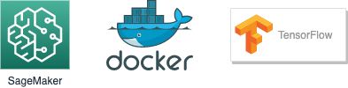

# SageMakerで独自コンテナでトレーニングする方法

## TL;DR



`AWS SageMaker`で独自コンテナでトレーニングする方法です。
メトリクスの設定などを含めて必要最小限の設定でトレーニングするためのサンプルとなります。
ローカルモードとSageMaker上のトレーニングジョブとしての実行もフラグの切替で可能となっています。

## ディレクトリ構成

新規ディレクトリに以下の様にディレクトリやファイルを配置します。

```
├── Dockerfile
├── code
│   └── train.py
└── train.ipynb
```
## 事前準備

SageMakerの初期設定が必要です。トレーニングジョブ実行用のロールとモデル出力用のS3バケットを用意して設定してください。
また、独自コンテナはECRで管理します。ECRに任意の名前でリポジトリを作成してください。

## Dockerfile

tensorflow2.3を利用する想定です。`2.3.0`ではpython3となっています。
最低限必要なパッケージは`sagemaker-containers`のみです。
コンテナ側のディレクトリ構成は[Amazon SageMaker コンテナライブラリを使用した Docker コンテナの作成](https://docs.aws.amazon.com/ja_jp/sagemaker/latest/dg/amazon-sagemaker-containers.html)を参照してください。

```Dockerfile
FROM tensorflow/tensorflow:2.3.0rc2

RUN pip install sagemaker-containers

# Copies the training code inside the container
COPY code/train.py /opt/ml/code/train.py

# Defines train.py as script entrypoint
ENV SAGEMAKER_PROGRAM train.py
```

## トレーニング用スクリプト(train.py)

`code/train.py`に独自のトレーニングスクリプトを記載します。
以下は`MNIST`のトレーニングをするサンプルとなっています。

```python
import tensorflow as tf
import argparse
import os

parser = argparse.ArgumentParser()
parser.add_argument('--model-dir', type=str,
                    default=os.environ['SM_MODEL_DIR'])
parser.add_argument('--output-dir', type=str,
                    default=os.environ['SM_OUTPUT_DATA_DIR'])

args, _ = parser.parse_known_args()

mnist = tf.keras.datasets.mnist

(x_train, y_train), (x_test, y_test) = mnist.load_data()
x_train, x_test = x_train / 255.0, x_test / 255.0

model = tf.keras.models.Sequential([
    tf.keras.layers.Flatten(input_shape=(28, 28)),
    tf.keras.layers.Dense(128, activation='relu'),
    tf.keras.layers.Dropout(0.2),
    tf.keras.layers.Dense(10, activation='softmax')
])

model.compile(optimizer='adam',
              loss='sparse_categorical_crossentropy',
              metrics=['accuracy', 'mse', 'mae'])

model.fit(x_train, y_train, epochs=1, verbose=2) # verbose=1のままだとメトリクスを上手く取得できないので2に設定します。

model.evaluate(x_test, y_test)
tf.saved_model.save(model, f'{args.model_dir}/1')
```

## トレーニング実行用ノートブック(train.ipynb)

### 依存モジュールのインストール

`sagemaker[local]`をインストールします。

```python
!pip install 'sagemaker[local]'
```

### パラメータの設定

実際に利用する環境によって設定してください。

```python
is_local_mode = False # ローカルモードとSageMakerのトレーニングジョブの実行を切り替えるためのフラグです。
AWS_ACCOUNT_ID = '[AWS_ACCOUNT_ID]' # 利用するAWSのアカウントID(数字)を指定します。
PROJECT_NAME = 'train-mnist' # プロジェクト名です。モデル名として使用したりトレーニングジョブのタグとして付与します。
ROLE_ARN = '[MY_ROLE]' # sagemakerで指定したロールを設定します。
AWS_REGION = 'us-east-1' # regionを指定します。SageMaker/ECRは同一リージョンである必要があります。
ECR_REPOSITORY_URL = f'{AWS_ACCOUNT_ID}.dkr.ecr.{AWS_REGION}.amazonaws.com'
CONTAINER_IMAGE_NAME = PROJECT_NAME
CONTAINER_TAG_NAME = 'latest'
TAGS = [{
    'Key': 'ProjectName',
    'Value': PROJECT_NAME
}]
OUTPUT_ROOT = f's3://sagemaker-{AWS_REGION}-{AWS_ACCOUNT_ID}/projects/{PROJECT_NAME}'
```

### コンテナのビルド

```python
import subprocess
from subprocess import CalledProcessError

build_command = f'docker build -t {CONTAINER_IMAGE_NAME} .'
login_command = f'aws ecr get-login-password --region {AWS_REGION} | docker login --username AWS --password-stdin {ECR_REPOSITORY_URL}'
tagging_command = f'docker tag {CONTAINER_IMAGE_NAME}:{CONTAINER_TAG_NAME} {ECR_REPOSITORY_URL}/{CONTAINER_IMAGE_NAME}:{CONTAINER_TAG_NAME}'
push_command = f'docker push {ECR_REPOSITORY_URL}/{CONTAINER_IMAGE_NAME}:{CONTAINER_TAG_NAME}'

print(subprocess.check_output(build_command, shell=True))

if not is_local_mode:
    subprocess.call(login_command, shell=True) # なぜか成功してもreturn code 1が返るのでcheck_outputしません。
    print(subprocess.check_output(tagging_command, shell=True))
    print(subprocess.check_output(push_command, shell=True))
```

### SageMaker用Sessionの作成

```python
import boto3
import sagemaker

boto3_session = boto3.session.Session(region_name=AWS_REGION)
session = None

if is_local_mode:
    session = sagemaker.local.local_session.LocalSession(boto3_session)
else:
    session = sagemaker.Session(boto3_session)
```

### トレーニングの実行

```python
from sagemaker.estimator import Estimator

instance_type = None
image_name = None

if is_local_mode:
	image_name = CONTAINER_IMAGE_NAME
	instance_type = 'local'
else:
	image_name = f'{ECR_REPOSITORY_URL}/{CONTAINER_IMAGE_NAME}'
	instance_type = 'ml.m5.large'

metric_definitions = [
    {'Name': 'train:acc', 'Regex': 'accuracy: (\S+)'},
    {'Name': 'train:mse', 'Regex': 'mse: (\S+)'},
    {'Name': 'train:mae', 'Regex': 'mae: (\S+)'},
]

estimator = Estimator(image_name=image_name,
      sagemaker_session=session,
	  role=ROLE_ARN,
	  tags=TAGS,
	  output_path=OUTPUT_ROOT,
	  train_instance_count=1,
	  train_instance_type=instance_type,
	  metric_definitions=metric_definitions)

estimator.fit()
```

## まとめ

`is_local_mode`を`True`にして実行するとローカル環境で実行して動作を確認することができます。
`train.py`の内容を編集して動作を確認した後は、`False`にすることでSageMaker上のインスタンスを利用したトレーニングジョブとしてそのまま実行できます。

## 参考文献

* [Amazon SageMaker コンテナライブラリを使用した Docker コンテナの作成](https://docs.aws.amazon.com/ja_jp/sagemaker/latest/dg/amazon-sagemaker-containers.html)