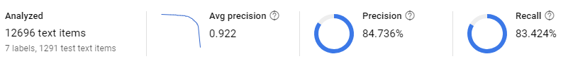
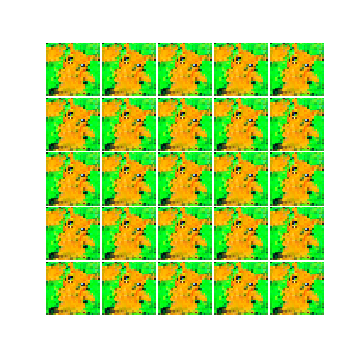

# INOUE-KOBO.COM

フリーランスのシステムアーキテクト、機械学習エンジニアです。
技術メモやポートフォリオを公開しています。

## AWS

  

    

      

        
        

          <h5 class="card-title">MkdocsとS3/Cloudfrontによるドキュメント公開システムの構築</h5>
          <a href="aws/mkdocs-s3-cloudfront/index.html" class="btn btn-primary">Read</a>
        

      

    

    
&nbsp;

    
&nbsp;

  

## AI/ML

  

    

      

        
        

          <h5 class="card-title">GCP AutoML Natural Languageのベンチマーク</h5>
          <a href="ai_ml/automl-benchmark/index.html" class="btn btn-primary">Read</a>
        

      

    

    

      

        
        

          <h5 class="card-title">GANでピカチュウを描いてみる</h5>
          <a href="ai_ml/gan-pikachu/index.html" class="btn btn-primary">Read</a>
        

      

    

    
&nbsp;

  

## Others

*under construction*