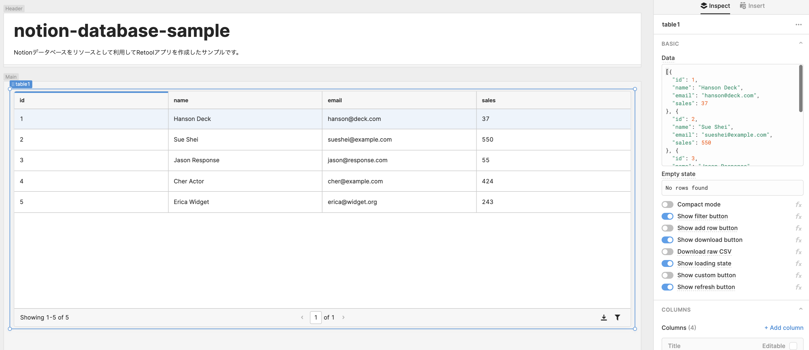

# Notionのデータベースに対するViewerをRetoolで作ってみた

## TL;DR

[Notion](https://www.notion.so/)で記録したデータベースをリソースとして、No-Code/Low-Code Platformである[Retool](https://retool.com/)を利用して表示用のWebアプリケーションを作成してみました。

Retoolからは[Notion API(β)](https://developers.notion.com/)を利用してデータを参照しています。但し、ページングには対応していません。Notion APIはページサイズの上限が100件となっているため、このままでは100件以上あるデータベースは全件表示ができません。

対応策はありますが、Retoolの現在の制限により少し対応方法が複雑になるため、今回は上限100件までの表示になるという制限付きです。

## Notionでデータベースを作成する

まずはリソースとなるNotionデータベースを作成します。サンプルとして以下の様なデータベースを用意しました。


ダミーデータ生成の一部には、[faker](https://github.com/joke2k/faker)を使用しています。

## Notion APIを利用できるようにする

最初にNotion APIを利用するためのAPI Tokenを発行する必要があります。以下のサイトを開き新しいインテーグレーションを作成します。

* [Notion - 私のインテグレーション](https://www.notion.so/my-integrations)


現在のインテグレーションは、関連付けるワークスペースと利用する権限セットの単位で作成しますが、APIとして参照するデータベースの単位で作成する方がわかりやすいと思います。ここでは、名前として`notion-database-sample`、権限は参照のみ、ユーザ情報は提供しないということで設定しています。


送信をするとトークン(API Token)が発行されます。トークンは秘密情報であるため外部に露出しないように注意してください。


最後にNotionのデータベースに作成したインテーグレーションを`Invite`します。


## Retoolで新規にアプリを作成する

今回はRetoolで新規にアプリを作成します。


## Componetを配置する

最初にHeader部分にアプリのタイトルと説明をラベルとして追加します。Text部品をドラッグアンドドロップでHeaderに配置します。


RetoolのText部品はMarkdown記法が利用可能です。

```markdown
# notion-database-sample

Notionデータベースをリソースとして利用してRetoolアプリを作成したサンプルです。
```

続いてTable部品をMain部分に配置します。



## Resourceを設定する

外部APIの呼び出しはResourceとして設定します。NotionのResourcesより連携を新規に作成します。


ResourceではNotion APIを呼び出す設定を行います。設定すべき項目は以下のとおりです。

* Name
* Base URL
* Authorization
* Notion-Version


### Name

Resourceに付ける名前です。内容は任意です。ここでは`notion-database-sample-api`としています。

### Base URL

Notionデータベースに対するQuery APIのURLです。現在のNotion APIでは以下の書式となっています。

```
https://api.notion.com/v1/databases/[database-id]/query
```

`database-id`については、Notionをブラウザで表示し、対象のデータベースを開いた状態でブラウザで表示されているURLを確認してください。32桁の英数字(UUID)です。

```
https://www.notion.so/[自分のワークスペース]/[database-id]?v=[view-id]
```

### Authorization

RetoolのAuthenticationの設定は利用できないため、ヘッダーに直接API Tokenを設定します。Valueでは以下の様に`Bearer `(Bearerの後に半角スペース含む)を先頭に付け加えて設定します。

```
Bearer [Notion API Token]
```

### Notion-Version

Notion APIのバージョンです。2022-01-01時点では以下の固定値を設定します。最新のAPIの状況についてはNotion APIの公式サイトを参照してください。

```
2021-08-16
```

## Resourceの呼び出しパラメータを設定する

Resourceの作成では固定値となるパラメータのみ設定します。アプリ内で動的に変更するパラメータについては、Resource作成後にパラメータを設定します。今回設定するパラメータは以下のとおりです。

* Run query automatically when inputs change
* Action type
* Body


### Run query automatically when inputs change

今回使用するNotion API(データベースに対するQuery)は`POST`メソッドです。Retoolの仕様では`POST`のResourceは入力の保存を行わない限り自動的に呼び出されません。今回は参照しかしないため、デフォルトの`Run query only when manually triggered`のままだと初期表示でAPIの呼び出しが行われません。

このため、`Run query automatically when inputs change`に変更します。

### Action type

Method(Action type)を`POST`に変更することに注意してください。Resourceを設定したら、Save、Runを行いAPIの呼び出しを行います。

### Body

今回はソート条件を固定値で設定しているため動的ではありませんが、Retoolのアプリ内の入力をパラメータの内容に設定することが可能です。

```json
sorts: [{ "property": "Title", "direction": "ascending"}]
```

## TableにResourceを紐付ける

Table部品を選択し、画面右ペインの`Data` に作成したResource(Query)で取得したデータを参照する設定を行います。


```
query1.data.results
```

`query1`は作成したResource(Query)の名前です。変更している場合は合わせてください。`query1.data` でAPIのResponseを参照することができます。Notion APIでは`query1.data.results`に取得したデータベースのレコードが配列として記録されているため、ここで指定します。

## TableのColumnを設定する

`Data`を設定するとAPIのレスポンスから自動的にColumnが設定されますが、Notion APIのレスポンスは階層が深いため、今回は表示に必要なカラムをCustuom Columnとして追加します。


既存のColumnは全て非表示にした上で(目のアイコンを押下すると非表示にできます)、`Add column`を押下して以下のColumnを追加します。

* Title
* Note
* Due Date
* Done

以下は各Columnの設定内容です。全て`Value`に設定する内容です。`Column Type`は全て`Auto`で問題ありません。

### Title

```json
{{currentRow.properties.Title.title[0].plain_text}}
```

### Note

```json
{{currentRow.properties.Note.rich_text[0].text.content}}
```

### Due Date

```json
{{currentRow.properties['Due Date'].date.start}}
```

### Done

```json
{{currentRow.properties.Done.checkbox}}
```

## 設定完了後の画面を確認する

設定が適切に完了すると以下の様な表示になります。`Preview`を押下しなくても編集画面で一連の操作を確認できます。


## アプリを公開する

アプリを誰でもアクセスできるようにするためには、`Preview`画面で`Share`を押し、`Public access link`を発行します。


ここで発行したURLは、パスワードによる保護(`Enable password protection`)を行わない限り誰でもアクセスすることができます。発行したURLの共有については意図したものか注意してください。

## まとめ

今回は主にRetoolの操作感を確認することを目的に触ってみたのですが、Low-Code Platformとしてかなり使いやすいと思いました。画面構成が制限されていますが、その分学習コストが低いため、強力なコードオートコンプリート機能と合わせてかなり直感的な開発が可能です。

なお、今回ページング(Server side pagenation)を制限事項とした理由ですが、Notion APIのページングの方式がCursor方式なのですが、RetoolがCursor方式の場合はGETメソッドを想定しているようで、POSTメソッドに対する挙動が安定しなかったためです。現状の回避策としては以下のようなものが考えられます。

* APIオーケストレーション層を設けて、Notion APIとRetoolのギャップを埋める。
* RetoolのEventHandlerを利用して、ページング時のAPIリクエストを自分で制御する。

後者は実際に試して動作はしたのですが、かなり分かり難い実装になったため今回は割愛しました。現状はオーケストレーション層を設ける方がスマートだと思います。

また、Notion APIはβとなっているため仕様が頻繁に変更されることが予測されます。前述のRetoolのページング機能の相性なども解消される可能性があるため、こちらも今後のアップデートに注目されます。

## 参考文献

* [Notion](https://www.notion.so/)
* [Notion API(β)](https://developers.notion.com/)
* [Retool](https://retool.com/)
* [NotionAPIを使ってみた](https://qiita.com/tomoya_sakusaku/items/5a7f59ddfebe25e1ca8b)