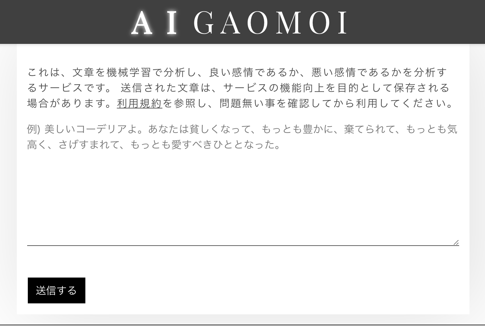
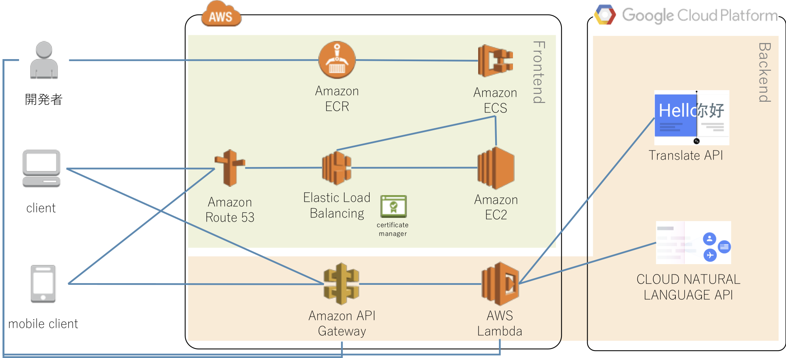

# AIGAOMOI - 日本語文書感情分析サービス

## 概要

文章を機械学習で分析し、良い感情(Positive)であるか、悪い感情(Negative)であるかを分析するWebサービスです。
サーバレス、SPA、機械学習関連APIのデモンストレーションとして作成しました。

* [https://www.aigaomoi.com/](https://www.aigaomoi.com)

## システム構成

機械学習関連APIとして`GCP Natural Language API`を使用しています。
日本語は受け付けないため、`Google Translate API`により、英語に翻訳してからAPIを通す構成です。

なお、当初はフロントエンドの構成にDockerを使用しましたが、現在はS3により運用しています。

## 使用技術

* ECMASCript6
* Node.js
* Babel
* Yarn
* Webpack
* React
* Redux
* Serverless Framework
* Sass
* AMP Start
* Docker