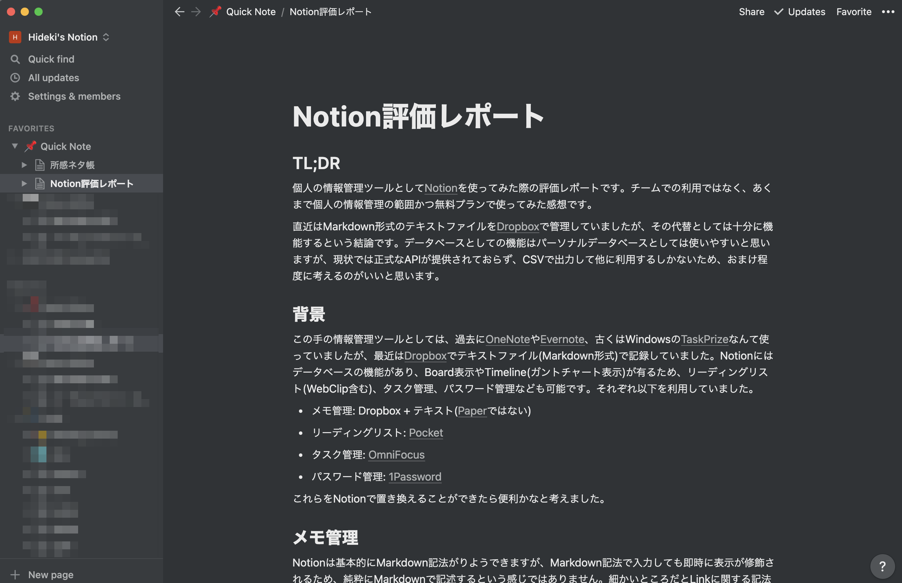

# Notion評価レポート

## TL;DR

個人の情報管理ツールとして[Notion](https://www.notion.so/)を使ってみた際の評価レポートです。チームでの利用ではなく、あくまで個人の情報管理の範囲かつ無料プランで使ってみた感想です。

直近はMarkdown形式のテキストファイルを[Dropbox](https://www.dropbox.com/h)で管理していましたが、その代替としては十分に機能するという結論です。データベースとしての機能はパーソナルデータベースとしては使いやすいと思いますが、現状では正式なAPIが提供されておらず、CSVで出力して他に利用するしかないため、おまけ程度に考えるのがいいと思います。

## 背景

この手の情報管理ツールとしては、過去に[OneNote](https://www.onenote.com/hrd?omkt=ja-JP)や[Evernote](https://evernote.com/intl/jp)、古くはWindowsの[TaskPrize](https://k2top.jpn.org/index.php?TaskPrize)なんて使っていましたが、最近は[Dropbox](https://www.dropbox.com/h)でテキストファイル(Markdown形式)で記録していました。Notionにはデータベースの機能があり、Board表示やTimeline(ガントチャート表示)が有るため、リーディングリスト(WebClip含む)、タスク管理、パスワード管理なども可能です。それぞれ以下を利用していました。

- メモ管理: Dropbox + テキスト([Paper](https://www.dropbox.com/ja/paper)ではない)
- リーディングリスト: [Pocket](https://app.getpocket.com/)
- タスク管理: [OmniFocus](https://www.omnigroup.com/omnifocus/)
- パスワード管理: [1Password](https://1password.com/jp/)

これらをNotionで置き換えることができたら便利かなと考えました。

## メモ管理

Notionは基本的にMarkdown記法がりようできますが、Markdown記法で入力しても即時に表示が修飾されるため、純粋にMarkdownで記述するという感じではありません。細かいところだとLinkに関する記法がインラインでは行えなかったりします(コピペでは機能します)。

Markdown記法のRaw表示とPreview表示への切替がないのは使い勝手を考えてだと思いますが、個人的にはちょっと使い辛いかなと感じる点です。

検索機能は全文検索ができればいいので特に不満は感じませんが、他のツールでタグ機能を多用していた人は注意が必要です。Notionではデータベース機能を利用しないとタグ相当の機能が利用できませんが、データベースではない単純なメモとして作成した場合は、後からタグ相当の情報(Property)を追加することができません。

ゼロからメモを管理する場合は気になりませんが、他のツールから移行した場合はデータベース機能の活用に悩むと思います。

## リーディングリスト

一応Chrome用のWeb Clipperプラグインが存在するのですが、Notionがデフォルトで提供しているTemplateのReading Listと上手く連携できませんでした。これは一時的な問題かも知れませんが、暫くはリーディングリストとしてNotionを利用することはないと思います。

タブレットやスマートフォン用でリーディングリストに特化したアプリも現状では提供されていないため、使い勝手的には専用のアプリ・サービスには一歩劣ると思います。

ただし、参考資料を管理するためのデータベース機能を利用するのは結構便利です。

## タスク管理

BoardやTimeline表示の機能があるため、Notionとして力を入れている機能だと思いますが、現状だと繰り返したタスクの機能がありません。GIS(位置情報)との連携やコンテキスト(あるいはタグ)によるパースペクティブなど、細かい要望もありますが、繰り返しタスクがないのは大きいと思います。

あと、Apple Watch用のアプリがないのも個人的には重要なポイントです。タスク管理はApple Watchと連携してると便利なことが多いため、この点でも暫くはNotionをタスク管理に使うのは難しいかなと感じています。

他にもMacOSの通知アプリにも無いので、やはりタスク管理は専用のアプリ・サービスの代替にするには敷居が高いかなという感じです。

## パスワード管理

データベース機能にPassword型がないため、Text型を使用することになりますが、当然秘密テキストとしての表示になりません。自分しか利用しないと考えれば問題無いのですが、専用のアプリを使っている人は、さすがに気持ち悪いと思います。

また、ワンタイムパスワードにも対応しておらず、ブラウザに対する入力支援もありません。このため、パスワード管理アプリ・サービスの完全な代替とすることは無理だと思います。

ただ、一時的な情報を管理する場所としては便利なこともあるので、併用することもあるかなという印象です。

## あったらいいな

- Markdownで出力する際にzipアーカイブになるため、他に貼り付ける際に一手間かかります。Markdown形式でクリップボードにコピー機能があったらないいなと思います。
- PropertyのLinkからSummaryやページのコンテンツを取得する機能(Gallery ViewでSummaryが表示されると嬉しいので)。
- 手書き対応。割とすぐに対応されそうな気もしますが、iPad Pencilでメモする機会もあるので、対応してくれると嬉しいです。

## まとめ

個人的にはメモ管理の代替として利用していきたいと考えています。パスワード管理はさすがに難しいですが、タスク管理やリーディングリストもNotionに統合できたらいいなと思うものの、現状はちょっと難しそうです。

Notionの売りはデータベース機能にあると思いますが、単純なメモ管理としてはデータベース機能を意識しすぎると面倒になると思います。あくまでデータベース機能はおまけ程度に考えるのが、個人的にはお勧めです。