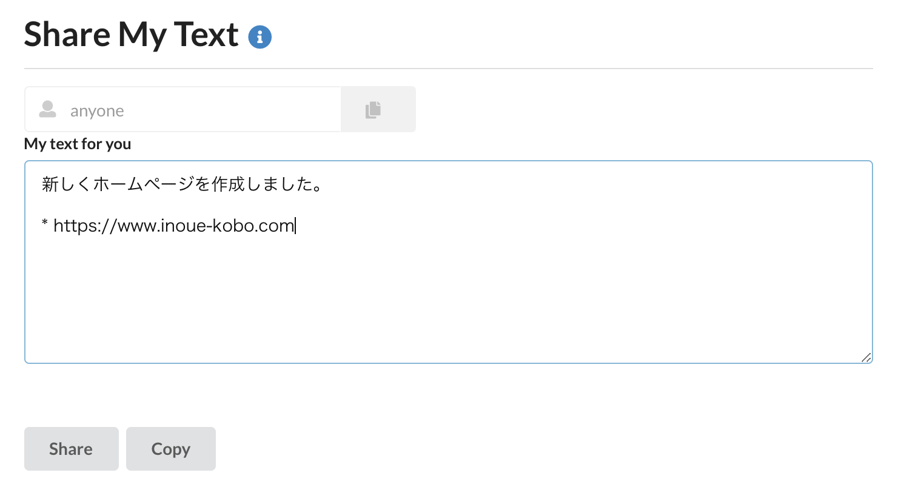
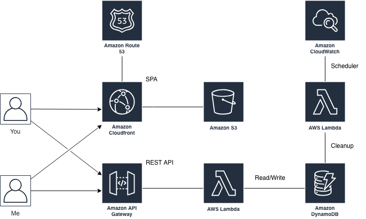

# Share My Text - Share your short text in short time

## 概要

短いテキストをURLベースで共有するためのWebサービスです。テキストは一時的にサーバに保存されますが、短時間(1時間)で自動的に削除されます。

他のユーザとの共有の他に、複数の端末を利用している場合にクリップボード感覚でテキストを共有することができます。

* [https://service.inoue-kobo.com/sharemytext/v1/index.html](https://service.inoue-kobo.com/sharemytext/v1/index.html)

## システム構成

SPA + REST API、データストアにDynamoDBという標準的なサーバーレスの構成です。
UIが単純なのでフロントはフレームワークを使用せずに素のJavaScriptで作成しています。

## 使用技術

* Python3
* AWS Lambda
* Amazon API Gateway
* Amazon DynamoDB
* Semantic UI