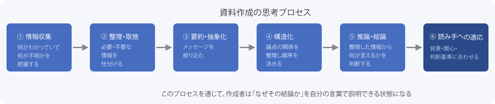
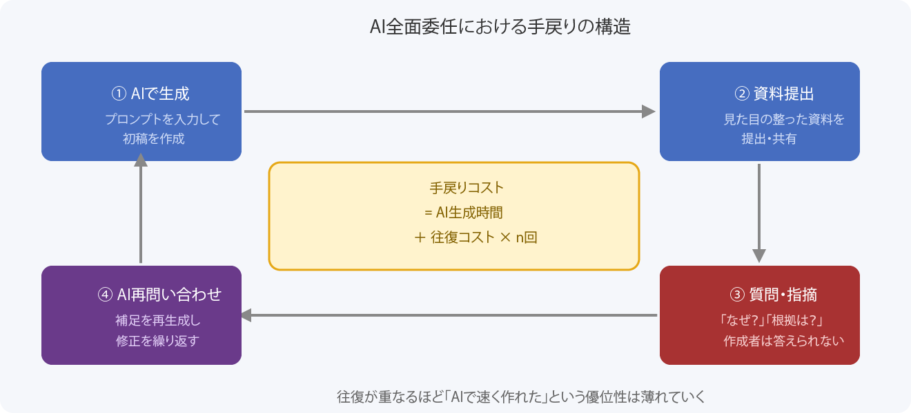
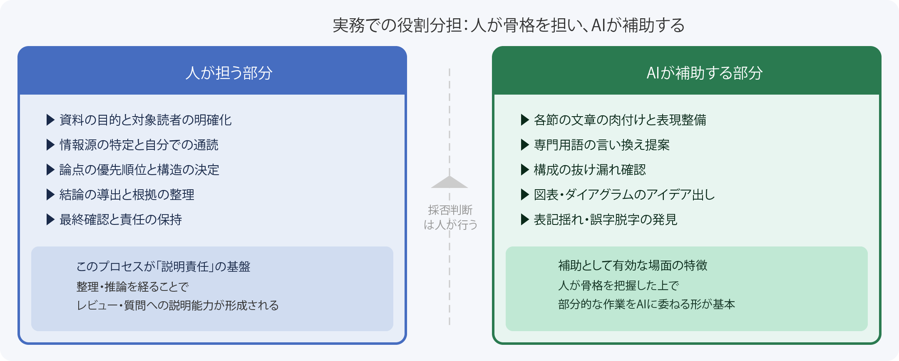

# AIに資料を全面委任すると、なぜ手戻りが増えるのか

本稿では、生成AIを用いた資料作成における`全面委任`と`補助活用`の違いを、資料本来の目的・思考プロセス・手戻りコストの観点から整理しています。AIは資料の生成速度を大幅に向上させますが、情報整理・推論・説明責任という作業構造を踏まえると、全面委任の費用対効果は見かけ上の速さよりも低くなる場面が少なくありません。適切な役割分担によって品質と効率を両立させる方法についても合わせて紹介します。

## はじめに

生成AIの普及により、資料の「初稿を出す速さ」は大幅に向上しました。プロンプトを入力すれば、数十秒でそれらしい文章や箇条書き、スライド構成が返ってきます。この速さは本物であり、補助的に活用する場面では確かに有効です。

しかし、速さだけに注目すると見落としがちな問題があります。「AIに任せたら早く完成した」にもかかわらず、レビューで大量の指摘が入る、関係者の質問に答えられない、修正の往復が何度も続く——このような状況は、AIを活用する現場で起きやすいパターンの一つです。

資料の生成速度と、資料が本来の目的を果たすかどうかは、別の問題です。本稿では、この問題を資料作成の構造・責任・費用対効果の観点から整理します。

## 資料の目的は「作ること」ではなく「伝えること」

資料の目的は、相手に説明し、理解してもらい、必要に応じて判断や行動につなげることです。設計書であれば設計の意図を伝えて承認を得るため、提案書であれば意思決定を促すため、報告書であれば現状を共有して次の行動を引き出すためです。

実務の現場では、「資料を完成させること」がいつのまにか目的として扱われることがあります。締め切りに追われているとき、タスクは「資料を完成させること」として認識されやすく、完成した資料をもってタスク完了と見なされます。しかし、読み手が理解できなければ、質問に答えられなければ、判断や行動につながらなければ、その資料は目的を果たしていません。

AIを活用すると、この「作ること」と「目的を果たすこと」の乖離が広がりやすくなります。AIは見た目の整った資料を素早く生成しますが、特定の読み手の疑問に答えられるかどうかは別の問題だからです。

## 資料作成という思考プロセス

資料作成とは、単なる文章生成やスライドの清書ではありません。次のような思考プロセスの積み重ねです。

- **①情報収集**: 何がわかっていて、何がわかっていないかを把握する
- **②整理・取捨選択**: 読み手に必要な情報と不要な情報を分ける
- **③要約・抽象化**: 細部をまとめ、伝えるべきメッセージを絞る
- **④構造化**: 論点の関係を整理し、順序を決める
- **⑤推論・結論の導出**: 整理した情報から何が言えるかを判断する
- **⑥読み手への適応**: 読み手の背景知識・関心・判断基準に合わせて調整する

このプロセスを経ることの意義は、完成物を作ることだけにあるのではありません。整理する過程で自分の理解の穴に気づき、構造化する過程で前提の矛盾を発見し、推論を経ることで説明の根拠が整理されます。結果として、作成者は資料の内容を自分の言葉で説明できる状態になります。

AIに依頼すると、このプロセスの大部分を外部化することになります。外部化の範囲が広いほど、このプロセスを経る機会は失われていきます。

## 思考プロセスが「説明責任」を支えること

資料作成の思考プロセスを自分で経ることには、「説明責任」という観点からも重要な意味があります。

資料が相手に届いた後には、次のような場面が起きます。

- レビュワーが「なぜこの結論になるのか」と問う
- ステークホルダーが「前提の根拠は何か」と確認する
- チームメンバーが「この方針はAとBのどちらを優先しているのか」と聞く

これらの問いに答えられるのは、情報源を自分で読み、整理し、推論を経てきた人です。そのプロセスを通過していれば、「○○という情報と△△という制約を組み合わせると、この結論が最も現実的である」と即座に説明できます。

AIが生成した資料をそのまま提出した場合、論拠の構造は作成者の手にありません。レビューや質問の場面で「AIがそう書いていたので」という状態に陥るか、あるいは説明できずに資料の信頼性そのものが損なわれます。

論拠の選択が読み手の状況や関係者固有の制約と合っているかどうかは、その状況を知る人間が確認しなければわかりません。これはAIの能力の問題ではなく、文脈の所在の問題です。

## AIへの全面委任が引き起こすこと

具体的なシナリオで考えてみます。

あるエンジニアが新機能の設計提案書をAIに生成させました。出力は構成が整っており、文章も読みやすいものでした。期限内に「完成」しました。

レビュー会議で次のような指摘が入りました。

- 「アーキテクチャの選定理由は書かれているが、なぜ代替案Bではなく今回の方式を選んだのか説明できますか」
- 「○○制約下での動作については触れられていませんが、意図的に除外したのですか」
- 「前提としている利用規模の根拠は何ですか」

作成者は答えられません。再度AIに問い合わせて補足資料を作り、次のレビューに臨みます。そこでまた別の観点からの指摘が入ります。この往復が続きます。

この構造でコストが増大する理由は、「AIへの再問い合わせ」自体がゼロコストではないからです。指摘内容を整理し、適切なプロンプトを作成し、出力を確認し、また資料に反映する——この往復がレビューの回数分繰り返されます。

手戻りのコストは、最初の生成時間ではなく往復の総時間で評価する必要があります。この視点が抜けると、AIへの全面委任による速さが過大評価されやすくなります。なお、設計提案書のような技術資料に限らず、経営層向けの報告書や顧客向けの提案資料においても、同様のループは起きやすいパターンです。

## 全面委任を成立させるにはハーネスの定義が必要であり、構造的なトレードオフが生じる

AIへの全面委任を精度よく成立させようとするなら、精密なハーネス——AIへの指示の骨格——を定義する必要があります。ハーネスには次のような要素が含まれます。

- **対象読者**: 誰の、どの程度の知識を前提とするか
- **目的**: 何を理解させ、何を判断させるための資料か
- **使う情報源**: どの資料・データ・制約を参照するか
- **論点の優先順位**: 何を強調し、何を省略するか
- **推論規則**: どの条件のときにどちらの結論を選ぶか
- **レビュー観点**: どの基準でOK/NGを判断するか

これらを定義すれば、AIはより意図に沿った出力を返すようになります。ただし、この定義作業自体がコストを伴います。

また、定義が精密であるほど、出力を検証するコストも上がります。「この出力は指定した推論規則に従っているか」「対象読者に合わせた言い回しになっているか」を確認するためには、定義した観点を一つひとつ照合する作業が必要です。

ハーネスを精密に定義できるということは、対象読者・目的・情報源・論点・推論規則を作成者がすでに正確に把握しているということでもあります。そこまで把握できている場合、新規に発生する一回限りの資料や高コンテキストな資料については、人が直接作成した方が総コストを抑えられるケースが多くなります。

| 工程 | 人が直接作成 | AIに全面委任（ハーネス再利用なし） |
|---|---|---|
| 情報整理・構造化 | 人が実施 | ハーネス定義として実施（高コスト） |
| 本文・スライド生成 | 人が実施 | AIが実施（速い） |
| 出力検証・修正指示 | 不要 | 人が実施（コスト発生） |
| レビュー対応 | 説明可能 | 説明困難（往復増加） |
| 総コスト | 中程度 | ハーネス定義＋往復で増大しやすい |

全面委任の費用対効果が優れるのは、ハーネスを一度定義すれば繰り返し再利用できる定型的な資料の生成に限られます。一発もの・高コンテキスト・関係者固有の制約が多い資料ほど、ハーネス定義コストと往復コストの合計は増大しやすくなります。

なお、ハーネス定義コストが過小評価されやすい理由の一つは、AIが即座に出力を返すため、プロンプト設計に費やした時間の認識が薄れやすい点にあります。「すぐに出てきた」という印象が、準備コストを見えにくくします。

## AIが有効に機能する領域とそうでない領域

整理すると、AIが資料作成において有効に機能する領域と、人が担うべき領域は次のように区分できます。

### AIが補助として有効な領域

- **要約**: 長い議事録・仕様書・ログを短くまとめる
- **言い換え**: 専門用語の平易化、表現の多様化
- **構成案のたたき台**: アウトラインの候補を複数出す（人が選択する）
- **抜け漏れ観点の確認**: 「この視点が欠けていないか」を問う
- **図表案**: テキストで表現しにくい関係をダイアグラム化する補助
- **文体の統一・校正**: 表記揺れ、誤字脱字の発見

これらに共通するのは、人が資料の骨格を把握した上で、部分的な作業をAIに委ねる形であることです。出力を採用するかどうかの判断は、常に人が行います。

### 人が担うべき領域

- **情報源の整理**: 関連資料を自分で読まずにAIにまとめさせると、後の説明責任を失うことになります
- **論点の選択**: 何を強調すべきかの判断は、読み手の状況を知る人間が行う必要があります
- **結論の導出**: 状況の制約・関係者の背景・優先順位の評価は、文脈を持つ人間が関与しなければ適合性を確認できません
- **読み手への適応**: 対象読者を定義せずに汎用的な出力を採用すると、誰にも刺さらない資料になるリスクがあります

## 実務での役割分担

実務において、現実的な役割分担は次のようになります。

### 人が担う部分

- 資料の目的と対象読者の明確化
- 使用する情報源の特定と自分での通読
- 論点の優先順位と構造の決定
- 結論の導出とその根拠の整理
- 最終的な内容の確認と責任の保持

### AIに委ねる部分

- 各節の文章の肉付けと表現の整備
- 専門用語の言い換え提案
- 図表のアイデア出し
- 構成の抜け漏れ確認
- 表記揺れの修正

この役割分担の考え方は、[メタドキュメント作成のススメ](https://www.inoue-kobo.com/ai_ml/meta-document-workflow/)で述べた観点とも重なります。成果物の品質基準・構造・目的を人が定義し、AIはその基準に沿った補助として機能させる——という原則は、資料作成においても同様に適用できます。

具体的な進め方の一例を挙げます。

1. 自分で情報源を読み、「何を言いたいか」を箇条書きで3〜5点まとめる
2. その箇条書きをもとにAIに構成案を出させ、不足観点を確認する
3. 節ごとに自分の言葉でキーメッセージを書き、AIに文章を整えさせる
4. 出来上がった文章を自分でレビューし、「自分の言葉で説明できるか」を確認する
5. 説明できない箇所があれば、情報整理の工程に戻る

この流れは、人が情報整理のプロセスを経た上でAIを補助に使う構成になっています。「速さ」は多少犠牲になりますが、レビュー対応や質問への説明が可能な資料が得られます。結果として修正の往復回数が減り、総コストを抑えられる可能性があります。

## おわりに

資料作成が問題になりやすいのは、AIの能力が不足しているからではありません。資料作成は本来、情報整理・推論・説明責任という思考プロセスを伴う作業であり、そのプロセスを経ることで作成者が「説明できる状態」になります。このプロセスを外部化しすぎると、見た目の整った資料が完成しても、中身を説明できない状態が残ります。

全面委任を精度よく成立させるためのハーネス定義コストは、見えにくいため過小評価されやすい傾向があります。AIが即座に出力を返すという速さが、準備コストの認識を薄めることがあるためです。

AIは資料作成の補助として有効に活用できます。「相手に何を理解してもらい、何を判断させるのか」を問い続ける役割は、資料の作成者である人が担うことになります。

---

*本稿の執筆にあたり、Claude CodeのAgent Teams（Planner・Drafter・Critic・Editor）を構成レビュー・論理検証・文体確認の補助として活用しました。記事の構成・主張・最終確認は著者が担当しています。*

## 参考文献

- [メタドキュメント作成のススメ](https://www.inoue-kobo.com/ai_ml/meta-document-workflow/)
