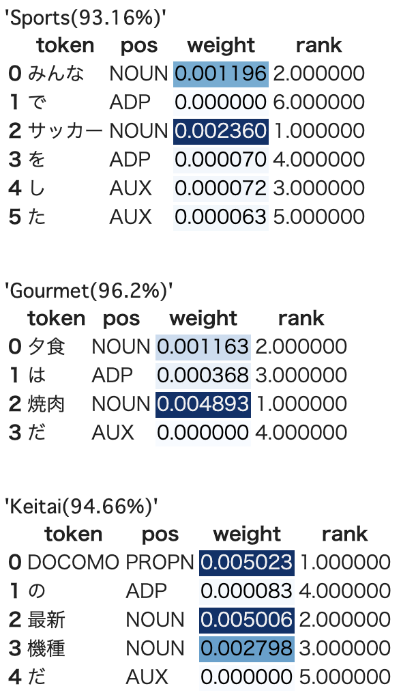

# 自然言語処理で使われるAttentionのWeightを可視化する(spaCy版)

## TL;DR

自然言語処理で使われるAtentionのAttention Weight(Attention Weightを加味した入力シーケンス毎の出力)を可視化します。
基本的に[自然言語処理で使われるAttentionのWeightを可視化する](../attention-visualize/index.md)と同様ですが、[spaCy](https://spacy.io/)を利用したバージョンです。

{:style=max-height:600px}

### ベンチマーク用データ

[京都大学情報学研究科--NTTコミュニケーション科学基礎研究所 共同研究ユニット](http://nlp.ist.i.kyoto-u.ac.jp/kuntt/index.php)が提供するブログの記事に関するデータセットを利用しました。 このデータセットでは、ブログの記事に対して以下の4つの分類がされています。

* グルメ
* 携帯電話
* 京都
* スポーツ

## ソースコード

### モジュールのインストール

```python
!pip install keras-self-attention
!pip install ginza
# Colabを利用する場合、pip install直後でginza(spaCy)が認識されないため、
# 以下を参考にしてパッケージをリロードします。
# https://www.sololance.tokyo/2019/10/colab-load-ginza.html
import pkg_resources, imp
imp.reload(pkg_resources)
```

### データセットの準備

```python
!mkdir data
!wget http://nlp.ist.i.kyoto-u.ac.jp/kuntt/KNBC_v1.0_090925_utf8.tar.bz2 -O data/KNBC_v1.0_090925_utf8.tar.bz2
%cd data
!tar xvf KNBC_v1.0_090925_utf8.tar.bz2
%cd ..
```

```python
import re
import pandas as pd
import numpy as np

def get_sentences_from_text(filename):
  sentences = []
  with open(filename, 'r') as f:
    for i, line in enumerate(f):
      sentence = line.split('\t')[1].strip()
      if sentence == '': # 空文字を除去。
        continue
      if re.match('^http.*$', sentence): # URLを除去。
        continue
      sentences.append(sentence)
  return sentences

import os

root_dir = 'data/KNBC_v1.0_090925_utf8/corpus2'
targets = ['Gourmet', 'Keitai', 'Kyoto', 'Sports']

original_data = []
for target in targets:
  filename = os.path.join(root_dir, f'{target}.tsv')
  sentences = get_sentences_from_text(filename)
  for sentence in sentences:
    original_data.append([target, sentence])

original_df = pd.DataFrame(original_data, columns=['target', 'sentence'])

display(original_df.head())
display(original_df.tail())
display(pd.DataFrame(original_df['target'].value_counts()))
```

### データセットの分割

```python
test_size = 0.2

rand_index = np.random.permutation(list(range(len(original_df))))
diff = int(len(original_df) * (1 - test_size))

train_df = original_df.iloc[rand_index[0:diff]]
test_df = original_df.iloc[rand_index[diff:len(original_df)]]

import pandas as pd

target2index = pd.get_dummies(targets)

# 単語(spaCy)
import spacy
from keras.preprocessing.sequence import pad_sequences

nlp = spacy.load('ja_ginza')

def get_features_and_labels_for_spacy(original_df):
  features = []
  labels = []
  max_feature_len = 0
  for i, original in enumerate(original_df.iterrows()):
    sentence = original[1]['sentence']
    target = original[1]['target']

    doc = nlp(sentence)
    feature = [token.vector for token in doc]
    max_feature_len = max(max_feature_len, len(feature))
    label = target2index[target].values

    features.append(feature)
    labels.append(label)

  return np.asarray(features), np.asarray(labels), max_feature_len

word_train_features, word_train_labels, word_max_feature_len = get_features_and_labels_for_spacy(train_df)
word_test_features, word_test_labels, _ = get_features_and_labels_for_spacy(test_df)
word_train_features = pad_sequences(word_train_features, maxlen=word_max_feature_len, dtype='float32') # dtypeの指定を忘れるとひどいことになるので注意。
word_test_features = pad_sequences(word_test_features, maxlen=word_max_feature_len, dtype='float32') # dtypeの指定を忘れるとひどいことになるので注意。

print(word_train_features.shape)
print(word_train_labels.shape)
print(word_test_features.shape)
print(word_test_labels.shape)
```

### モデルの構築

```python
from keras.layers import Input, LSTM, Dense, Bidirectional, Flatten
from keras.models import Model
from keras_self_attention import SeqSelfAttention

batch_size = 256
epochs = 3

def create_model_for_attention(max_feature_len, tokens_dim):
  inputs = Input((max_feature_len, tokens_dim))
  attention = SeqSelfAttention(name='attention', attention_activation='sigmoid', attention_type=SeqSelfAttention.ATTENTION_TYPE_ADD)(inputs)
  last = Flatten()(attention)
  outputs = Dense(len(targets), activation='softmax', name='class')(last)

  model = Model(inputs, outputs)
  model.compile(loss='categorical_crossentropy', optimizer='nadam', metrics=['accuracy', 'mse'])
  model.summary()

  return model

attention_model = create_model_for_attention(word_max_feature_len, word_train_features.shape[2])
```

### トレーニング

```python
epochs = 4

attention_model.fit(word_train_features, word_train_labels, validation_split=0.1, verbose=1, epochs=epochs)
```

### 可視化

```python
attention_with_w_model = Model(inputs=attention_model.input, outputs=[attention_model.output, attention_model.get_layer('attention').output])

def _softmax(a):
    c = np.max(a)
    exp_a = np.exp(a - c)
    sum_exp_a = np.sum(exp_a)
    y = exp_a / sum_exp_a

    return y.tolist()


def get_attention_weight(tokens, weights):
    weights = _softmax([np.sqrt((w ** 2).max()) for w in weights[-len(tokens):]])
    min_weight = np.min(weights)
    weights -= min_weight
    df = pd.DataFrame({
        'token': tokens,
        'pos': [t.pos_ for t in tokens],
        'weight': weights
    })

    df['rank'] = df['weight'].rank(ascending=False)
    df['weight'] = df['weight'].astype('float32')
    df = df.style.background_gradient(cmap='Blues', subset=['weight'])

    return df

def get_label_and_weights(text, max_feature_len):
  tokens = nlp(text)
  vectors = [t.vector for t in tokens]
  vectors = pad_sequences([vectors], maxlen=max_feature_len, dtype='float32')

  predicts = attention_with_w_model.predict(vectors)
  attention_df = get_attention_weight(tokens, predicts[1][0])

  return {
      'label': targets[predicts[0].argmax()],
      'prob': round(predicts[0].max() * 100, 2),
      'weights': attention_df
  }

test_texts = [
              'みんなでサッカーをした',
              '夕食は焼肉だ',
              'DOCOMOの最新機種だ'
]

for test_text in test_texts:
  rets = get_label_and_weights(test_text, word_max_feature_len)

  print('\n')
  display(f"{rets['label']}({rets['prob']}%)")
  display(rets['weights'])
```

## まとめ

{:style=max-height:600px}

わかりやすい結果を得るためには、なるべくモデルを単純にする必要があります。
試した限りでは、なるべく層を浅くしたり、RNN系のアルゴリズムを使用しない方が人が見てわかりやすい結果を得られています。

この辺りは説明性と精度のバーターになるんだと思います。

## 参考文献

* [自然言語処理で使われるAttentionのWeightを可視化する](../attention-visualize/index.md)