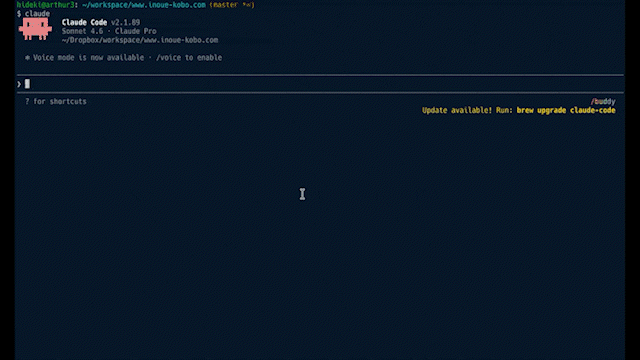

# Claude Code の Agent Teamsで作成した「コード数行でAutoMLが動く——AutoGluon 1.5で試す4種類の機械学習タスク完全ガイド」

この記事は、以下の記事をもとにClaude CodeのAgent Teamsで作成したものです。

* [AutoGluonの基本的なAutoMLを試してみる](https://www.inoue-kobo.com/ai_ml/autogluon/)

上記の記事に対し、以下のプロンプトによりAgent Teamsで内容を拡充・更新しました。

```
以下のチームを作成して、タスクを並列で実行してください。Modelはsonnetを利用してください。

# チーム

1. 機械学習エンジニア: 記事の内容が技術的に適切か確認します。
2. AutoMLに興味のある一般エンジニア: 記事の内容に興味を持てるかについて意見します。
3. 技術系記事を書いているライター: 技術系記事の一般的な観点でアドバイスします。

# タスク

以下の記事のPVを改善するための検討事項と具体的なタスクを検討した上で、改善後の記事を作成してください。

* www/content/ai_ml/autogluon/index.md

改善後の記事は以下として出力してください。

* www/content/ai_ml/autogluon-v2/index.md
```

以下はClaude Codeの実行状況です(20倍速)。



----

機械学習プロジェクトで最も時間がかかるのは、モデル選定とハイパーパラメータ調整ではないだろうか。適切なアルゴリズムを選び、前処理を整え、何十回もチューニングを繰り返す——この作業だけで数日〜数週間を費やすことも珍しくない。

[AutoGluon](https://auto.gluon.ai/stable/index.html)を使うと、その作業をほぼゼロにできる。Amazonが開発したこのオープンソースのAutoMLフレームワークは、データを渡すだけで複数モデルを自動比較・アンサンブルし、最良のものを選んでくれる。核心となるコードはたった2行だ。

```python
predictor = TabularPredictor(label="target").fit(train_data)
predictions = predictor.predict(test_data)
```

本記事では、以下の4タスクでAutoGluonの手軽さと実力を検証する。

| タスク             | 代表的な業務ユースケース                 |
| ------------------ | ---------------------------------------- |
| 表形式データの分類 | 顧客離脱予測、スパムメール判定、不正検知 |
| 表形式データの回帰 | 売上予測、不動産価格推定、需要予測       |
| 時系列予測         | 在庫管理、アクセス数予測、電力需要予測   |
| 画像分類           | 製品外観検査、医療画像診断補助           |

## 前提条件

- AutoGluon Version: 1.5.0
- Python Version: 3.12.12

インストールは以下のコマンドで行う。

```bash
pip install autogluon
```

画像分類（MultiModal）を使う場合は追加パッケージが必要になることがある。詳細は[公式ドキュメント](https://auto.gluon.ai/stable/install.html)を参照。

## AutoGluonが内部でやっていること

各タスクを試す前に、AutoGluonの仕組みを簡単に押さえておこう。

AutoGluonは単一のモデルを学習するのではなく、**複数のモデルを並列で学習し、それらをアンサンブルする**。内部では以下のような階層構造で処理が進む。

```
Layer 1: 個別モデルの学習
  ├── LightGBM
  ├── CatBoost
  ├── NeuralNetTorch
  ├── RandomForest
  └── XGBoost など...

Layer 2: アンサンブル (WeightedEnsemble_L2)
  └── Layer 1の予測結果を特徴量として最適な重みで統合
```

`leaderboard()`の`stack_level`列がこの階層に対応している（`stack_level=1`が個別モデル、`stack_level=2`がアンサンブル）。

また、学習時間と精度のバランスは`presets`パラメータで制御できる。

| presets                   | 用途                                   |
| ------------------------- | -------------------------------------- |
| `best_quality`            | 精度最優先（デフォルト。時間がかかる） |
| `high_quality`            | 精度と速度のバランス                   |
| `medium_quality`          | 速度重視                               |
| `optimize_for_deployment` | 推論速度を最適化したモデルを選択       |

---

## 表形式データの分類

有名な分類タスク用データセットである[Irisデータセット](https://scikit-learn.org/1.4/auto_examples/datasets/plot_iris_dataset.html)を使った例だ。花の計測値（がくと花びらの長さ・幅）から種類（3クラス）を分類する。自分のCSVデータで試す場合は、`pd.read_csv()`で読み込み、`label=`に目的変数の列名を指定するだけで同様に使える。

まずはデータセットを準備する。

```python
from sklearn import datasets
from sklearn.model_selection import train_test_split
import pandas as pd

dataset = datasets.load_iris()

df = pd.DataFrame(data=dataset.data, columns=dataset.feature_names)
df["target"] = dataset.target

train_df, test_df = train_test_split(df, test_size=0.2, random_state=42)

display(train_df.head())
display(test_df.head())
```

以下のようなデータだ。

|     | **sepal length (cm)** | **sepal width (cm)** | **petal length (cm)** | **petal width (cm)** | **target** |
| --- | --------------------- | -------------------- | --------------------- | -------------------- | ---------- |
| 22  | 4.6                   | 3.6                  | 1.0                   | 0.2                  | 0          |
| 15  | 5.7                   | 4.4                  | 1.5                   | 0.4                  | 0          |
| 65  | 6.7                   | 3.1                  | 4.4                   | 1.4                  | 1          |
| 11  | 4.8                   | 3.4                  | 1.6                   | 0.2                  | 0          |
| 42  | 4.4                   | 3.2                  | 1.3                   | 0.2                  | 0          |

AutoGluon用のデータセット形式に変換する。

```python
from autogluon.tabular import TabularDataset, TabularPredictor

train_data = TabularDataset(train_df)
test_data = TabularDataset(test_df)
```

あとは表形式データ用のPredictor（TabularPredictor）を作成し、学習・推論するだけだ。

```python
predictor = TabularPredictor(label="target").fit(train_data)
predictions = predictor.predict(test_data)
```

AutoGluonはデータの内容から分類タスクであることを自動的に判定する。欠損値補完・カテゴリエンコード・数値スケーリングなどの前処理も自動で行われるため、前処理コードを書く必要がない。

```python
=================== System Info ===================
[省略]
===================================================
[省略]
Train Data Rows:    120
Train Data Columns: 4
Label Column:       target
AutoGluon infers your prediction problem is: 'multiclass' (because dtype of label-column == int, but few unique label-values observed).
	3 unique label values:  [np.int64(0), np.int64(1), np.int64(2)]
	If 'multiclass' is not the correct problem_type, please manually specify the problem_type parameter during Predictor init (You may specify problem_type as one of: ['binary', 'multiclass', 'regression', 'quantile'])
Problem Type:       multiclass # <- multiclassになっています。
Preprocessing data ...
[省略]
```

推論結果は以下のようになっている。

```python
predictions[:5]
```

```
73     1
18     0
118    2
78     1
76     1
Name: target, dtype: int64
```

評価指標を確認することもできる。

```python
ret = predictor.evaluate(test_data, detailed_report=True)

ret_df = pd.DataFrame(ret["classification_report"])
display(ret_df)
```

|           | **0** | **1**    | **2**     | **accuracy** | **macro avg** | **weighted avg** |
| --------- | ----- | -------- | --------- | ------------ | ------------- | ---------------- |
| precision | 1.0   | 1.000000 | 0.916667  | 0.966667     | 0.972222      | 0.969444         |
| recall    | 1.0   | 0.888889 | 1.000000  | 0.966667     | 0.962963      | 0.966667         |
| f1-score  | 1.0   | 0.941176 | 0.956522  | 0.966667     | 0.965899      | 0.966411         |
| support   | 10.0  | 9.000000 | 11.000000 | 0.966667     | 30.000000     | 30.000000        |

AutoGluonが試したモデル毎の評価指標も確認できる。

```python
predictor.leaderboard(test_data, extra_metrics=["f1_macro"])
```

|     | **model**           | **score_test** | **f1_macro** | **score_val** | **eval_metric** | **pred_time_test** | **pred_time_val** | **fit_time** | **pred_time_test_marginal** | **pred_time_val_marginal** | **fit_time_marginal** | **stack_level** | **can_infer** | **fit_order** |
| --- | ------------------- | -------------- | ------------ | ------------- | --------------- | ------------------ | ----------------- | ------------ | --------------------------- | -------------------------- | --------------------- | --------------- | ------------- | ------------- |
| 0   | LightGBMXT          | 1.000000       | 1.000000     | 1.000000      | accuracy        | 0.000729           | 0.000401          | 0.482431     | 0.000729                    | 0.000401                   | 0.482431              | 1               | True          | 2             |
| 1   | CatBoost            | 1.000000       | 1.000000     | 1.000000      | accuracy        | 0.001354           | 0.000837          | 0.234552     | 0.001354                    | 0.000837                   | 0.234552              | 1               | True          | 6             |
| 2   | LightGBMLarge       | 1.000000       | 1.000000     | 1.000000      | accuracy        | 0.001811           | 0.000400          | 2.694018     | 0.001811                    | 0.000400                   | 2.694018              | 1               | True          | 11            |
| 3   | NeuralNetTorch      | 1.000000       | 1.000000     | 1.000000      | accuracy        | 0.002747           | 0.001838          | 1.232548     | 0.002747                    | 0.001838                   | 1.232548              | 1               | True          | 10            |
| 4   | ExtraTreesEntr      | 1.000000       | 1.000000     | 0.958333      | accuracy        | 0.017640           | 0.013169          | 0.199860     | 0.017640                    | 0.013169                   | 0.199860              | 1               | True          | 8             |
| 5   | ExtraTreesGini      | 1.000000       | 1.000000     | 0.958333      | accuracy        | 0.028808           | 0.014351          | 0.206514     | 0.028808                    | 0.014351                   | 0.206514              | 1               | True          | 7             |
| 6   | RandomForestGini    | 1.000000       | 1.000000     | 0.958333      | accuracy        | 0.029583           | 0.013446          | 0.292962     | 0.029583                    | 0.013446                   | 0.292962              | 1               | True          | 4             |
| 7   | RandomForestEntr    | 1.000000       | 1.000000     | 0.958333      | accuracy        | 0.030591           | 0.012489          | 0.197481     | 0.030591                    | 0.012489                   | 0.197481              | 1               | True          | 5             |
| 8   | LightGBM            | 0.966667       | 0.966583     | 1.000000      | accuracy        | 0.001737           | 0.000393          | 0.899142     | 0.001737                    | 0.000393                   | 0.899142              | 1               | True          | 3             |
| 9   | XGBoost             | 0.966667       | 0.965899     | 0.916667      | accuracy        | 0.005900           | 0.001184          | 0.556606     | 0.005900                    | 0.001184                   | 0.556606              | 1               | True          | 9             |
| 10  | NeuralNetFastAI     | 0.966667       | 0.965899     | 1.000000      | accuracy        | 0.006194           | 0.004473          | 1.127240     | 0.006194                    | 0.004473                   | 1.127240              | 1               | True          | 1             |
| 11  | WeightedEnsemble_L2 | 0.966667       | 0.965899     | 1.000000      | accuracy        | 0.007086           | 0.004794          | 1.157533     | 0.000892                    | 0.000321                   | 0.030293              | 2               | True          | 12            |

leaderboardの見方：`score_test`が高いモデルが優秀。`stack_level=1`が個別モデル、`stack_level=2`（WeightedEnsemble_L2）が全モデルの予測を組み合わせたアンサンブルだ。このケースでは個別モデルが十分高精度だったため、アンサンブルが特別有利にはなっていないが、データが複雑になるほどアンサンブルの恩恵が大きくなる傾向がある。

実行時間の目安：Irisデータセット（150件）であれば数十秒程度で完了する。

---

## 表形式データの回帰

回帰タスクのデータセットである[The California housing dataset](https://inria.github.io/scikit-learn-mooc/python_scripts/datasets_california_housing.html)を利用した例だ。カリフォルニア州の地区ごとの情報（収入・築年数・部屋数など）から住宅価格の中央値を予測する。売上予測や不動産価格推定などの業務に近い構造のタスクだ。

まずはデータセットを準備する。

```python
dataset = datasets.fetch_california_housing()

df = pd.DataFrame(data=dataset.data, columns=dataset.feature_names)
df["target"] = dataset.target

train_df, test_df = train_test_split(df[:1000], test_size=0.2, random_state=42)

display(train_df.head())
display(test_df.head())
```

|     | **MedInc** | **HouseAge** | **AveRooms** | **AveBedrms** | **Population** | **AveOccup** | **Latitude** | **Longitude** | **target** |
| --- | ---------- | ------------ | ------------ | ------------- | -------------- | ------------ | ------------ | ------------- | ---------- |
| 29  | 1.6875     | 52.0         | 4.703226     | 1.032258      | 395.0          | 2.548387     | 37.84        | -122.28       | 1.320      |
| 535 | 5.2601     | 13.0         | 4.156379     | 1.100823      | 959.0          | 1.973251     | 37.78        | -122.27       | 2.927      |
| 695 | 2.4206     | 19.0         | 3.719613     | 1.089779      | 1765.0         | 2.437845     | 37.70        | -122.11       | 1.375      |
| 557 | 5.1039     | 52.0         | 5.628037     | 1.013084      | 1303.0         | 2.435514     | 37.76        | -122.23       | 2.738      |
| 836 | 4.3875     | 17.0         | 5.504983     | 1.059801      | 1873.0         | 3.111296     | 37.60        | -122.04       | 2.385      |

分類タスクと同様にAutoGluon用のデータセット形式に変換する。

```python
train_data = TabularDataset(train_df)
test_data = TabularDataset(test_df)
```

学習・推論も分類タスクと同様だ。AutoGluonがラベル列のデータ型（float・ユニーク値の多さ）から回帰タスクであることを自動的に判定してくれる。

```python
predictor = TabularPredictor(label="target").fit(train_data)
predictions = predictor.predict(test_data)
```

```python
=================== System Info ===================
[省略]
===================================================
[省略]
Train Data Rows:    800
Train Data Columns: 8
Label Column:       target
AutoGluon infers your prediction problem is: 'regression' (because dtype of label-column == float and many unique label-values observed).
	Label info (max, min, mean, stddev): (5.00001, 0.675, 2.12968, 0.89625)
	If 'regression' is not the correct problem_type, please manually specify the problem_type parameter during Predictor init (You may specify problem_type as one of: ['binary', 'multiclass', 'regression', 'quantile'])
Problem Type:       regression # <- regressionになっています。
Preprocessing data ...
[省略]
```

評価指標を確認する。

```python
ret = predictor.evaluate(test_data, detailed_report=True)

ret_df = pd.DataFrame([ret])
display(ret_df)
```

|     | **root_mean_squared_error** | **mean_squared_error** | **mean_absolute_error** | **r2**   | **pearsonr** | **median_absolute_error** |
| --- | --------------------------- | ---------------------- | ----------------------- | -------- | ------------ | ------------------------- |
| 0   | -0.337892                   | -0.114171              | -0.243167               | 0.842975 | 0.926857     | -0.168862                 |

`root_mean_squared_error`などが負数になっているのは、AutoGluonが「評価指標が大きいほど良い」に統一するため符号を反転させているためだ（絶対値が小さいほど良い指標は負にして、最大化問題に統一する設計）。実際の精度を確認する場合は絶対値を見ればよい。R²は0.84で、住宅価格の約84%の分散を説明できていることを示す。

AutoGluonが評価したモデルも確認できる。

```python
predictor.leaderboard(test_data, extra_metrics=["r2"])
```

|     | **model**           | **score_test** | **r2**   | **score_val** | **eval_metric**         | **pred_time_test** | **pred_time_val** | **fit_time** | **pred_time_test_marginal** | **pred_time_val_marginal** | **fit_time_marginal** | **stack_level** | **can_infer** | **fit_order** |
| --- | ------------------- | -------------- | -------- | ------------- | ----------------------- | ------------------ | ----------------- | ------------ | --------------------------- | -------------------------- | --------------------- | --------------- | ------------- | ------------- |
| 0   | LightGBMXT          | -0.329303      | 0.850857 | -0.356802     | root_mean_squared_error | 0.006622           | 0.001256          | 2.019685     | 0.006622                    | 0.001256                   | 2.019685              | 1               | True          | 1             |
| 1   | NeuralNetTorch      | -0.331640      | 0.848732 | -0.436263     | root_mean_squared_error | 0.004493           | 0.003548          | 3.953525     | 0.004493                    | 0.003548                   | 3.953525              | 1               | True          | 8             |
| 2   | CatBoost            | -0.333273      | 0.847239 | -0.351505     | root_mean_squared_error | 0.001937           | 0.000442          | 0.245677     | 0.001937                    | 0.000442                   | 0.245677              | 1               | True          | 4             |
| 3   | WeightedEnsemble_L2 | -0.337892      | 0.842975 | -0.334350     | root_mean_squared_error | 0.078949           | 0.057096          | 6.653374     | 0.001518                    | 0.000184                   | 0.004776              | 2               | True          | 10            |
| 4   | RandomForestMSE     | -0.346399      | 0.834968 | -0.353917     | root_mean_squared_error | 0.032986           | 0.025742          | 0.220570     | 0.032986                    | 0.025742                   | 0.220570              | 1               | True          | 3             |
| 5   | ExtraTreesMSE       | -0.346958      | 0.834435 | -0.344967     | root_mean_squared_error | 0.033604           | 0.025847          | 0.206870     | 0.033604                    | 0.025847                   | 0.206870              | 1               | True          | 5             |
| 6   | LightGBM            | -0.351175      | 0.830387 | -0.347429     | root_mean_squared_error | 0.001786           | 0.000523          | 1.538106     | 0.001786                    | 0.000523                   | 1.538106              | 1               | True          | 2             |
| 7   | NeuralNetFastAI     | -0.358509      | 0.823228 | -0.429565     | root_mean_squared_error | 0.006463           | 0.003125          | 0.405156     | 0.006463                    | 0.003125                   | 0.405156              | 1               | True          | 6             |
| 8   | XGBoost             | -0.360608      | 0.821153 | -0.352713     | root_mean_squared_error | 0.004562           | 0.001252          | 0.729527     | 0.004562                    | 0.001252                   | 0.729527              | 1               | True          | 7             |
| 9   | LightGBMLarge       | -0.380407      | 0.800974 | -0.365170     | root_mean_squared_error | 0.003996           | 0.000846          | 7.603294     | 0.003996                    | 0.000846                   | 7.603294              | 1               | True          | 9             |

今回の回帰タスクではLightGBMXT（LightGBMのXtra-Trees変種）が最高精度を記録した。アンサンブル（WeightedEnsemble_L2）はここでは個別モデルより若干スコアが低いが、これはデータサイズが小さい（800件）ため過学習が起きやすい状況が影響している可能性がある。

実行時間の目安：800件のデータで数分程度。

---

## 時系列予測

時系列予測では、[Bike Sharing Demandデータセット](https://www.kaggle.com/c/bike-sharing-demand)を利用する。1時間ごとの気象条件や日時情報から自転車シェアリングの利用台数を予測するタスクで、小売業の需要予測やWebサービスのアクセス数予測に近い構造だ。

sklearnでもOpenML経由でデータセットの取得が可能だが、そちらのバージョンは日付（datetime）の列がないため、今回はKaggleからダウンロードしたバージョンを利用する。

```python
# OpenMLから取得したデータセットだとdatetimeがないため、Kaggleのデータセットを使用します。事前にダウンロードが必要です。

df = pd.read_csv("data/bike-sharing-demand/train.csv", parse_dates=["datetime"])

df["item_id"] = 1  # 単一の時系列データとして扱うためのID列を追加

train_df = df[(df["datetime"] >= "2011-01-01") & (df["datetime"] <= "2012-09-30")]
test_df = df[(df["datetime"] >= "2012-10-01") & (df["datetime"] <= "2012-12-31")]

display(train_df.head())
display(test_df.head())
```

|     | **datetime**        | **season** | **holiday** | **workingday** | **weather** | **temp** | **atemp** | **humidity** | **windspeed** | **casual** | **registered** | **count** | **item_id** |
| --- | ------------------- | ---------- | ----------- | -------------- | ----------- | -------- | --------- | ------------ | ------------- | ---------- | -------------- | --------- | ----------- |
| 0   | 2011-01-01 00:00:00 | 1          | 0           | 0              | 1           | 9.84     | 14.395    | 81           | 0.0           | 3          | 13             | 16        | 1           |
| 1   | 2011-01-01 01:00:00 | 1          | 0           | 0              | 1           | 9.02     | 13.635    | 80           | 0.0           | 8          | 32             | 40        | 1           |
| 2   | 2011-01-01 02:00:00 | 1          | 0           | 0              | 1           | 9.02     | 13.635    | 80           | 0.0           | 5          | 27             | 32        | 1           |
| 3   | 2011-01-01 03:00:00 | 1          | 0           | 0              | 1           | 9.84     | 14.395    | 75           | 0.0           | 3          | 10             | 13        | 1           |
| 4   | 2011-01-01 04:00:00 | 1          | 0           | 0              | 1           | 9.84     | 14.395    | 75           | 0.0           | 0          | 1              | 1         | 1           |

`item_id`列を追加しているのは、AutoGluonのTimeSeriesDataFrameが「複数の時系列を同時に管理できる」設計になっているためだ。今回は単一の時系列（自転車1路線分のデータ）なので、全行に同じID（`1`）を割り当てている。複数店舗の売上予測など、複数の時系列を一括で扱う場合はIDを変えることで管理できる。

時系列予測でもAutoGluon用のデータセットに変換する。時系列予測専用のDataFrame（TimeSeriesDataFrame）になっている点に注意。

```python
from autogluon.timeseries import TimeSeriesDataFrame, TimeSeriesPredictor

train_data = TimeSeriesDataFrame.from_data_frame(
    train_df, id_column="item_id", timestamp_column="datetime"
)
test_data = TimeSeriesDataFrame.from_data_frame(
    test_df, id_column="item_id", timestamp_column="datetime"
)

display(train_data.head())
display(test_data.head())
```

データセットを用意したら、時系列予測用のPredictor（TimeSeriesPredictor）を作成して学習を実行する。

```python
predictor = TimeSeriesPredictor(
    prediction_length=48,  # 48時間先まで予測
    freq="H",              # 1時間単位のデータ
    target="count",        # 予測する列
    eval_metric="MASE",    # 平均絶対スケール誤差（スケール不変・季節性考慮）
)
predictor.fit(
    train_data,
    presets="medium_quality",  # 速度重視（検証目的）
    time_limit=60,             # 最大60秒で学習を打ち切る
)
```

`prediction_length=48`は「48ステップ先まで予測する」設定で、`freq="H"`（1時間単位）と組み合わせると「48時間先まで予測」を意味する。評価指標のMASEはスケール不変で季節性パターンを考慮できるため時系列予測に広く使われる。`time_limit`は実務では必須のパラメータで、設定しないとAutoGluonがすべての候補モデルを試し終えるまで処理が続く。

以下は推論の例だ。時系列予測は自己回帰であるため、予測の元となる部分（過去データ）を入力した上で残りを推論する形になる。推論する部分を`backtest_window`として指定している。

```python
backtest_window = 100

predictions = predictor.predict(test_data[:-backtest_window])

display(predictions.head())
display(predictions.tail())
```

|             | **mean**            | **0.1**    | **0.2**    | **0.3**    | **0.4**    | **0.5**    | **0.6**    | **0.7**    | **0.8**    | **0.9**    |
| ----------- | ------------------- | ---------- | ---------- | ---------- | ---------- | ---------- | ---------- | ---------- | ---------- | ---------- |
| **item_id** | **timestamp**       |            |            |            |            |            |            |            |            |            |
| 1           | 2012-12-15 20:00:00 | 194.065120 | 153.445508 | 165.888456 | 175.456589 | 185.240948 | 194.065120 | 202.139917 | 210.918463 | 220.560174 |
|             | 2012-12-15 21:00:00 | 174.495215 | 130.972268 | 145.480966 | 156.113247 | 165.878517 | 174.495215 | 183.074575 | 192.663728 | 203.698353 |
|             | 2012-12-15 22:00:00 | 155.703548 | 117.243307 | 130.646849 | 140.136719 | 148.045559 | 155.703548 | 163.457911 | 171.482626 | 181.781609 |
|             | 2012-12-15 23:00:00 | 137.703546 | 95.020458  | 109.967144 | 120.957801 | 129.799906 | 137.703546 | 145.535706 | 154.349331 | 165.599227 |
|             | 2012-12-16 00:00:00 | 112.233787 | 75.123124  | 88.284815  | 97.711033  | 105.520264 | 112.233787 | 119.398298 | 127.307092 | 135.456921 |

出力の`mean`が点予測値、`0.1`〜`0.9`が各分位数の予測値（予測の不確実性幅）だ。需要予測では「最悪ケースの在庫量（0.9分位）」と「最良ケース（0.1分位）」を同時に取得できる点が実務で役立つ。

```python
history_length = 200
fig = predictor.plot(
    test_data[:-backtest_window],
    predictions,
    quantile_levels=[0.1, 0.9],
    max_history_length=history_length,
)
ax = fig.axes[0] if hasattr(fig, "axes") and fig.axes else fig
item_id = test_data.item_ids[0]
actual_series = test_data.loc[item_id]["count"]
actual_series = actual_series[len(actual_series) - (history_length + backtest_window):]
actual_series = actual_series.reindex(predictions.index.get_level_values("timestamp"))
ax.plot(
    actual_series.index,
    actual_series.values,
    linestyle="--",
    color="black",
    label="Actual",
)
ax.legend()

fig
```


時系列予測でもAutoGluonが複数のモデルを評価する。leaderboardで確認できる。

```python
predictor.leaderboard(test_data)
```

|     | **model**                 | **score_test** | **score_val** | **pred_time_test** | **pred_time_val** | **fit_time_marginal** | **fit_order** |
| --- | ------------------------- | -------------- | ------------- | ------------------ | ----------------- | --------------------- | ------------- |
| 0   | Chronos2                  | -0.254466      | -1.184548     | 0.984460           | 0.594089          | 2.414695              | 5             |
| 1   | WeightedEnsemble          | -0.262974      | -1.179862     | 2.248962           | 1.886012          | 0.093204              | 7             |
| 2   | DirectTabular             | -0.341152      | -1.396010     | 0.032112           | 0.082884          | 3.028223              | 3             |
| 3   | SeasonalNaive             | -0.435779      | -1.334797     | 1.263871           | 1.290907          | 0.010896              | 1             |
| 4   | RecursiveTabular          | -0.517793      | -1.418418     | 0.079369           | 0.079426          | 4.486879              | 2             |
| 5   | TemporalFusionTransformer | -0.614487      | -1.521826     | 0.038884           | 0.020077          | 18.891045             | 6             |
| 6   | ETS                       | -0.925439      | -1.776815     | 3.892389           | 5.950521          | 0.012492              | 4             |

Amazonが開発した大規模時系列基盤モデル「Chronos2」がトップだった。MASEの絶対値が小さいほど精度が高く（符号反転のため`score_test`は大きい値が優秀）、SeasonalNaiveや統計モデルのETSを大きく上回っていることがわかる。

実行時間の目安：`time_limit=60`を設定したため、学習は約1分で完了する。

---

## 画像分類

AutoGluonではMultimodalデータに関するタスクとして、Hugging Faceのモデルリポジトリのモデルを利用してさまざまなタスクを実行できる。今回は[MNIST](https://scikit-learn.org/stable/auto_examples/classification/plot_digits_classification.html)の手書き数字（0〜9）を使った画像分類を試してみた。製品外観検査や文書分類など、画像データに基づく判定業務に応用できるタスクだ。

画像分類にはAutoGluon用にデータを準備する特有の手順がある。画像をファイルに保存した上で、`image`（画像のファイルパス）と`label`の列を持つDataFrameを用意する。

```python
from PIL import Image
from autogluon.multimodal.utils import download
import os

dataset = datasets.load_digits()

train_data_size = 100
test_data_size = 10
train_images = dataset.images[:train_data_size].astype("uint8")
for i in range(train_images.shape[0]):
    train_images[i] = (train_images[i] / train_images[i].max()) * 255
train_labels = dataset.target[:train_data_size]
test_images = dataset.images[train_data_size : train_data_size + test_data_size].astype(
    "uint8"
)
for i in range(test_images.shape[0]):
    test_images[i] = (test_images[i] / test_images[i].max()) * 255
test_labels = dataset.target[train_data_size : train_data_size + test_data_size]

os.makedirs("tmp/train", exist_ok=True)
os.makedirs("tmp/test", exist_ok=True)

train_data = []
for i in range(len(train_images)):
    Image.fromarray(train_images[i]).save(f"tmp/train/digit_train_{i}.png")
    train_data.append(
        {
            "image": f"tmp/train/digit_train_{i}.png",
            "label": int(train_labels[i]),
        }
    )
test_data = []
for i in range(len(test_images)):
    Image.fromarray(test_images[i]).save(f"tmp/test/digit_test_{i}.png")
    test_data.append(
        {
            "image": f"tmp/test/digit_test_{i}.png",
            "label": int(test_labels[i]),
        }
    )

import matplotlib.pyplot as plt

fig, axes = plt.subplots(1, 10, figsize=(8, 8))
for i, ax in enumerate(axes.flat):
    ax.imshow(train_images[i], cmap="gray")
    ax.axis("off")
plt.show()

train_df = pd.DataFrame(train_data)
test_df = pd.DataFrame(test_data)

display(train_df.head())
display(test_df.head())
```


|     | **image**                   | **label** |
| --- | --------------------------- | --------- |
| 0   | tmp/train/digit_train_0.png | 0         |
| 1   | tmp/train/digit_train_1.png | 1         |
| 2   | tmp/train/digit_train_2.png | 2         |
| 3   | tmp/train/digit_train_3.png | 3         |
| 4   | tmp/train/digit_train_4.png | 4         |

|     | **image**                 | **label** |
| --- | ------------------------- | --------- |
| 0   | tmp/test/digit_test_0.png | 4         |
| 1   | tmp/test/digit_test_1.png | 0         |
| 2   | tmp/test/digit_test_2.png | 5         |
| 3   | tmp/test/digit_test_3.png | 3         |
| 4   | tmp/test/digit_test_4.png | 6         |

MultiModalPredictorを作成して学習を実行する。データセットの内容から自動的にタスクの種類を判定し、必要なモデルをHugging Faceから自動的にダウンロードしてくれる。

```python
from autogluon.multimodal import MultiModalPredictor
import uuid

model_path = f"./tmp/{uuid.uuid4().hex}-automm_mnist"
predictor = MultiModalPredictor(label="label", path=model_path)
predictor.fit(
    train_data=train_df,
    time_limit=120, # seconds
)
```

```python
=================== System Info ===================
[省略]
===================================================
AutoGluon infers your prediction problem is: 'multiclass' (because dtype of label-column == int, but few unique label-values observed).
	10 unique label values:  [np.int64(0), np.int64(1), np.int64(2), np.int64(3), np.int64(4), np.int64(5), np.int64(6), np.int64(7), np.int64(8), np.int64(9)]
	If 'multiclass' is not the correct problem_type, please manually specify the problem_type parameter during Predictor init (You may specify problem_type as one of: ['binary', 'multiclass', 'regression', 'quantile'])

AutoMM starts to create your model. ✨✨✨
[省略]
INFO:timm.models._builder:Loading pretrained weights from Hugging Face hub (timm/caformer_b36.sail_in22k_ft_in1k)
INFO:timm.models._hub:[timm/caformer_b36.sail_in22k_ft_in1k] Safe alternative available for 'pytorch_model.bin' (as 'model.safetensors'). Loading weights using safetensors.
INFO:timm.models._builder:Missing keys (head.fc.fc2.weight, head.fc.fc2.bias) discovered while loading pretrained weights. This is expected if model is being adapted.
[省略]
```

自動選択された事前学習モデルは以下だった。

- [caformer_b36.sail_in22k_ft_in1k](https://huggingface.co/timm/caformer_b36.sail_in22k_ft_in1k)

ImageNet-22kで事前学習済みの大規模モデルが自動的に選ばれ、Hugging Faceから重みがダウンロードされる。手動でモデルを選定する必要がない点がAutoGluonの強みだ。

推論結果を確認する。

```python
probs = predictor.predict_proba(
    {"image": [image_path for image_path in test_df["image"].tolist()]}
)

pd.DataFrame(
    {
        "pred": probs.argmax(axis=1),
        "prob": probs.max(axis=1),
        "actual": test_df["label"].tolist(),
    }
)
```

|     | **pred** | **prob** | **actual** |
| --- | -------- | -------- | ---------- |
| 0   | 4        | 0.448798 | 4          |
| 1   | 0        | 0.869716 | 0          |
| 2   | 3        | 0.407478 | 5          |
| 3   | 3        | 0.650282 | 3          |
| 4   | 6        | 0.818564 | 6          |
| 5   | 9        | 0.253878 | 9          |
| 6   | 6        | 0.712888 | 6          |
| 7   | 1        | 0.872671 | 1          |
| 8   | 7        | 0.524540 | 7          |
| 9   | 3        | 0.411690 | 5          |

評価指標を確認する。

```python
scores = predictor.evaluate(test_df, metrics=["accuracy"])
print("Top-1 test acc: %.3f" % scores["accuracy"])
```

```python
Top-1 test acc: 0.800
```

精度80%（10件中8件正解）という結果は、今回の条件では十分な動作確認ができたと言える。ただし、今回は意図的に**訓練100枚・テスト10枚**という非常に小さなデータセットで試しており、画像サイズも元データが8×8ピクセルと極めて小さい。これが精度の上限を制限している主因だ。実務での画像分類では数百〜数千枚以上の訓練データと、実際のサイズに近い画像を使うことで精度が大幅に改善する。

---

## まとめ

AutoGluonを使うことで、コード数行で複数のモデルを自動比較・評価できることが確認できた。特に印象的だった点を整理する。

| 機能                            | 内容                                                             |
| ------------------------------- | ---------------------------------------------------------------- |
| **タスク種別の自動判定**        | ラベル列のデータ型だけで分類／回帰／多クラスを自動識別           |
| **前処理の自動化**              | 欠損値補完・カテゴリエンコード・数値スケーリングを自動実施       |
| **leaderboardによるモデル比較** | 10種類以上のモデルを並列学習し、一覧で比較可能                   |
| **アンサンブルの自動化**        | 個別モデルの予測を最適な重みで統合するWeightedEnsembleを自動生成 |
| **マルチモーダル対応**          | 表形式・時系列・画像・テキストを同一フレームワークで扱える       |

一方で、タスクごとに注意点もある。

- **時系列予測**では`TimeSeriesDataFrame`への変換と`item_id`列が必要
- **画像分類**では画像をファイルに保存してパスをDataFrameに渡す形式が必要
- **実務では`time_limit`を設定する**ことで学習時間を制御できる

AutoGluonは対応タスクが多く、今回試した4タスク以外にもテキスト分類・物体検出・翻訳・OCRなど多様なタスクに対応している。まずは自分のデータで`fit()`と`predict()`の2行を試してみるところから始めてみてほしい。

## 参考文献

- [AutoGluon公式ドキュメント](https://auto.gluon.ai/stable/index.html)
- [AutoGluon インストールガイド](https://auto.gluon.ai/stable/install.html)
- [Irisデータセット (scikit-learn)](https://scikit-learn.org/1.4/auto_examples/datasets/plot_iris_dataset.html)
- [California housing dataset](https://inria.github.io/scikit-learn-mooc/python_scripts/datasets_california_housing.html)
- [Bike Sharing Demand (Kaggle)](https://www.kaggle.com/c/bike-sharing-demand)
- [MNIST digits (scikit-learn)](https://scikit-learn.org/stable/auto_examples/classification/plot_digits_classification.html)
- [caformer_b36.sail_in22k_ft_in1k (Hugging Face)](https://huggingface.co/timm/caformer_b36.sail_in22k_ft_in1k)
