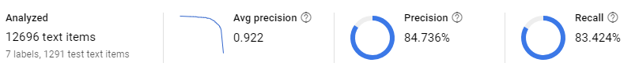
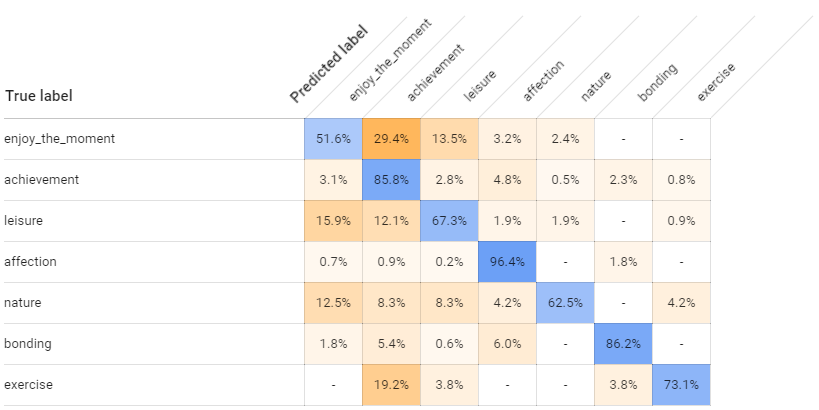

# GCP AutoML Natural Languageのベンチマーク

## TL;DR

デモデータを利用して`AutoML Natural Language`と自作モデルの性能を比較してみました。
もう全部`AutoML Natural Language`でいいんじゃないかなぁ・・・。

## 背景

GCPUBイベントに参加したところ、AutoMLのβ公開が始まっていることを知ったので、自然言語処理用である`AutoML Natural Language`の性能を確認してみようと考えました。

`AutoML Vision`はShuhei Fujiwaraさんの[こちらの記事](https://cloudplatform-jp.googleblog.com/2018/03/automl-vision-in-action-from-ramen-to-branded-goods.html)をどうぞ。

## 対象データ

`AutoML Natural Language`の[公式ドキュメント](https://cloud.google.com/natural-language/automl/docs/quickstart?hl=ja)に掲載されている[デモデータ](https://cloud.google.com/natural-language/automl/docs/sample/happiness.csv?hl=ja)を利用しました。

## 自作モデル

特徴量となる入力文をWord2Vecを利用してToken Embeddingとして入力、GRUで学習するという内容になっています。
形態素解析せずに、kerasの`text_to_word_sequence`を利用しているので、入力に適さない品詞もそのままです。
また、フレームワークとしてkerasを利用しています。

詳細は[Jupyter Notebook](https://github.com/lhideki/automl-test/blob/master/train.ipynb)を参照してください。

## 性能の比較

### AutoML Natural Language





### 自作モデル

```
                  precision    recall  f1-score   support

         bonding       0.72      0.91      0.80       506
         leisure       0.74      0.56      0.64       298
       affection       0.92      0.90      0.91      1277
enjoy_the_moment       0.57      0.55      0.56       408
     achievement       0.84      0.85      0.85      1187
          nature       0.91      0.53      0.67        73
        exercise       0.73      0.84      0.78        61

     avg / total       0.82      0.81      0.81      3810
```

## 処理時間

### AutoML Natural Language

約4時間。

### 自作モデル

約30分。
後述のJupyter Notebookのアウトプットでは15分になっていますが、一度途中から学習を再開しているため、合計で30分程度になっています。

## コスト

### AutoML Natural Language

```
219.05 Minute	¥1,215.51
```

単価については[公式ドキュメント](https://cloud.google.com/natural-language/automl/pricing?hl=ja)を参照してください。

### 自作モデル

GPUとしてGTX 1060(6GB)を搭載したデスクトップパソコンで実行しました。
このため、電気代だけです。

## その他

とっても凄い`AutoML Natural Language`ですが、日本語はサポートされていないそうです。
実際に、ラベルに日本語を使うと正しく解釈されません。
ただし、特徴量としては日本語も入力ができたので、ラベルをコード化するなどで日本語を使ってみることはできると思われます。

その場合の性能は確認していないので、他の人の検証を期待します。

## 関連情報

* [Google Cloud AutoML Natural Language](https://cloud.google.com/natural-language/automl/docs/?hl=ja)
* [ラーメン二郎とブランド品で AutoML Vision の認識性能を試す](https://cloudplatform-jp.googleblog.com/2018/03/automl-vision-in-action-from-ramen-to-branded-goods.html)
