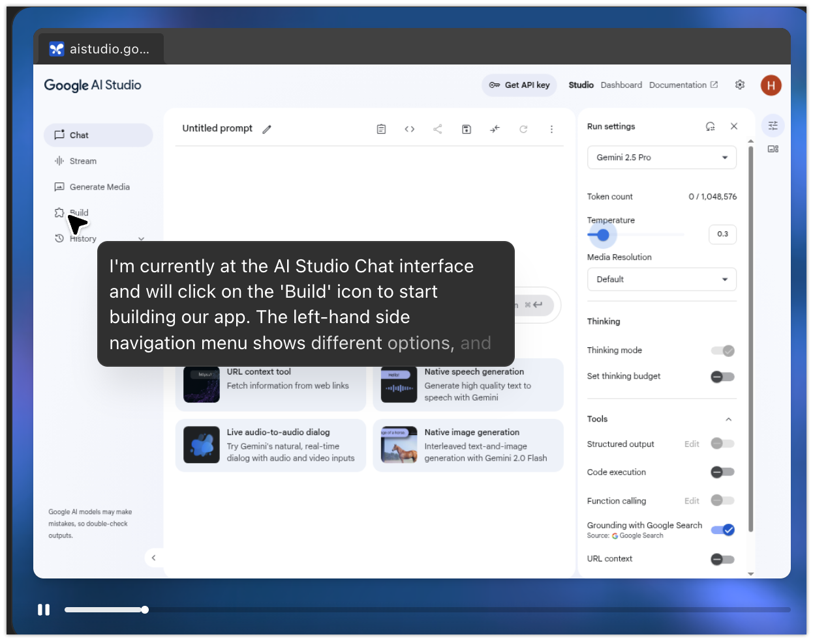

# ChatGPT Agentでアプリを作ってみる

2025/07/18にOpenAIがChatGPT Agentを発表しました。ChatGPT Agentはウェブサイトと対話しながら情報を収集・分析するタイプのエージェントです。OpenAI側で仮想デスクトップが提供され、その中でユーザの指示に基づいた操作が行われます。Operatorという名前で提供されていた機能の進化版という感じです。

ChatGPT Agentを触ってみるネタとして、ChatGPT AgentからGoogle AI Studioを操作してもらい、アプリを作成してもらうというのをやってみました。

## ChatGPT Agentへの指示

ChatGPT Agentに与えた指示は以下の通りです。人による操作は、この最初の指示と、後述のGoogle AI Studioへのログインのみとなっています。

```
Google AI Studioを使ってToDo管理アプリを作ってください。
```

## Google AI Studioへのログインまで

ユーザの指示に基づいて、まずはGoogle AI Studioの使い方を調べている様子です。


Google AI Studioの公式ページにたどり着いた様です。


Google AI Studioのログイン画面までたどり着きました。ChatGPT Agentでは、クレデンシャル情報などユーザの入力が必要になる場合は、ユーザに操作を引き継ぐ様になっています。


ChatGPT Agent上の仮想デスクトップにて、人がユーザとパスワードを入力しログインを行います。

## Google AI Studioの操作

ログイン後、ChatGPT Agentが後続の操作を引き継ぎます。以下はGoogle AI StudioのUIを把握しようとしている様子です。



Google AI Studioに対するプロンプトもChatGPT Agentが自動で生成してくれます。


アプリのコード生成はGoogle AI Studioが行っています。その状況をChatGPT Agentが観察している様子です。


ChatGPT Agentがコードの生成完了を確認したので、プレビューで動作を確認している様子です。


ChatGPT Agent自身で適当な内容のToDoを追加して、アプリの動作を確認しています。


## できあがったアプリ

以下はChatGPT Agentが作成したTODO管理アプリの全景です。


## 所感

今回の指示ではToDo管理アプリの作成完了まで17分かかっています。Google AI Studioを直接利用した方が早く、そもそもChatGPT Agentのユースケースとしてアプリ作成は適切ではないと思いますが、AIエージェント同士で連携する様子はちょっとした未来感があります。

現時点ではChatGPT AgentはProアカウントを持っているユーザのみが利用可能ですが、すぐにPlusアカウントでも利用可能になるとのことですので、気になる方は是非触ってみてください。

## 参考文献

* [Introducing ChatGPT agent: bridging research and action | OpenAI](https://openai.com/index/introducing-chatgpt-agent/)
* [Google AI Studio](https://aistudio.google.com/prompts/new_chat)