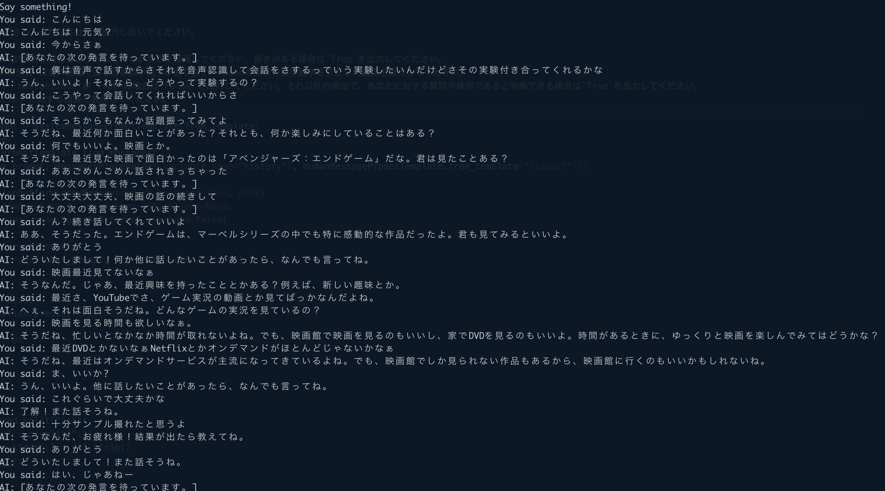

# 対話型 AI と音声認識を使って雑談してみる

音声認識を使って OpenAI の対話型 AI 用モデルと音声で雑談してみるサンプル実装です。音声認識部分は[Whisper Mic](https://github.com/mallorbc/whisper_mic)の実装をほぼそのまま利用しています。また、[マイクに話しかけた言葉を，リアルタイムに AI が認識（whisper, whisper_mic, Python を使用）（Windows 上）](https://www.kkaneko.jp/ai/repot/micrecog.html)を参考に日本語対応としています。

発言が途中であるか否かの判定、音声認識で発生するであろう誤字脱字について考慮したプロンプトとしています。



### 前提条件

-   langchain==0.0.135
-   openai==0.27.4
-   Whisper 関連は[Whisper Mic](https://github.com/mallorbc/whisper_mic)を参照してください。

## モジュールの準備

### Whisper 関連

以下の`requirements.txt`をダウンロードします。

\*[Whisper Mic](https://github.com/mallorbc/whisper_mic)

```bash
pip install -r requirements.txt
```

### それ以外(LangChain など)

```bash
pip install openai
pip install langchain
```

## 環境変数の設定

以下の環境変数を事前に設定してください。

-   OPENAI_API_KEY

## ソースコード

```python
import io
from pydub import AudioSegment
import speech_recognition as sr
import whisper
import queue
import tempfile
import os
import threading
import click
import torch
import numpy as np
from langchain.chat_models import ChatOpenAI
from langchain.prompts.chat import (
    ChatPromptTemplate,
    SystemMessagePromptTemplate,
    MessagesPlaceholder,
    HumanMessagePromptTemplate,
)
from langchain.memory import ConversationBufferWindowMemory
from langchain.chains import ConversationChain
from pprint import pprint

system_template = '''以下はHumanとあなたとの会話の内容です。あなたはHumanの友達であり、Humanがあなたに対して投げかけた質問に対し、以下の条件に従って回答してください。あなたはHumanの友達であるため、口調は砕けた感じとしてください。

## 条件

以下の内容を出力してください。それ以外は何も出力しないでください。

* HasContinue: Humanが続きを発言しようとしているか否かを推測してください。続きがある場合は`True`を出力してください。
* Predicted: `Humanの発言`は音声認識であるため誤字脱字があります。Humanの発言の誤字脱字を訂正した結果を出力してください。
* IsAnsweringReady: `HasContinue`が`True`の場合は`False`を出力してください。それ以外の場合で、あなたに対する質問や挨拶であると判断できる場合は`True`を出力してください。
* Response: `Predicted`に対する回答を表示してください。
'''
system_message_prompt = SystemMessagePromptTemplate.from_template(
    system_template)
chat_prompt = ChatPromptTemplate.from_messages(
    [system_message_prompt, MessagesPlaceholder(variable_name="history"), HumanMessagePromptTemplate.from_template("{input}")])

memory = ConversationBufferWindowMemory(return_messages=True, k=10)
chat = ChatOpenAI(temperature=0, max_tokens=256, client=None,
                  model_name="gpt-3.5-turbo", verbose=False)

conversation = ConversationChain(
    memory=memory, prompt=chat_prompt, llm=chat, verbose=False)


def get_response(input):
    pred = conversation.predict(input=input)

    if len(pred) == 0:
        return {}

    ret = {}
    # print(pred)
    try:
        for p in pred.split("\n"):
            key, val = p.split(":")
            ret[key.strip()] = val.strip()
    except ValueError:
        return {}

    return ret


@click.command()
@click.option("--model", default="base", help="Model to use", type=click.Choice(["tiny", "base", "small", "medium", "large"]))
@click.option("--english", default=False, help="Whether to use English model", is_flag=True, type=bool)
@click.option("--verbose", default=False, help="Whether to print verbose output", is_flag=True, type=bool)
@click.option("--energy", default=300, help="Energy level for mic to detect", type=int)
@click.option("--dynamic_energy", default=False, is_flag=True, help="Flag to enable dynamic engergy", type=bool)
@click.option("--pause", default=0.8, help="Pause time before entry ends", type=float)
@click.option("--save_file", default=False, help="Flag to save file", is_flag=True, type=bool)
def main(model, english, verbose, energy, pause, dynamic_energy, save_file):
    temp_dir = tempfile.mkdtemp() if save_file else None
    # there are no english models for large
    if model != "large" and english:
        model = model + ".en"
    audio_model = whisper.load_model(model)
    audio_queue = queue.Queue()
    result_queue = queue.Queue()
    threading.Thread(target=record_audio,
                     args=(audio_queue, energy, pause, dynamic_energy, save_file, temp_dir)).start()
    threading.Thread(target=transcribe_forever,
                     args=(audio_queue, result_queue, audio_model, english, verbose, save_file)).start()

    while True:
        say = result_queue.get()
        print(say)
        res = get_response(say)
        if res.get('IsAnsweringReady', "False") == 'True':  # type: ignore
            print(f"AI: {res.get('Response', '')}")  # type: ignore
        else:
            print(f"AI: [あなたの次の発言を待っています。]")


def record_audio(audio_queue, energy, pause, dynamic_energy, save_file, temp_dir):
    # load the speech recognizer and set the initial energy threshold and pause threshold
    r = sr.Recognizer()
    r.energy_threshold = energy
    r.pause_threshold = pause
    r.dynamic_energy_threshold = dynamic_energy
    # r.non_speaking_duration = 0.1
    # r.phrase_threshold = 0.1

    with sr.Microphone(sample_rate=16000) as source:
        print("Say something!")
        i = 0
        while True:
            # get and save audio to wav file
            audio = r.listen(source)
            if save_file:
                data = io.BytesIO(audio.get_wav_data())
                audio_clip = AudioSegment.from_file(data)
                filename = os.path.join(temp_dir, f"temp{i}.wav")
                audio_clip.export(filename, format="wav")
                audio_data = filename
            else:
                torch_audio = torch.from_numpy(np.frombuffer(
                    audio.get_raw_data(), np.int16).flatten().astype(np.float32) / 32768.0)
                audio_data = torch_audio

            audio_queue.put_nowait(audio_data)
            i += 1


def transcribe_forever(audio_queue, result_queue, audio_model, english, verbose, save_file):
    while True:
        audio_data = audio_queue.get()
        if english:
            result = audio_model.transcribe(audio_data, language='english')
        else:
            result = audio_model.transcribe(audio_data, language='japanese')

        if not verbose:
            predicted_text = result["text"]
            result_queue.put_nowait("You said: " + predicted_text)
        else:
            result_queue.put_nowait(result)

        if save_file:
            os.remove(audio_data)


main()
```

## 実行方法

以下は Mac での実行例です。Model に medium を指定していますが、small でも機能します。`--pause`を短め(0.8->0.5)にすることでスムーズに会話できるようにしていますが、音声認識処理の方が長いため、気持ち程度です。

```bash
python conversation-by-mic.py --model medium --pause 0.5 2> /dev/null
```

実行時にエラーになった場合は以下を参照してみてください。

-   [openai / whisper を使ってマイクに話した言葉を文字起こしする Python スクリプトを書いた](https://qiita.com/nassy20/items/f85e0477fa92e0740a0e#%E5%AE%9F%E8%A1%8C%E6%99%82%E3%81%AB%E7%99%BA%E7%94%9F%E3%81%97%E3%81%9F%E3%82%A8%E3%83%A9%E3%83%BC%E3%81%AB%E9%96%A2%E3%81%97%E3%81%A6)

## 参考文献

-   [マイクに話しかけた言葉を，リアルタイムに AI が認識（whisper, whisper_mic, Python を使用）（Windows 上）](https://www.kkaneko.jp/ai/repot/micrecog.html)
-   [Whisper Mic](https://github.com/mallorbc/whisper_mic)
-   [LangChain の チャットモデル (ChatGPT の新しい抽象化) を試す](https://note.com/npaka/n/n403fc29a02c7)
-   [openai / whisper を使ってマイクに話した言葉を文字起こしする Python スクリプトを書いた](https://qiita.com/nassy20/items/f85e0477fa92e0740a0e#%E5%AE%9F%E8%A1%8C%E6%99%82%E3%81%AB%E7%99%BA%E7%94%9F%E3%81%97%E3%81%9F%E3%82%A8%E3%83%A9%E3%83%BC%E3%81%AB%E9%96%A2%E3%81%97%E3%81%A6)
