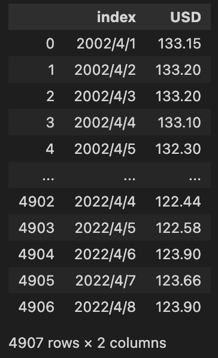

# 時系列予測用フレームワークであるDatrsでドル円為替を予測してみる

## TL;DR

最近は円安が進んでいることもあり、ドル円為替レートを例に時系列予測をやってみました。時系列予測フレームワークである[Darts](https://unit8co.github.io/darts/README.html)を利用し、複数モデルの同時評価を行っています。

ドル円為替のデータについては、みずほ銀行が提供するヒストリカルデータより`日次データ`を利用しています。

* [外国為替公示相場ヒストリカルデータ](https://www.mizuhobank.co.jp/market/historical.html)

ちなみに、Neural Architecture SearchのDARTSとは全くの別物です。

## モジュールのインストール

```python
!pip install darts
!pip install ipywidgets
```

## モジュールのロード

```python
import warnings

warnings.simplefilter('ignore', FutureWarning) # ProphetがFutureWarningを出すための抑制しています。

import pandas as pd
from darts import TimeSeries
from darts.utils.missing_values import fill_missing_values
import matplotlib.pyplot as plt

plt.rcParams['figure.figsize'] = (12, 8) # グラフのサイズを調整しています。
```

## データのロード

2002/04/01からのデータがありますが、今回は全てを利用するのではなく2022/01/01のみに絞っています。相場は土日休みであるため、日単位でみると欠損があります。このため、`fill_missing_values`で欠損値の補完をしています。

```python
df = pd.read_csv('data/quote.csv', encoding='SJIS', skiprows=2, index_col=0)
df = df.reset_index()[['index', 'USD']]

display(df)

series = TimeSeries.from_dataframe(df, time_col='index', freq='D').drop_before(pd.Timestamp('2022/01/01'))
series = fill_missing_values(series)
series.plot()
```

以下の様なデータ形式です。



2022/01/01以降のデータを可視化したものです。


## トレーニング・検証データの分割

2022/04/01より前をトレーニングデータ、以後を検証用として分割します。

```python
train, valid = series.split_before(pd.Timestamp('2022/04/01'))
train.plot(label='train')
valid.plot(label='valid')
```


## モデルの準備

Dartsで利用可能なモデルは他にもありますが、今回は以下のモデルを指定しています。

```python
from darts.models import ExponentialSmoothing, Prophet, AutoARIMA, Theta, NaiveDrift, ARIMA, KalmanForecaster

models = [
    NaiveDrift(),
    ExponentialSmoothing(),
    ARIMA(),
    AutoARIMA(),
    Prophet(),
    Theta(),
    KalmanForecaster()
]
```

## 各モデルによる推論結果の比較

```python
from darts.metrics import mape, r2_score

series.drop_before(pd.Timestamp('2022/03/14')).plot(label='train')

for model in models:
    model.fit(train)
    preds = model.predict(len(valid))
    _mape = mape(valid, preds)
    _r2 = r2_score(valid, preds)

    preds.plot(label=f'pred by {model.__class__.__name__}, mape: {_mape:.2f}%, r2: {_r2:.2f}', linestyle='dashed')
```

2022/04/01以降の為替を各種モデルに推論させた結果です。評価指標としてMAPE、R2を表示しています。


## バックテストによる比較

時系列予測における検証(評価)用データの選択は比較的難しい問題です。前述のように特定日次でトレーニング・検証データを区切る方法がありますが、これを一定期間毎に繰り返す事でより多くのデータで評価する方法をバックテストと言います。

```python
import math

fig_cols_count = 3
fig_rows_count = math.ceil(len(models) / fig_cols_count)
fig = plt.figure(figsize=(18, 5 * fig_rows_count))
fig.subplots_adjust(hspace=0.4)

for i, model in enumerate(models):
    ax = fig.add_subplot(fig_rows_count, fig_cols_count, i + 1)
    series.drop_before(pd.Timestamp('2022/02/14')).plot(label='actual')
    historical_forecast = model.historical_forecasts(
        series, start=0.7, forecast_horizon=1, verbose=True
    )
    _mape = mape(series, historical_forecast)
    _r2 = r2_score(series, historical_forecast)
    historical_forecast.plot(label=f'pred', linestyle='dashed')
    ax.set_title(f'{model.__class__.__name__}, mape: {_mape:.2f}%, r2: {_r2:.2f}')
```

Dartsはバックテストを簡単に行うことができます。以下はバックテストの開始を全体の70%時点とし、1Step(=1日)先を予測しながらバックテストを実施した結果です。


## まとめ

予測精度の話はともかく、Dartsを利用すると複数のモデルを簡単に並列評価できるため便利です。時系列の分割や補完、バックテストなどの独自に実装するとミスをし易い部分の機能がまとめられているため、時系列予測を行う際にとりあえず使って見ると幸せになると思います。

## 参考文献

* [Darts](https://unit8co.github.io/darts/README.html)
* [外国為替公示相場ヒストリカルデータ](https://www.mizuhobank.co.jp/market/historical.html)