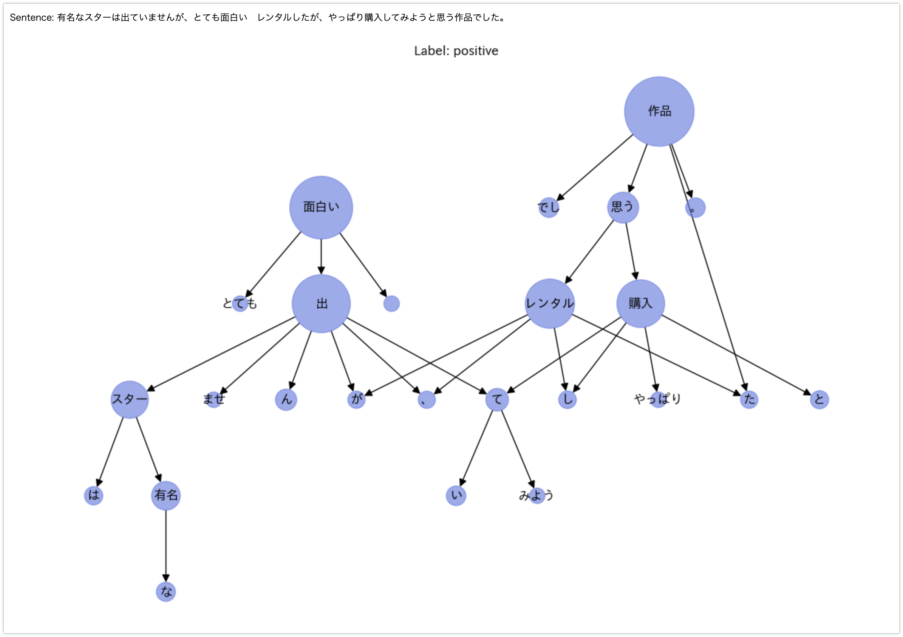

# Integrated Gradientsでグラフニューラルネットワークを可視化する

## TL;DR

Integrated Gradients(統合勾配)を利用して、グラフニューラルネットワークによる推論モデルの可視化を行ってみました。よくあるデータセットだと効果が直感的にわかり難いと感じたため、日本語ベンチマーク用データセットである[JGLUE](https://github.com/yahoojapan/JGLUE)の`MARK-ja`を利用し、日本語の文を係り受け解析した上でグラフ構造に変換して入力し、Itegrated Gradientsによりどの語句として表現されたノードの反応を可視化してみました。


### 環境

* dgl==0.9.1
* ginza==5.1.2
* networkx==2.8.7
* capsum==0.5.0

### データセット

ヤフー株式会社が提供するGLUEの日本語版です。いくつかのタスク用のデータセットが提供されていますが、今回は[ Multilingual Amazon Reviews Corpus (MARC)](https://docs.opendata.aws/amazon-reviews-ml/readme.html)から日本語のレビューを抜粋し、星評価による判断の他にクラウドソーシングによる評価を交えて`positive`、`negative`の2クラスにラベルされたMARC-jaを使用します。

* [JGLUE](https://github.com/yahoojapan/JGLUE)

## モジュールのインストール

係り受け解析と特徴量抽出のために[ginza](https://megagonlabs.github.io/ginza/)を利用します。グラフニューラルネットワーク用フレームワークは[dgl](https://github.com/dmlc/dgl)、Itegrated Gradientsの計算に[captum](https://github.com/pytorch/captum)を使います。

```python
!pip install -U ginza
!pip install dgl
!pip install captum
!pip install torch
!pip install networkx
```

## データの準備

MARC-jaのデータセットがファイルとして用意してある前提です。詳細は以下を参照してください。

* https://github.com/yahoojapan/JGLUE#marc-ja

全てのデータを利用すると処理が重くなるため、トレーニング用として1000、評価用として200サンプル抜き出します。

```python
import pandas as pd

train_df = pd.read_json(
    'data/marc_ja-v1.0/train-v1.0.json', lines=True)
train_df = pd.concat([train_df[train_df['label'] == 'positive'].sample(
    500), train_df[train_df['label'] == 'negative'].sample(500)]).sample(frac=1)
test_df = pd.read_json(
    'data/marc_ja-v1.0/valid-v1.0.json', lines=True)
test_df = pd.concat([test_df[test_df['label'] == 'positive'].sample(
    100), test_df[test_df['label'] == 'negative'].sample(100)]).sample(frac=1)

display(train_df)
display(test_df)
```


## 文をグラフ構造に変換する

ginza(SpaCy)を利用して文を係り受け解析し、NetworkXのグラフ構造を経てdgl用のグラフに変換します。変換部分のコードは以下を参考にしています。

* [Dependency trees to DGL graphs](https://discuss.dgl.ai/t/dependency-trees-to-dgl-graphs/196)

```python
import spacy

nlp = spacy.load('ja_ginza')
```

```python
import dgl
import networkx as nx
import matplotlib.pyplot as plt
import japanize_matplotlib
import numpy as np


def create_graph(doc: spacy.tokens.doc.Doc):
    edges = []
    vector_dict = {}
    node_id2names = {}
    for token in doc:
        vector_dict[token.text] = token.vector
        for child in token.children:
            edges.append((token.text, child.text))
            vector_dict[child.text] = child.vector
    graph = nx.DiGraph(edges)
    for i, (n, attr) in enumerate(graph.nodes.items()):
        graph.nodes[n]['feat'] = vector_dict[n]
        graph.nodes[n]['name_index'] = i
        node_id2names[i] = n
    g = dgl.from_networkx(graph, ['name_index', 'feat'])

    return g, node_id2names


def plot_tree(g, node_id2names, label, with_weight=False):
    relabels = {}
    base_size = 80
    base_color = [.4, .5, .9, .65]
    node_sizes = []
    for n, attr in g.nodes.items():
        relabels[n] = node_id2names[attr['name_index'].item()]
        if with_weight:
            scale = 1. + attr['weight'].detach().numpy()
            node_sizes.append(np.exp(scale**2) * base_size)
    g2 = nx.relabel_nodes(g, relabels)

    pos = nx.nx_agraph.graphviz_layout(g2, prog='dot')
    fig = plt.figure(figsize=(15, 10))
    ax = fig.add_subplot(1, 1, 1)
    if with_weight:
        nx.draw(g2, pos, with_labels=True, node_size=node_sizes,
                node_color=base_color, arrowsize=15, font_family='IPAexGothic', ax=ax)
    else:
        nx.draw(g2, pos, with_labels=True, node_size=300,
                node_color=base_color, arrowsize=15, font_family='IPAexGothic', ax=ax)
    ax.set_title(
        f'Label: {"positive" if label == 1 else "negative"}')
    plt.show()


sentence = train_df.iloc[0]['sentence']
print(f'Sentence: {sentence}')

g, node_id2names = create_graph(
    nlp(sentence))
plot_tree(g.to_networkx(
    node_attrs=['name_index', 'feat']), node_id2names, label=1)
```

以下のように文章がグラフ構造に変換されます。

```
Sentence: このゲーム、すぐに倉庫が満杯になりイライラしてくる事が多くなってきます。それ理由は倉庫枠が50あったとすると普通は50種類収納できると考えられると思いますが、違います。総数が50個までしか収納できないのです。分かりやすく例えると、ニンジン6個と小麦9個を倉庫に入れると枠を15使ってしまうのです。最初のうちは気にならないのですが、プレイし続けると倉庫のやりくりに頭を抱える事が多くなってやる気が削がれます。
```


以下でトレーニング、評価用のデータセットを全てグラフ構造に変換します。

```python
def create_features_and_labels(df):
    features = []
    labels = []
    node_id2names = []

    for index, row in df.iterrows():
        sentence = row['sentence']
        g, names = create_graph(nlp(sentence))

        features.append(g)
        label = 1 if row['label'] == 'positive' else 0
        label = np.array(label)
        labels.append(label)
        node_id2names.append(names)

    return features, labels, node_id2names


train_features, train_labels, train_node_id2names = create_features_and_labels(
    train_df)
test_features, test_labels, test_node_id2names = create_features_and_labels(
    test_df)
```

## モデルの準備

推論モデルを準備します。GraphConvを利用した比較的単純なモデルです。ラベルは`1:positive`、`0:negative`に変換しているため、出力はsigmoidで0-1の範囲に変換しています(後述の損失関数では`binary_cross_entropy`を使用しています)。

```python
import torch.nn as nn
from dgl.nn import GraphConv, MaxPooling, AvgPooling


class GCN(nn.Module):
    def __init__(self,
                 in_feats,
                 num_classes):
        super(GCN, self).__init__()
        self.conv1 = GraphConv(in_feats, 32, allow_zero_in_degree=True)
        self.conv2 = GraphConv(32, 16, allow_zero_in_degree=True)
        self.pooling = AvgPooling()
        self.linear1 = nn.Linear(16, 256)
        self.linear2 = nn.Linear(256, num_classes)

    def forward(self, g, h):
        h = self.conv1(g, h)
        h = self.conv2(g, h)
        h = self.pooling(g, h)
        h = self.linear1(h)
        h = F.relu(h)
        h = self.linear2(h)
        out = F.sigmoid(h)

        return out


model = GCN(train_features[0].ndata['feat'].shape[1], 1)
print(model)
```

```
GCN(
  (conv1): GraphConv(in=300, out=32, normalization=both, activation=None)
  (conv2): GraphConv(in=32, out=16, normalization=both, activation=None)
  (pooling): AvgPooling()
  (linear1): Linear(in_features=16, out_features=256, bias=True)
  (linear2): Linear(in_features=256, out_features=1, bias=True)
)
```

## トレーニング

```python
import torch
import torch.nn.functional as F
import numpy as np
from statistics import mean


def train(model, train_features, train_labels, report_period=500):
    optimizer = torch.optim.Adam(model.parameters(), lr=0.001)
    losss = []

    for step, (feature, label) in enumerate(zip(train_features, train_labels)):
        g = feature.add_self_loop()
        logits = model(g, feature.ndata['feat'])
        _label = torch.tensor(label).reshape(-1, 1).float()

        loss = F.binary_cross_entropy(logits, _label)
        losss.append(loss.clone().detach().numpy())
        # print(logits, _label, loss)

        # Backward
        optimizer.zero_grad()
        loss.backward()
        optimizer.step()

        if step > 0 and step % report_period == 0 or step == (len(train_features) - 1):
            print(f'step: {step + 1}, loss: {np.array(losss).mean()}')
            losss = []


for i in range(5):
    train(model, train_features, train_labels)
```

## 評価

```python
from sklearn.metrics import classification_report

preds = []
labels = []

for feature, label in zip(test_features, test_labels):
    g = feature.add_self_loop()
    pred = model(g, feature.ndata['feat'])

    preds.append(1 if pred > 0.5 else 0)
    labels.append(label)

confusion_matrix = np.zeros((2, 2))
for p, l in zip(preds, labels):
    confusion_matrix[p][l] += 1

cr = classification_report(labels, preds, output_dict=True)
pd.DataFrame(cr).T
```

評価用データセットの評価結果は以下のとおりです。概ね0.78〜0.80程度のAccになります。


## 可視化

`captum`の`IntegratedGradients`でIntegrated Gradientsを計算します。計算した統合勾配はノード分出力されますが、わかりやすくするために標準化した上で、ノードの属性である`weight`に割り当てています。この`weight`を利用して、networkXによる可視化時にノードの大きさを調整しています。

```python
from captum.attr import IntegratedGradients
from functools import partial

# test_target_graph_index = 64 # positive sample
# test_target_graph_index = 77 # negative sample
test_target_graph_index = 77
g = test_features[test_target_graph_index].add_self_loop()
label = test_labels[test_target_graph_index]
sentence = test_df.iloc[test_target_graph_index]["sentence"]

h = g.ndata['feat'].clone().requires_grad_(True)
ig = IntegratedGradients(partial(model, g))

feat_attr = ig.attribute(
    h, target=0, internal_batch_size=g.num_nodes(), n_steps=10)

node_weights = feat_attr.abs().sum(dim=1)
node_weights = (node_weights - node_weights.min()) / node_weights.max()
g.ndata['weight'] = node_weights

print(f'Sentence: {sentence}')
plot_tree(g.remove_self_loop().to_networkx(
    node_attrs=['name_index', 'feat', 'weight']), test_node_id2names[test_target_graph_index], label=label, with_weight=True)
```

### positive example



### negative example


## 参考文献

* [JGLUE](https://github.com/yahoojapan/JGLUE)
* [dgl](https://github.com/dmlc/dgl)
* [captum](https://github.com/pytorch/captum)
* [GNNLens2 - Tutorial 4: Weighted subgraphs and explanation methods](https://github.com/dmlc/GNNLens2/blob/main/resources/tutorials/tutorial_4_subgraph.md)
* [Dependency trees to DGL graphs](https://discuss.dgl.ai/t/dependency-trees-to-dgl-graphs/196)