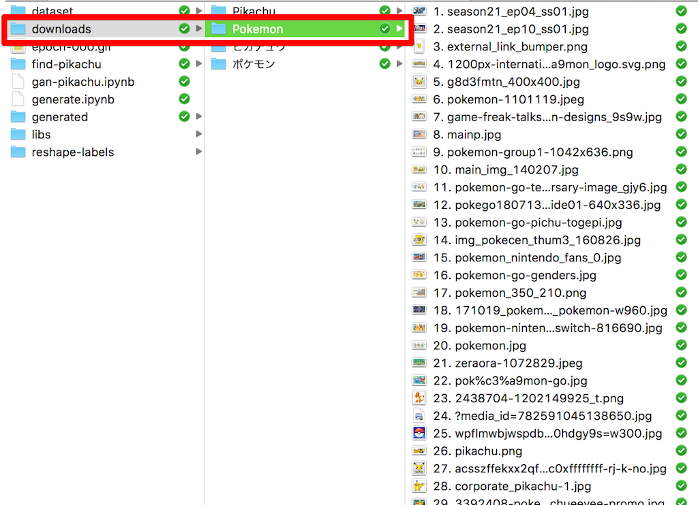
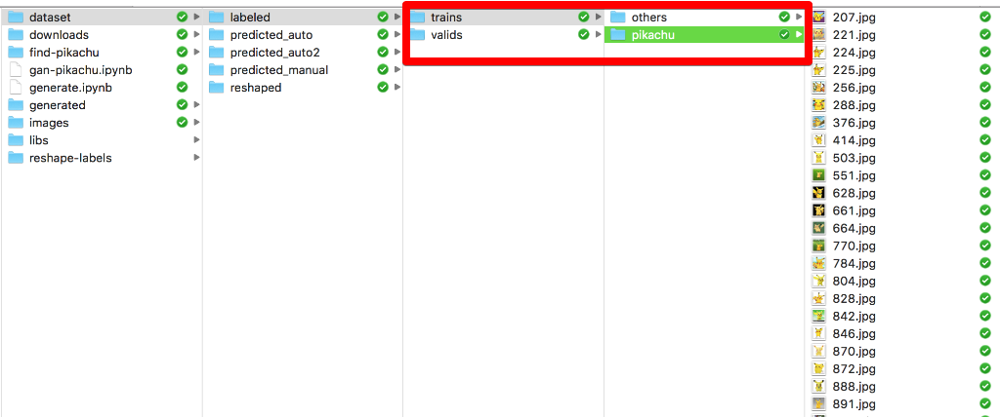
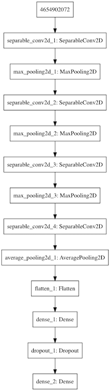
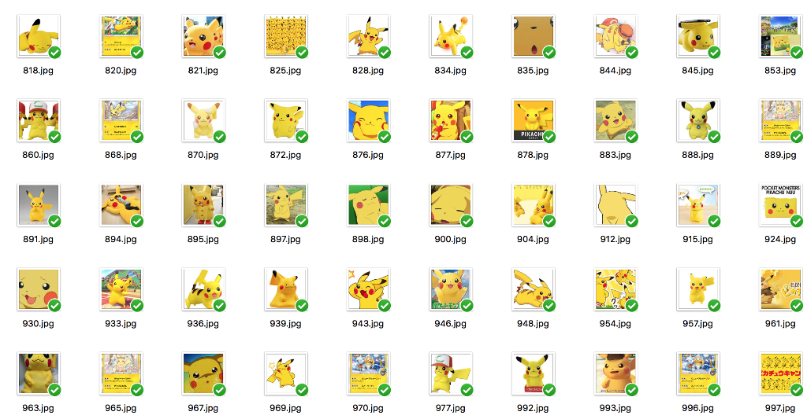
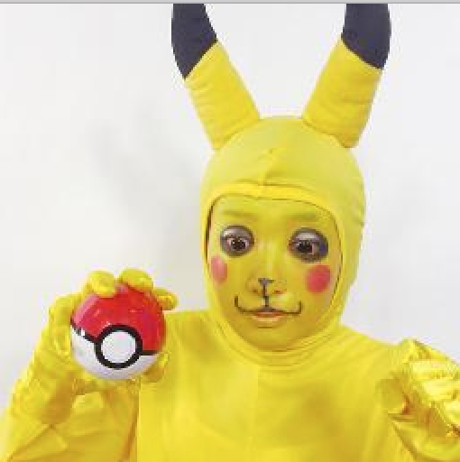
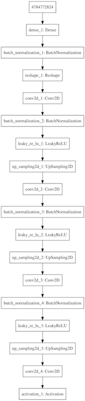
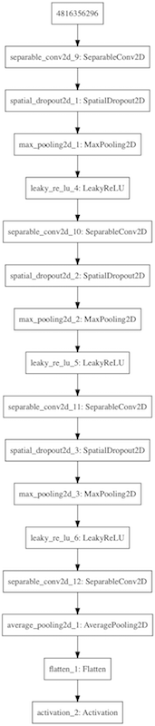
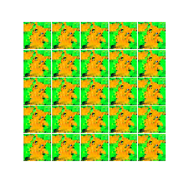

# GANでピカチュウを描いてみる

## TL;DR

`GAN(Generative Adversarial Network)`でピカチュウを描いてみるというネタです。

* googleでポケモンの画像を集める。
* ピカチュウの画像を`CNN`で選定する。
* `GAN`でピカチュウを描く。

完全なコードは以下で参照できます。

* https://github.com/lhideki/gan-pikachu

## 環境

### 言語/フレームワーク

* Python
* keras
* tensorflow
* Jupyter Notebook

### ハードウェア

* CPU: 4Core 3.4GHz
* MEM: 24GB
* GPU: GTX1060 6GB

## googleでポケモンの画像を集める

データセットとして大量のピカチュウの画像が必要です。
今回は、googleを利用して画像データを集めます。

### google-image-downloadのインストールと設定

[google-images-download](https://github.com/hardikvasa/google-images-download)を使用します。
以下でインストールします。

```sh
pip install google_images_download
```

`chromedriver`がインストールされていない場合は、先にインストールします。
Macでbrewを使う場合は以下のコマンドを実行します。

```sh
brew cask install chromdriver
```

`chromedriver`のパスを確認します。

```sh
which chromedriver
```

### 画像の収集

画像の収集を行います。
`google-images-download`で100個以上のイメージを取得する場合は、`chromedriver`のパスの指定が必要です。
今回は最大で`10000`件集めます。

上記で確認した`chromedriver`のパスを指定します。私の環境では`/usr/local/bin/chromedriver`でした。

```sh
googleimagesdownload --keywords "ピカチュウ,Pikachu,ポケモン,Pokemon" -l 10000 --chromedriver /usr/local/bin/chromedriver
```

`downloads`という名前のディレクトリの下に、`--keywords`で指定したキーワード別にディレクトリが作成されて、関連する画像が以下の様にダウンロードされます。



今回は合計で4195件の画像が見つかりました。

### 画像の切り出し

後工程の処理では、正方形の画像の方が簡単であるため、集めた画像を`PILLOW`を利用して切り出します。
ここでは一旦`256x256`の画像として切り出しています。

```python
import os
import glob
from PIL import Image, ImageOps

input_dirname = os.path.join('..', 'downloads', '*', '*')
output_dirname = os.path.join('..', 'dataset', 'reshaped')
files = glob.glob(input_dirname)
reshaped_size = (256, 256)

for i, file in enumerate(files):
    index = i + 1
    try:
        image = Image.open(file)
    except IOError:
        pass
    reshaped = ImageOps.fit(image, reshaped_size, Image.NEAREST)
    converted = reshaped.convert('RGB')
    converted.save(os.path.join(output_dirname, f'{index}.jpg'))
    print(f'{index}: {file} was saved.')
```

## ピカチュウの画像をCNNで選定する

ピカチュウの画像の選定も機会に行わせたいと思います。
が、教師データの抽出は人が行う必要があります。

今回は以下のように、`dataset/labeled`というディレクトリの下に、学習用と検証用のデータセットを手動で選択しておきました。



`trains`が学習用、`valids`が検証用のデータセットです。
ピカチュウの画像を選ぶのが目的ですが、ピカチュウとそれ以外の2項分類とするため、教師データもピカチュウとそれ以外を用意しています。手動で選んだ数はそれぞれ以下の通りです。

* trains-pikachu: 30件
* trains-others: 50件
* valids-pikachu: 12件
* validas-others: 20件

### ニューラルネットワークの構造

NNの構造は以下の通りです。CNNを利用したスタンダードなものです。



### データセットの準備とImage Augmentation

学習に使用するデータセットはkerasの`ImageDataGenerator`で読み込みます。
`ImageDataGenerator`はデータセットの読み込み時に、サイズの変更や数値データのリスケーリングだけではなく、`Image Augmentation`として画像を変形した水増しを行うことができます。

以下は、読み込んだ画像を`Image Augmentation`により水増ししながら、学習用データセットとして準備する際のコードです。ちなみに検証用データセットは`Image Augmentation`による水増しは行いません(水増しするのは学習するためのバリエーションを増やすためで、答えを増やすためではありません)。

```python
from keras.preprocessing.image import ImageDataGenerator, array_to_img
import os

trains_dirname = os.path.join('..', 'dataset', 'labeled', 'trains')
valids_dirname = os.path.join('..', 'dataset', 'labeled', 'valids')
trains_generator = ImageDataGenerator(
    rescale=1 / 255,
    rotation_range=10,
    width_shift_range=0.1,
    height_shift_range=0.1,
    channel_shift_range=20.0,
    #shear_range=0.1,
    horizontal_flip=True,
    vertical_flip=False
    )
valids_generator = ImageDataGenerator()

trains_generator = trains_generator.flow_from_directory(
    trains_dirname,
    target_size=(32,32),
    batch_size=32,
    class_mode='binary'
)
valids_generator = valids_generator.flow_from_directory(
    valids_dirname,
    target_size=(32,32),
    batch_size=32,
    class_mode='binary'
)
```

### 学習の実行

データセットの準備が整ったら学習を開始します。epochを100としていますが、10回程度で結果が収束(ここでは`val_loss`を観測しているので、`val_loss`が下がらなくなる状態)すると思います。

```python
from keras.callbacks import EarlyStopping, ModelCheckpoint, TensorBoard

model_filename = os.path.join('models', 'finding-pikachu_model_{val_loss:.2f}.h5')

model.fit_generator(
    trains_generator,
    validation_data=valids_generator,
    steps_per_epoch=100,
    epochs=100,
    callbacks = [
        TensorBoard(log_dir='tflogs'),
        EarlyStopping(patience=3, monitor='val_loss'),
        ModelCheckpoint(model_filename, monitor='val_loss', save_best_only=True),
    ]
)
```

私の環境では7回目で学習が完了しました。

```
Epoch 6/100
100/100 [==============================] - 9s 92ms/step - loss: 0.1193 - acc: 0.9600 - mean_absolute_error: 0.0719 - val_loss: 1.0682e-07 - val_acc: 1.0000 - val_mean_absolute_error: 0.0000e+00
Epoch 7/100
100/100 [==============================] - 8s 83ms/step - loss: 0.0993 - acc: 0.9672 - mean_absolute_error: 0.0604 - val_loss: 1.0682e-07 - val_acc: 1.0000 - val_mean_absolute_error: 0.0000e+00
```

### ピカチュウ探し

学習したモデルを利用して、全4200枚のポケモン画像からピカチュウを探し出します。

```python
import glob
import os
from keras.preprocessing.image import load_img, img_to_array
import shutil

predicting_dirname = os.path.join('..', 'dataset', 'reshaped', '*')
predicted_dirname = os.path.join('..', 'dataset', 'predicted_auto2')
for i, file in enumerate(glob.glob(predicting_dirname)):
    image =load_img(file).resize((32, 32))
    array = img_to_array(image) / 255
    predicted = model.predict(np.array([
        array
    ]))
    prob = int(predicted[0][0]*100)
    print(f'file={file}, pikachu?={prob}%')

    if prob >= 99:
        shutil.copy(file, predicted_dirname)
```

学習したモデルが99%以上ピカチュウだと判断した画像を、ピカチュウとして選定しました。



うーん、全部ピカチュウ!



あつまったピカチュウの画像は724枚でした。

## GANでピカチュウを描く

`GAN`により、機械が集めたピカチュウの画像を学習し、ピカチュウの画像を新しく描くということを行います。

### そもそもGANって?

`Generative Adversarial Network`です。日本語では`敵対的生成ネットワーク`と言います。具体的にはQiitaの[今さら聞けないGAN（1）　基本構造の理解](https://qiita.com/triwave33/items/1890ccc71fab6cbca87e)を参照するのがいいと思います。
簡単に言うと、乱数を元に偽物の画像を生成するモデルと、教師データを元に真偽を見破るモデルの2つを対決させ、より本物に近い画像を生成する、あるいはより真偽の判定の精度を上げるという仕組みです。

これぞAIという感じで兆かっこいい!!

今回は偽物の画像を生成するモデルを育てる目的で使用します。

### ニューラルネットワークの構造

#### generator(偽造側)



#### discriminator(見破る側)



### keras-adversarialの利用

`GAN`の学習は偽造側と見破る側の両方を学習させながら進める必要があるため、kerasを利用してもコードが複雑になります。
その辺りの面倒を見てくれるモジュールとして、今回は[keras-adversarial](https://github.com/bstriner/keras-adversarial)を利用します。

ただし、[keras-adversarial](https://github.com/bstriner/keras-adversarial)は、そのままではkeras 2.1.6以上では動作しません。
keras 2.1.6以上を利用する場合は、以下のパッチを適用する必要があります。

* https://github.com/bstriner/keras-adversarial/pull/59/commits/a1d783adf3f1934df63cc0970494f655b40e957f

### 学習の実行

基本的には`Antonio Gulli, Sujit Pal「直感 Deep Learning」オライリー・ジャパン, 2018`に掲載されていたコードを元にしています。
違いは以下の点です。

* `Conv2D`の代わりに、`SeparableConv2D`を利用している。
* Unit数の定義を`nch=256`ではなく、`nch=512`としている。
* カーネルサイズを`h=5`ではなく、`h=7`としている。

epochは50001回です。100epoch毎に`generator`が生成した画像を保存しました。

```python
    example_gan(AdversarialOptimizerSimultaneous(), "generated/pikachu",
                opt_g=Adam(1e-4, decay=1e-5),
                opt_d=Adam(1e-3, decay=1e-5),
                nb_epoch=50001, generator=generator, discriminator=discriminator,
                latent_dim=latent_dim)
```

### generatorが生成した画像

最も精度が高かった(ここではdiscriminator側のlossが最低だった状態)25,200epoch目の画像は以下の通りです。



以下は最初のepochから25,200epoch目までの変化です。


## 所感

社内で機械学習に興味を持ってもらうための教材としてやってみましたが、要求されるハードウェア性能が高く、気軽に誰でもという訳にはいかなそうです。ただ、機械学習の深淵に触れるための入り口として非常に面白い題材だと感じました。

`RTX20180Ti`でも買って、`PGGAN(Progressive Growing of GANs)`とか手を出してみようかなと思ったり・・・。

なお、実は`GANでギャンを描く`というのを最初に思いついたのですが、[先駆者](http://blog.asilla.jp/entry/gan-and-gyan)がいらっしゃったので、ピカチュウに変更しました。
でも、`ギャン`が`GAN`の入門になるというのも面白そうなので、今後試してみようと思います。

## 参考文献

* Antonio Gulli, Sujit Pal「直感 Deep Learning」オライリー・ジャパン, 2018
* [keras-adversarial](https://github.com/bstriner/keras-adversarial)
