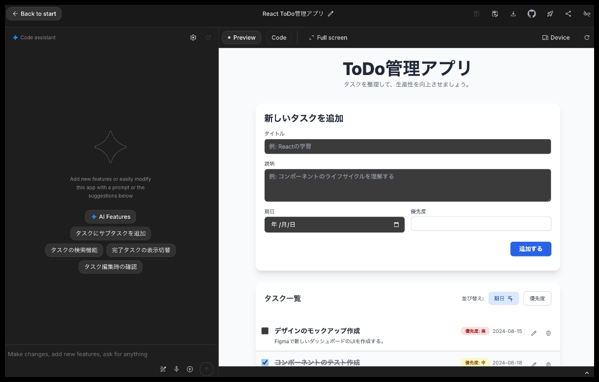
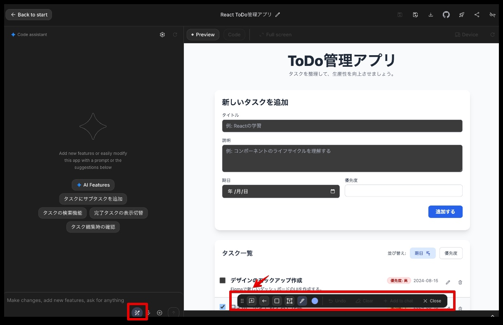
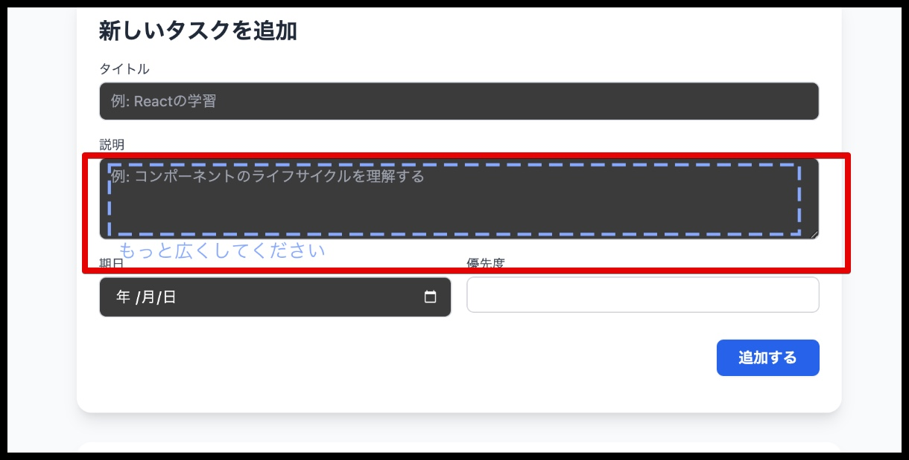
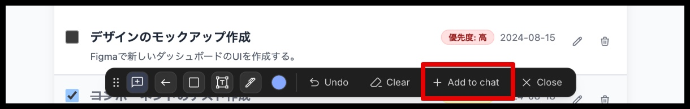
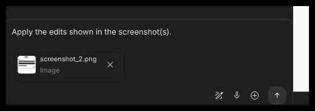
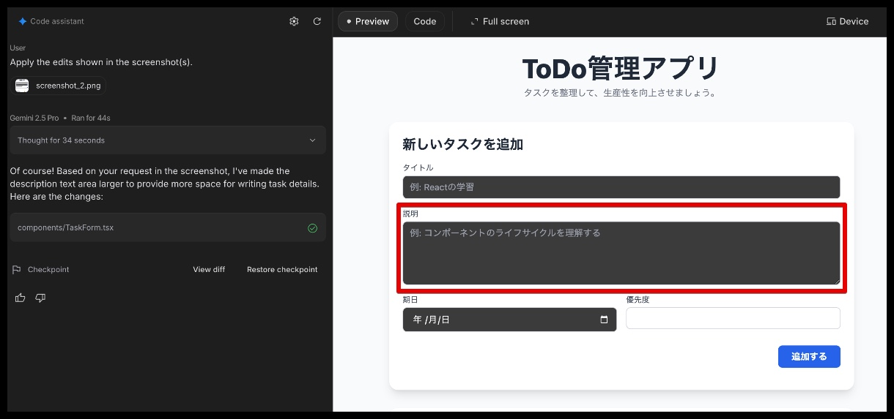
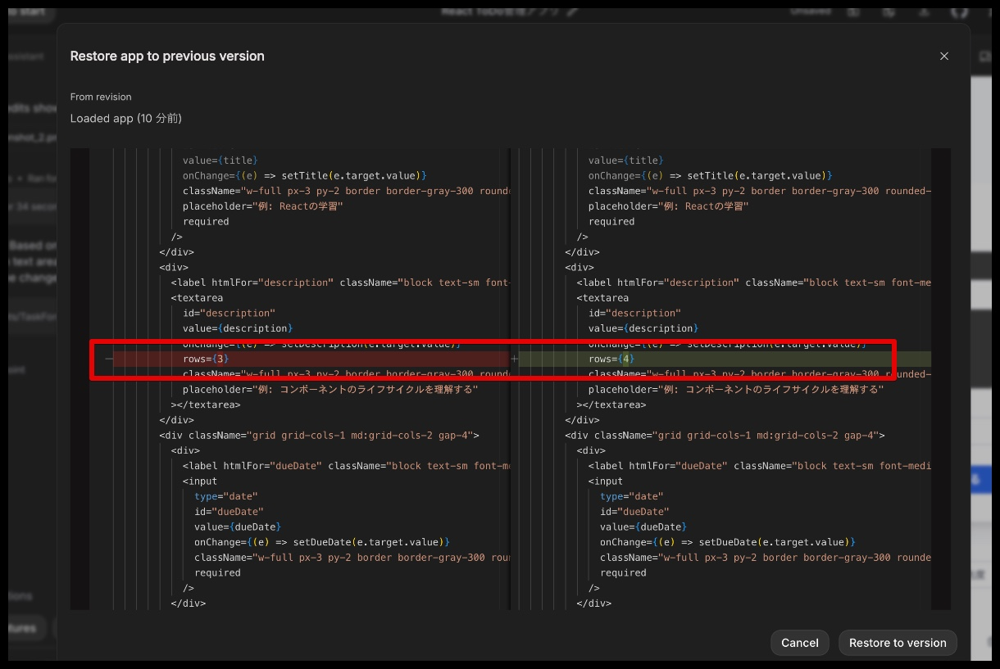
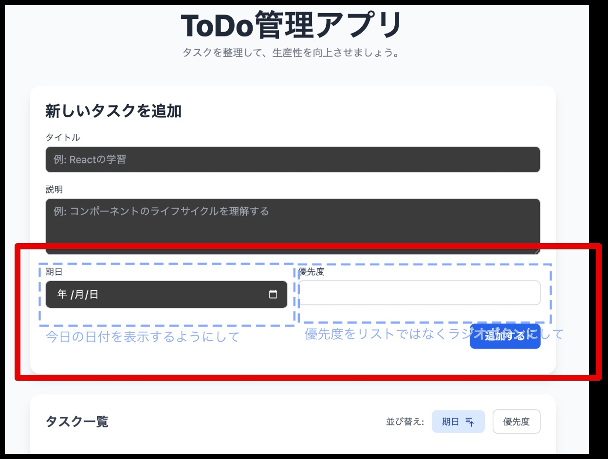
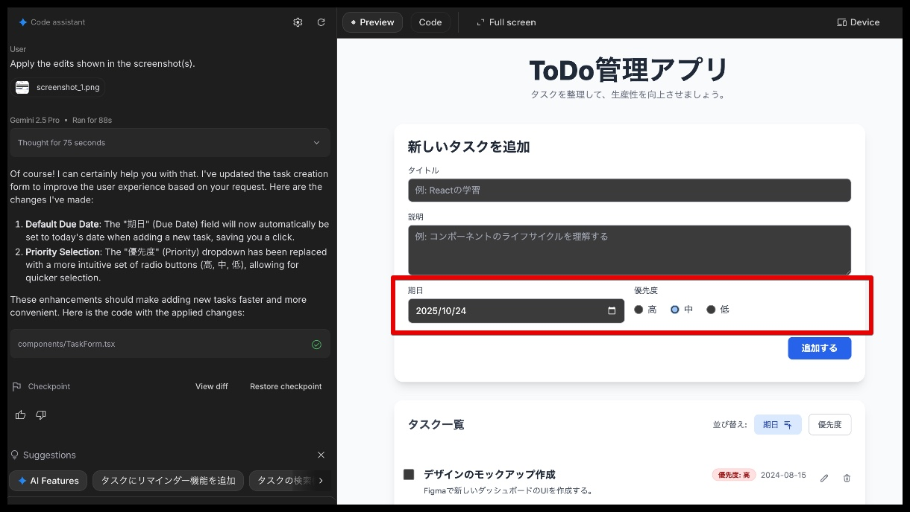

# Google AI StudioでGUIへのアノテーションができるようになりました

[Google AI Studio](https://aistudio.google.com/apps)は、AIを利用して対話的にWebアプリケーションを作成できる仕組みです。AIへ指示した結果がリアルタイムで反映され、プレビューで確認しながら開発を進められるため、効率的にアプリケーションを構築できます。

今までは言葉でAIに指示する必要がありましたが、最近のアップデートでプレビュー画面へのアノテーション(注釈)により直感的にAIへ指示を出せるようになりました。

## アノテーションを利用したGUI改善の例

以下はGoogle AI Studioで用意したToDoリストアプリです。

ここで、 `Annotate App` ボタンをクリックすると、プレビュー画面にアノテーションを付けることができます。

`Add to chat` ボタンをクリックすると、アノテーション内容がAIへの指示としてチャットに追加されます。

あとは、そのままプロンプトを送信することで、アプリケーションが変更されプレビューで確認することができます。

微妙な差なので見た目には解り難いですが、ソースコードをみると以下の様に意図した部分のみ変更されていることが確認できます。

## 複数アノテーションした場合の例

AIの指示はシンプルである方がよいと思われますが、以下のように複数のアノテーションを指定することも可能です。

## 参考文献

* [Google AI Studio⁠⁠、ビルドモードでAIアプリをVibe Codingするための新しいUXを提供](https://gihyo.jp/article/2025/10/vibe-coding-ai-app-using-google-ai-studio-build-mode)