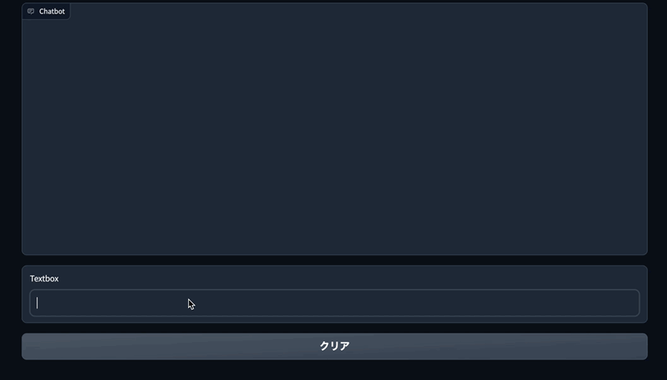

# Gradio と LangChain でレスポンスがストリーミング出力される Chatbot を作る

Gradio と LangChain を使うことで簡単に ChatGPT Clone を作ることができますが、レスポンスをストリーミング出力する実装サンプルがあまり見られなかったので、参考文献のコードを参考に、色々寄せて集めて見ました。同時リクエストがあった場合の挙動を確認していないため、あくまでお一人様用ということになります。



## 前提条件

-   langchain==0.0.212
-   openai==0.27.0
-   gradio==3.36.1

## ソースコード

```python
from typing import Any

from langchain.prompts.chat import (
    ChatPromptTemplate,
    MessagesPlaceholder,
    SystemMessagePromptTemplate,
    HumanMessagePromptTemplate,
)
from langchain.chat_models import ChatOpenAI
from langchain.memory import ConversationBufferWindowMemory
from langchain.chains import ConversationChain
from anyio.from_thread import start_blocking_portal
import gradio as gr
from queue import Queue
from langchain.callbacks.base import AsyncCallbackHandler
from langchain.callbacks.manager import AsyncCallbackManager
from langchain.chat_models import ChatOpenAI
from langchain.schema import LLMResult


system_prompt_template = "以下は、HumanとAIが会話している様子です。AIは以下の会話内容を考慮し、Humanの質問に対して回答してください。AIは質問に対する答えを知らない場合は「知らない」と答えてください。"

# チャットプロンプトテンプレート
prompt = ChatPromptTemplate.from_messages(
    [
        SystemMessagePromptTemplate.from_template(system_prompt_template),
        MessagesPlaceholder(variable_name="history"),
        HumanMessagePromptTemplate.from_template("{input}"),
    ]
)


q = Queue()
job_done = object()


class StreamingLLMCallbackHandler(AsyncCallbackHandler):
    """Callback handler for streaming LLM responses to a queue."""

    def __init__(self, q):
        self.q = q

    def on_llm_new_token(self, token: str, **kwargs: Any) -> None:
        self.q.put(token)

    def on_llm_end(self, response: LLMResult, **kwargs: Any) -> None:
        """Run when LLM ends running."""
        self.q.put(job_done)


# チャットモデル
llm = ChatOpenAI(
    client=None,
    model="gpt-3.5-turbo-16k",
    max_tokens=512,
    temperature=0,
    streaming=True,
    callback_manager=AsyncCallbackManager([StreamingLLMCallbackHandler(q)]),
)

# メモリ
memory = ConversationBufferWindowMemory(k=3, return_messages=True)

# 会話チェーン
conversation = ConversationChain(memory=memory, prompt=prompt, llm=llm, verbose=True)


def user(message, history):
    return "", history + [[message, None]]


def chat(history):
    user_msg = history[-1][0]
    prompt = user_msg

    async def task(prompt):
        ret = await conversation.arun(input=prompt)

        return ret

    with start_blocking_portal() as portal:
        portal.start_task_soon(task, prompt)
        content = ""
        while True:
            next_token = q.get(True, timeout=1)
            if next_token is job_done:
                break
            content += next_token
            history[-1][1] = content

            yield history


with gr.Blocks() as demo:
    # コンポーネント
    chatbot = gr.Chatbot()
    msg = gr.Textbox()
    clear = gr.Button("Clear")

    msg.submit(user, [msg, chatbot], [msg, chatbot], queue=False).then(  # type: ignore
        chat, chatbot, chatbot
    )
    clear.click(lambda: None, None, chatbot, queue=False)

if __name__ == "__main__":
    demo.queue()
    demo.launch()
```

## 参考文献

-   [GitHub - Title: Request for Streaming Outputs as a Generator for Dynamic Chat Responses](https://github.com/hwchase17/langchain/issues/2428)
-   [ChatGPT API+LangChain+Gradio でキャラクターとお話するアプリを作る](https://qiita.com/tkmrsksk/items/7362f183138dfb324c50)
