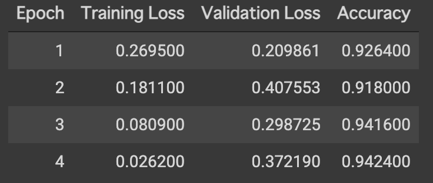
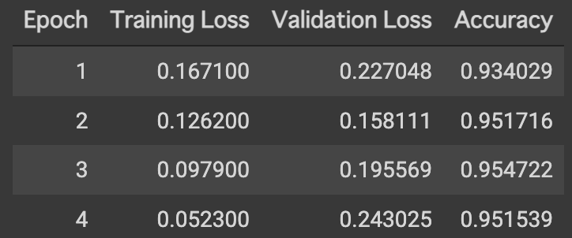

# JGLUE/MARC-jaをGoogle Colabで評価してみる

## TL;DR

ヤフー株式会社により、標準的な自然言語処理の標準ベンチマークである[GLUE](https://gluebenchmark.com/)の日本語版として[JGLUE](https://github.com/yahoojapan/JGLUE)が公開されています。

今回は日本語の二項分類タスクの評価用データセットである`MARC-ja`について、Google Colab上で実際に評価してみました。モデルは[Huggingface](https://huggingface.co/)を利用し、以下に対するファインチューニングを行っています。

* [cl-tohoku/bert-base-japanese-v2](https://huggingface.co/cl-tohoku/bert-base-japanese-v2)

| No. | Model | Train example num | Valid(Dev) example num | Accuracy | Time | Note |
|---|---|---|---|---|---|---|
| 1 | JGLUE - Tohoku BERT base(※) | 187,528 | 5,654 | 0.958 | na | JGLUE公式 |
| 2 | 今回 - Tohoku BERT base(※) | 187,528 | 5,654 | 0.955 | 約6時間50分 | TPU利用、4 Epochs中最高の結果 |
| 3 | 今回 - Tohoku BERT base(※) | 15,000 | 2,500 | 0.942 | 約1時間40分 | GPU利用、4 Epochs中最高の結果 |
| 4 | 今回 - Tohoku BERT base(※) | 15,000 | 2,500 | 0.948 | 約40分 | TPU利用、4 Epochs中最高の結果 |

※ JGLUE公式に合わせて`Tohoku BERT base`と表記していますが、[cl-tohoku/bert-base-japanese-v2](https://huggingface.co/cl-tohoku/bert-base-japanese-v2)と同一です(`-v2`である点に注意)。

なお、[JGLUE](https://github.com/yahoojapan/JGLUE)で公開されているベンチマークとハイパーパラメータをできる限り合わせていますが、評価用のスクリプト(`run_glue.py`)を使用していなかったり、バッチサイズが異なる等、厳密には一致しない点にご注意ください。

### MARC-ja

[ Multilingual Amazon Reviews Corpus (MARC)](https://docs.opendata.aws/amazon-reviews-ml/readme.html)から日本語のレビューを抜粋したものです。星評価による判断の他にクラウドソーシングによる評価を交えて`positive`、`negative`の2クラスにラベルされています。

| No. | Dataset | Positive num | Negative num | (Negative) Ratio |
|---|---|---|---|---|
| 1 | Train | 165,477 | 22,051 | 0.133 |
| 2 | Valid(Dev) | 4,832 | 822 | 0.170 |

## データの準備

`MARC-ja`は[JGLUEのGithub](https://github.com/yahoojapan/JGLUE)に格納されていないため、個別にダウンロードしてスクリプトで処理する必要があります。データ準備の手順については以下を参照してください。

* https://github.com/yahoojapan/JGLUE#marc-ja

処理した結果、以下のファイルが生成されます。以降の手順はこれらのファイルをGoogle Drive上にアップロードしてある前提としています。

* train-v1.0.json
* valid-v1.0.json

## モジュールの準備

```python
!pip install ipadic
!pip install datasets
!pip install transformers
!pip install sklearn
!pip install fugashi
!pip install unidic-lite
!pip install accelerate # for auto_find_batch_size
```

## データ変換

準備した`MARC-ja`のデータをGoogle Driveにアップロードしてある前提です。Google Driveをマウントしてデータセットを読み込んでいます。

```python
from google.colab import drive
drive.mount('/content/drive')
```

```python
from datasets import load_dataset

dataset = load_dataset('json', data_files={
    'train': '/content/drive/MyDrive/[Your Dataset Parent Path]/marc_ja-v1.0/train-v1.0.json',
    'valid': '/content/drive/MyDrive/[Your Dataset Parent Path]/marc_ja-v1.0/valid-v1.0.json',
}).map(lambda example: {'label': 1 if example['label'] == 'positive' else 0})

display(dataset)
```

`[Your Dataset Parent Path]`を実際のパスで置き換えてください。

```python
from transformers import AutoTokenizer

tokenizer = AutoTokenizer.from_pretrained('cl-tohoku/bert-base-japanese-v2')

def tokenize_function(examples):
    return tokenizer(examples['sentence'], padding='max_length', truncation=True, max_length=512)

tokenized_datasets = dataset.map(tokenize_function, batched=True)
small_train_ds = tokenized_datasets['train'].shuffle(seed=51).select(range(15000))
small_valid_ds = tokenized_datasets['valid'].shuffle(seed=51).select(range(2500))
```

`seed=51`でサンプリングしています。

## モデルの準備

```python
from transformers import AutoModelForSequenceClassification

model = AutoModelForSequenceClassification.from_pretrained('cl-tohoku/bert-base-japanese-v2', num_labels=2)
```

## トレーニングの実行

```python
import numpy as np
from datasets import load_metric

metric = load_metric('accuracy')

def compute_metrics(eval_pred):
    logits, labels = eval_pred
    predictions = np.argmax(logits, axis=-1)
    return metric.compute(predictions=predictions, references=labels)
```

```python
from transformers import TrainingArguments, Trainer

training_args = TrainingArguments(output_dir='outputs',
                                    evaluation_strategy='epoch',
                                    auto_find_batch_size=True,
                                    learning_rate=5e-05,
                                    num_train_epochs=4,
                                    warmup_ratio=0.1,
                                    save_steps=5000
                                  )
```

```python
trainer = Trainer(
    model=model,
    args=training_args,
    #train_dataset=tokenized_datasets['train'],
    train_dataset=small_train_ds,
    #eval_dataset=tokenized_datasets['valid'],
    eval_dataset=small_valid_ds,
    compute_metrics=compute_metrics,
)
```

```python
%%time

trainer.train()
```



## 結果の保存

```python
outputs = trainer.predict(small_valid_ds)
```

```python
import pandas as pd

preds_df = pd.DataFrame({
    'pred': outputs.predictions.argmax(axis=-1),
    'label': outputs.label_ids
})
preds_df.to_csv('/content/drive/MyDrive/[Your Dataset Parent Path]/bert-gpu-result.csv')
```

## TPUを利用したフルデータセットの評価

MARC-jaの全てのレコードを利用すると、(引き当てるGPUにもよりますが)Google ColabのGPUインスタンスでも12時間以上かかるため、無料版だと実行できない可能性があります。このため、前述の例ではサンプリングした上でベンチマークしていますが、TPUインスタンスを利用して全レコードによる評価を行うことも可能です。

### モジュールの準備

```python
!pip install ipadic
!pip install datasets
!pip install transformers
!pip install sklearn
!pip install fugashi
!pip install unidic-lite
!pip install accelerate # for auto_find_batch_size
!pip install cloud-tpu-client==0.10 https://storage.googleapis.com/tpu-pytorch/wheels/torch_xla-1.8-cp37-cp37m-linux_x86_64.whl # for TPU
!pip install torch==1.8 torchtext==0.9.0 # for TPU
```

[cl-tohoku/bert-base-japanese-v2](https://huggingface.co/cl-tohoku/bert-base-japanese-v2)はPyTorchによるモデルとなっています。TPUでの実行最適化に`cloud-tpu-client`を利用していますが、PyTorch-1.8にしか対応していないため、PyTorchを1.8にダウングレードしています(最新のTransformersだと1.9がインストースされるため)。

### データ変換

```python
from google.colab import drive
drive.mount('/content/drive')
```

```python
from datasets import load_dataset

dataset = load_dataset('json', data_files={
    'train': '/content/drive/MyDrive/[Your Dataset Parent Path]/marc_ja-v1.0/train-v1.0.json',
    'valid': '/content/drive/MyDrive/[Your Dataset Parent Path]/marc_ja-v1.0/valid-v1.0.json',
}).map(lambda example: {'label': 1 if example['label'] == 'positive' else 0})

display(dataset)
```

`[Your Dataset Parent Path]`を実際のパスで置き換えてください。

```python
from transformers import AutoTokenizer

tokenizer = AutoTokenizer.from_pretrained('cl-tohoku/bert-base-japanese-v2')

def tokenize_function(examples):
    return tokenizer(examples['sentence'], padding='max_length', truncation=True, max_length=512)

tokenized_datasets = dataset.map(tokenize_function, batched=True)
```

### モデルの準備

```python
from transformers import AutoModelForSequenceClassification

model = AutoModelForSequenceClassification.from_pretrained('cl-tohoku/bert-base-japanese-v2', num_labels=2)
```

### トレーニングの実行

```python
import numpy as np
from datasets import load_metric

metric = load_metric('accuracy')

def compute_metrics(eval_pred):
    logits, labels = eval_pred
    predictions = np.argmax(logits, axis=-1)
    return metric.compute(predictions=predictions, references=labels)
```

```python
from transformers import TrainingArguments, Trainer

training_args = TrainingArguments(output_dir='outputs',
                                    evaluation_strategy='epoch',
                                    #auto_find_batch_size=True,
                                    per_device_train_batch_size=16,
                                    learning_rate=5e-05,
                                    num_train_epochs=4,
                                    warmup_ratio=0.1,
                                    save_steps=5000,
                                    tpu_num_cores=8
                                  )
```

```python
trainer = Trainer(
    model=model,
    args=training_args,
    train_dataset=tokenized_datasets['train'],
    eval_dataset=tokenized_datasets['valid'],
    compute_metrics=compute_metrics,
)
```

```python
%%time

trainer.train()
```



### 結果の保存

```python
outputs = trainer.predict(tokenized_datasets['valid'])
```

```python
import pandas as pd

preds_df = pd.DataFrame({
    'pred': outputs.predictions.argmax(axis=-1),
    'label': outputs.label_ids
})
preds_df.to_csv('/content/drive/MyDrive/[Your Dataset Parent Path]/bert-tpu-full-result.csv')
```

## 参考文献

* [JGLUE](https://github.com/yahoojapan/JGLUE)
* [Huggingface](https://huggingface.co/)
* [Colab TPUでHuggingface accelerateを用いて文章分類を試してみる](https://tech.yellowback.net/posts/accelerate-text-classification-on-tpu)