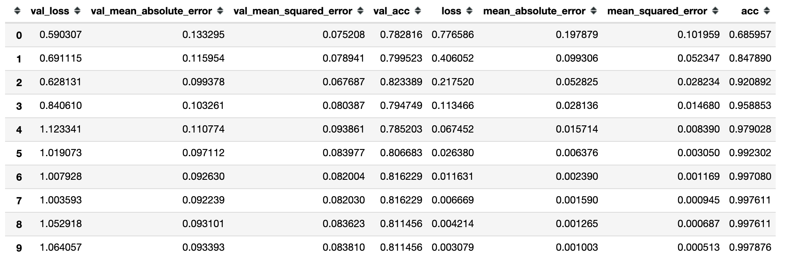
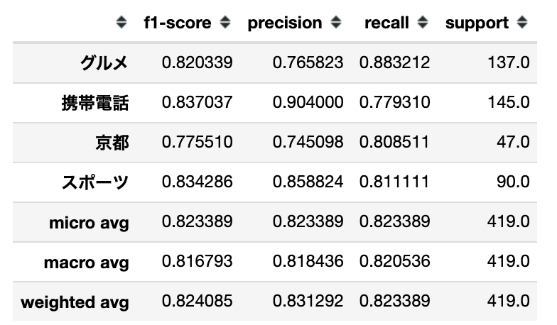

# もっと簡単に Keras BERT でファインチューニングしてみる

## TL;DR

[text-vectorian](https://pypi.org/project/text-vectorian/)をバージョンアップし、BERT のファインチューニングで役に立つ機能を追加しました。

BERT のモデルやベンチマーク用のデータなどは[Keras BERT でファインチューニングしてみる](https://www.inoue-kobo.com/ai_ml/keras-bert-with-finetuning/index.html)を参照してください。

## 事前準備

### BERT モデルのダウンロード

BERT のモデルは別途準備する必要があります。 日本語 Wikipedia を元に学習した学習済みモデルは以下の方が提供されています。

-   [BERT with SentencePiece を日本語 Wikipedia で学習してモデルを公開しました](https://yoheikikuta.github.io/bert-japanese/)

以下のファイルをダウンロードしておきます。

-   wiki-ja.vocab
-   wiki-ja.model
-   model.ckpt-1400000.data-00000-of-00001
-   model.ckpt-1400000.index
-   model.ckpt-1400000.meta

### text-vectorian のインストール

```bash
pip intall text-vectorian
```

バージョンは`0.2.0`以上であることを確認してください。

### Keras BERT の Config

`text-vectorian`では[Keras BERT](https://github.com/CyberZHG/keras-bert)を使用していますが、以下の設定をデフォルトで利用します。

```json
{
    "attention_probs_dropout_prob": 0.1,
    "hidden_act": "gelu",
    "hidden_dropout_prob": 0.1,
    "hidden_size": 768,
    "initializer_range": 0.02,
    "intermediate_size": 3072,
    "max_position_embeddings": 128,
    "max_seq_length": 128,
    "num_attention_heads": 12,
    "num_hidden_layers": 12,
    "type_vocab_size": 2,
    "vocab_size": 32000
}
```

`max_position_embeddings`と`max_seq_length`については、トークンが大きい場合はモデルの最大である 512 まで拡張することができます。
デフォルトとは異なる設定を使用する場合は、上記の`JSON`を任意のファイルとして保存し、`SpBertVectorian`にパラメータとして指定してください。
デフォルトのまま実行する場合は、`config_filename`は必要ありません。

```python
vectorizer_filename = f'{ROOT_DIR}/bert-japanese/model/model.ckpt-1400000'
tokenizer_filename = f'{ROOT_DIR}/bert-japanese/model/wiki-ja.model'
config_filename = f'{ROOT_DIR}/my-config.json'
vectorian = SpBertVectorian(
    tokenizer_filename=tokenizer_filename,
    vectorizer_filename=vectorizer_filename,
    config_filename=cofnig_filename
)
```

## ソースコード

### モジュールのロード

```python
from text_vectorian import SpBertVectorian

# `model.ckpt-1400000` のように拡張子を付けないのがポイントです。
vectorizer_filename = f'{ROOT_DIR}/bert-japanese/model/model.ckpt-1400000'
tokenizer_filename = f'{ROOT_DIR}/bert-japanese/model/wiki-ja.model'
vectorian = SpBertVectorian(
    tokenizer_filename=tokenizer_filename,
    vectorizer_filename=vectorizer_filename
)
```

### データロード用関数

```python
import pandas as pd
import sentencepiece as spm
from keras import utils
from keras.preprocessing.sequence import pad_sequences
import logging
import numpy as np

def _load_labeldata(train_dir, test_dir):
    train_features_df = pd.read_csv(f'{train_dir}/features.csv')
    train_labels_df = pd.read_csv(f'{train_dir}/labels.csv')
    test_features_df = pd.read_csv(f'{test_dir}/features.csv')
    test_labels_df = pd.read_csv(f'{test_dir}/labels.csv')
    label2index = {k: i for i, k in enumerate(train_labels_df['label'].unique())}
    index2label = {i: k for i, k in enumerate(train_labels_df['label'].unique())}
    class_count = len(label2index)
    train_labels = utils.np_utils.to_categorical([label2index[label] for label in train_labels_df['label']], num_classes=class_count)
    test_label_indices = [label2index[label] for label in test_labels_df['label']]
    test_labels = utils.np_utils.to_categorical(test_label_indices, num_classes=class_count)

    train_features = []
    test_features = []

    for feature in train_features_df['feature']:
        train_features.append(vectorian.fit(feature, suppress_vectors=True).indices)
    train_segments = vectorian.get_segments()
    vectorian.reset()
    for feature in test_features_df['feature']:
        test_features.append(vectorian.fit(feature, suppress_vectors=True).indices)
    test_segments = vectorian.get_segments()

    print(f'Trainデータ数: {len(train_features_df)}, Testデータ数: {len(test_features_df)}, ラベル数: {class_count}')

    return {
        'class_count': class_count,
        'label2index': label2index,
        'index2label': index2label,
        'train_labels': train_labels,
        'test_labels': test_labels,
        'test_label_indices': test_label_indices,
        'train_features': np.array(train_features),
        'train_segments': np.array(train_segments),
        'test_features': np.array(test_features),
        'test_segments': np.array(test_segments)
    }
```

### モデル準備関数

```python
from keras import Model
from keras.layers import Dense
import keras

def _create_model(class_count, samples_len, batch_size, epochs):
    layers = vectorian.get_keras_layer(trainable=True)
    optimizer = vectorian.get_optimizer(samples_len=samples_len, batch_size=batch_size, epochs=epochs)

    output_tensor = keras.layers.Dense(class_count, activation='softmax')(layers['last'])
    model = keras.Model(layers['inputs'], output_tensor)
    model.compile(loss='categorical_crossentropy', optimizer=optimizer, metrics=['mae', 'mse', 'acc'])
    model.summary()

    return model
```

### データのロードとモデルの準備

```python
trains_dir = f'{ROOT_DIR}/word-or-character/data/trains'
tests_dir = f'{ROOT_DIR}/word-or-character/data/tests'

data = _load_labeldata(trains_dir, tests_dir)
samples_len = len(data['train_features'])
batch_size = 8
epochs = 10

model = _create_model(data['class_count'], samples_len, batch_size, epochs)
```

### 学習の実行

```python
from keras.callbacks import EarlyStopping, ModelCheckpoint, TensorBoard
import pandas as pd

model_filename = 'bert.model'

history = model.fit([data['train_features'], data['train_segments']],
          data['train_labels'],
          epochs = epochs,
          batch_size = batch_size,
          validation_data=([data['test_features'], data['test_segments']], data['test_labels']),
          shuffle=False,
          verbose = 1,
          callbacks = [
              ModelCheckpoint(monitor='val_acc', mode='max', filepath=model_filename, save_best_only=True)
          ])
display(pd.DataFrame(history.history))
```



### クラシフィケーションレポート

```python
from sklearn.metrics import classification_report, confusion_matrix
from keras.models import load_model
from keras_bert import get_custom_objects

model = load_model(model_filename, custom_objects=get_custom_objects())

predicted_test_labels = model.predict([data['test_features'], data['test_segments']]).argmax(axis=1)
numeric_test_labels = np.array(data['test_labels']).argmax(axis=1)

report = classification_report(
        numeric_test_labels, predicted_test_labels, target_names=['グルメ', '携帯電話', '京都', 'スポーツ'], output_dict=True)

display(pd.DataFrame(report).T)
```



## まとめ

[Keras BERT でファインチューニングしてみる](https://www.inoue-kobo.com/ai_ml/keras-bert-with-finetuning/index.html)とほぼ同じ結果をえる事ができました。
[text-vectorian](https://pypi.org/project/text-vectorian/)を利用することで、BERT固有の前処理などを省略することができます。

### ファインチューニングを行わずにベクトルだけ取得する場合

ファインチューニングが不要の場合は、以下の様に簡単にBERTによるベクトルだけ取得することが可能です。

```python
from text_vectorian import SpBertVectorian

tokenizer_filename = '[モデルをダウンロードしたディレクトリ]/model/wiki-ja.model'
vectorizer_filename = '[モデルをダウンロードしたディレクトリ]/model/model.ckpt-1400000'
vectorian = SpBertVectorian(
    tokenizer_filename=tokenizer_filename,
    vectorizer_filename=vectorizer_filename,
)

text = 'これはテストです。'
vectors = vectorian.fit(text).vectors
```

## 参考文献

-   [Keras BERT](https://github.com/CyberZHG/keras-bert)
-   [BERT with SentencePiece を日本語 Wikipedia で学習してモデルを公開しました](https://yoheikikuta.github.io/bert-japanese/)
