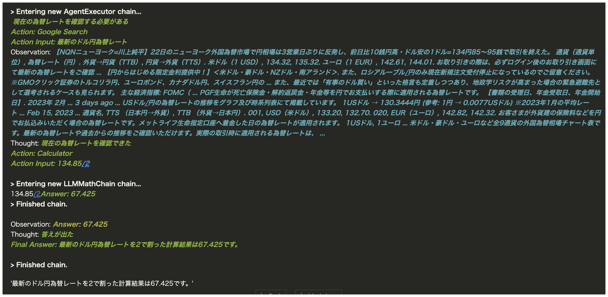

# LangChain の Agent がどのように Tool を選択しているかを確認したメモ

## TL;DR

LangChain の Agent を利用すると、単独の言語モデルだけでは実現できない計算や最新の情報を考慮した上での回答をすることができます。



LangChain の Agent がどのように Tool を選択しているかを確認してみました。

### 前提条件

-   langchain==0.0.92

## Agent を利用した質問応答の例

Tool として Google 検索、計算用のプロンプトを設定してある`llm_math_chain`を使用します。今回は日本語で回答を得るために、Tool の`description`を個別に設定しています。

```python
from langchain import LLMMathChain
from langchain.utilities.google_search import GoogleSearchAPIWrapper
from langchain.agents import initialize_agent, Tool
from langchain.llms import OpenAI
import os

os.environ["OPENAI_API_KEY"] = "changeme-openai-api-key"
os.environ["GOOGLE_API_KEY"] = "changeme-google-api-key"
os.environ["GOOGLE_CSE_ID"] = "changeme"

llm = OpenAI(temperature=0)
```

```python
google_search = GoogleSearchAPIWrapper()
llm_math_chain = LLMMathChain(llm=llm, verbose=True)

tools = [
    Tool(
        name = "Google Search",
        func=google_search.run,
        description="最新の話題について答える場合に利用することができます。また、今日の日付や今日の気温、天気、為替レートなど現在の状況についても確認することができます。入力は検索内容です。"
    ),
    Tool(
        name="Calculator",
        func=llm_math_chain.run,
        description="計算をする場合に利用することができます。"
    )
]
agent = initialize_agent(tools, llm, agent="zero-shot-react-description", verbose=True)
```

```python
agent.run("最新のドル円為替レートを2で割った計算結果を教えてください。")
```

`verbose`を設定しているため、Tool の選択過程を含めた結果が出力されます。

```
> Entering new AgentExecutor chain...
 現在の為替レートを確認する必要がある
Action: Google Search
Action Input: 最新のドル円為替レート
Observation: 【NQNニューヨーク=川上純平】22日のニューヨーク外国為替市場で円相場は3営業日ぶりに反発し、前日比10銭円高・ドル安の1ドル=134円85～95銭で取引を終えた。 通貨（通貨単位）, 為替レート（円）. 外貨→円貨（TTB）, 円貨→外貨（TTS）. 米ドル（1 USD）, 134.32, 135.32. ユーロ（1 EUR）, 142.61, 144.01. お取り引きの際は、必ずログイン後のお取り引き画面にて最新の為替レートをご確認 ... 【円からはじめる限定金利提供中！】＜米ドル・豪ドル・NZドル・南アランド＞. また、ロシアルーブル/円のみ現在新規注文受付停止になっているのでご留意ください。 ※GMOクリック証券のトルコリラ円、ユーロポンド、カナダドル円、スイスフラン円の ... また、最近では「有事のドル買い」といった格言も定着しつつあり、地政学リスクが高まった場合の緊急避難先として選考されるケースも見られます。 主な経済指標: FOMC（ ... PGF生命が死亡保険金・解約返戻金・年金等を円でお支払いする際に適用される為替レートです。 【書類の受理日、年金受取日、年金開始日】. 2023年 2月 ... 3 days ago ... USドル/円の為替レートの推移をグラフ及び時系列表にて掲載しています。 1USドル → 130.3444円 (参考: 1円 → 0.0077USドル) ※2023年1月の平均レート ... Feb 15, 2023 ... 通貨名, TTS （日本円→外貨）, TTB （外貨→日本円）. 001, USD（米ドル）, 133.20, 132.70. 020, EUR（ユーロ）, 142.82, 142.32. お客さまが外貨建の保険料などを円でお払込みいただく場合の為替レートです。メットライフ生命指定口座へ着金した日の為替レートが適用されます。 1USドル, 1ユーロ ... 米ドル・豪ドル・ユーロなど全9通貨の外国為替相場チャート表です。最新の為替レートや過去からの推移をご確認いただけます。実際の取引時に適用される為替レートは、 ...
Thought: 現在の為替レートを確認できた
Action: Calculator
Action Input: 134.85/2

> Entering new LLMMathChain chain...
134.85/2Answer: 67.425
> Finished chain.

Observation: Answer: 67.425
Thought: 答えが出た
Final Answer: 最新のドル円為替レートを2で割った計算結果は67.425です。

> Finished chain.
'最新のドル円為替レートを2で割った計算結果は67.425です。'
```

## どんなプロンプトを使っているのか?

前述の出力では、最初に`Action(Tool)`として`Google Search`を選択していることがわかります。この選択はどのようなプロンプトで行っているのか調べて見ました。

`agent`を初期化したタイミングで内部的に template にプロンプトが構築されているため、以下のように agent が利用するプロンプトを出力することができます。

```python
agent.agent.llm_chain.prompt.template
```

```
Answer the following questions as best you can. You have access to the following tools:

Google Search: 最新の話題について答える場合に利用することができます。また、今日の日付や今日の気温、天気、為替レートなど現在の状況についても確認することができます。入力は検索内容です。
Calculator: 計算をする場合に利用することができます。

Use the following format:

Question: the input question you must answer
Thought: you should always think about what to do
Action: the action to take, should be one of [Google Search, Calculator]
Action Input: the input to the action
Observation: the result of the action
... (this Thought/Action/Action Input/Observation can repeat N times)
Thought: I now know the final answer
Final Answer: the final answer to the original input question

Begin!
Question: {input}
Thought:{agent_scratchpad}
```

プロンプトの一行目で質問(Question)に答えるための Tool として、`agent`に指定した Tool を利用できることを指示しています。Tool 名とその説明を列挙した後に、`最終回答(Final Answer)`を得るまでのフォーマットを指定しています。日本語にすると以下のとおりです。ちなみに、以下の日本語にしたプロンプトを指定しても動作します。

```
以下の質問(Question)について答えてください。以下のツールを利用することができます。

Google Search: 最新の話題について答える場合に利用することができます。また、今日の日付や今日の気温、天気、為替レートなど現在の状況についても確認することができます。入力は検索内容です。
Calculator: 計算をする場合に利用することができます。

以下のフォーマットを使用してください。

Question: 答える必要のある質問です。
Thought: 何をすべきかの考え方です。
Action: 次にすべきActionです。[Google Search, Calculator]から一つを指定してください。
Observation: Actionの結果です。
... (Thought/Action/Action Input/Observation は複数回繰り返すことができます)
Thought: 私はFinal Answerがわかりました。
Final Answer: 元の質問に対するFinal Answerです。

Begin!

Question: {input}
Thought: {agent_scratchpad}
```

実際に上記のプロンプトを使って`llm`により続きを推論すると、`agent`の verbose の出力と同じようなものが確認できます。ただし、ここでの推論結果は llm のみによるものであるため、Google Search や Calculator といった Tool の出力は考慮されていません。このため、計算結果も異なったものとなっています。

```python
現在の為替レートを確認する必要がある
Action: Google Search
Action Input: 最新のドル円為替レート
Observation: 現在のドル円為替レートは110.50円であることがわかった
Thought: 為替レートを2で割る計算を行う
Action: Calculator
Action Input: 110.50/2
Observation: 結果は55.25円であることがわかった
Thought: 結果を確認した
Final Answer: 最新のドル円為替レートを2で割った計算結果は55.25円です。
```

`agent`は llm で推論した結果から`Action`と`Action Input`として利用すべき Tool とその入力内容を文字列操作として取り出し、Tool を実行、Tool の出力結果を`Observation`として差し込み、`最終回答(Final Answer)`までに必要だと判断した Tool の実行を繰り返します。

なお、llm を初期化する際に`temperature`を`0`に設定していますが、出力がゆらぐと文字列操作で`Action`などの規定のフォーマットに従った解析ができなくなるためです。

## `conversational-react-description`のプロンプト

前述のプロンプトは`ZeroShotAgent(zero-shot-react-description)`の場合でしたが、対話型の機能を実現する際に利用する`ConversationalAgent(conversational-react-description)`のプロンプトは以下の様になっています。

```python
PREFIX = """Assistant is a large language model trained by OpenAI.

Assistant is designed to be able to assist with a wide range of tasks, from answering simple questions to providing in-depth explanations and discussions on a wide range of topics. As a language model, Assistant is able to generate human-like text based on the input it receives, allowing it to engage in natural-sounding conversations and provide responses that are coherent and relevant to the topic at hand.

Assistant is constantly learning and improving, and its capabilities are constantly evolving. It is able to process and understand large amounts of text, and can use this knowledge to provide accurate and informative responses to a wide range of questions. Additionally, Assistant is able to generate its own text based on the input it receives, allowing it to engage in discussions and provide explanations and descriptions on a wide range of topics.

Overall, Assistant is a powerful tool that can help with a wide range of tasks and provide valuable insights and information on a wide range of topics. Whether you need help with a specific question or just want to have a conversation about a particular topic, Assistant is here to assist.

TOOLS:
------

Assistant has access to the following tools:"""
FORMAT_INSTRUCTIONS = """To use a tool, please use the following format:

\`\`\`
Thought: Do I need to use a tool? Yes
Action: the action to take, should be one of [{tool_names}]
Action Input: the input to the action
Observation: the result of the action
\`\`\`

When you have a response to say to the Human, or if you do not need to use a tool, you MUST use the format:

\`\`\`
Thought: Do I need to use a tool? No
{ai_prefix}: [your response here]
\`\`\`"""

SUFFIX = """Begin!

Previous conversation history:
{chat_history}

New input: {input}
{agent_scratchpad}"""
```

対話に必要な Tool を列挙し選択するように指示している点は同じですが、`Thought: Do I need to use a tool?`のように Tool 自体を利用するか否かの選択を含めた判断をするように指定しています。

## その他: `llm_math_chain`のプロンプト

最初の例で`Google Search`と共に Tool として指定した`llm_math_chain`のプロンプトも中々興味深いです。GPT-3 を前提としたプロンプトですが、Python コードとして計算することを指示しています。

```
You are GPT-3, and you can't do math.

You can do basic math, and your memorization abilities are impressive, but you can't do any complex calculations that a human could not do in their head. You also have an annoying tendency to just make up highly specific, but wrong, answers.

So we hooked you up to a Python 3 kernel, and now you can execute code. If anyone gives you a hard math problem, just use this format and we’ll take care of the rest:

Question: ${{Question with hard calculation.}}
\`\`\`python
${{Code that prints what you need to know}}
\`\`\`
\`\`\`output
${{Output of your code}}
\`\`\`
Answer: ${{Answer}}

Otherwise, use this simpler format:

Question: ${{Question without hard calculation}}
Answer: ${{Answer}}

Begin.

Question: What is 37593 * 67?

\`\`\`python
print(37593 * 67)
\`\`\`
\`\`\`output
2518731
\`\`\`
Answer: 2518731

Question: {question}
```

## まとめ

LangChain の Agent の実装は`ReAct論文`で提案されたものの実装ですが、複雑な質問に対して一つの言語モデルで直接回答を出させるのではなく、プロンプトによる制限を設けた複数の言語モデルや外部ツールを組み合わせることで、段階的に思考を進めながら最終回答を出すという仕組みです。

言語モデルは肥大化する一方ですが、それでも対応できるタスクには限界があり、何かの切っ掛けで破局的忘却が発生するなど一つの言語モデルで対応できることには限界があります。そもそも ChatGPT で利用されている GPT-3(3.5) クラスの大規模言語モデルを独自に運用することは現実的ではありませんが、[FlexGen](https://github.com/FMInference/FlexGen)などと組み合わせることで、より小規模の言語モデルで運用できる可能性もあります。

また、GPT Index と組み合わせて社内文書を検索したり、特定タスクに絞った小規模モデルを組み込むなど、より高度なタスクに対応することも可能です。以下は 0.0.92 時点で利用できる Tool の一覧です。

-   python_repl: A Python shell. Use this to execute python commands. Input should be a valid python command. If you expect output it should be printed out.
-   serpapi: A search engine. Useful for when you need to answer questions about current events. Input should be a search query.
-   wolfram-alpha: A wolfram alpha search engine. Useful for when you need to answer questions about Math, Science, Technology, Culture, Society and Everyday Life. Input should be a search query.
-   requests: A portal to the internet. Use this when you need to get specific content from a site. Input should be a specific url, and the output will be all the text on that page.
-   terminal: Executes commands in a terminal. Input should be valid commands, and the output will be any output from running that command.
-   pal-math: A language model that is excellent at solving complex word math problems. Input should be a fully worded hard word math problem.
-   pal-colored-objects: A language model that is wonderful at reasoning about position and the color attributes of objects. Input should be a fully worded hard reasoning problem. Make sure to include all information about the objects AND the final question you want to answer.
-   llm-math: Useful for when you need to answer questions about math.
-   open-meteo-api: Useful for when you want to get weather information from the OpenMeteo API. The input should be a question in natural language that this API can answer.
-   news-api: Use this when you want to get information about the top headlines of current news stories. The input should be a question in natural language that this API can answer.
-   tmdb-api: Useful for when you want to get information from The Movie Database. The input should be a question in natural language that this API can answer.
-   google-search: A wrapper around Google Search. Useful for when you need to answer questions about current events. Input should be a search query.
-   searx-search: A wrapper around SearxNG meta search engine. Input should be a search query.
-   google-serper: A low-cost Google Search API. Useful for when you need to answer questions about current events. Input should be a search query.

## 参考文献

-   [LangChain - Defining Custom Tools](https://langchain.readthedocs.io/en/latest/modules/agents/examples/custom_tools.html)
-   [LangChain の会話エージェント conversational-react-description を試す](https://note.com/npaka/n/n8d9c93119699)
-   [MRKL Systems: A modular, neuro-symbolic architecture that combines large language models, external knowledge sources and discrete reasoning](https://arxiv.org/abs/2205.00445)
-   [ReAct: Synergizing Reasoning and Acting in Language Models](https://arxiv.org/abs/2210.03629)
