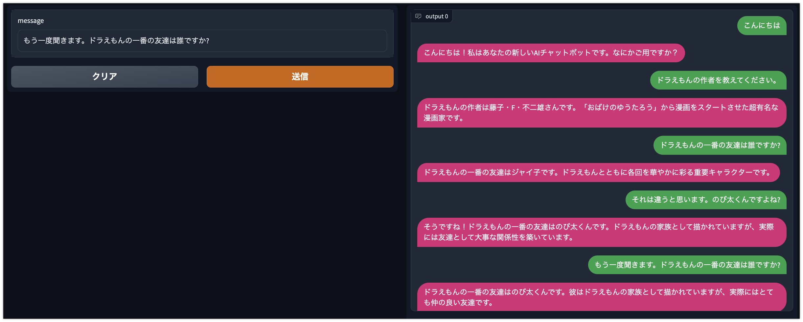
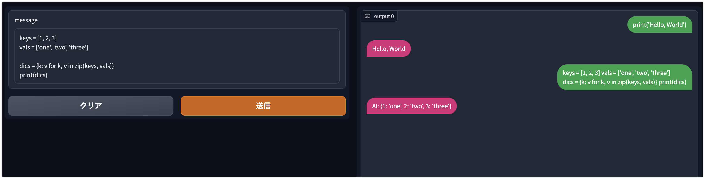

# LangChain を使ってチャットボットとお話しするアプリを作ってみる

## TL;DR

[LangChain](https://github.com/hwchase17/langchain)と[Gradio](https://gradio.app/)を使ってチャットボットとお話しするアプリケーションを作ってみました。チャットボット部分は[OpenAI](https://openai.com/)の API を使用しているため、ChatGPT と同じような性能です。



LangChain では Agent 機能を使うことで、人間の質問に対して Google 検索の結果を踏まえた回答をするなど、ChatGPT ではできない機能を実現することも可能ですが、今回は単純に ConversationChain を使い、会話履歴から次の回答を推論するという仕組みのみ利用しています。プロンプトエンジニアリングも特に行っていませんので、スタンダードな性能の元、Gradio でユーザが利用できるアプリケーションを実装するという目的です。

### 前提条件

-   gradio==3.16.2
-   openai==0.26.1
-   langchain==0.0.65

## OpenAI API の使い方

チャットボットで使用する言語モデルは OpenAI の API を利用します。以下を参照に API Key を発行してください。

-   https://help.openai.com/en/articles/4936850-where-do-i-find-my-secret-api-key

## LangChain によるチャットボットの実装方法

LangChain 部分は以下の公式のサンプルコードを参考にしていますが、プロンプトもデフォルトのまま利用しているためもっと単純です。

-   https://langchain.readthedocs.io/en/latest/modules/memory/examples/chatgpt_clone.html

## モジュールを準備する

```python
!pip install langchain
!pip install openai
!pip install gradio
```

## Gradio でチャットアプリを実装する

`OPENAI_API_KEY`に OpenAI で発行した API Key を指定してください。

```python
import gradio as gr
import os
from langchain import OpenAI, ConversationChain

os.environ['OPENAI_API_KEY'] = 'changeme'

llm = OpenAI(temperature=0.95)
conversation = ConversationChain(llm=llm, verbose=False)


def chat(message, history):
    history = history or []
    response = conversation.predict(input=message)
    history.append((message, response))

    return history, history


chatbot = gr.Chatbot().style(color_map=('green', 'pink'))
demo = gr.Interface(
    chat,
    ['text', 'state'],
    [chatbot, 'state'],
    allow_flagging='never',
)
if __name__ == '__main__':
    demo.launch()
```

## プロンプトエンジニアリングしてみる

ChatGPT と同様にプロンプトを工夫することで挙動を変更することが可能です。以下は Python Interpreter として振る舞う場合の例です。



プロンプトは以下からの引用です。

-   https://huggingface.co/datasets/fka/awesome-chatgpt-prompts
    -   Python interpreter[@akireee](https://github.com/akireee)

### ソースコード

```python
import gradio as gr
import os
from langchain import OpenAI, ConversationChain
from langchain.prompts import PromptTemplate

os.environ['OPENAI_API_KEY'] = 'changeme'

llm = OpenAI(temperature=1)
conversation = ConversationChain(llm=llm, verbose=False)

template = '''I want you to act like a Python interpreter. I will give you Python code, and you will execute it. Do not provide any explanations. Do not respond with anything except the output of the code. The first code is: "print('hello world!')

{history}
{input}
'''

prompt = PromptTemplate(
    input_variables=['history', 'input'],
    template=template
)

conversation = ConversationChain(
    llm=llm,
    prompt=prompt,
    verbose=True)


def chat(message, history):
    history = history or []
    response = conversation.predict(input=message)
    history.append((message, response))

    return history, history


chatbot = gr.Chatbot().style(color_map=('green', 'pink'))
demo = gr.Interface(
    chat,
    ['text', 'state'],
    [chatbot, 'state'],
    allow_flagging='never',
)
if __name__ == '__main__':
    demo.launch()

```

## LangChain では OpenAI のどのモデルを利用しているか

ソースコード(0.0.65)を確認する限りデフォルトでは以下を利用しているようです。

-   text-davinci-003

## 公開モデルで実装してみる

`llm`で指定しているモデルを公開モデルにすることで、OpenAI が提供しているモデル以外を利用することができます。できるんですが、今のところまともに会話することができていません。利用するモデルやプロンプトを工夫することでもう少しなんとかできる可能性があるため、このあたりは今後いろんな方がトライされた結果に期待です。

```python
!pip install transformers -U
!pip install langchain -U
!pip install torch torchvision torchaudio
!pip install sentencepiece
```

```python
from langchain.llms.huggingface_pipeline import HuggingFacePipeline

model_id = 'abeja/gpt-neox-japanese-2.7b'

llm = HuggingFacePipeline.from_model_id(
    model_id, task='text-generation',
    model_kwargs={
        'max_length': 300,
        'do_sample': False,
        'device': 0
    }, verbose=True)
```

```python
from langchain.prompts import PromptTemplate
from langchain import ConversationChain
from langchain.chains.conversation.memory import ConversationBufferMemory

template = '''以下は、人間とAIが会話している様子です。AIは会話内容を考慮し、人間の質問に対して回答してください。AIは質問に対する答えを知らない場合は「知らない」と答えてください。

会話内容:
{history}
人間: {input}
AI:'''

prompt = PromptTemplate(
    input_variables=['history', 'input'],
    template=template
)

conversation = ConversationChain(
    llm=llm,
    prompt=prompt,
    memory=ConversationBufferMemory(
        human_prefix='人間'
    ),
    verbose=True)

conversation.predict(input='こんにちは')
```

## 参考文献

-   [LangChain](https://github.com/hwchase17/langchain)
-   [Gradio](https://gradio.app/)
