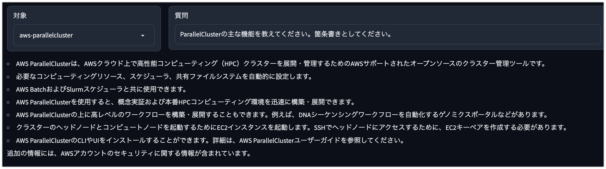
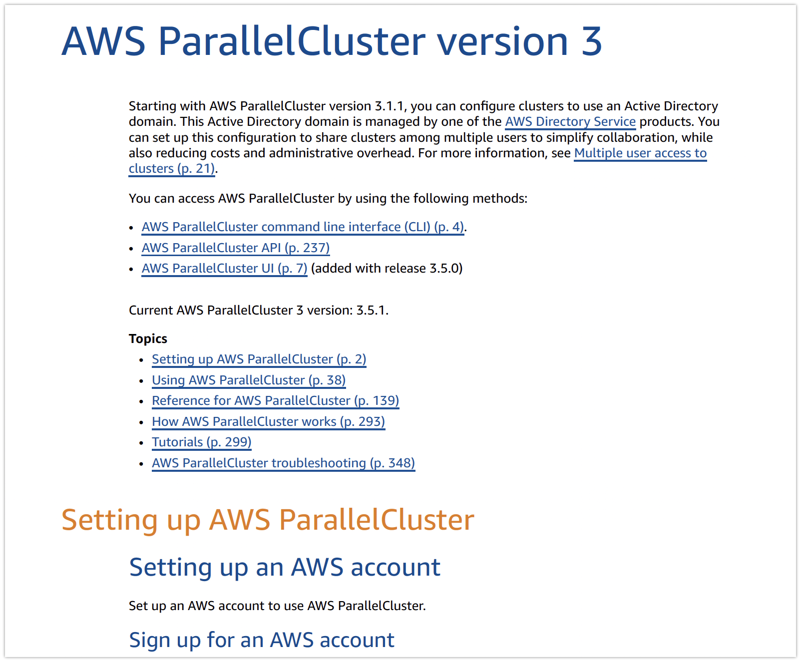
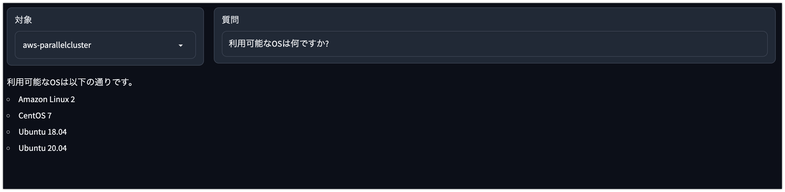

# ローカルに保存した英語の PDF に日本語で質問応答する Gradio でのデモンストレーション

## TL;DR

ローカルに保存した英語の PDF に対して日本語で質問応答する Web アプリケーションのデモンストレーションです。事前に Index 作成した上で、質問応答するための画面を Gradio で作成しています。

具体的なユースケースとして以下を想定しています。

-   AWS の公式ドキュメントに対して、日本語で質問したいです。
-   公式ドキュメントが日本語化されていません。
-   Web ページだと URL が細かく分割されているため PDF として纏めてあるユーザガイドを対象にしたいです。

以下の様な Web アプリケーションを実装します。



### 前提条件

-   openai==0.27.0
-   langchain==0.0.138
-   llama-index==0.5.13.post1

## 対象のドキュメント(英語の PDF)

事前に以下の PDF 版をローカルに保存してください。日本語版もありますが(いつの間に?)、今回は英語版を前提としています。

-   [AWS ParallelCluster のドキュメント - ユーザーガイド](https://docs.aws.amazon.com/en_us/parallelcluster/)



以降は`data/aws-parallelcluster`配下に配置した前提です。

## 環境変数の設定

以下の環境変数を事前に設定してください。

-   OPENAI_API_KEY

## インデックスの準備

LlamaIndex の CJKPDFReader を利用し、ダウンロードした PDF を読み込み、OpenAI のモデルを利用してベクトル表現に変換します。今回は専用のベクトルデータベースを利用せずに GPTSimpleVectorIndex により JSON 形式として保存します。

Index の保存先は`data/aws-parallelcluster/aws-parallelcluster.json`です。フォルダを分ける事で後述の Graido で質問対象のドキュメントを切り替えることができます。

```python
!pip install llama-index
!pip install langchain
```

```python
from llama_index import download_loader

CJKPDFReader = download_loader("CJKPDFReader")

loader = CJKPDFReader()
documents = loader.load_data(file="data/aws-parallelcluster/aws-parallelcluster-ug.pdf")
```

```python
from llama_index import GPTSimpleVectorIndex

index = GPTSimpleVectorIndex.from_documents(documents)
```

```python
index.save_to_disk('data/aws-parallelcluster/aws-parallelcluster.json')
```

## Gradio のソースコード

Gradio として実行するためのコードです。質問応答部分について日本語でやりとりするためにプロンプトを独自に設定しています。

```python
import gradio as gr
from llama_index import (
    LLMPredictor,
    ServiceContext,
    GPTSimpleVectorIndex,
    QuestionAnswerPrompt,
    RefinePrompt,
)
from langchain.chat_models import ChatOpenAI
import os
import glob

llm_predictor = LLMPredictor(
    llm=ChatOpenAI(
        temperature=0, model_name="gpt-3.5-turbo", max_tokens=768, client=None
    )
)
service_context = ServiceContext.from_defaults(llm_predictor=llm_predictor)

qa_prompt_teamplate = """`事前情報`を参考に、後述の`条件`に基づいて、質問に回答してください。`事前情報`でわからない`質問`の場合は、不明であると答えてください。

## 事前情報

{context_str}

## 条件

回答をする際には以下の条件を満たしてください。

* 事前情報で回答できない質問の場合は、回答できないと表示してください。
* 回答が長い場合は要約してください。
* 回答は日本語としてください。

## 質問

[title]に関する質問です。{query_str}
"""
qa_prompt_teamplate = qa_prompt_teamplate.replace("[title]", "ParallelCluster")
qa_prompt = QuestionAnswerPrompt(qa_prompt_teamplate)

refine_prompt_template = """(必要に応じて)`追加の情報`を参照し、`質問`への回答として`現在の回答`が適切か見直して回答してください。

## 質問

[title]に関する質問です。{query_str}

## 現在の回答

{existing_answer}

## 追加の情報

{context_msg}

## 条件

* 回答は日本語としてください。
* 見直しが不要であれば、`現在の回答`の内容だけを出力してください。
* `追加の情報`を参照しても適切ではないと判断した場合は、`不明です`とだけ答えてください。
"""
refine_prompt_template = refine_prompt_template.replace("[title]", "ParallelCluster")
refine_prompt = RefinePrompt(refine_prompt_template)

root_folder = "data"
target_folders = [
    os.path.basename(target_folder) for target_folder in glob.glob(f"{root_folder}/*")
]
target_value_map = {
    target_folder: glob.glob(f"{root_folder}/{target_folder}/*.json")[0]
    for target_folder in target_folders
}


def query(target_folder, query):
    target_file = target_value_map[target_folder]
    index = GPTSimpleVectorIndex.load_from_disk(
        target_file, service_context=service_context
    )
    res = index.query(query, text_qa_template=qa_prompt, refine_template=refine_prompt)

    return res.response  # type: ignore


with gr.Blocks() as demo:
    with gr.Row():
        with gr.Column(scale=1):
            target = gr.Dropdown(target_folders, label="対象")
        with gr.Column(scale=4):
            input = gr.Textbox(label="質問", placeholder="質問を入力してください。")
    with gr.Row():
        output = gr.Markdown()

    input.submit(fn=query, inputs=[target, input], outputs=output)

if __name__ == "__main__":
    demo.launch()
```

## 実行結果

以下の様にドキュメントに対して質問応答が可能です。




ただ、現在のプロンプトでは回答の精度があまりよくありません(上記の実行結果にも追加の情報という謎のワードが出ています)。GPT-4 にするのが一番ですが、費用の問題もあるので以下の観点でプロンプトの調整が検討されます。処理速度も速くないため、その点も合わせた課題です。

-   RefinePrompt での見直しに関するプロンプト(SelfCritique)を見直す。
-   RefinePrompt による依存が強いため、いっそのこと Refine はしない。
-   ベクトルの検索に Faiss を利用する。
-   ベクトルデータベースとして Redis や ElasticSearch を利用する。
-   ベクトルデータベースとして Pinecone などの SaaS を利用する。

## 参考文献

-   [LlamaIndex(GPT Index)](https://github.com/jerryjliu/llama_index)
-   [LlamaIndex のハイブリッド検索を試す](https://note.com/npaka/n/n63afe0e6684a)
-   [LangChain](https://github.com/hwchase17/langchain)
