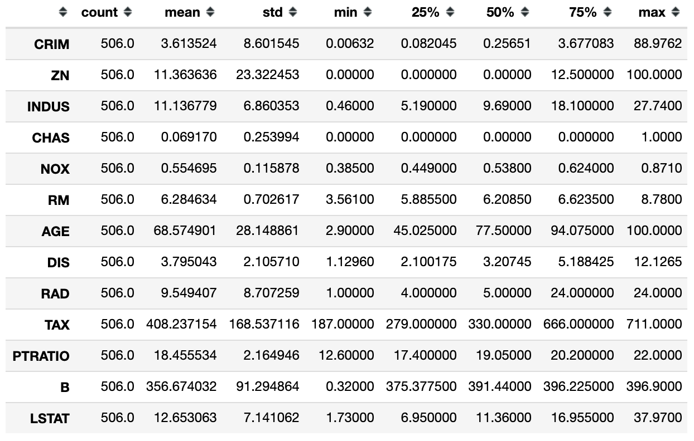
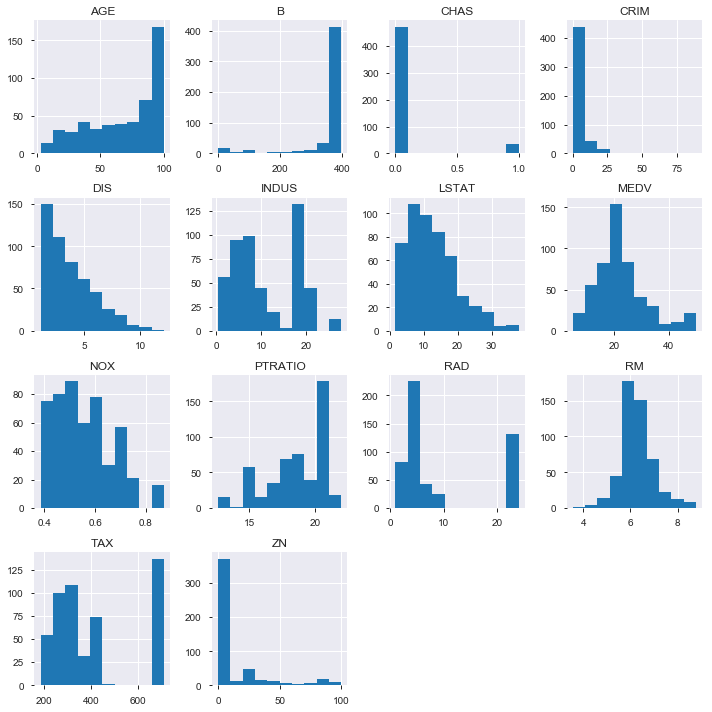
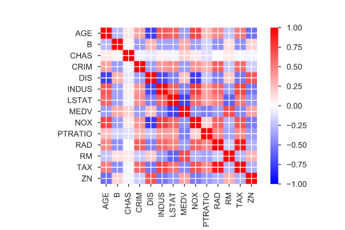
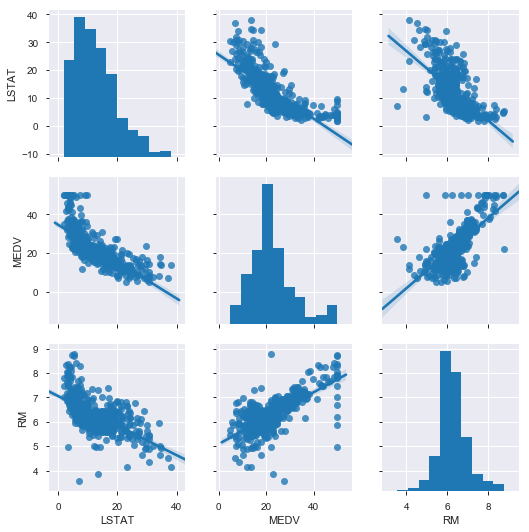
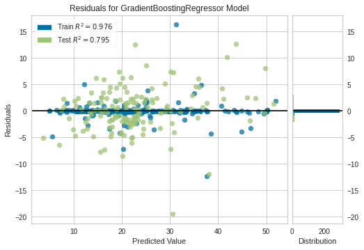
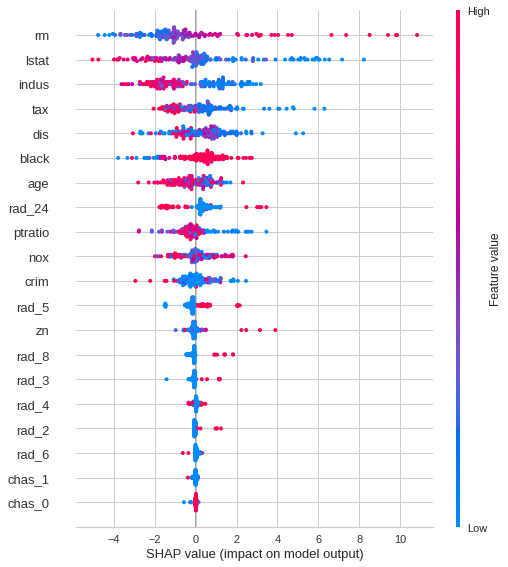
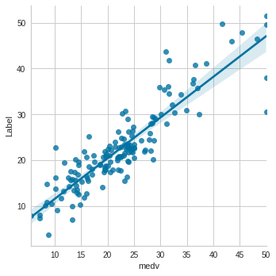
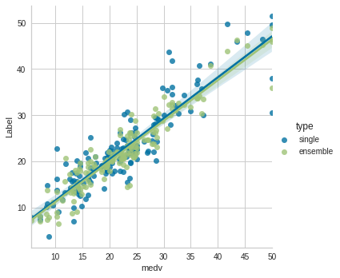

# PyCaretで学ぶデータ分析におけるAutoMLの利用

## TL;DR

`ボストン住宅価格データセット`を利用して、データ分析におけるAutoMLの利用を解説します。
似たようなコンテンツは他にも色々有りますが、手動でのデータ分析からAutoMLの利用までの一連の流れを説明する機会があったので、その内容を纏めています。
以下のような流れでの解説です。

1. ボストン住宅価格データセットの概要
2. 手動でのデータ分析の例
3. PyCaretによるAutoMLの利用
4. アンサンブル学習
5. まとめ

### AutoMLとは

機械学習の利用には、データの前処理、アルゴリズムの選定、ハイパーパラメータ最適化、評価のプロセスを順番に行う必要があります。AutoMLは、これらの機械学習に必要なプロセスを全て自動で実行してくれる仕組みを提供するソリューションの分類です。

今回はAutoMLに分類されるオープンソースである[PyCaret](https://pycaret.org/)について簡単なデモを交えてご紹介します。

## ボストン住宅価格データセットの概要

`ボストン住宅価格データセット`は、以下の要素を持ったボストンにおける住宅価格と、関連すると思われる情報のデータです。トイプロブレム(練習問題)として、データ分析に関するテキストで頻繁に利用されています。

| カラム  | 説明                                                                 |
|---------|----------------------------------------------------------------------|
| CRIM    | 町ごとの一人当たりの犯罪率                                           |
| ZN      | 宅地の比率が25000平方フィートを超える敷地に区画されている。          |
| INDUS   | 町当たりの非小売業エーカーの割合                                     |
| CHAS    | チャーリーズ川ダミー変数（川の境界にある場合は1、それ以外の場合は0） |
| NOX     | 一酸化窒素濃度（1000万分の1）                                        |
| RM      | 1住戸あたりの平均部屋数                                              |
| AGE     | 1940年以前に建設された所有占有ユニットの年齢比率                     |
| DIS     | 5つのボストンの雇用センターまでの加重距離                            |
| RAD     | ラジアルハイウェイへのアクセス可能性の指標                           |
| TAX     | 10000ドルあたりの税全額固定資産税率                                  |
| PTRATIO | 生徒教師の比率                                                       |
| B       | 町における黒人の割合                                                 |
| LSTAT   | 人口当たり地位が低い率                                               |
| MEDV    | 所有者居住住宅価格の中央値(1000ドル単位)                                   |

今回は`住宅価格(MEDV)`を予測するというテーマで進めます。

## 手動でのデータ分析の例

### まずは基本統計量を確認する



* count・・・データ数
* mean・・・算術平均
* std・・・標準偏差
* min・・・最小値
* 25%・・・1/4分位数(パーセンタイル)
* 50%・・・中央値(パーセンタイル)
* 75%・・・3/4分位数(パーセンタイル)
* max・・・最大値

### 次にヒストグラムを確認する



### 相関係数を確認して特徴量を選ぶ

相関係数を確認し、相関係数の大きい特徴量を選択します。



予測したい`MEDV`に相関の高い`LSTAT`、`RM`についてもう少し詳細に見てみます。



### 回帰分析で予測する

以下は`LSTAT`と`RM`により、重回帰分析による推論を実施した結果です。評価用に95:5(train:test)でデータを分割しています。

### 評価する

予測結果は定量的に評価する必要があります。以下はR2(決定係数)という評価方法で評価した結果です。

* 0.69

R2の詳細は省略しますが、R2は`目的変数`である`住宅価格(MDEV)`を、特徴量として入力した`説明変数`でどの程度説明できるかを表しています。R2は1に近いほど正確な予測ができていることになります。

## PyCaretによるAutoMLの利用

今度は手動でのデータ分析と同じように`ボストン住宅価格データセット`における`住宅価格(MEDV)`をAutoMLである`PyCaret`で予測してみます。

### モジュールの準備

```python
!pip install pycaret
!pip install shap
```

### データの準備

PyCaretには有名なデータセットを簡単に取得するための関数があります。
以下ではボストン住宅価格データセットをダウンロードしています。

```python
from pycaret.datasets import get_data

data = get_data('boston')
```


<div>
<style scoped>
    .dataframe tbody tr th:only-of-type {
        vertical-align: middle;
    }

    .dataframe tbody tr th {
        vertical-align: top;
    }

    .dataframe thead th {
        text-align: right;
    }
</style>
<table border="1" class="dataframe">
  <thead>
    <tr style="text-align: right;">
      <th></th>
      <th>crim</th>
      <th>zn</th>
      <th>indus</th>
      <th>chas</th>
      <th>nox</th>
      <th>rm</th>
      <th>age</th>
      <th>dis</th>
      <th>rad</th>
      <th>tax</th>
      <th>ptratio</th>
      <th>black</th>
      <th>lstat</th>
      <th>medv</th>
    </tr>
  </thead>
  <tbody>
    <tr>
      <th>0</th>
      <td>0.00632</td>
      <td>18.0</td>
      <td>2.31</td>
      <td>0</td>
      <td>0.538</td>
      <td>6.575</td>
      <td>65.2</td>
      <td>4.0900</td>
      <td>1</td>
      <td>296</td>
      <td>15.3</td>
      <td>396.90</td>
      <td>4.98</td>
      <td>24.0</td>
    </tr>
    <tr>
      <th>1</th>
      <td>0.02731</td>
      <td>0.0</td>
      <td>7.07</td>
      <td>0</td>
      <td>0.469</td>
      <td>6.421</td>
      <td>78.9</td>
      <td>4.9671</td>
      <td>2</td>
      <td>242</td>
      <td>17.8</td>
      <td>396.90</td>
      <td>9.14</td>
      <td>21.6</td>
    </tr>
    <tr>
      <th>2</th>
      <td>0.02729</td>
      <td>0.0</td>
      <td>7.07</td>
      <td>0</td>
      <td>0.469</td>
      <td>7.185</td>
      <td>61.1</td>
      <td>4.9671</td>
      <td>2</td>
      <td>242</td>
      <td>17.8</td>
      <td>392.83</td>
      <td>4.03</td>
      <td>34.7</td>
    </tr>
    <tr>
      <th>3</th>
      <td>0.03237</td>
      <td>0.0</td>
      <td>2.18</td>
      <td>0</td>
      <td>0.458</td>
      <td>6.998</td>
      <td>45.8</td>
      <td>6.0622</td>
      <td>3</td>
      <td>222</td>
      <td>18.7</td>
      <td>394.63</td>
      <td>2.94</td>
      <td>33.4</td>
    </tr>
    <tr>
      <th>4</th>
      <td>0.06905</td>
      <td>0.0</td>
      <td>2.18</td>
      <td>0</td>
      <td>0.458</td>
      <td>7.147</td>
      <td>54.2</td>
      <td>6.0622</td>
      <td>3</td>
      <td>222</td>
      <td>18.7</td>
      <td>396.90</td>
      <td>5.33</td>
      <td>36.2</td>
    </tr>
  </tbody>
</table>
</div>

### データの分析

以下の様に実行することでPyCaretがデータを分析し、必要な前処理を自動的に行ってくれます。

```python
from pycaret.regression import *

expression = setup(data, target='medv', silent=True)
```

<style  type="text/css" >
</style><table id="T_4d740bc6_e86a_11ea_a103_0242ac1c0002" ><thead>    <tr>        <th class="blank level0" ></th>        <th class="col_heading level0 col0" >Description</th>        <th class="col_heading level0 col1" >Value</th>    </tr></thead><tbody>
                <tr>
                        <th id="T_4d740bc6_e86a_11ea_a103_0242ac1c0002level0_row0" class="row_heading level0 row0" >0</th>
                        <td id="T_4d740bc6_e86a_11ea_a103_0242ac1c0002row0_col0" class="data row0 col0" >session_id</td>
                        <td id="T_4d740bc6_e86a_11ea_a103_0242ac1c0002row0_col1" class="data row0 col1" >4182</td>
            </tr>
            <tr>
                        <th id="T_4d740bc6_e86a_11ea_a103_0242ac1c0002level0_row1" class="row_heading level0 row1" >1</th>
                        <td id="T_4d740bc6_e86a_11ea_a103_0242ac1c0002row1_col0" class="data row1 col0" >Transform Target </td>
                        <td id="T_4d740bc6_e86a_11ea_a103_0242ac1c0002row1_col1" class="data row1 col1" >False</td>
            </tr>
            <tr>
                        <th id="T_4d740bc6_e86a_11ea_a103_0242ac1c0002level0_row2" class="row_heading level0 row2" >2</th>
                        <td id="T_4d740bc6_e86a_11ea_a103_0242ac1c0002row2_col0" class="data row2 col0" >Transform Target Method</td>
                        <td id="T_4d740bc6_e86a_11ea_a103_0242ac1c0002row2_col1" class="data row2 col1" >None</td>
            </tr>
            <tr>
                        <th id="T_4d740bc6_e86a_11ea_a103_0242ac1c0002level0_row3" class="row_heading level0 row3" >3</th>
                        <td id="T_4d740bc6_e86a_11ea_a103_0242ac1c0002row3_col0" class="data row3 col0" >Original Data</td>
                        <td id="T_4d740bc6_e86a_11ea_a103_0242ac1c0002row3_col1" class="data row3 col1" >(506, 14)</td>
            </tr>
            <tr>
                        <th id="T_4d740bc6_e86a_11ea_a103_0242ac1c0002level0_row4" class="row_heading level0 row4" >4</th>
                        <td id="T_4d740bc6_e86a_11ea_a103_0242ac1c0002row4_col0" class="data row4 col0" >Missing Values </td>
                        <td id="T_4d740bc6_e86a_11ea_a103_0242ac1c0002row4_col1" class="data row4 col1" >False</td>
            </tr>
            <tr>
                        <th id="T_4d740bc6_e86a_11ea_a103_0242ac1c0002level0_row5" class="row_heading level0 row5" >5</th>
                        <td id="T_4d740bc6_e86a_11ea_a103_0242ac1c0002row5_col0" class="data row5 col0" >Numeric Features </td>
                        <td id="T_4d740bc6_e86a_11ea_a103_0242ac1c0002row5_col1" class="data row5 col1" >11</td>
            </tr>
            <tr>
                        <th id="T_4d740bc6_e86a_11ea_a103_0242ac1c0002level0_row6" class="row_heading level0 row6" >6</th>
                        <td id="T_4d740bc6_e86a_11ea_a103_0242ac1c0002row6_col0" class="data row6 col0" >Categorical Features </td>
                        <td id="T_4d740bc6_e86a_11ea_a103_0242ac1c0002row6_col1" class="data row6 col1" >2</td>
            </tr>
            <tr>
                        <th id="T_4d740bc6_e86a_11ea_a103_0242ac1c0002level0_row7" class="row_heading level0 row7" >7</th>
                        <td id="T_4d740bc6_e86a_11ea_a103_0242ac1c0002row7_col0" class="data row7 col0" >Ordinal Features </td>
                        <td id="T_4d740bc6_e86a_11ea_a103_0242ac1c0002row7_col1" class="data row7 col1" >False</td>
            </tr>
            <tr>
                        <th id="T_4d740bc6_e86a_11ea_a103_0242ac1c0002level0_row8" class="row_heading level0 row8" >8</th>
                        <td id="T_4d740bc6_e86a_11ea_a103_0242ac1c0002row8_col0" class="data row8 col0" >High Cardinality Features </td>
                        <td id="T_4d740bc6_e86a_11ea_a103_0242ac1c0002row8_col1" class="data row8 col1" >False</td>
            </tr>
            <tr>
                        <th id="T_4d740bc6_e86a_11ea_a103_0242ac1c0002level0_row9" class="row_heading level0 row9" >9</th>
                        <td id="T_4d740bc6_e86a_11ea_a103_0242ac1c0002row9_col0" class="data row9 col0" >High Cardinality Method </td>
                        <td id="T_4d740bc6_e86a_11ea_a103_0242ac1c0002row9_col1" class="data row9 col1" >None</td>
            </tr>
            <tr>
                        <th id="T_4d740bc6_e86a_11ea_a103_0242ac1c0002level0_row10" class="row_heading level0 row10" >10</th>
                        <td id="T_4d740bc6_e86a_11ea_a103_0242ac1c0002row10_col0" class="data row10 col0" >Sampled Data</td>
                        <td id="T_4d740bc6_e86a_11ea_a103_0242ac1c0002row10_col1" class="data row10 col1" >(506, 14)</td>
            </tr>
            <tr>
                        <th id="T_4d740bc6_e86a_11ea_a103_0242ac1c0002level0_row11" class="row_heading level0 row11" >11</th>
                        <td id="T_4d740bc6_e86a_11ea_a103_0242ac1c0002row11_col0" class="data row11 col0" >Transformed Train Set</td>
                        <td id="T_4d740bc6_e86a_11ea_a103_0242ac1c0002row11_col1" class="data row11 col1" >(354, 22)</td>
            </tr>
            <tr>
                        <th id="T_4d740bc6_e86a_11ea_a103_0242ac1c0002level0_row12" class="row_heading level0 row12" >12</th>
                        <td id="T_4d740bc6_e86a_11ea_a103_0242ac1c0002row12_col0" class="data row12 col0" >Transformed Test Set</td>
                        <td id="T_4d740bc6_e86a_11ea_a103_0242ac1c0002row12_col1" class="data row12 col1" >(152, 22)</td>
            </tr>
            <tr>
                        <th id="T_4d740bc6_e86a_11ea_a103_0242ac1c0002level0_row13" class="row_heading level0 row13" >13</th>
                        <td id="T_4d740bc6_e86a_11ea_a103_0242ac1c0002row13_col0" class="data row13 col0" >Numeric Imputer </td>
                        <td id="T_4d740bc6_e86a_11ea_a103_0242ac1c0002row13_col1" class="data row13 col1" >mean</td>
            </tr>
            <tr>
                        <th id="T_4d740bc6_e86a_11ea_a103_0242ac1c0002level0_row14" class="row_heading level0 row14" >14</th>
                        <td id="T_4d740bc6_e86a_11ea_a103_0242ac1c0002row14_col0" class="data row14 col0" >Categorical Imputer </td>
                        <td id="T_4d740bc6_e86a_11ea_a103_0242ac1c0002row14_col1" class="data row14 col1" >constant</td>
            </tr>
            <tr>
                        <th id="T_4d740bc6_e86a_11ea_a103_0242ac1c0002level0_row15" class="row_heading level0 row15" >15</th>
                        <td id="T_4d740bc6_e86a_11ea_a103_0242ac1c0002row15_col0" class="data row15 col0" >Normalize </td>
                        <td id="T_4d740bc6_e86a_11ea_a103_0242ac1c0002row15_col1" class="data row15 col1" >False</td>
            </tr>
            <tr>
                        <th id="T_4d740bc6_e86a_11ea_a103_0242ac1c0002level0_row16" class="row_heading level0 row16" >16</th>
                        <td id="T_4d740bc6_e86a_11ea_a103_0242ac1c0002row16_col0" class="data row16 col0" >Normalize Method </td>
                        <td id="T_4d740bc6_e86a_11ea_a103_0242ac1c0002row16_col1" class="data row16 col1" >None</td>
            </tr>
            <tr>
                        <th id="T_4d740bc6_e86a_11ea_a103_0242ac1c0002level0_row17" class="row_heading level0 row17" >17</th>
                        <td id="T_4d740bc6_e86a_11ea_a103_0242ac1c0002row17_col0" class="data row17 col0" >Transformation </td>
                        <td id="T_4d740bc6_e86a_11ea_a103_0242ac1c0002row17_col1" class="data row17 col1" >False</td>
            </tr>
            <tr>
                        <th id="T_4d740bc6_e86a_11ea_a103_0242ac1c0002level0_row18" class="row_heading level0 row18" >18</th>
                        <td id="T_4d740bc6_e86a_11ea_a103_0242ac1c0002row18_col0" class="data row18 col0" >Transformation Method </td>
                        <td id="T_4d740bc6_e86a_11ea_a103_0242ac1c0002row18_col1" class="data row18 col1" >None</td>
            </tr>
            <tr>
                        <th id="T_4d740bc6_e86a_11ea_a103_0242ac1c0002level0_row19" class="row_heading level0 row19" >19</th>
                        <td id="T_4d740bc6_e86a_11ea_a103_0242ac1c0002row19_col0" class="data row19 col0" >PCA </td>
                        <td id="T_4d740bc6_e86a_11ea_a103_0242ac1c0002row19_col1" class="data row19 col1" >False</td>
            </tr>
            <tr>
                        <th id="T_4d740bc6_e86a_11ea_a103_0242ac1c0002level0_row20" class="row_heading level0 row20" >20</th>
                        <td id="T_4d740bc6_e86a_11ea_a103_0242ac1c0002row20_col0" class="data row20 col0" >PCA Method </td>
                        <td id="T_4d740bc6_e86a_11ea_a103_0242ac1c0002row20_col1" class="data row20 col1" >None</td>
            </tr>
            <tr>
                        <th id="T_4d740bc6_e86a_11ea_a103_0242ac1c0002level0_row21" class="row_heading level0 row21" >21</th>
                        <td id="T_4d740bc6_e86a_11ea_a103_0242ac1c0002row21_col0" class="data row21 col0" >PCA Components </td>
                        <td id="T_4d740bc6_e86a_11ea_a103_0242ac1c0002row21_col1" class="data row21 col1" >None</td>
            </tr>
            <tr>
                        <th id="T_4d740bc6_e86a_11ea_a103_0242ac1c0002level0_row22" class="row_heading level0 row22" >22</th>
                        <td id="T_4d740bc6_e86a_11ea_a103_0242ac1c0002row22_col0" class="data row22 col0" >Ignore Low Variance </td>
                        <td id="T_4d740bc6_e86a_11ea_a103_0242ac1c0002row22_col1" class="data row22 col1" >False</td>
            </tr>
            <tr>
                        <th id="T_4d740bc6_e86a_11ea_a103_0242ac1c0002level0_row23" class="row_heading level0 row23" >23</th>
                        <td id="T_4d740bc6_e86a_11ea_a103_0242ac1c0002row23_col0" class="data row23 col0" >Combine Rare Levels </td>
                        <td id="T_4d740bc6_e86a_11ea_a103_0242ac1c0002row23_col1" class="data row23 col1" >False</td>
            </tr>
            <tr>
                        <th id="T_4d740bc6_e86a_11ea_a103_0242ac1c0002level0_row24" class="row_heading level0 row24" >24</th>
                        <td id="T_4d740bc6_e86a_11ea_a103_0242ac1c0002row24_col0" class="data row24 col0" >Rare Level Threshold </td>
                        <td id="T_4d740bc6_e86a_11ea_a103_0242ac1c0002row24_col1" class="data row24 col1" >None</td>
            </tr>
            <tr>
                        <th id="T_4d740bc6_e86a_11ea_a103_0242ac1c0002level0_row25" class="row_heading level0 row25" >25</th>
                        <td id="T_4d740bc6_e86a_11ea_a103_0242ac1c0002row25_col0" class="data row25 col0" >Numeric Binning </td>
                        <td id="T_4d740bc6_e86a_11ea_a103_0242ac1c0002row25_col1" class="data row25 col1" >False</td>
            </tr>
            <tr>
                        <th id="T_4d740bc6_e86a_11ea_a103_0242ac1c0002level0_row26" class="row_heading level0 row26" >26</th>
                        <td id="T_4d740bc6_e86a_11ea_a103_0242ac1c0002row26_col0" class="data row26 col0" >Remove Outliers </td>
                        <td id="T_4d740bc6_e86a_11ea_a103_0242ac1c0002row26_col1" class="data row26 col1" >False</td>
            </tr>
            <tr>
                        <th id="T_4d740bc6_e86a_11ea_a103_0242ac1c0002level0_row27" class="row_heading level0 row27" >27</th>
                        <td id="T_4d740bc6_e86a_11ea_a103_0242ac1c0002row27_col0" class="data row27 col0" >Outliers Threshold </td>
                        <td id="T_4d740bc6_e86a_11ea_a103_0242ac1c0002row27_col1" class="data row27 col1" >None</td>
            </tr>
            <tr>
                        <th id="T_4d740bc6_e86a_11ea_a103_0242ac1c0002level0_row28" class="row_heading level0 row28" >28</th>
                        <td id="T_4d740bc6_e86a_11ea_a103_0242ac1c0002row28_col0" class="data row28 col0" >Remove Multicollinearity </td>
                        <td id="T_4d740bc6_e86a_11ea_a103_0242ac1c0002row28_col1" class="data row28 col1" >False</td>
            </tr>
            <tr>
                        <th id="T_4d740bc6_e86a_11ea_a103_0242ac1c0002level0_row29" class="row_heading level0 row29" >29</th>
                        <td id="T_4d740bc6_e86a_11ea_a103_0242ac1c0002row29_col0" class="data row29 col0" >Multicollinearity Threshold </td>
                        <td id="T_4d740bc6_e86a_11ea_a103_0242ac1c0002row29_col1" class="data row29 col1" >None</td>
            </tr>
            <tr>
                        <th id="T_4d740bc6_e86a_11ea_a103_0242ac1c0002level0_row30" class="row_heading level0 row30" >30</th>
                        <td id="T_4d740bc6_e86a_11ea_a103_0242ac1c0002row30_col0" class="data row30 col0" >Clustering </td>
                        <td id="T_4d740bc6_e86a_11ea_a103_0242ac1c0002row30_col1" class="data row30 col1" >False</td>
            </tr>
            <tr>
                        <th id="T_4d740bc6_e86a_11ea_a103_0242ac1c0002level0_row31" class="row_heading level0 row31" >31</th>
                        <td id="T_4d740bc6_e86a_11ea_a103_0242ac1c0002row31_col0" class="data row31 col0" >Clustering Iteration </td>
                        <td id="T_4d740bc6_e86a_11ea_a103_0242ac1c0002row31_col1" class="data row31 col1" >None</td>
            </tr>
            <tr>
                        <th id="T_4d740bc6_e86a_11ea_a103_0242ac1c0002level0_row32" class="row_heading level0 row32" >32</th>
                        <td id="T_4d740bc6_e86a_11ea_a103_0242ac1c0002row32_col0" class="data row32 col0" >Polynomial Features </td>
                        <td id="T_4d740bc6_e86a_11ea_a103_0242ac1c0002row32_col1" class="data row32 col1" >False</td>
            </tr>
            <tr>
                        <th id="T_4d740bc6_e86a_11ea_a103_0242ac1c0002level0_row33" class="row_heading level0 row33" >33</th>
                        <td id="T_4d740bc6_e86a_11ea_a103_0242ac1c0002row33_col0" class="data row33 col0" >Polynomial Degree </td>
                        <td id="T_4d740bc6_e86a_11ea_a103_0242ac1c0002row33_col1" class="data row33 col1" >None</td>
            </tr>
            <tr>
                        <th id="T_4d740bc6_e86a_11ea_a103_0242ac1c0002level0_row34" class="row_heading level0 row34" >34</th>
                        <td id="T_4d740bc6_e86a_11ea_a103_0242ac1c0002row34_col0" class="data row34 col0" >Trignometry Features </td>
                        <td id="T_4d740bc6_e86a_11ea_a103_0242ac1c0002row34_col1" class="data row34 col1" >False</td>
            </tr>
            <tr>
                        <th id="T_4d740bc6_e86a_11ea_a103_0242ac1c0002level0_row35" class="row_heading level0 row35" >35</th>
                        <td id="T_4d740bc6_e86a_11ea_a103_0242ac1c0002row35_col0" class="data row35 col0" >Polynomial Threshold </td>
                        <td id="T_4d740bc6_e86a_11ea_a103_0242ac1c0002row35_col1" class="data row35 col1" >None</td>
            </tr>
            <tr>
                        <th id="T_4d740bc6_e86a_11ea_a103_0242ac1c0002level0_row36" class="row_heading level0 row36" >36</th>
                        <td id="T_4d740bc6_e86a_11ea_a103_0242ac1c0002row36_col0" class="data row36 col0" >Group Features </td>
                        <td id="T_4d740bc6_e86a_11ea_a103_0242ac1c0002row36_col1" class="data row36 col1" >False</td>
            </tr>
            <tr>
                        <th id="T_4d740bc6_e86a_11ea_a103_0242ac1c0002level0_row37" class="row_heading level0 row37" >37</th>
                        <td id="T_4d740bc6_e86a_11ea_a103_0242ac1c0002row37_col0" class="data row37 col0" >Feature Selection </td>
                        <td id="T_4d740bc6_e86a_11ea_a103_0242ac1c0002row37_col1" class="data row37 col1" >False</td>
            </tr>
            <tr>
                        <th id="T_4d740bc6_e86a_11ea_a103_0242ac1c0002level0_row38" class="row_heading level0 row38" >38</th>
                        <td id="T_4d740bc6_e86a_11ea_a103_0242ac1c0002row38_col0" class="data row38 col0" >Features Selection Threshold </td>
                        <td id="T_4d740bc6_e86a_11ea_a103_0242ac1c0002row38_col1" class="data row38 col1" >None</td>
            </tr>
            <tr>
                        <th id="T_4d740bc6_e86a_11ea_a103_0242ac1c0002level0_row39" class="row_heading level0 row39" >39</th>
                        <td id="T_4d740bc6_e86a_11ea_a103_0242ac1c0002row39_col0" class="data row39 col0" >Feature Interaction </td>
                        <td id="T_4d740bc6_e86a_11ea_a103_0242ac1c0002row39_col1" class="data row39 col1" >False</td>
            </tr>
            <tr>
                        <th id="T_4d740bc6_e86a_11ea_a103_0242ac1c0002level0_row40" class="row_heading level0 row40" >40</th>
                        <td id="T_4d740bc6_e86a_11ea_a103_0242ac1c0002row40_col0" class="data row40 col0" >Feature Ratio </td>
                        <td id="T_4d740bc6_e86a_11ea_a103_0242ac1c0002row40_col1" class="data row40 col1" >False</td>
            </tr>
            <tr>
                        <th id="T_4d740bc6_e86a_11ea_a103_0242ac1c0002level0_row41" class="row_heading level0 row41" >41</th>
                        <td id="T_4d740bc6_e86a_11ea_a103_0242ac1c0002row41_col0" class="data row41 col0" >Interaction Threshold </td>
                        <td id="T_4d740bc6_e86a_11ea_a103_0242ac1c0002row41_col1" class="data row41 col1" >None</td>
            </tr>
    </tbody></table>

### モデルの選択

PyCaretがサポートする複数のモデルで学習・評価した上で、評価指標毎に比較してくれます。`blacklist`に指定することで`catboost`を除外していますが、評価指標の説明で対応していないものがあったためです。通常は除外する必要はありません。

```python
best = compare_models(blacklist = ['catboost'])
```


<style  type="text/css" >
    #T_676977be_e86a_11ea_a103_0242ac1c0002 th {
          text-align: left;
    }    #T_676977be_e86a_11ea_a103_0242ac1c0002row0_col0 {
            text-align:  left;
        }    #T_676977be_e86a_11ea_a103_0242ac1c0002row0_col1 {
            : ;
            text-align:  left;
        }    #T_676977be_e86a_11ea_a103_0242ac1c0002row0_col2 {
            background-color:  yellow;
            text-align:  left;
        }    #T_676977be_e86a_11ea_a103_0242ac1c0002row0_col3 {
            background-color:  yellow;
            text-align:  left;
        }    #T_676977be_e86a_11ea_a103_0242ac1c0002row0_col4 {
            background-color:  yellow;
            text-align:  left;
        }    #T_676977be_e86a_11ea_a103_0242ac1c0002row0_col5 {
            : ;
            text-align:  left;
        }    #T_676977be_e86a_11ea_a103_0242ac1c0002row0_col6 {
            : ;
            text-align:  left;
        }    #T_676977be_e86a_11ea_a103_0242ac1c0002row0_col7 {
            background-color:  lightgrey;
            text-align:  left;
        }    #T_676977be_e86a_11ea_a103_0242ac1c0002row1_col0 {
            text-align:  left;
        }    #T_676977be_e86a_11ea_a103_0242ac1c0002row1_col1 {
            background-color:  yellow;
            text-align:  left;
        }    #T_676977be_e86a_11ea_a103_0242ac1c0002row1_col2 {
            : ;
            text-align:  left;
        }    #T_676977be_e86a_11ea_a103_0242ac1c0002row1_col3 {
            : ;
            text-align:  left;
        }    #T_676977be_e86a_11ea_a103_0242ac1c0002row1_col4 {
            : ;
            text-align:  left;
        }    #T_676977be_e86a_11ea_a103_0242ac1c0002row1_col5 {
            background-color:  yellow;
            text-align:  left;
        }    #T_676977be_e86a_11ea_a103_0242ac1c0002row1_col6 {
            background-color:  yellow;
            text-align:  left;
        }    #T_676977be_e86a_11ea_a103_0242ac1c0002row1_col7 {
            background-color:  lightgrey;
            text-align:  left;
        }    #T_676977be_e86a_11ea_a103_0242ac1c0002row2_col0 {
            text-align:  left;
        }    #T_676977be_e86a_11ea_a103_0242ac1c0002row2_col1 {
            : ;
            text-align:  left;
        }    #T_676977be_e86a_11ea_a103_0242ac1c0002row2_col2 {
            : ;
            text-align:  left;
        }    #T_676977be_e86a_11ea_a103_0242ac1c0002row2_col3 {
            : ;
            text-align:  left;
        }    #T_676977be_e86a_11ea_a103_0242ac1c0002row2_col4 {
            : ;
            text-align:  left;
        }    #T_676977be_e86a_11ea_a103_0242ac1c0002row2_col5 {
            : ;
            text-align:  left;
        }    #T_676977be_e86a_11ea_a103_0242ac1c0002row2_col6 {
            : ;
            text-align:  left;
        }    #T_676977be_e86a_11ea_a103_0242ac1c0002row2_col7 {
            background-color:  lightgrey;
            text-align:  left;
        }    #T_676977be_e86a_11ea_a103_0242ac1c0002row3_col0 {
            text-align:  left;
        }    #T_676977be_e86a_11ea_a103_0242ac1c0002row3_col1 {
            : ;
            text-align:  left;
        }    #T_676977be_e86a_11ea_a103_0242ac1c0002row3_col2 {
            : ;
            text-align:  left;
        }    #T_676977be_e86a_11ea_a103_0242ac1c0002row3_col3 {
            : ;
            text-align:  left;
        }    #T_676977be_e86a_11ea_a103_0242ac1c0002row3_col4 {
            : ;
            text-align:  left;
        }    #T_676977be_e86a_11ea_a103_0242ac1c0002row3_col5 {
            : ;
            text-align:  left;
        }    #T_676977be_e86a_11ea_a103_0242ac1c0002row3_col6 {
            : ;
            text-align:  left;
        }    #T_676977be_e86a_11ea_a103_0242ac1c0002row3_col7 {
            background-color:  lightgrey;
            text-align:  left;
        }    #T_676977be_e86a_11ea_a103_0242ac1c0002row4_col0 {
            text-align:  left;
        }    #T_676977be_e86a_11ea_a103_0242ac1c0002row4_col1 {
            : ;
            text-align:  left;
        }    #T_676977be_e86a_11ea_a103_0242ac1c0002row4_col2 {
            : ;
            text-align:  left;
        }    #T_676977be_e86a_11ea_a103_0242ac1c0002row4_col3 {
            : ;
            text-align:  left;
        }    #T_676977be_e86a_11ea_a103_0242ac1c0002row4_col4 {
            : ;
            text-align:  left;
        }    #T_676977be_e86a_11ea_a103_0242ac1c0002row4_col5 {
            : ;
            text-align:  left;
        }    #T_676977be_e86a_11ea_a103_0242ac1c0002row4_col6 {
            : ;
            text-align:  left;
        }    #T_676977be_e86a_11ea_a103_0242ac1c0002row4_col7 {
            background-color:  lightgrey;
            text-align:  left;
        }    #T_676977be_e86a_11ea_a103_0242ac1c0002row5_col0 {
            text-align:  left;
        }    #T_676977be_e86a_11ea_a103_0242ac1c0002row5_col1 {
            : ;
            text-align:  left;
        }    #T_676977be_e86a_11ea_a103_0242ac1c0002row5_col2 {
            : ;
            text-align:  left;
        }    #T_676977be_e86a_11ea_a103_0242ac1c0002row5_col3 {
            : ;
            text-align:  left;
        }    #T_676977be_e86a_11ea_a103_0242ac1c0002row5_col4 {
            : ;
            text-align:  left;
        }    #T_676977be_e86a_11ea_a103_0242ac1c0002row5_col5 {
            : ;
            text-align:  left;
        }    #T_676977be_e86a_11ea_a103_0242ac1c0002row5_col6 {
            : ;
            text-align:  left;
        }    #T_676977be_e86a_11ea_a103_0242ac1c0002row5_col7 {
            background-color:  lightgrey;
            text-align:  left;
        }    #T_676977be_e86a_11ea_a103_0242ac1c0002row6_col0 {
            text-align:  left;
        }    #T_676977be_e86a_11ea_a103_0242ac1c0002row6_col1 {
            : ;
            text-align:  left;
        }    #T_676977be_e86a_11ea_a103_0242ac1c0002row6_col2 {
            : ;
            text-align:  left;
        }    #T_676977be_e86a_11ea_a103_0242ac1c0002row6_col3 {
            : ;
            text-align:  left;
        }    #T_676977be_e86a_11ea_a103_0242ac1c0002row6_col4 {
            : ;
            text-align:  left;
        }    #T_676977be_e86a_11ea_a103_0242ac1c0002row6_col5 {
            : ;
            text-align:  left;
        }    #T_676977be_e86a_11ea_a103_0242ac1c0002row6_col6 {
            : ;
            text-align:  left;
        }    #T_676977be_e86a_11ea_a103_0242ac1c0002row6_col7 {
            background-color:  lightgrey;
            text-align:  left;
        }    #T_676977be_e86a_11ea_a103_0242ac1c0002row7_col0 {
            text-align:  left;
        }    #T_676977be_e86a_11ea_a103_0242ac1c0002row7_col1 {
            : ;
            text-align:  left;
        }    #T_676977be_e86a_11ea_a103_0242ac1c0002row7_col2 {
            : ;
            text-align:  left;
        }    #T_676977be_e86a_11ea_a103_0242ac1c0002row7_col3 {
            : ;
            text-align:  left;
        }    #T_676977be_e86a_11ea_a103_0242ac1c0002row7_col4 {
            : ;
            text-align:  left;
        }    #T_676977be_e86a_11ea_a103_0242ac1c0002row7_col5 {
            : ;
            text-align:  left;
        }    #T_676977be_e86a_11ea_a103_0242ac1c0002row7_col6 {
            : ;
            text-align:  left;
        }    #T_676977be_e86a_11ea_a103_0242ac1c0002row7_col7 {
            background-color:  lightgrey;
            text-align:  left;
        }    #T_676977be_e86a_11ea_a103_0242ac1c0002row8_col0 {
            text-align:  left;
        }    #T_676977be_e86a_11ea_a103_0242ac1c0002row8_col1 {
            : ;
            text-align:  left;
        }    #T_676977be_e86a_11ea_a103_0242ac1c0002row8_col2 {
            : ;
            text-align:  left;
        }    #T_676977be_e86a_11ea_a103_0242ac1c0002row8_col3 {
            : ;
            text-align:  left;
        }    #T_676977be_e86a_11ea_a103_0242ac1c0002row8_col4 {
            : ;
            text-align:  left;
        }    #T_676977be_e86a_11ea_a103_0242ac1c0002row8_col5 {
            : ;
            text-align:  left;
        }    #T_676977be_e86a_11ea_a103_0242ac1c0002row8_col6 {
            : ;
            text-align:  left;
        }    #T_676977be_e86a_11ea_a103_0242ac1c0002row8_col7 {
            background-color:  lightgrey;
            text-align:  left;
        }    #T_676977be_e86a_11ea_a103_0242ac1c0002row9_col0 {
            text-align:  left;
        }    #T_676977be_e86a_11ea_a103_0242ac1c0002row9_col1 {
            : ;
            text-align:  left;
        }    #T_676977be_e86a_11ea_a103_0242ac1c0002row9_col2 {
            : ;
            text-align:  left;
        }    #T_676977be_e86a_11ea_a103_0242ac1c0002row9_col3 {
            : ;
            text-align:  left;
        }    #T_676977be_e86a_11ea_a103_0242ac1c0002row9_col4 {
            : ;
            text-align:  left;
        }    #T_676977be_e86a_11ea_a103_0242ac1c0002row9_col5 {
            : ;
            text-align:  left;
        }    #T_676977be_e86a_11ea_a103_0242ac1c0002row9_col6 {
            : ;
            text-align:  left;
        }    #T_676977be_e86a_11ea_a103_0242ac1c0002row9_col7 {
            background-color:  lightgrey;
            text-align:  left;
        }    #T_676977be_e86a_11ea_a103_0242ac1c0002row10_col0 {
            text-align:  left;
        }    #T_676977be_e86a_11ea_a103_0242ac1c0002row10_col1 {
            : ;
            text-align:  left;
        }    #T_676977be_e86a_11ea_a103_0242ac1c0002row10_col2 {
            : ;
            text-align:  left;
        }    #T_676977be_e86a_11ea_a103_0242ac1c0002row10_col3 {
            : ;
            text-align:  left;
        }    #T_676977be_e86a_11ea_a103_0242ac1c0002row10_col4 {
            : ;
            text-align:  left;
        }    #T_676977be_e86a_11ea_a103_0242ac1c0002row10_col5 {
            : ;
            text-align:  left;
        }    #T_676977be_e86a_11ea_a103_0242ac1c0002row10_col6 {
            : ;
            text-align:  left;
        }    #T_676977be_e86a_11ea_a103_0242ac1c0002row10_col7 {
            background-color:  lightgrey;
            text-align:  left;
        }    #T_676977be_e86a_11ea_a103_0242ac1c0002row11_col0 {
            text-align:  left;
        }    #T_676977be_e86a_11ea_a103_0242ac1c0002row11_col1 {
            : ;
            text-align:  left;
        }    #T_676977be_e86a_11ea_a103_0242ac1c0002row11_col2 {
            : ;
            text-align:  left;
        }    #T_676977be_e86a_11ea_a103_0242ac1c0002row11_col3 {
            : ;
            text-align:  left;
        }    #T_676977be_e86a_11ea_a103_0242ac1c0002row11_col4 {
            : ;
            text-align:  left;
        }    #T_676977be_e86a_11ea_a103_0242ac1c0002row11_col5 {
            : ;
            text-align:  left;
        }    #T_676977be_e86a_11ea_a103_0242ac1c0002row11_col6 {
            : ;
            text-align:  left;
        }    #T_676977be_e86a_11ea_a103_0242ac1c0002row11_col7 {
            background-color:  lightgrey;
            text-align:  left;
        }    #T_676977be_e86a_11ea_a103_0242ac1c0002row12_col0 {
            text-align:  left;
        }    #T_676977be_e86a_11ea_a103_0242ac1c0002row12_col1 {
            : ;
            text-align:  left;
        }    #T_676977be_e86a_11ea_a103_0242ac1c0002row12_col2 {
            : ;
            text-align:  left;
        }    #T_676977be_e86a_11ea_a103_0242ac1c0002row12_col3 {
            : ;
            text-align:  left;
        }    #T_676977be_e86a_11ea_a103_0242ac1c0002row12_col4 {
            : ;
            text-align:  left;
        }    #T_676977be_e86a_11ea_a103_0242ac1c0002row12_col5 {
            : ;
            text-align:  left;
        }    #T_676977be_e86a_11ea_a103_0242ac1c0002row12_col6 {
            : ;
            text-align:  left;
        }    #T_676977be_e86a_11ea_a103_0242ac1c0002row12_col7 {
            background-color:  lightgrey;
            text-align:  left;
        }    #T_676977be_e86a_11ea_a103_0242ac1c0002row13_col0 {
            text-align:  left;
        }    #T_676977be_e86a_11ea_a103_0242ac1c0002row13_col1 {
            : ;
            text-align:  left;
        }    #T_676977be_e86a_11ea_a103_0242ac1c0002row13_col2 {
            : ;
            text-align:  left;
        }    #T_676977be_e86a_11ea_a103_0242ac1c0002row13_col3 {
            : ;
            text-align:  left;
        }    #T_676977be_e86a_11ea_a103_0242ac1c0002row13_col4 {
            : ;
            text-align:  left;
        }    #T_676977be_e86a_11ea_a103_0242ac1c0002row13_col5 {
            : ;
            text-align:  left;
        }    #T_676977be_e86a_11ea_a103_0242ac1c0002row13_col6 {
            : ;
            text-align:  left;
        }    #T_676977be_e86a_11ea_a103_0242ac1c0002row13_col7 {
            background-color:  lightgrey;
            text-align:  left;
        }    #T_676977be_e86a_11ea_a103_0242ac1c0002row14_col0 {
            text-align:  left;
        }    #T_676977be_e86a_11ea_a103_0242ac1c0002row14_col1 {
            : ;
            text-align:  left;
        }    #T_676977be_e86a_11ea_a103_0242ac1c0002row14_col2 {
            : ;
            text-align:  left;
        }    #T_676977be_e86a_11ea_a103_0242ac1c0002row14_col3 {
            : ;
            text-align:  left;
        }    #T_676977be_e86a_11ea_a103_0242ac1c0002row14_col4 {
            : ;
            text-align:  left;
        }    #T_676977be_e86a_11ea_a103_0242ac1c0002row14_col5 {
            : ;
            text-align:  left;
        }    #T_676977be_e86a_11ea_a103_0242ac1c0002row14_col6 {
            : ;
            text-align:  left;
        }    #T_676977be_e86a_11ea_a103_0242ac1c0002row14_col7 {
            background-color:  lightgrey;
            text-align:  left;
        }    #T_676977be_e86a_11ea_a103_0242ac1c0002row15_col0 {
            text-align:  left;
        }    #T_676977be_e86a_11ea_a103_0242ac1c0002row15_col1 {
            : ;
            text-align:  left;
        }    #T_676977be_e86a_11ea_a103_0242ac1c0002row15_col2 {
            : ;
            text-align:  left;
        }    #T_676977be_e86a_11ea_a103_0242ac1c0002row15_col3 {
            : ;
            text-align:  left;
        }    #T_676977be_e86a_11ea_a103_0242ac1c0002row15_col4 {
            : ;
            text-align:  left;
        }    #T_676977be_e86a_11ea_a103_0242ac1c0002row15_col5 {
            : ;
            text-align:  left;
        }    #T_676977be_e86a_11ea_a103_0242ac1c0002row15_col6 {
            : ;
            text-align:  left;
        }    #T_676977be_e86a_11ea_a103_0242ac1c0002row15_col7 {
            background-color:  lightgrey;
            text-align:  left;
        }    #T_676977be_e86a_11ea_a103_0242ac1c0002row16_col0 {
            text-align:  left;
        }    #T_676977be_e86a_11ea_a103_0242ac1c0002row16_col1 {
            : ;
            text-align:  left;
        }    #T_676977be_e86a_11ea_a103_0242ac1c0002row16_col2 {
            : ;
            text-align:  left;
        }    #T_676977be_e86a_11ea_a103_0242ac1c0002row16_col3 {
            : ;
            text-align:  left;
        }    #T_676977be_e86a_11ea_a103_0242ac1c0002row16_col4 {
            : ;
            text-align:  left;
        }    #T_676977be_e86a_11ea_a103_0242ac1c0002row16_col5 {
            : ;
            text-align:  left;
        }    #T_676977be_e86a_11ea_a103_0242ac1c0002row16_col6 {
            : ;
            text-align:  left;
        }    #T_676977be_e86a_11ea_a103_0242ac1c0002row16_col7 {
            background-color:  lightgrey;
            text-align:  left;
        }    #T_676977be_e86a_11ea_a103_0242ac1c0002row17_col0 {
            text-align:  left;
        }    #T_676977be_e86a_11ea_a103_0242ac1c0002row17_col1 {
            : ;
            text-align:  left;
        }    #T_676977be_e86a_11ea_a103_0242ac1c0002row17_col2 {
            : ;
            text-align:  left;
        }    #T_676977be_e86a_11ea_a103_0242ac1c0002row17_col3 {
            : ;
            text-align:  left;
        }    #T_676977be_e86a_11ea_a103_0242ac1c0002row17_col4 {
            : ;
            text-align:  left;
        }    #T_676977be_e86a_11ea_a103_0242ac1c0002row17_col5 {
            : ;
            text-align:  left;
        }    #T_676977be_e86a_11ea_a103_0242ac1c0002row17_col6 {
            : ;
            text-align:  left;
        }    #T_676977be_e86a_11ea_a103_0242ac1c0002row17_col7 {
            background-color:  lightgrey;
            text-align:  left;
        }    #T_676977be_e86a_11ea_a103_0242ac1c0002row18_col0 {
            text-align:  left;
        }    #T_676977be_e86a_11ea_a103_0242ac1c0002row18_col1 {
            : ;
            text-align:  left;
        }    #T_676977be_e86a_11ea_a103_0242ac1c0002row18_col2 {
            : ;
            text-align:  left;
        }    #T_676977be_e86a_11ea_a103_0242ac1c0002row18_col3 {
            : ;
            text-align:  left;
        }    #T_676977be_e86a_11ea_a103_0242ac1c0002row18_col4 {
            : ;
            text-align:  left;
        }    #T_676977be_e86a_11ea_a103_0242ac1c0002row18_col5 {
            : ;
            text-align:  left;
        }    #T_676977be_e86a_11ea_a103_0242ac1c0002row18_col6 {
            : ;
            text-align:  left;
        }    #T_676977be_e86a_11ea_a103_0242ac1c0002row18_col7 {
            background-color:  lightgrey;
            text-align:  left;
        }    #T_676977be_e86a_11ea_a103_0242ac1c0002row19_col0 {
            text-align:  left;
        }    #T_676977be_e86a_11ea_a103_0242ac1c0002row19_col1 {
            : ;
            text-align:  left;
        }    #T_676977be_e86a_11ea_a103_0242ac1c0002row19_col2 {
            : ;
            text-align:  left;
        }    #T_676977be_e86a_11ea_a103_0242ac1c0002row19_col3 {
            : ;
            text-align:  left;
        }    #T_676977be_e86a_11ea_a103_0242ac1c0002row19_col4 {
            : ;
            text-align:  left;
        }    #T_676977be_e86a_11ea_a103_0242ac1c0002row19_col5 {
            : ;
            text-align:  left;
        }    #T_676977be_e86a_11ea_a103_0242ac1c0002row19_col6 {
            : ;
            text-align:  left;
        }    #T_676977be_e86a_11ea_a103_0242ac1c0002row19_col7 {
            background-color:  lightgrey;
            text-align:  left;
        }    #T_676977be_e86a_11ea_a103_0242ac1c0002row20_col0 {
            text-align:  left;
        }    #T_676977be_e86a_11ea_a103_0242ac1c0002row20_col1 {
            : ;
            text-align:  left;
        }    #T_676977be_e86a_11ea_a103_0242ac1c0002row20_col2 {
            : ;
            text-align:  left;
        }    #T_676977be_e86a_11ea_a103_0242ac1c0002row20_col3 {
            : ;
            text-align:  left;
        }    #T_676977be_e86a_11ea_a103_0242ac1c0002row20_col4 {
            : ;
            text-align:  left;
        }    #T_676977be_e86a_11ea_a103_0242ac1c0002row20_col5 {
            : ;
            text-align:  left;
        }    #T_676977be_e86a_11ea_a103_0242ac1c0002row20_col6 {
            : ;
            text-align:  left;
        }    #T_676977be_e86a_11ea_a103_0242ac1c0002row20_col7 {
            background-color:  lightgrey;
            text-align:  left;
        }</style><table id="T_676977be_e86a_11ea_a103_0242ac1c0002" ><thead>    <tr>        <th class="blank level0" ></th>        <th class="col_heading level0 col0" >Model</th>        <th class="col_heading level0 col1" >MAE</th>        <th class="col_heading level0 col2" >MSE</th>        <th class="col_heading level0 col3" >RMSE</th>        <th class="col_heading level0 col4" >R2</th>        <th class="col_heading level0 col5" >RMSLE</th>        <th class="col_heading level0 col6" >MAPE</th>        <th class="col_heading level0 col7" >TT (Sec)</th>    </tr></thead><tbody>
                <tr>
                        <th id="T_676977be_e86a_11ea_a103_0242ac1c0002level0_row0" class="row_heading level0 row0" >0</th>
                        <td id="T_676977be_e86a_11ea_a103_0242ac1c0002row0_col0" class="data row0 col0" >Gradient Boosting Regressor</td>
                        <td id="T_676977be_e86a_11ea_a103_0242ac1c0002row0_col1" class="data row0 col1" >2.1717</td>
                        <td id="T_676977be_e86a_11ea_a103_0242ac1c0002row0_col2" class="data row0 col2" >10.8950</td>
                        <td id="T_676977be_e86a_11ea_a103_0242ac1c0002row0_col3" class="data row0 col3" >3.1723</td>
                        <td id="T_676977be_e86a_11ea_a103_0242ac1c0002row0_col4" class="data row0 col4" >0.8720</td>
                        <td id="T_676977be_e86a_11ea_a103_0242ac1c0002row0_col5" class="data row0 col5" >0.1417</td>
                        <td id="T_676977be_e86a_11ea_a103_0242ac1c0002row0_col6" class="data row0 col6" >0.1103</td>
                        <td id="T_676977be_e86a_11ea_a103_0242ac1c0002row0_col7" class="data row0 col7" >0.1092</td>
            </tr>
            <tr>
                        <th id="T_676977be_e86a_11ea_a103_0242ac1c0002level0_row1" class="row_heading level0 row1" >1</th>
                        <td id="T_676977be_e86a_11ea_a103_0242ac1c0002row1_col0" class="data row1 col0" >Extra Trees Regressor</td>
                        <td id="T_676977be_e86a_11ea_a103_0242ac1c0002row1_col1" class="data row1 col1" >2.1045</td>
                        <td id="T_676977be_e86a_11ea_a103_0242ac1c0002row1_col2" class="data row1 col2" >11.2624</td>
                        <td id="T_676977be_e86a_11ea_a103_0242ac1c0002row1_col3" class="data row1 col3" >3.1786</td>
                        <td id="T_676977be_e86a_11ea_a103_0242ac1c0002row1_col4" class="data row1 col4" >0.8706</td>
                        <td id="T_676977be_e86a_11ea_a103_0242ac1c0002row1_col5" class="data row1 col5" >0.1382</td>
                        <td id="T_676977be_e86a_11ea_a103_0242ac1c0002row1_col6" class="data row1 col6" >0.1052</td>
                        <td id="T_676977be_e86a_11ea_a103_0242ac1c0002row1_col7" class="data row1 col7" >0.2590</td>
            </tr>
            <tr>
                        <th id="T_676977be_e86a_11ea_a103_0242ac1c0002level0_row2" class="row_heading level0 row2" >2</th>
                        <td id="T_676977be_e86a_11ea_a103_0242ac1c0002row2_col0" class="data row2 col0" >Extreme Gradient Boosting</td>
                        <td id="T_676977be_e86a_11ea_a103_0242ac1c0002row2_col1" class="data row2 col1" >2.2362</td>
                        <td id="T_676977be_e86a_11ea_a103_0242ac1c0002row2_col2" class="data row2 col2" >11.1638</td>
                        <td id="T_676977be_e86a_11ea_a103_0242ac1c0002row2_col3" class="data row2 col3" >3.2195</td>
                        <td id="T_676977be_e86a_11ea_a103_0242ac1c0002row2_col4" class="data row2 col4" >0.8690</td>
                        <td id="T_676977be_e86a_11ea_a103_0242ac1c0002row2_col5" class="data row2 col5" >0.1444</td>
                        <td id="T_676977be_e86a_11ea_a103_0242ac1c0002row2_col6" class="data row2 col6" >0.1135</td>
                        <td id="T_676977be_e86a_11ea_a103_0242ac1c0002row2_col7" class="data row2 col7" >0.0686</td>
            </tr>
            <tr>
                        <th id="T_676977be_e86a_11ea_a103_0242ac1c0002level0_row3" class="row_heading level0 row3" >3</th>
                        <td id="T_676977be_e86a_11ea_a103_0242ac1c0002row3_col0" class="data row3 col0" >Light Gradient Boosting Machine</td>
                        <td id="T_676977be_e86a_11ea_a103_0242ac1c0002row3_col1" class="data row3 col1" >2.2578</td>
                        <td id="T_676977be_e86a_11ea_a103_0242ac1c0002row3_col2" class="data row3 col2" >12.0301</td>
                        <td id="T_676977be_e86a_11ea_a103_0242ac1c0002row3_col3" class="data row3 col3" >3.3382</td>
                        <td id="T_676977be_e86a_11ea_a103_0242ac1c0002row3_col4" class="data row3 col4" >0.8606</td>
                        <td id="T_676977be_e86a_11ea_a103_0242ac1c0002row3_col5" class="data row3 col5" >0.1448</td>
                        <td id="T_676977be_e86a_11ea_a103_0242ac1c0002row3_col6" class="data row3 col6" >0.1124</td>
                        <td id="T_676977be_e86a_11ea_a103_0242ac1c0002row3_col7" class="data row3 col7" >0.0445</td>
            </tr>
            <tr>
                        <th id="T_676977be_e86a_11ea_a103_0242ac1c0002level0_row4" class="row_heading level0 row4" >4</th>
                        <td id="T_676977be_e86a_11ea_a103_0242ac1c0002row4_col0" class="data row4 col0" >Random Forest</td>
                        <td id="T_676977be_e86a_11ea_a103_0242ac1c0002row4_col1" class="data row4 col1" >2.2601</td>
                        <td id="T_676977be_e86a_11ea_a103_0242ac1c0002row4_col2" class="data row4 col2" >12.8804</td>
                        <td id="T_676977be_e86a_11ea_a103_0242ac1c0002row4_col3" class="data row4 col3" >3.4217</td>
                        <td id="T_676977be_e86a_11ea_a103_0242ac1c0002row4_col4" class="data row4 col4" >0.8526</td>
                        <td id="T_676977be_e86a_11ea_a103_0242ac1c0002row4_col5" class="data row4 col5" >0.1486</td>
                        <td id="T_676977be_e86a_11ea_a103_0242ac1c0002row4_col6" class="data row4 col6" >0.1145</td>
                        <td id="T_676977be_e86a_11ea_a103_0242ac1c0002row4_col7" class="data row4 col7" >0.3606</td>
            </tr>
            <tr>
                        <th id="T_676977be_e86a_11ea_a103_0242ac1c0002level0_row5" class="row_heading level0 row5" >5</th>
                        <td id="T_676977be_e86a_11ea_a103_0242ac1c0002row5_col0" class="data row5 col0" >AdaBoost Regressor</td>
                        <td id="T_676977be_e86a_11ea_a103_0242ac1c0002row5_col1" class="data row5 col1" >2.8814</td>
                        <td id="T_676977be_e86a_11ea_a103_0242ac1c0002row5_col2" class="data row5 col2" >16.3503</td>
                        <td id="T_676977be_e86a_11ea_a103_0242ac1c0002row5_col3" class="data row5 col3" >3.9647</td>
                        <td id="T_676977be_e86a_11ea_a103_0242ac1c0002row5_col4" class="data row5 col4" >0.8027</td>
                        <td id="T_676977be_e86a_11ea_a103_0242ac1c0002row5_col5" class="data row5 col5" >0.1746</td>
                        <td id="T_676977be_e86a_11ea_a103_0242ac1c0002row5_col6" class="data row5 col6" >0.1475</td>
                        <td id="T_676977be_e86a_11ea_a103_0242ac1c0002row5_col7" class="data row5 col7" >0.1107</td>
            </tr>
            <tr>
                        <th id="T_676977be_e86a_11ea_a103_0242ac1c0002level0_row6" class="row_heading level0 row6" >6</th>
                        <td id="T_676977be_e86a_11ea_a103_0242ac1c0002row6_col0" class="data row6 col0" >Decision Tree</td>
                        <td id="T_676977be_e86a_11ea_a103_0242ac1c0002row6_col1" class="data row6 col1" >3.0666</td>
                        <td id="T_676977be_e86a_11ea_a103_0242ac1c0002row6_col2" class="data row6 col2" >22.0149</td>
                        <td id="T_676977be_e86a_11ea_a103_0242ac1c0002row6_col3" class="data row6 col3" >4.5037</td>
                        <td id="T_676977be_e86a_11ea_a103_0242ac1c0002row6_col4" class="data row6 col4" >0.7370</td>
                        <td id="T_676977be_e86a_11ea_a103_0242ac1c0002row6_col5" class="data row6 col5" >0.1882</td>
                        <td id="T_676977be_e86a_11ea_a103_0242ac1c0002row6_col6" class="data row6 col6" >0.1473</td>
                        <td id="T_676977be_e86a_11ea_a103_0242ac1c0002row6_col7" class="data row6 col7" >0.0099</td>
            </tr>
            <tr>
                        <th id="T_676977be_e86a_11ea_a103_0242ac1c0002level0_row7" class="row_heading level0 row7" >7</th>
                        <td id="T_676977be_e86a_11ea_a103_0242ac1c0002row7_col0" class="data row7 col0" >Linear Regression</td>
                        <td id="T_676977be_e86a_11ea_a103_0242ac1c0002row7_col1" class="data row7 col1" >3.4632</td>
                        <td id="T_676977be_e86a_11ea_a103_0242ac1c0002row7_col2" class="data row7 col2" >24.9899</td>
                        <td id="T_676977be_e86a_11ea_a103_0242ac1c0002row7_col3" class="data row7 col3" >4.8915</td>
                        <td id="T_676977be_e86a_11ea_a103_0242ac1c0002row7_col4" class="data row7 col4" >0.7016</td>
                        <td id="T_676977be_e86a_11ea_a103_0242ac1c0002row7_col5" class="data row7 col5" >0.2492</td>
                        <td id="T_676977be_e86a_11ea_a103_0242ac1c0002row7_col6" class="data row7 col6" >0.1721</td>
                        <td id="T_676977be_e86a_11ea_a103_0242ac1c0002row7_col7" class="data row7 col7" >0.0062</td>
            </tr>
            <tr>
                        <th id="T_676977be_e86a_11ea_a103_0242ac1c0002level0_row8" class="row_heading level0 row8" >8</th>
                        <td id="T_676977be_e86a_11ea_a103_0242ac1c0002row8_col0" class="data row8 col0" >Ridge Regression</td>
                        <td id="T_676977be_e86a_11ea_a103_0242ac1c0002row8_col1" class="data row8 col1" >3.4403</td>
                        <td id="T_676977be_e86a_11ea_a103_0242ac1c0002row8_col2" class="data row8 col2" >25.1043</td>
                        <td id="T_676977be_e86a_11ea_a103_0242ac1c0002row8_col3" class="data row8 col3" >4.8940</td>
                        <td id="T_676977be_e86a_11ea_a103_0242ac1c0002row8_col4" class="data row8 col4" >0.7001</td>
                        <td id="T_676977be_e86a_11ea_a103_0242ac1c0002row8_col5" class="data row8 col5" >0.2664</td>
                        <td id="T_676977be_e86a_11ea_a103_0242ac1c0002row8_col6" class="data row8 col6" >0.1722</td>
                        <td id="T_676977be_e86a_11ea_a103_0242ac1c0002row8_col7" class="data row8 col7" >0.0050</td>
            </tr>
            <tr>
                        <th id="T_676977be_e86a_11ea_a103_0242ac1c0002level0_row9" class="row_heading level0 row9" >9</th>
                        <td id="T_676977be_e86a_11ea_a103_0242ac1c0002row9_col0" class="data row9 col0" >Bayesian Ridge</td>
                        <td id="T_676977be_e86a_11ea_a103_0242ac1c0002row9_col1" class="data row9 col1" >3.4915</td>
                        <td id="T_676977be_e86a_11ea_a103_0242ac1c0002row9_col2" class="data row9 col2" >25.7912</td>
                        <td id="T_676977be_e86a_11ea_a103_0242ac1c0002row9_col3" class="data row9 col3" >4.9644</td>
                        <td id="T_676977be_e86a_11ea_a103_0242ac1c0002row9_col4" class="data row9 col4" >0.6928</td>
                        <td id="T_676977be_e86a_11ea_a103_0242ac1c0002row9_col5" class="data row9 col5" >0.2553</td>
                        <td id="T_676977be_e86a_11ea_a103_0242ac1c0002row9_col6" class="data row9 col6" >0.1749</td>
                        <td id="T_676977be_e86a_11ea_a103_0242ac1c0002row9_col7" class="data row9 col7" >0.0093</td>
            </tr>
            <tr>
                        <th id="T_676977be_e86a_11ea_a103_0242ac1c0002level0_row10" class="row_heading level0 row10" >10</th>
                        <td id="T_676977be_e86a_11ea_a103_0242ac1c0002row10_col0" class="data row10 col0" >Least Angle Regression</td>
                        <td id="T_676977be_e86a_11ea_a103_0242ac1c0002row10_col1" class="data row10 col1" >3.6040</td>
                        <td id="T_676977be_e86a_11ea_a103_0242ac1c0002row10_col2" class="data row10 col2" >26.7588</td>
                        <td id="T_676977be_e86a_11ea_a103_0242ac1c0002row10_col3" class="data row10 col3" >5.0719</td>
                        <td id="T_676977be_e86a_11ea_a103_0242ac1c0002row10_col4" class="data row10 col4" >0.6795</td>
                        <td id="T_676977be_e86a_11ea_a103_0242ac1c0002row10_col5" class="data row10 col5" >0.2587</td>
                        <td id="T_676977be_e86a_11ea_a103_0242ac1c0002row10_col6" class="data row10 col6" >0.1782</td>
                        <td id="T_676977be_e86a_11ea_a103_0242ac1c0002row10_col7" class="data row10 col7" >0.0137</td>
            </tr>
            <tr>
                        <th id="T_676977be_e86a_11ea_a103_0242ac1c0002level0_row11" class="row_heading level0 row11" >11</th>
                        <td id="T_676977be_e86a_11ea_a103_0242ac1c0002row11_col0" class="data row11 col0" >TheilSen Regressor</td>
                        <td id="T_676977be_e86a_11ea_a103_0242ac1c0002row11_col1" class="data row11 col1" >3.4238</td>
                        <td id="T_676977be_e86a_11ea_a103_0242ac1c0002row11_col2" class="data row11 col2" >27.7112</td>
                        <td id="T_676977be_e86a_11ea_a103_0242ac1c0002row11_col3" class="data row11 col3" >5.1293</td>
                        <td id="T_676977be_e86a_11ea_a103_0242ac1c0002row11_col4" class="data row11 col4" >0.6707</td>
                        <td id="T_676977be_e86a_11ea_a103_0242ac1c0002row11_col5" class="data row11 col5" >0.2528</td>
                        <td id="T_676977be_e86a_11ea_a103_0242ac1c0002row11_col6" class="data row11 col6" >0.1630</td>
                        <td id="T_676977be_e86a_11ea_a103_0242ac1c0002row11_col7" class="data row11 col7" >2.0845</td>
            </tr>
            <tr>
                        <th id="T_676977be_e86a_11ea_a103_0242ac1c0002level0_row12" class="row_heading level0 row12" >12</th>
                        <td id="T_676977be_e86a_11ea_a103_0242ac1c0002row12_col0" class="data row12 col0" >Random Sample Consensus</td>
                        <td id="T_676977be_e86a_11ea_a103_0242ac1c0002row12_col1" class="data row12 col1" >3.2967</td>
                        <td id="T_676977be_e86a_11ea_a103_0242ac1c0002row12_col2" class="data row12 col2" >28.0928</td>
                        <td id="T_676977be_e86a_11ea_a103_0242ac1c0002row12_col3" class="data row12 col3" >5.1190</td>
                        <td id="T_676977be_e86a_11ea_a103_0242ac1c0002row12_col4" class="data row12 col4" >0.6684</td>
                        <td id="T_676977be_e86a_11ea_a103_0242ac1c0002row12_col5" class="data row12 col5" >0.2631</td>
                        <td id="T_676977be_e86a_11ea_a103_0242ac1c0002row12_col6" class="data row12 col6" >0.1581</td>
                        <td id="T_676977be_e86a_11ea_a103_0242ac1c0002row12_col7" class="data row12 col7" >0.1186</td>
            </tr>
            <tr>
                        <th id="T_676977be_e86a_11ea_a103_0242ac1c0002level0_row13" class="row_heading level0 row13" >13</th>
                        <td id="T_676977be_e86a_11ea_a103_0242ac1c0002row13_col0" class="data row13 col0" >Elastic Net</td>
                        <td id="T_676977be_e86a_11ea_a103_0242ac1c0002row13_col1" class="data row13 col1" >3.8303</td>
                        <td id="T_676977be_e86a_11ea_a103_0242ac1c0002row13_col2" class="data row13 col2" >29.5342</td>
                        <td id="T_676977be_e86a_11ea_a103_0242ac1c0002row13_col3" class="data row13 col3" >5.3625</td>
                        <td id="T_676977be_e86a_11ea_a103_0242ac1c0002row13_col4" class="data row13 col4" >0.6490</td>
                        <td id="T_676977be_e86a_11ea_a103_0242ac1c0002row13_col5" class="data row13 col5" >0.2766</td>
                        <td id="T_676977be_e86a_11ea_a103_0242ac1c0002row13_col6" class="data row13 col6" >0.1856</td>
                        <td id="T_676977be_e86a_11ea_a103_0242ac1c0002row13_col7" class="data row13 col7" >0.0068</td>
            </tr>
            <tr>
                        <th id="T_676977be_e86a_11ea_a103_0242ac1c0002level0_row14" class="row_heading level0 row14" >14</th>
                        <td id="T_676977be_e86a_11ea_a103_0242ac1c0002row14_col0" class="data row14 col0" >Lasso Regression</td>
                        <td id="T_676977be_e86a_11ea_a103_0242ac1c0002row14_col1" class="data row14 col1" >3.8667</td>
                        <td id="T_676977be_e86a_11ea_a103_0242ac1c0002row14_col2" class="data row14 col2" >30.1019</td>
                        <td id="T_676977be_e86a_11ea_a103_0242ac1c0002row14_col3" class="data row14 col3" >5.4142</td>
                        <td id="T_676977be_e86a_11ea_a103_0242ac1c0002row14_col4" class="data row14 col4" >0.6430</td>
                        <td id="T_676977be_e86a_11ea_a103_0242ac1c0002row14_col5" class="data row14 col5" >0.2761</td>
                        <td id="T_676977be_e86a_11ea_a103_0242ac1c0002row14_col6" class="data row14 col6" >0.1875</td>
                        <td id="T_676977be_e86a_11ea_a103_0242ac1c0002row14_col7" class="data row14 col7" >0.0067</td>
            </tr>
            <tr>
                        <th id="T_676977be_e86a_11ea_a103_0242ac1c0002level0_row15" class="row_heading level0 row15" >15</th>
                        <td id="T_676977be_e86a_11ea_a103_0242ac1c0002row15_col0" class="data row15 col0" >Huber Regressor</td>
                        <td id="T_676977be_e86a_11ea_a103_0242ac1c0002row15_col1" class="data row15 col1" >3.6431</td>
                        <td id="T_676977be_e86a_11ea_a103_0242ac1c0002row15_col2" class="data row15 col2" >31.4942</td>
                        <td id="T_676977be_e86a_11ea_a103_0242ac1c0002row15_col3" class="data row15 col3" >5.4532</td>
                        <td id="T_676977be_e86a_11ea_a103_0242ac1c0002row15_col4" class="data row15 col4" >0.6242</td>
                        <td id="T_676977be_e86a_11ea_a103_0242ac1c0002row15_col5" class="data row15 col5" >0.2853</td>
                        <td id="T_676977be_e86a_11ea_a103_0242ac1c0002row15_col6" class="data row15 col6" >0.1837</td>
                        <td id="T_676977be_e86a_11ea_a103_0242ac1c0002row15_col7" class="data row15 col7" >0.0466</td>
            </tr>
            <tr>
                        <th id="T_676977be_e86a_11ea_a103_0242ac1c0002level0_row16" class="row_heading level0 row16" >16</th>
                        <td id="T_676977be_e86a_11ea_a103_0242ac1c0002row16_col0" class="data row16 col0" >Orthogonal Matching Pursuit</td>
                        <td id="T_676977be_e86a_11ea_a103_0242ac1c0002row16_col1" class="data row16 col1" >4.0136</td>
                        <td id="T_676977be_e86a_11ea_a103_0242ac1c0002row16_col2" class="data row16 col2" >32.1424</td>
                        <td id="T_676977be_e86a_11ea_a103_0242ac1c0002row16_col3" class="data row16 col3" >5.5664</td>
                        <td id="T_676977be_e86a_11ea_a103_0242ac1c0002row16_col4" class="data row16 col4" >0.6184</td>
                        <td id="T_676977be_e86a_11ea_a103_0242ac1c0002row16_col5" class="data row16 col5" >0.3024</td>
                        <td id="T_676977be_e86a_11ea_a103_0242ac1c0002row16_col6" class="data row16 col6" >0.2077</td>
                        <td id="T_676977be_e86a_11ea_a103_0242ac1c0002row16_col7" class="data row16 col7" >0.0065</td>
            </tr>
            <tr>
                        <th id="T_676977be_e86a_11ea_a103_0242ac1c0002level0_row17" class="row_heading level0 row17" >17</th>
                        <td id="T_676977be_e86a_11ea_a103_0242ac1c0002row17_col0" class="data row17 col0" >K Neighbors Regressor</td>
                        <td id="T_676977be_e86a_11ea_a103_0242ac1c0002row17_col1" class="data row17 col1" >4.6173</td>
                        <td id="T_676977be_e86a_11ea_a103_0242ac1c0002row17_col2" class="data row17 col2" >43.1164</td>
                        <td id="T_676977be_e86a_11ea_a103_0242ac1c0002row17_col3" class="data row17 col3" >6.4653</td>
                        <td id="T_676977be_e86a_11ea_a103_0242ac1c0002row17_col4" class="data row17 col4" >0.4876</td>
                        <td id="T_676977be_e86a_11ea_a103_0242ac1c0002row17_col5" class="data row17 col5" >0.2563</td>
                        <td id="T_676977be_e86a_11ea_a103_0242ac1c0002row17_col6" class="data row17 col6" >0.2183</td>
                        <td id="T_676977be_e86a_11ea_a103_0242ac1c0002row17_col7" class="data row17 col7" >0.0042</td>
            </tr>
            <tr>
                        <th id="T_676977be_e86a_11ea_a103_0242ac1c0002level0_row18" class="row_heading level0 row18" >18</th>
                        <td id="T_676977be_e86a_11ea_a103_0242ac1c0002row18_col0" class="data row18 col0" >Support Vector Machine</td>
                        <td id="T_676977be_e86a_11ea_a103_0242ac1c0002row18_col1" class="data row18 col1" >5.4367</td>
                        <td id="T_676977be_e86a_11ea_a103_0242ac1c0002row18_col2" class="data row18 col2" >71.9442</td>
                        <td id="T_676977be_e86a_11ea_a103_0242ac1c0002row18_col3" class="data row18 col3" >8.3996</td>
                        <td id="T_676977be_e86a_11ea_a103_0242ac1c0002row18_col4" class="data row18 col4" >0.1526</td>
                        <td id="T_676977be_e86a_11ea_a103_0242ac1c0002row18_col5" class="data row18 col5" >0.3197</td>
                        <td id="T_676977be_e86a_11ea_a103_0242ac1c0002row18_col6" class="data row18 col6" >0.2428</td>
                        <td id="T_676977be_e86a_11ea_a103_0242ac1c0002row18_col7" class="data row18 col7" >0.0160</td>
            </tr>
            <tr>
                        <th id="T_676977be_e86a_11ea_a103_0242ac1c0002level0_row19" class="row_heading level0 row19" >19</th>
                        <td id="T_676977be_e86a_11ea_a103_0242ac1c0002row19_col0" class="data row19 col0" >Passive Aggressive Regressor</td>
                        <td id="T_676977be_e86a_11ea_a103_0242ac1c0002row19_col1" class="data row19 col1" >7.4133</td>
                        <td id="T_676977be_e86a_11ea_a103_0242ac1c0002row19_col2" class="data row19 col2" >85.7062</td>
                        <td id="T_676977be_e86a_11ea_a103_0242ac1c0002row19_col3" class="data row19 col3" >9.0677</td>
                        <td id="T_676977be_e86a_11ea_a103_0242ac1c0002row19_col4" class="data row19 col4" >0.0086</td>
                        <td id="T_676977be_e86a_11ea_a103_0242ac1c0002row19_col5" class="data row19 col5" >0.4409</td>
                        <td id="T_676977be_e86a_11ea_a103_0242ac1c0002row19_col6" class="data row19 col6" >0.4208</td>
                        <td id="T_676977be_e86a_11ea_a103_0242ac1c0002row19_col7" class="data row19 col7" >0.0063</td>
            </tr>
            <tr>
                        <th id="T_676977be_e86a_11ea_a103_0242ac1c0002level0_row20" class="row_heading level0 row20" >20</th>
                        <td id="T_676977be_e86a_11ea_a103_0242ac1c0002row20_col0" class="data row20 col0" >Lasso Least Angle Regression</td>
                        <td id="T_676977be_e86a_11ea_a103_0242ac1c0002row20_col1" class="data row20 col1" >6.6160</td>
                        <td id="T_676977be_e86a_11ea_a103_0242ac1c0002row20_col2" class="data row20 col2" >85.3046</td>
                        <td id="T_676977be_e86a_11ea_a103_0242ac1c0002row20_col3" class="data row20 col3" >9.1740</td>
                        <td id="T_676977be_e86a_11ea_a103_0242ac1c0002row20_col4" class="data row20 col4" >-0.0127</td>
                        <td id="T_676977be_e86a_11ea_a103_0242ac1c0002row20_col5" class="data row20 col5" >0.3884</td>
                        <td id="T_676977be_e86a_11ea_a103_0242ac1c0002row20_col6" class="data row20 col6" >0.3563</td>
                        <td id="T_676977be_e86a_11ea_a103_0242ac1c0002row20_col7" class="data row20 col7" >0.0062</td>
            </tr>
    </tbody></table>

以下が今回選択された最適なモデルです。

```python
best
```

```
    GradientBoostingRegressor(alpha=0.9, ccp_alpha=0.0, criterion='friedman_mse',
                              init=None, learning_rate=0.1, loss='ls', max_depth=3,
                              max_features=None, max_leaf_nodes=None,
                              min_impurity_decrease=0.0, min_impurity_split=None,
                              min_samples_leaf=1, min_samples_split=2,
                              min_weight_fraction_leaf=0.0, n_estimators=100,
                              n_iter_no_change=None, presort='deprecated',
                              random_state=4182, subsample=1.0, tol=0.0001,
                              validation_fraction=0.1, verbose=0, warm_start=False)
```

### 選択したモデルをチューニングする

選択したモデルをチューニングして精度を上げます。

```python
model = create_model(best)
```


<style  type="text/css" >
    #T_68a3b126_e86a_11ea_a103_0242ac1c0002row10_col0 {
            background:  yellow;
        }    #T_68a3b126_e86a_11ea_a103_0242ac1c0002row10_col1 {
            background:  yellow;
        }    #T_68a3b126_e86a_11ea_a103_0242ac1c0002row10_col2 {
            background:  yellow;
        }    #T_68a3b126_e86a_11ea_a103_0242ac1c0002row10_col3 {
            background:  yellow;
        }    #T_68a3b126_e86a_11ea_a103_0242ac1c0002row10_col4 {
            background:  yellow;
        }    #T_68a3b126_e86a_11ea_a103_0242ac1c0002row10_col5 {
            background:  yellow;
        }</style><table id="T_68a3b126_e86a_11ea_a103_0242ac1c0002" ><thead>    <tr>        <th class="blank level0" ></th>        <th class="col_heading level0 col0" >MAE</th>        <th class="col_heading level0 col1" >MSE</th>        <th class="col_heading level0 col2" >RMSE</th>        <th class="col_heading level0 col3" >R2</th>        <th class="col_heading level0 col4" >RMSLE</th>        <th class="col_heading level0 col5" >MAPE</th>    </tr></thead><tbody>
                <tr>
                        <th id="T_68a3b126_e86a_11ea_a103_0242ac1c0002level0_row0" class="row_heading level0 row0" >0</th>
                        <td id="T_68a3b126_e86a_11ea_a103_0242ac1c0002row0_col0" class="data row0 col0" >2.5338</td>
                        <td id="T_68a3b126_e86a_11ea_a103_0242ac1c0002row0_col1" class="data row0 col1" >18.5730</td>
                        <td id="T_68a3b126_e86a_11ea_a103_0242ac1c0002row0_col2" class="data row0 col2" >4.3096</td>
                        <td id="T_68a3b126_e86a_11ea_a103_0242ac1c0002row0_col3" class="data row0 col3" >0.8005</td>
                        <td id="T_68a3b126_e86a_11ea_a103_0242ac1c0002row0_col4" class="data row0 col4" >0.1597</td>
                        <td id="T_68a3b126_e86a_11ea_a103_0242ac1c0002row0_col5" class="data row0 col5" >0.1202</td>
            </tr>
            <tr>
                        <th id="T_68a3b126_e86a_11ea_a103_0242ac1c0002level0_row1" class="row_heading level0 row1" >1</th>
                        <td id="T_68a3b126_e86a_11ea_a103_0242ac1c0002row1_col0" class="data row1 col0" >2.7114</td>
                        <td id="T_68a3b126_e86a_11ea_a103_0242ac1c0002row1_col1" class="data row1 col1" >24.6079</td>
                        <td id="T_68a3b126_e86a_11ea_a103_0242ac1c0002row1_col2" class="data row1 col2" >4.9606</td>
                        <td id="T_68a3b126_e86a_11ea_a103_0242ac1c0002row1_col3" class="data row1 col3" >0.7504</td>
                        <td id="T_68a3b126_e86a_11ea_a103_0242ac1c0002row1_col4" class="data row1 col4" >0.1945</td>
                        <td id="T_68a3b126_e86a_11ea_a103_0242ac1c0002row1_col5" class="data row1 col5" >0.1379</td>
            </tr>
            <tr>
                        <th id="T_68a3b126_e86a_11ea_a103_0242ac1c0002level0_row2" class="row_heading level0 row2" >2</th>
                        <td id="T_68a3b126_e86a_11ea_a103_0242ac1c0002row2_col0" class="data row2 col0" >2.1671</td>
                        <td id="T_68a3b126_e86a_11ea_a103_0242ac1c0002row2_col1" class="data row2 col1" >8.6700</td>
                        <td id="T_68a3b126_e86a_11ea_a103_0242ac1c0002row2_col2" class="data row2 col2" >2.9445</td>
                        <td id="T_68a3b126_e86a_11ea_a103_0242ac1c0002row2_col3" class="data row2 col3" >0.8638</td>
                        <td id="T_68a3b126_e86a_11ea_a103_0242ac1c0002row2_col4" class="data row2 col4" >0.1537</td>
                        <td id="T_68a3b126_e86a_11ea_a103_0242ac1c0002row2_col5" class="data row2 col5" >0.1189</td>
            </tr>
            <tr>
                        <th id="T_68a3b126_e86a_11ea_a103_0242ac1c0002level0_row3" class="row_heading level0 row3" >3</th>
                        <td id="T_68a3b126_e86a_11ea_a103_0242ac1c0002row3_col0" class="data row3 col0" >1.4460</td>
                        <td id="T_68a3b126_e86a_11ea_a103_0242ac1c0002row3_col1" class="data row3 col1" >2.7717</td>
                        <td id="T_68a3b126_e86a_11ea_a103_0242ac1c0002row3_col2" class="data row3 col2" >1.6648</td>
                        <td id="T_68a3b126_e86a_11ea_a103_0242ac1c0002row3_col3" class="data row3 col3" >0.9399</td>
                        <td id="T_68a3b126_e86a_11ea_a103_0242ac1c0002row3_col4" class="data row3 col4" >0.0846</td>
                        <td id="T_68a3b126_e86a_11ea_a103_0242ac1c0002row3_col5" class="data row3 col5" >0.0748</td>
            </tr>
            <tr>
                        <th id="T_68a3b126_e86a_11ea_a103_0242ac1c0002level0_row4" class="row_heading level0 row4" >4</th>
                        <td id="T_68a3b126_e86a_11ea_a103_0242ac1c0002row4_col0" class="data row4 col0" >1.9647</td>
                        <td id="T_68a3b126_e86a_11ea_a103_0242ac1c0002row4_col1" class="data row4 col1" >6.4830</td>
                        <td id="T_68a3b126_e86a_11ea_a103_0242ac1c0002row4_col2" class="data row4 col2" >2.5462</td>
                        <td id="T_68a3b126_e86a_11ea_a103_0242ac1c0002row4_col3" class="data row4 col3" >0.9230</td>
                        <td id="T_68a3b126_e86a_11ea_a103_0242ac1c0002row4_col4" class="data row4 col4" >0.1434</td>
                        <td id="T_68a3b126_e86a_11ea_a103_0242ac1c0002row4_col5" class="data row4 col5" >0.1146</td>
            </tr>
            <tr>
                        <th id="T_68a3b126_e86a_11ea_a103_0242ac1c0002level0_row5" class="row_heading level0 row5" >5</th>
                        <td id="T_68a3b126_e86a_11ea_a103_0242ac1c0002row5_col0" class="data row5 col0" >2.8042</td>
                        <td id="T_68a3b126_e86a_11ea_a103_0242ac1c0002row5_col1" class="data row5 col1" >15.0154</td>
                        <td id="T_68a3b126_e86a_11ea_a103_0242ac1c0002row5_col2" class="data row5 col2" >3.8750</td>
                        <td id="T_68a3b126_e86a_11ea_a103_0242ac1c0002row5_col3" class="data row5 col3" >0.7779</td>
                        <td id="T_68a3b126_e86a_11ea_a103_0242ac1c0002row5_col4" class="data row5 col4" >0.1734</td>
                        <td id="T_68a3b126_e86a_11ea_a103_0242ac1c0002row5_col5" class="data row5 col5" >0.1433</td>
            </tr>
            <tr>
                        <th id="T_68a3b126_e86a_11ea_a103_0242ac1c0002level0_row6" class="row_heading level0 row6" >6</th>
                        <td id="T_68a3b126_e86a_11ea_a103_0242ac1c0002row6_col0" class="data row6 col0" >2.2699</td>
                        <td id="T_68a3b126_e86a_11ea_a103_0242ac1c0002row6_col1" class="data row6 col1" >10.4669</td>
                        <td id="T_68a3b126_e86a_11ea_a103_0242ac1c0002row6_col2" class="data row6 col2" >3.2353</td>
                        <td id="T_68a3b126_e86a_11ea_a103_0242ac1c0002row6_col3" class="data row6 col3" >0.9049</td>
                        <td id="T_68a3b126_e86a_11ea_a103_0242ac1c0002row6_col4" class="data row6 col4" >0.1376</td>
                        <td id="T_68a3b126_e86a_11ea_a103_0242ac1c0002row6_col5" class="data row6 col5" >0.1101</td>
            </tr>
            <tr>
                        <th id="T_68a3b126_e86a_11ea_a103_0242ac1c0002level0_row7" class="row_heading level0 row7" >7</th>
                        <td id="T_68a3b126_e86a_11ea_a103_0242ac1c0002row7_col0" class="data row7 col0" >1.8186</td>
                        <td id="T_68a3b126_e86a_11ea_a103_0242ac1c0002row7_col1" class="data row7 col1" >7.1547</td>
                        <td id="T_68a3b126_e86a_11ea_a103_0242ac1c0002row7_col2" class="data row7 col2" >2.6748</td>
                        <td id="T_68a3b126_e86a_11ea_a103_0242ac1c0002row7_col3" class="data row7 col3" >0.9167</td>
                        <td id="T_68a3b126_e86a_11ea_a103_0242ac1c0002row7_col4" class="data row7 col4" >0.1249</td>
                        <td id="T_68a3b126_e86a_11ea_a103_0242ac1c0002row7_col5" class="data row7 col5" >0.0916</td>
            </tr>
            <tr>
                        <th id="T_68a3b126_e86a_11ea_a103_0242ac1c0002level0_row8" class="row_heading level0 row8" >8</th>
                        <td id="T_68a3b126_e86a_11ea_a103_0242ac1c0002row8_col0" class="data row8 col0" >1.9255</td>
                        <td id="T_68a3b126_e86a_11ea_a103_0242ac1c0002row8_col1" class="data row8 col1" >7.0940</td>
                        <td id="T_68a3b126_e86a_11ea_a103_0242ac1c0002row8_col2" class="data row8 col2" >2.6635</td>
                        <td id="T_68a3b126_e86a_11ea_a103_0242ac1c0002row8_col3" class="data row8 col3" >0.9278</td>
                        <td id="T_68a3b126_e86a_11ea_a103_0242ac1c0002row8_col4" class="data row8 col4" >0.1356</td>
                        <td id="T_68a3b126_e86a_11ea_a103_0242ac1c0002row8_col5" class="data row8 col5" >0.0968</td>
            </tr>
            <tr>
                        <th id="T_68a3b126_e86a_11ea_a103_0242ac1c0002level0_row9" class="row_heading level0 row9" >9</th>
                        <td id="T_68a3b126_e86a_11ea_a103_0242ac1c0002row9_col0" class="data row9 col0" >2.0761</td>
                        <td id="T_68a3b126_e86a_11ea_a103_0242ac1c0002row9_col1" class="data row9 col1" >8.1138</td>
                        <td id="T_68a3b126_e86a_11ea_a103_0242ac1c0002row9_col2" class="data row9 col2" >2.8485</td>
                        <td id="T_68a3b126_e86a_11ea_a103_0242ac1c0002row9_col3" class="data row9 col3" >0.9147</td>
                        <td id="T_68a3b126_e86a_11ea_a103_0242ac1c0002row9_col4" class="data row9 col4" >0.1097</td>
                        <td id="T_68a3b126_e86a_11ea_a103_0242ac1c0002row9_col5" class="data row9 col5" >0.0949</td>
            </tr>
            <tr>
                        <th id="T_68a3b126_e86a_11ea_a103_0242ac1c0002level0_row10" class="row_heading level0 row10" >Mean</th>
                        <td id="T_68a3b126_e86a_11ea_a103_0242ac1c0002row10_col0" class="data row10 col0" >2.1717</td>
                        <td id="T_68a3b126_e86a_11ea_a103_0242ac1c0002row10_col1" class="data row10 col1" >10.8950</td>
                        <td id="T_68a3b126_e86a_11ea_a103_0242ac1c0002row10_col2" class="data row10 col2" >3.1723</td>
                        <td id="T_68a3b126_e86a_11ea_a103_0242ac1c0002row10_col3" class="data row10 col3" >0.8720</td>
                        <td id="T_68a3b126_e86a_11ea_a103_0242ac1c0002row10_col4" class="data row10 col4" >0.1417</td>
                        <td id="T_68a3b126_e86a_11ea_a103_0242ac1c0002row10_col5" class="data row10 col5" >0.1103</td>
            </tr>
            <tr>
                        <th id="T_68a3b126_e86a_11ea_a103_0242ac1c0002level0_row11" class="row_heading level0 row11" >SD</th>
                        <td id="T_68a3b126_e86a_11ea_a103_0242ac1c0002row11_col0" class="data row11 col0" >0.3995</td>
                        <td id="T_68a3b126_e86a_11ea_a103_0242ac1c0002row11_col1" class="data row11 col1" >6.2509</td>
                        <td id="T_68a3b126_e86a_11ea_a103_0242ac1c0002row11_col2" class="data row11 col2" >0.9120</td>
                        <td id="T_68a3b126_e86a_11ea_a103_0242ac1c0002row11_col3" class="data row11 col3" >0.0664</td>
                        <td id="T_68a3b126_e86a_11ea_a103_0242ac1c0002row11_col4" class="data row11 col4" >0.0298</td>
                        <td id="T_68a3b126_e86a_11ea_a103_0242ac1c0002row11_col5" class="data row11 col5" >0.0202</td>
            </tr>
    </tbody></table>


```python
tuned_model = tune_model(model)
```


<style  type="text/css" >
    #T_7b266730_e86a_11ea_a103_0242ac1c0002row10_col0 {
            background:  yellow;
        }    #T_7b266730_e86a_11ea_a103_0242ac1c0002row10_col1 {
            background:  yellow;
        }    #T_7b266730_e86a_11ea_a103_0242ac1c0002row10_col2 {
            background:  yellow;
        }    #T_7b266730_e86a_11ea_a103_0242ac1c0002row10_col3 {
            background:  yellow;
        }    #T_7b266730_e86a_11ea_a103_0242ac1c0002row10_col4 {
            background:  yellow;
        }    #T_7b266730_e86a_11ea_a103_0242ac1c0002row10_col5 {
            background:  yellow;
        }</style><table id="T_7b266730_e86a_11ea_a103_0242ac1c0002" ><thead>    <tr>        <th class="blank level0" ></th>        <th class="col_heading level0 col0" >MAE</th>        <th class="col_heading level0 col1" >MSE</th>        <th class="col_heading level0 col2" >RMSE</th>        <th class="col_heading level0 col3" >R2</th>        <th class="col_heading level0 col4" >RMSLE</th>        <th class="col_heading level0 col5" >MAPE</th>    </tr></thead><tbody>
                <tr>
                        <th id="T_7b266730_e86a_11ea_a103_0242ac1c0002level0_row0" class="row_heading level0 row0" >0</th>
                        <td id="T_7b266730_e86a_11ea_a103_0242ac1c0002row0_col0" class="data row0 col0" >2.6026</td>
                        <td id="T_7b266730_e86a_11ea_a103_0242ac1c0002row0_col1" class="data row0 col1" >11.6589</td>
                        <td id="T_7b266730_e86a_11ea_a103_0242ac1c0002row0_col2" class="data row0 col2" >3.4145</td>
                        <td id="T_7b266730_e86a_11ea_a103_0242ac1c0002row0_col3" class="data row0 col3" >0.8748</td>
                        <td id="T_7b266730_e86a_11ea_a103_0242ac1c0002row0_col4" class="data row0 col4" >0.1392</td>
                        <td id="T_7b266730_e86a_11ea_a103_0242ac1c0002row0_col5" class="data row0 col5" >0.1208</td>
            </tr>
            <tr>
                        <th id="T_7b266730_e86a_11ea_a103_0242ac1c0002level0_row1" class="row_heading level0 row1" >1</th>
                        <td id="T_7b266730_e86a_11ea_a103_0242ac1c0002row1_col0" class="data row1 col0" >3.8280</td>
                        <td id="T_7b266730_e86a_11ea_a103_0242ac1c0002row1_col1" class="data row1 col1" >41.8951</td>
                        <td id="T_7b266730_e86a_11ea_a103_0242ac1c0002row1_col2" class="data row1 col2" >6.4726</td>
                        <td id="T_7b266730_e86a_11ea_a103_0242ac1c0002row1_col3" class="data row1 col3" >0.5750</td>
                        <td id="T_7b266730_e86a_11ea_a103_0242ac1c0002row1_col4" class="data row1 col4" >0.2671</td>
                        <td id="T_7b266730_e86a_11ea_a103_0242ac1c0002row1_col5" class="data row1 col5" >0.1946</td>
            </tr>
            <tr>
                        <th id="T_7b266730_e86a_11ea_a103_0242ac1c0002level0_row2" class="row_heading level0 row2" >2</th>
                        <td id="T_7b266730_e86a_11ea_a103_0242ac1c0002row2_col0" class="data row2 col0" >2.9522</td>
                        <td id="T_7b266730_e86a_11ea_a103_0242ac1c0002row2_col1" class="data row2 col1" >15.0012</td>
                        <td id="T_7b266730_e86a_11ea_a103_0242ac1c0002row2_col2" class="data row2 col2" >3.8731</td>
                        <td id="T_7b266730_e86a_11ea_a103_0242ac1c0002row2_col3" class="data row2 col3" >0.7643</td>
                        <td id="T_7b266730_e86a_11ea_a103_0242ac1c0002row2_col4" class="data row2 col4" >0.1883</td>
                        <td id="T_7b266730_e86a_11ea_a103_0242ac1c0002row2_col5" class="data row2 col5" >0.1532</td>
            </tr>
            <tr>
                        <th id="T_7b266730_e86a_11ea_a103_0242ac1c0002level0_row3" class="row_heading level0 row3" >3</th>
                        <td id="T_7b266730_e86a_11ea_a103_0242ac1c0002row3_col0" class="data row3 col0" >2.3868</td>
                        <td id="T_7b266730_e86a_11ea_a103_0242ac1c0002row3_col1" class="data row3 col1" >9.6241</td>
                        <td id="T_7b266730_e86a_11ea_a103_0242ac1c0002row3_col2" class="data row3 col2" >3.1023</td>
                        <td id="T_7b266730_e86a_11ea_a103_0242ac1c0002row3_col3" class="data row3 col3" >0.7913</td>
                        <td id="T_7b266730_e86a_11ea_a103_0242ac1c0002row3_col4" class="data row3 col4" >0.1411</td>
                        <td id="T_7b266730_e86a_11ea_a103_0242ac1c0002row3_col5" class="data row3 col5" >0.1164</td>
            </tr>
            <tr>
                        <th id="T_7b266730_e86a_11ea_a103_0242ac1c0002level0_row4" class="row_heading level0 row4" >4</th>
                        <td id="T_7b266730_e86a_11ea_a103_0242ac1c0002row4_col0" class="data row4 col0" >2.1264</td>
                        <td id="T_7b266730_e86a_11ea_a103_0242ac1c0002row4_col1" class="data row4 col1" >7.4431</td>
                        <td id="T_7b266730_e86a_11ea_a103_0242ac1c0002row4_col2" class="data row4 col2" >2.7282</td>
                        <td id="T_7b266730_e86a_11ea_a103_0242ac1c0002row4_col3" class="data row4 col3" >0.9117</td>
                        <td id="T_7b266730_e86a_11ea_a103_0242ac1c0002row4_col4" class="data row4 col4" >0.1146</td>
                        <td id="T_7b266730_e86a_11ea_a103_0242ac1c0002row4_col5" class="data row4 col5" >0.0985</td>
            </tr>
            <tr>
                        <th id="T_7b266730_e86a_11ea_a103_0242ac1c0002level0_row5" class="row_heading level0 row5" >5</th>
                        <td id="T_7b266730_e86a_11ea_a103_0242ac1c0002row5_col0" class="data row5 col0" >2.6155</td>
                        <td id="T_7b266730_e86a_11ea_a103_0242ac1c0002row5_col1" class="data row5 col1" >12.2137</td>
                        <td id="T_7b266730_e86a_11ea_a103_0242ac1c0002row5_col2" class="data row5 col2" >3.4948</td>
                        <td id="T_7b266730_e86a_11ea_a103_0242ac1c0002row5_col3" class="data row5 col3" >0.8193</td>
                        <td id="T_7b266730_e86a_11ea_a103_0242ac1c0002row5_col4" class="data row5 col4" >0.1711</td>
                        <td id="T_7b266730_e86a_11ea_a103_0242ac1c0002row5_col5" class="data row5 col5" >0.1415</td>
            </tr>
            <tr>
                        <th id="T_7b266730_e86a_11ea_a103_0242ac1c0002level0_row6" class="row_heading level0 row6" >6</th>
                        <td id="T_7b266730_e86a_11ea_a103_0242ac1c0002row6_col0" class="data row6 col0" >2.4792</td>
                        <td id="T_7b266730_e86a_11ea_a103_0242ac1c0002row6_col1" class="data row6 col1" >10.8875</td>
                        <td id="T_7b266730_e86a_11ea_a103_0242ac1c0002row6_col2" class="data row6 col2" >3.2996</td>
                        <td id="T_7b266730_e86a_11ea_a103_0242ac1c0002row6_col3" class="data row6 col3" >0.9011</td>
                        <td id="T_7b266730_e86a_11ea_a103_0242ac1c0002row6_col4" class="data row6 col4" >0.1314</td>
                        <td id="T_7b266730_e86a_11ea_a103_0242ac1c0002row6_col5" class="data row6 col5" >0.1102</td>
            </tr>
            <tr>
                        <th id="T_7b266730_e86a_11ea_a103_0242ac1c0002level0_row7" class="row_heading level0 row7" >7</th>
                        <td id="T_7b266730_e86a_11ea_a103_0242ac1c0002row7_col0" class="data row7 col0" >2.1583</td>
                        <td id="T_7b266730_e86a_11ea_a103_0242ac1c0002row7_col1" class="data row7 col1" >8.5575</td>
                        <td id="T_7b266730_e86a_11ea_a103_0242ac1c0002row7_col2" class="data row7 col2" >2.9253</td>
                        <td id="T_7b266730_e86a_11ea_a103_0242ac1c0002row7_col3" class="data row7 col3" >0.9004</td>
                        <td id="T_7b266730_e86a_11ea_a103_0242ac1c0002row7_col4" class="data row7 col4" >0.1432</td>
                        <td id="T_7b266730_e86a_11ea_a103_0242ac1c0002row7_col5" class="data row7 col5" >0.1164</td>
            </tr>
            <tr>
                        <th id="T_7b266730_e86a_11ea_a103_0242ac1c0002level0_row8" class="row_heading level0 row8" >8</th>
                        <td id="T_7b266730_e86a_11ea_a103_0242ac1c0002row8_col0" class="data row8 col0" >2.6304</td>
                        <td id="T_7b266730_e86a_11ea_a103_0242ac1c0002row8_col1" class="data row8 col1" >12.9879</td>
                        <td id="T_7b266730_e86a_11ea_a103_0242ac1c0002row8_col2" class="data row8 col2" >3.6039</td>
                        <td id="T_7b266730_e86a_11ea_a103_0242ac1c0002row8_col3" class="data row8 col3" >0.8678</td>
                        <td id="T_7b266730_e86a_11ea_a103_0242ac1c0002row8_col4" class="data row8 col4" >0.1510</td>
                        <td id="T_7b266730_e86a_11ea_a103_0242ac1c0002row8_col5" class="data row8 col5" >0.1235</td>
            </tr>
            <tr>
                        <th id="T_7b266730_e86a_11ea_a103_0242ac1c0002level0_row9" class="row_heading level0 row9" >9</th>
                        <td id="T_7b266730_e86a_11ea_a103_0242ac1c0002row9_col0" class="data row9 col0" >2.6053</td>
                        <td id="T_7b266730_e86a_11ea_a103_0242ac1c0002row9_col1" class="data row9 col1" >12.5364</td>
                        <td id="T_7b266730_e86a_11ea_a103_0242ac1c0002row9_col2" class="data row9 col2" >3.5407</td>
                        <td id="T_7b266730_e86a_11ea_a103_0242ac1c0002row9_col3" class="data row9 col3" >0.8682</td>
                        <td id="T_7b266730_e86a_11ea_a103_0242ac1c0002row9_col4" class="data row9 col4" >0.1412</td>
                        <td id="T_7b266730_e86a_11ea_a103_0242ac1c0002row9_col5" class="data row9 col5" >0.1167</td>
            </tr>
            <tr>
                        <th id="T_7b266730_e86a_11ea_a103_0242ac1c0002level0_row10" class="row_heading level0 row10" >Mean</th>
                        <td id="T_7b266730_e86a_11ea_a103_0242ac1c0002row10_col0" class="data row10 col0" >2.6385</td>
                        <td id="T_7b266730_e86a_11ea_a103_0242ac1c0002row10_col1" class="data row10 col1" >14.2805</td>
                        <td id="T_7b266730_e86a_11ea_a103_0242ac1c0002row10_col2" class="data row10 col2" >3.6455</td>
                        <td id="T_7b266730_e86a_11ea_a103_0242ac1c0002row10_col3" class="data row10 col3" >0.8274</td>
                        <td id="T_7b266730_e86a_11ea_a103_0242ac1c0002row10_col4" class="data row10 col4" >0.1588</td>
                        <td id="T_7b266730_e86a_11ea_a103_0242ac1c0002row10_col5" class="data row10 col5" >0.1292</td>
            </tr>
            <tr>
                        <th id="T_7b266730_e86a_11ea_a103_0242ac1c0002level0_row11" class="row_heading level0 row11" >SD</th>
                        <td id="T_7b266730_e86a_11ea_a103_0242ac1c0002row11_col0" class="data row11 col0" >0.4580</td>
                        <td id="T_7b266730_e86a_11ea_a103_0242ac1c0002row11_col1" class="data row11 col1" >9.4427</td>
                        <td id="T_7b266730_e86a_11ea_a103_0242ac1c0002row11_col2" class="data row11 col2" >0.9954</td>
                        <td id="T_7b266730_e86a_11ea_a103_0242ac1c0002row11_col3" class="data row11 col3" >0.0961</td>
                        <td id="T_7b266730_e86a_11ea_a103_0242ac1c0002row11_col4" class="data row11 col4" >0.0409</td>
                        <td id="T_7b266730_e86a_11ea_a103_0242ac1c0002row11_col5" class="data row11 col5" >0.0262</td>
            </tr>
    </tbody></table>


```python
plot_model(tuned_model)
```




(テストデータにおいて)R2が0.795になったことが確認できます。

### Shap値による分析

```python
interpret_model(tuned_model)
```





[SHAP値の考え方を理解する（木構造編）](https://www.slideshare.net/KazuyukiWakasugi/shap-181632545)


### 推論する

```python
test_pred = predict_model(tuned_model)
```


<div>
<style scoped>
    .dataframe tbody tr th:only-of-type {
        vertical-align: middle;
    }

    .dataframe tbody tr th {
        vertical-align: top;
    }

    .dataframe thead th {
        text-align: right;
    }
</style>
<table border="1" class="dataframe">
  <thead>
    <tr style="text-align: right;">
      <th></th>
      <th>Model</th>
      <th>MAE</th>
      <th>MSE</th>
      <th>RMSE</th>
      <th>R2</th>
      <th>RMSLE</th>
      <th>MAPE</th>
    </tr>
  </thead>
  <tbody>
    <tr>
      <th>0</th>
      <td>Gradient Boosting Regressor</td>
      <td>2.9745</td>
      <td>16.9952</td>
      <td>4.1225</td>
      <td>0.7954</td>
      <td>0.1939</td>
      <td>0.1523</td>
    </tr>
  </tbody>
</table>
</div>


```python
test_pred['type'] = 'single'

display(test_pred[['type', 'medv', 'Label']].head(10))
```


<div>
<style scoped>
    .dataframe tbody tr th:only-of-type {
        vertical-align: middle;
    }

    .dataframe tbody tr th {
        vertical-align: top;
    }

    .dataframe thead th {
        text-align: right;
    }
</style>
<table border="1" class="dataframe">
  <thead>
    <tr style="text-align: right;">
      <th></th>
      <th>type</th>
      <th>medv</th>
      <th>Label</th>
    </tr>
  </thead>
  <tbody>
    <tr>
      <th>0</th>
      <td>single</td>
      <td>31.2</td>
      <td>27.9153</td>
    </tr>
    <tr>
      <th>1</th>
      <td>single</td>
      <td>9.5</td>
      <td>10.4961</td>
    </tr>
    <tr>
      <th>2</th>
      <td>single</td>
      <td>28.0</td>
      <td>25.9247</td>
    </tr>
    <tr>
      <th>3</th>
      <td>single</td>
      <td>14.4</td>
      <td>16.8564</td>
    </tr>
    <tr>
      <th>4</th>
      <td>single</td>
      <td>32.7</td>
      <td>30.3784</td>
    </tr>
    <tr>
      <th>5</th>
      <td>single</td>
      <td>23.2</td>
      <td>21.5688</td>
    </tr>
    <tr>
      <th>6</th>
      <td>single</td>
      <td>12.8</td>
      <td>14.2838</td>
    </tr>
    <tr>
      <th>7</th>
      <td>single</td>
      <td>24.4</td>
      <td>22.4519</td>
    </tr>
    <tr>
      <th>8</th>
      <td>single</td>
      <td>11.9</td>
      <td>19.3766</td>
    </tr>
    <tr>
      <th>9</th>
      <td>single</td>
      <td>31.6</td>
      <td>34.6063</td>
    </tr>
  </tbody>
</table>
</div>


* medv・・・実測値(Actual)
* Label・・・推論値(Predict)


```python
import seaborn as sns

sns.lmplot(data=test_pred, x='medv', y='Label')
```



## アンサンブル学習

### 代表的なアルゴリズムの紹介

* [SVM](https://qiita.com/arata-honda/items/bc24cbd953bd9d2c743c)
* [決定木](https://qiita.com/3000manJPY/items/ef7495960f472ec14377)
* [ランダムフォレスト](https://qiita.com/renesisu727/items/09d9e88ab4e14ab034ed)
* [勾配ブースティング](https://logmi.jp/tech/articles/322734)
* [Lasso/Ridge/ElasticNet](https://aizine.ai/ridge-lasso-elasticnet/)

### 複数のアルゴリズムを利用したアンサンブル学習

以下でPyCaretがサポートするモデルの一覧が表示できます。

```python
from pycaret.regression import models
models()
```


<div>
<style scoped>
    .dataframe tbody tr th:only-of-type {
        vertical-align: middle;
    }

    .dataframe tbody tr th {
        vertical-align: top;
    }

    .dataframe thead th {
        text-align: right;
    }
</style>
<table border="1" class="dataframe">
  <thead>
    <tr style="text-align: right;">
      <th></th>
      <th>Name</th>
      <th>Reference</th>
      <th>Turbo</th>
    </tr>
    <tr>
      <th>ID</th>
      <th></th>
      <th></th>
      <th></th>
    </tr>
  </thead>
  <tbody>
    <tr>
      <th>lr</th>
      <td>Linear Regression</td>
      <td>sklearn.linear_model.LinearRegression</td>
      <td>True</td>
    </tr>
    <tr>
      <th>lasso</th>
      <td>Lasso Regression</td>
      <td>sklearn.linear_model.Lasso</td>
      <td>True</td>
    </tr>
    <tr>
      <th>ridge</th>
      <td>Ridge Regression</td>
      <td>sklearn.linear_model.Ridge</td>
      <td>True</td>
    </tr>
    <tr>
      <th>en</th>
      <td>Elastic Net</td>
      <td>sklearn.linear_model.ElasticNet</td>
      <td>True</td>
    </tr>
    <tr>
      <th>lar</th>
      <td>Least Angle Regression</td>
      <td>sklearn.linear_model.Lars</td>
      <td>True</td>
    </tr>
    <tr>
      <th>llar</th>
      <td>Lasso Least Angle Regression</td>
      <td>sklearn.linear_model.LassoLars</td>
      <td>True</td>
    </tr>
    <tr>
      <th>omp</th>
      <td>Orthogonal Matching Pursuit</td>
      <td>sklearn.linear_model.OMP</td>
      <td>True</td>
    </tr>
    <tr>
      <th>br</th>
      <td>Bayesian Ridge</td>
      <td>sklearn.linear_model.BayesianRidge</td>
      <td>True</td>
    </tr>
    <tr>
      <th>ard</th>
      <td>Automatic Relevance Determination</td>
      <td>sklearn.linear_model.ARDRegression</td>
      <td>False</td>
    </tr>
    <tr>
      <th>par</th>
      <td>Passive Aggressive Regressor</td>
      <td>sklearn.linear_model.PAR</td>
      <td>True</td>
    </tr>
    <tr>
      <th>ransac</th>
      <td>Random Sample Consensus</td>
      <td>sklearn.linear_model.RANSACRegressor</td>
      <td>True</td>
    </tr>
    <tr>
      <th>tr</th>
      <td>TheilSen Regressor</td>
      <td>sklearn.linear_model.TheilSenRegressor</td>
      <td>True</td>
    </tr>
    <tr>
      <th>huber</th>
      <td>Huber Regressor</td>
      <td>sklearn.linear_model.HuberRegressor</td>
      <td>True</td>
    </tr>
    <tr>
      <th>kr</th>
      <td>Kernel Ridge</td>
      <td>sklearn.kernel_ridge.KernelRidge</td>
      <td>False</td>
    </tr>
    <tr>
      <th>svm</th>
      <td>Support Vector Machine</td>
      <td>sklearn.svm.SVR</td>
      <td>True</td>
    </tr>
    <tr>
      <th>knn</th>
      <td>K Neighbors Regressor</td>
      <td>sklearn.neighbors.KNeighborsRegressor</td>
      <td>True</td>
    </tr>
    <tr>
      <th>dt</th>
      <td>Decision Tree</td>
      <td>sklearn.tree.DecisionTreeRegressor</td>
      <td>True</td>
    </tr>
    <tr>
      <th>rf</th>
      <td>Random Forest</td>
      <td>sklearn.ensemble.RandomForestRegressor</td>
      <td>True</td>
    </tr>
    <tr>
      <th>et</th>
      <td>Extra Trees Regressor</td>
      <td>sklearn.ensemble.ExtraTreesRegressor</td>
      <td>True</td>
    </tr>
    <tr>
      <th>ada</th>
      <td>AdaBoost Regressor</td>
      <td>sklearn.ensemble.AdaBoostRegressor</td>
      <td>True</td>
    </tr>
    <tr>
      <th>gbr</th>
      <td>Gradient Boosting Regressor</td>
      <td>sklearn.ensemble.GradientBoostingRegressor</td>
      <td>True</td>
    </tr>
    <tr>
      <th>mlp</th>
      <td>Multi Level Perceptron</td>
      <td>sklearn.neural_network.MLPRegressor</td>
      <td>False</td>
    </tr>
    <tr>
      <th>xgboost</th>
      <td>Extreme Gradient Boosting</td>
      <td>xgboost.readthedocs.io</td>
      <td>True</td>
    </tr>
    <tr>
      <th>lightgbm</th>
      <td>Light Gradient Boosting Machine</td>
      <td>github.com/microsoft/LightGBM</td>
      <td>True</td>
    </tr>
    <tr>
      <th>catboost</th>
      <td>CatBoost Regressor</td>
      <td>https://catboost.ai</td>
      <td>True</td>
    </tr>
  </tbody>
</table>
</div>

今回は[スタッキング](https://bigdata-tools.com/stacking/)を試してみます。
`mlp`、`xgboost`、`lightgbm`を利用し、`rf(ランダムフォレスト)`をメタモデルとして纏めています。

```python
model1 = create_model('mlp')
model2 = create_model('xgboost')
model3 = create_model('lightgbm')
meta = create_model('rf')
```

```python
stacked_model = stack_models([model1, model2, model3], meta_model=meta)
```


<style  type="text/css" >
    #T_8de7e894_e86a_11ea_a103_0242ac1c0002row10_col0 {
            background:  yellow;
        }    #T_8de7e894_e86a_11ea_a103_0242ac1c0002row10_col1 {
            background:  yellow;
        }    #T_8de7e894_e86a_11ea_a103_0242ac1c0002row10_col2 {
            background:  yellow;
        }    #T_8de7e894_e86a_11ea_a103_0242ac1c0002row10_col3 {
            background:  yellow;
        }    #T_8de7e894_e86a_11ea_a103_0242ac1c0002row10_col4 {
            background:  yellow;
        }    #T_8de7e894_e86a_11ea_a103_0242ac1c0002row10_col5 {
            background:  yellow;
        }</style><table id="T_8de7e894_e86a_11ea_a103_0242ac1c0002" ><thead>    <tr>        <th class="blank level0" ></th>        <th class="col_heading level0 col0" >MAE</th>        <th class="col_heading level0 col1" >MSE</th>        <th class="col_heading level0 col2" >RMSE</th>        <th class="col_heading level0 col3" >R2</th>        <th class="col_heading level0 col4" >RMSLE</th>        <th class="col_heading level0 col5" >MAPE</th>    </tr></thead><tbody>
                <tr>
                        <th id="T_8de7e894_e86a_11ea_a103_0242ac1c0002level0_row0" class="row_heading level0 row0" >0</th>
                        <td id="T_8de7e894_e86a_11ea_a103_0242ac1c0002row0_col0" class="data row0 col0" >3.3571</td>
                        <td id="T_8de7e894_e86a_11ea_a103_0242ac1c0002row0_col1" class="data row0 col1" >38.5353</td>
                        <td id="T_8de7e894_e86a_11ea_a103_0242ac1c0002row0_col2" class="data row0 col2" >6.2077</td>
                        <td id="T_8de7e894_e86a_11ea_a103_0242ac1c0002row0_col3" class="data row0 col3" >0.5861</td>
                        <td id="T_8de7e894_e86a_11ea_a103_0242ac1c0002row0_col4" class="data row0 col4" >0.2074</td>
                        <td id="T_8de7e894_e86a_11ea_a103_0242ac1c0002row0_col5" class="data row0 col5" >0.1492</td>
            </tr>
            <tr>
                        <th id="T_8de7e894_e86a_11ea_a103_0242ac1c0002level0_row1" class="row_heading level0 row1" >1</th>
                        <td id="T_8de7e894_e86a_11ea_a103_0242ac1c0002row1_col0" class="data row1 col0" >2.7624</td>
                        <td id="T_8de7e894_e86a_11ea_a103_0242ac1c0002row1_col1" class="data row1 col1" >30.9767</td>
                        <td id="T_8de7e894_e86a_11ea_a103_0242ac1c0002row1_col2" class="data row1 col2" >5.5657</td>
                        <td id="T_8de7e894_e86a_11ea_a103_0242ac1c0002row1_col3" class="data row1 col3" >0.6858</td>
                        <td id="T_8de7e894_e86a_11ea_a103_0242ac1c0002row1_col4" class="data row1 col4" >0.2181</td>
                        <td id="T_8de7e894_e86a_11ea_a103_0242ac1c0002row1_col5" class="data row1 col5" >0.1277</td>
            </tr>
            <tr>
                        <th id="T_8de7e894_e86a_11ea_a103_0242ac1c0002level0_row2" class="row_heading level0 row2" >2</th>
                        <td id="T_8de7e894_e86a_11ea_a103_0242ac1c0002row2_col0" class="data row2 col0" >1.9525</td>
                        <td id="T_8de7e894_e86a_11ea_a103_0242ac1c0002row2_col1" class="data row2 col1" >8.6069</td>
                        <td id="T_8de7e894_e86a_11ea_a103_0242ac1c0002row2_col2" class="data row2 col2" >2.9338</td>
                        <td id="T_8de7e894_e86a_11ea_a103_0242ac1c0002row2_col3" class="data row2 col3" >0.8648</td>
                        <td id="T_8de7e894_e86a_11ea_a103_0242ac1c0002row2_col4" class="data row2 col4" >0.1488</td>
                        <td id="T_8de7e894_e86a_11ea_a103_0242ac1c0002row2_col5" class="data row2 col5" >0.1049</td>
            </tr>
            <tr>
                        <th id="T_8de7e894_e86a_11ea_a103_0242ac1c0002level0_row3" class="row_heading level0 row3" >3</th>
                        <td id="T_8de7e894_e86a_11ea_a103_0242ac1c0002row3_col0" class="data row3 col0" >1.4635</td>
                        <td id="T_8de7e894_e86a_11ea_a103_0242ac1c0002row3_col1" class="data row3 col1" >2.9203</td>
                        <td id="T_8de7e894_e86a_11ea_a103_0242ac1c0002row3_col2" class="data row3 col2" >1.7089</td>
                        <td id="T_8de7e894_e86a_11ea_a103_0242ac1c0002row3_col3" class="data row3 col3" >0.9367</td>
                        <td id="T_8de7e894_e86a_11ea_a103_0242ac1c0002row3_col4" class="data row3 col4" >0.0847</td>
                        <td id="T_8de7e894_e86a_11ea_a103_0242ac1c0002row3_col5" class="data row3 col5" >0.0748</td>
            </tr>
            <tr>
                        <th id="T_8de7e894_e86a_11ea_a103_0242ac1c0002level0_row4" class="row_heading level0 row4" >4</th>
                        <td id="T_8de7e894_e86a_11ea_a103_0242ac1c0002row4_col0" class="data row4 col0" >2.3036</td>
                        <td id="T_8de7e894_e86a_11ea_a103_0242ac1c0002row4_col1" class="data row4 col1" >11.1064</td>
                        <td id="T_8de7e894_e86a_11ea_a103_0242ac1c0002row4_col2" class="data row4 col2" >3.3326</td>
                        <td id="T_8de7e894_e86a_11ea_a103_0242ac1c0002row4_col3" class="data row4 col3" >0.8682</td>
                        <td id="T_8de7e894_e86a_11ea_a103_0242ac1c0002row4_col4" class="data row4 col4" >0.1691</td>
                        <td id="T_8de7e894_e86a_11ea_a103_0242ac1c0002row4_col5" class="data row4 col5" >0.1310</td>
            </tr>
            <tr>
                        <th id="T_8de7e894_e86a_11ea_a103_0242ac1c0002level0_row5" class="row_heading level0 row5" >5</th>
                        <td id="T_8de7e894_e86a_11ea_a103_0242ac1c0002row5_col0" class="data row5 col0" >2.6526</td>
                        <td id="T_8de7e894_e86a_11ea_a103_0242ac1c0002row5_col1" class="data row5 col1" >12.9210</td>
                        <td id="T_8de7e894_e86a_11ea_a103_0242ac1c0002row5_col2" class="data row5 col2" >3.5946</td>
                        <td id="T_8de7e894_e86a_11ea_a103_0242ac1c0002row5_col3" class="data row5 col3" >0.8089</td>
                        <td id="T_8de7e894_e86a_11ea_a103_0242ac1c0002row5_col4" class="data row5 col4" >0.1865</td>
                        <td id="T_8de7e894_e86a_11ea_a103_0242ac1c0002row5_col5" class="data row5 col5" >0.1508</td>
            </tr>
            <tr>
                        <th id="T_8de7e894_e86a_11ea_a103_0242ac1c0002level0_row6" class="row_heading level0 row6" >6</th>
                        <td id="T_8de7e894_e86a_11ea_a103_0242ac1c0002row6_col0" class="data row6 col0" >2.5139</td>
                        <td id="T_8de7e894_e86a_11ea_a103_0242ac1c0002row6_col1" class="data row6 col1" >11.8796</td>
                        <td id="T_8de7e894_e86a_11ea_a103_0242ac1c0002row6_col2" class="data row6 col2" >3.4467</td>
                        <td id="T_8de7e894_e86a_11ea_a103_0242ac1c0002row6_col3" class="data row6 col3" >0.8921</td>
                        <td id="T_8de7e894_e86a_11ea_a103_0242ac1c0002row6_col4" class="data row6 col4" >0.1463</td>
                        <td id="T_8de7e894_e86a_11ea_a103_0242ac1c0002row6_col5" class="data row6 col5" >0.1215</td>
            </tr>
            <tr>
                        <th id="T_8de7e894_e86a_11ea_a103_0242ac1c0002level0_row7" class="row_heading level0 row7" >7</th>
                        <td id="T_8de7e894_e86a_11ea_a103_0242ac1c0002row7_col0" class="data row7 col0" >2.1999</td>
                        <td id="T_8de7e894_e86a_11ea_a103_0242ac1c0002row7_col1" class="data row7 col1" >10.1471</td>
                        <td id="T_8de7e894_e86a_11ea_a103_0242ac1c0002row7_col2" class="data row7 col2" >3.1855</td>
                        <td id="T_8de7e894_e86a_11ea_a103_0242ac1c0002row7_col3" class="data row7 col3" >0.8819</td>
                        <td id="T_8de7e894_e86a_11ea_a103_0242ac1c0002row7_col4" class="data row7 col4" >0.1436</td>
                        <td id="T_8de7e894_e86a_11ea_a103_0242ac1c0002row7_col5" class="data row7 col5" >0.1114</td>
            </tr>
            <tr>
                        <th id="T_8de7e894_e86a_11ea_a103_0242ac1c0002level0_row8" class="row_heading level0 row8" >8</th>
                        <td id="T_8de7e894_e86a_11ea_a103_0242ac1c0002row8_col0" class="data row8 col0" >2.2558</td>
                        <td id="T_8de7e894_e86a_11ea_a103_0242ac1c0002row8_col1" class="data row8 col1" >10.0549</td>
                        <td id="T_8de7e894_e86a_11ea_a103_0242ac1c0002row8_col2" class="data row8 col2" >3.1709</td>
                        <td id="T_8de7e894_e86a_11ea_a103_0242ac1c0002row8_col3" class="data row8 col3" >0.8977</td>
                        <td id="T_8de7e894_e86a_11ea_a103_0242ac1c0002row8_col4" class="data row8 col4" >0.1545</td>
                        <td id="T_8de7e894_e86a_11ea_a103_0242ac1c0002row8_col5" class="data row8 col5" >0.1115</td>
            </tr>
            <tr>
                        <th id="T_8de7e894_e86a_11ea_a103_0242ac1c0002level0_row9" class="row_heading level0 row9" >9</th>
                        <td id="T_8de7e894_e86a_11ea_a103_0242ac1c0002row9_col0" class="data row9 col0" >1.5800</td>
                        <td id="T_8de7e894_e86a_11ea_a103_0242ac1c0002row9_col1" class="data row9 col1" >4.2422</td>
                        <td id="T_8de7e894_e86a_11ea_a103_0242ac1c0002row9_col2" class="data row9 col2" >2.0597</td>
                        <td id="T_8de7e894_e86a_11ea_a103_0242ac1c0002row9_col3" class="data row9 col3" >0.9554</td>
                        <td id="T_8de7e894_e86a_11ea_a103_0242ac1c0002row9_col4" class="data row9 col4" >0.0980</td>
                        <td id="T_8de7e894_e86a_11ea_a103_0242ac1c0002row9_col5" class="data row9 col5" >0.0784</td>
            </tr>
            <tr>
                        <th id="T_8de7e894_e86a_11ea_a103_0242ac1c0002level0_row10" class="row_heading level0 row10" >Mean</th>
                        <td id="T_8de7e894_e86a_11ea_a103_0242ac1c0002row10_col0" class="data row10 col0" >2.3041</td>
                        <td id="T_8de7e894_e86a_11ea_a103_0242ac1c0002row10_col1" class="data row10 col1" >14.1390</td>
                        <td id="T_8de7e894_e86a_11ea_a103_0242ac1c0002row10_col2" class="data row10 col2" >3.5206</td>
                        <td id="T_8de7e894_e86a_11ea_a103_0242ac1c0002row10_col3" class="data row10 col3" >0.8377</td>
                        <td id="T_8de7e894_e86a_11ea_a103_0242ac1c0002row10_col4" class="data row10 col4" >0.1557</td>
                        <td id="T_8de7e894_e86a_11ea_a103_0242ac1c0002row10_col5" class="data row10 col5" >0.1161</td>
            </tr>
            <tr>
                        <th id="T_8de7e894_e86a_11ea_a103_0242ac1c0002level0_row11" class="row_heading level0 row11" >SD</th>
                        <td id="T_8de7e894_e86a_11ea_a103_0242ac1c0002row11_col0" class="data row11 col0" >0.5340</td>
                        <td id="T_8de7e894_e86a_11ea_a103_0242ac1c0002row11_col1" class="data row11 col1" >10.8697</td>
                        <td id="T_8de7e894_e86a_11ea_a103_0242ac1c0002row11_col2" class="data row11 col2" >1.3208</td>
                        <td id="T_8de7e894_e86a_11ea_a103_0242ac1c0002row11_col3" class="data row11 col3" >0.1100</td>
                        <td id="T_8de7e894_e86a_11ea_a103_0242ac1c0002row11_col4" class="data row11 col4" >0.0404</td>
                        <td id="T_8de7e894_e86a_11ea_a103_0242ac1c0002row11_col5" class="data row11 col5" >0.0245</td>
            </tr>
    </tbody></table>


```python
test_pred = test_pred.append(predict_model(stacked_model))
test_pred = test_pred.fillna('ensemble')
```


<div>
<style scoped>
    .dataframe tbody tr th:only-of-type {
        vertical-align: middle;
    }

    .dataframe tbody tr th {
        vertical-align: top;
    }

    .dataframe thead th {
        text-align: right;
    }
</style>
<table border="1" class="dataframe">
  <thead>
    <tr style="text-align: right;">
      <th></th>
      <th>Model</th>
      <th>MAE</th>
      <th>MSE</th>
      <th>RMSE</th>
      <th>R2</th>
      <th>RMSLE</th>
      <th>MAPE</th>
    </tr>
  </thead>
  <tbody>
    <tr>
      <th>0</th>
      <td>Stacking Regressor</td>
      <td>2.2114</td>
      <td>8.9086</td>
      <td>2.9847</td>
      <td>0.8927</td>
      <td>0.1458</td>
      <td>0.1119</td>
    </tr>
  </tbody>
</table>
</div>


```python
sns.lmplot(data=test_pred, x='medv', y='Label', hue='type')
```



R2が0.897になったことが確認できます。

## まとめ

手動でのデータ分析からAutoMLによる予測、さらにスタッキングを利用した結果、R2は以下の様に改善することが確認できました。

* 手動: 0.69
* AutoML(PyCaret): 0.795
* スタッキング(PyCaret): 0.897