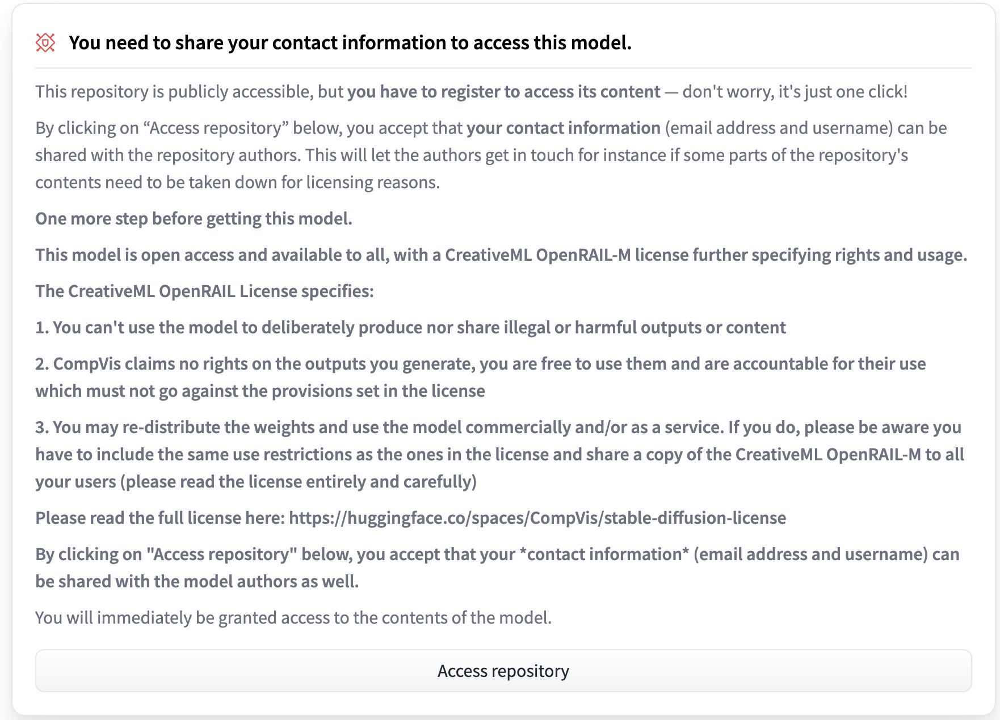

# Stable Diffusion を GPU なしのローカル PC で動かす

## TL;DR

[DALL・E 2](https://openai.com/dall-e-2/)や[Midjourney](https://www.midjourney.com/home/)など、テキストから画像を生成するモデルが話題になっていますが、その中でも[Stable Diffusion](https://github.com/CompVis/stable-diffusion)はオープンソースとしてモデルが公開されています。[Hugging Face](https://huggingface.co/CompVis/stable-diffusion-v1-4)経由で利用ができるため、簡単にローカル PC で動かすことができます。ということで試してみました。

ただ、単純に動かすだけであればサンプルコードをそのまま動かすだけなので、同じように Huggig Face で公開されている翻訳モデルを併用し、日本語で支持したテキストからの画像生成をやってみました。ローカル PC の環境は M1 Mac ですが、M1 チップに最適化されたモデルはまだ公開されていないため、CPU として実行しています。

## 前準備

以下の Stable Diffusion のページにアクセスするとリポジトリへのアクセス確認がされるため、まずは Hugging Face にアカウントを作成してログインし、利用規約に合意します。

-   https://huggingface.co/CompVis/stable-diffusion-v1-4



その後、ローカル PC で以下のコマンドを実行し、Hugging Face で作成したアカウントの Token を入力します。`huggingface-cli`が存在しない場合は、後述の依存パッケージのインストールを実行後に再度実行します。

```bash
huggingface-cli login
```

## 依存パッケージのインストール

```bash
!pip install --upgrade diffusers transformers scipy
!pip install --upgrade sentencepiece
```

## 日本語から英語への翻訳

`source_text`に画像を生成するためのテキストを指定し、Hugging Face で公開されている[staka/fugumt-ja-en](https://huggingface.co/staka/fugumt-ja-en)というモデルを利用して日英翻訳します。

```python
from transformers import pipeline

source_text = 'それは剣と言うには、あまりに大きすぎた。大きく、ぶ厚く、重く、そして大雑把すぎた。それは正に鉄塊だった'

translator = pipeline('translation', model='staka/fugumt-ja-en')
translated = translator(source_text)[0]['translation_text']

print(translated)
```

```
It was too big to say a sword. It was big, thick, heavy, and too big. It was just a mass of iron.
```

## 画像の生成

Stable Diffusion は重めのモデルですので、推論とはいえ CPU で実行するとそこそこ時間がかかります。M1 Max チップの MacBook Pro の場合、1 回の画像生成で 3〜4 分程度の時間がかかります。
以下では 9 個の画像を生成しているため、全体で 30 分ほどかかります。

```python
import torch
from torch import autocast
from diffusers import StableDiffusionPipeline

device = 'cpu' # サンプルコードではcudaになっていますが、GPUがない場合は`cpu`を指定します。


pipe = StableDiffusionPipeline.from_pretrained(
    'CompVis/stable-diffusion-v1-4', use_auth_token=True)
pipe = pipe.to(device)

prompt = translated

images = []
for i in range(9):
    image = pipe(prompt, guidance_scale=7.5)['sample'][0]
    images.append(image)
```

## 画像の表示

```python
import matplotlib.pyplot as plt

fig = plt.figure(figsize=(15, 15))

for i, image in enumerate(images):
    ax = fig.add_subplot(3, 3, i + 1)
    ax.imshow(image)
```


上記の例では 1 個だけ黒い画像となっていますが、画像生成時に以下のログが出力されており、`NSFW(Not Safe For Work)=職場閲覧注意`との理由で黒塗りとなるようです。

```
Potential NSFW content was detected in one or more images. A black image will be returned instead. Try again with a different prompt and/or seed.
```

## 参考文献

-   [Hugging Face - CompVis/stable-diffusion-v1-4](https://huggingface.co/CompVis/stable-diffusion-v1-4)
-   [Hugging Face - staka/fugumt-ja-en](https://huggingface.co/staka/fugumt-ja-en)
