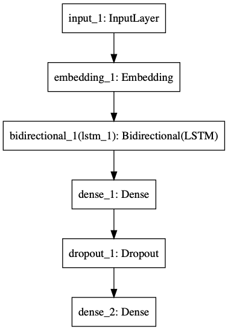
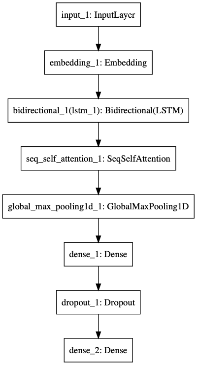

# Self-Attentionを利用したテキスト分類

## TL;DR

テキスト分類問題を対象に、LSTMのみの場合とSelf-Attentionを利用する場合で精度にどのような差がでるのかを比較しました。
結果、テキスト分類問題においても、Self-Attentionを利用することで、LSTMのみを利用するよりも高い精度を得られることが確認できました。

Self-Attentionの実装としては[keras-self-attention](https://github.com/CyberZHG/keras-self-attention)を利用しました。

### ベンチマーク用データ

[京都大学情報学研究科--NTTコミュニケーション科学基礎研究所 共同研究ユニット](http://nlp.ist.i.kyoto-u.ac.jp/kuntt/index.php)が提供するブログの記事に関するデータセットを利用しました。 このデータセットでは、ブログの記事に対して以下の4つの分類がされています。

* グルメ
* 携帯電話
* 京都
* スポーツ

## LSTMのみ利用した場合のモデルと結果

[text-vectorian](https://github.com/lhideki/text-vectorian)を利用してベクトル表現に変換したテキスト入力し、LSTMにより学習、
分類先となる4ラベルの何れに該当するかを推論するモデルです。

### モデル



### クラシフィケーションレポート

F1値は0.76でした。

```
              precision    recall  f1-score   support

          京都       0.71      0.75      0.73       137
        携帯電話       0.80      0.81      0.80       145
        スポーツ       0.68      0.72      0.70        47
         グルメ       0.84      0.72      0.78        90

   micro avg       0.76      0.76      0.76       419
   macro avg       0.76      0.75      0.75       419
weighted avg       0.77      0.76      0.76       419
```

## Self-Attentionを利用した場合のモデルと結果

`LSTMのみを利用した場合のモデル`に`Self-Attention`の層を追加したものです。
`Self-Attention`の出力は入力と同じ(sample, time, dim)の3階テンソルであるため、`GlobalMaxPooling1D`によりShapeを変換しています。

### モデル



### クラシフィケーションレポート

F1値が0.79でした。

```
              precision    recall  f1-score   support

          京都       0.71      0.84      0.77       137
        携帯電話       0.88      0.78      0.83       145
        スポーツ       0.66      0.74      0.70        47
         グルメ       0.88      0.74      0.81        90

   micro avg       0.79      0.79      0.79       419
   macro avg       0.78      0.78      0.78       419
weighted avg       0.80      0.79      0.79       419
```

## 総括

`LSTMのみ`では0.76であったF1値が`Self-Attention`を追加することで3%増加し0.79に向上しました。
それぞれ複数回試しても±1-2%程度の誤差範囲でしたので、`Self-Attention`を追加することは有意であると考えられます。

`Attention`は`NMT(Neural Machine Translation)`のようなシーケンスからシーケンスを推論する問題(seq2seq)への適用が注目されますが、
単純な分類問題にも入出力の形を変えずにそのまま適用出来るため、とりあえず使って見るのは悪く無さそうです。

## 参考文献

* [keras-self-attention](https://github.com/CyberZHG/keras-self-attention)
* [作って理解する Transformer / Attention](https://qiita.com/halhorn/items/c91497522be27bde17ce)