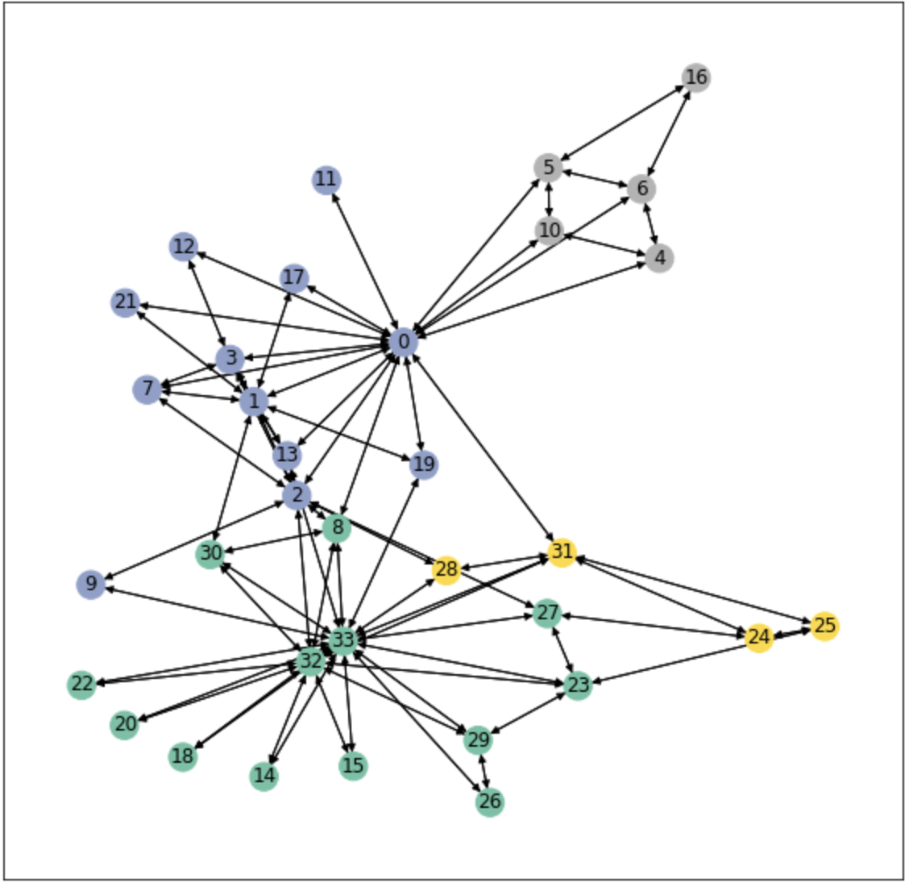
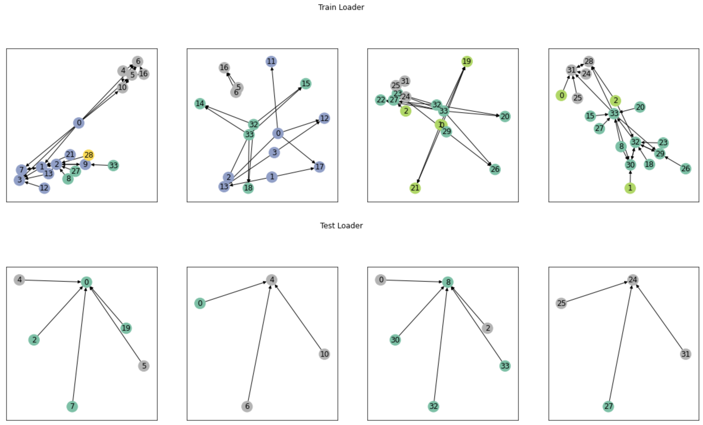
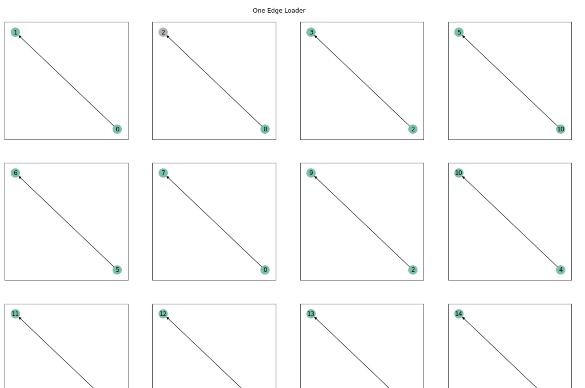
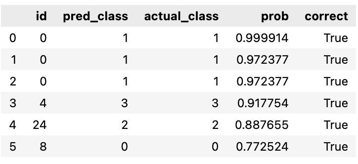

# 1 つのグラフに対し、PyG の Sampler を利用してMini Batchによる学習を行う

## TL;DR

大きな構造のグラフをグラフニューラルネットワークで学習する場合、メモリに乗り切らない可能性があるため、サンプリングして学習する必要があります。

今回、[PyG; pytorch-geometics](https://github.com/pyg-team/pytorch_geometric)のSamplerを利用して、1つのグラフをサブグラフに分割し学習を行ってみました。使用するSamplerは以下の通りです。

* NeighborSampler

データセットはみんな大好きKarateClubを利用しています。ノードが所属するクラスを推論するタスクです。

## データの準備

```python
from torch_geometric.datasets import TUDataset, KarateClub

# dataset = TUDataset(root='/tmp/ENZYMES', name='ENZYMES')
dataset = KarateClub()

assert len(dataset) == 1, f'Graph count is {len(dataset)}. Should be 1.'

data = dataset[0]

print(f'Data shape is "{data}".')
```

```python
import matplotlib.pyplot as plt
import networkx as nx
from torch_geometric.utils import to_networkx


def visualize_graph(G, color, labels, ax):
    nx.draw_networkx(G, pos=nx.spring_layout(G, seed=42),
                     labels=labels, node_color=color, cmap='Set2', ax=ax)


labels = {i: i for i in range(len(data.x))}

fig = plt.figure(figsize=(10, 10))
ax = fig.add_subplot((111))
visualize_graph(to_networkx(data), data.y, labels, ax=ax)
```

ノードの色は各ノードのクラスを表しています。



## Samplerによるサブグラフの抽出

`NeighborSampler`は近傍のノードをどこまで探索するかを指定します。`sizes`では対象となるノードから探索対象とするエッジの数を指定します。`batch_size`は一度の学習で使用するサブグラフの数です。

以下の`train_loader`では`sizes`に`[5]`、`batch_size`に`8`を指定しているので、1つのノードで最大5個のエッジを探索し、それらを8個纏めて学習するための準備をしています。

`test_loader`はサブグラフを1個ずつ推論するために、`batch_size`を`1`にしています。

```python
from torch_geometric.loader import NeighborSampler
import numpy as np
import torch
from torch_geometric.data import Data

print(f'Train count is {torch.count_nonzero(~data.train_mask)}.')
print(f'Test count is {torch.count_nonzero(data.train_mask)}.')
train_loader = NeighborSampler(
    edge_index=data.edge_index, node_idx=~data.train_mask, sizes=[5], batch_size=8)
test_loader = NeighborSampler(
    edge_index=data.edge_index, node_idx=data.train_mask, sizes=[5], batch_size=1)

def visualize_loader(loader, fig, rows=2):
    for i, info in enumerate(loader):
        (batch_size, n_id, adjs) = info
        _data = Data(x=data.x[n_id], edge_index=adjs.edge_index, y=data.y[n_id])
        _labels = {i: labels[id] for i, id in enumerate(n_id.tolist())}
        ax = fig.add_subplot(rows, 4, i + 1)
        visualize_graph(to_networkx(_data), _data.y, _labels, ax)

print(f'Sample count is {len(train_loader)}.')

fig = plt.figure(figsize=(20, 10))
fig.suptitle('Train Loader')
visualize_loader(train_loader, fig)

fig = plt.figure(figsize=(20, 10))
fig.suptitle('Test Loader')
visualize_loader(test_loader, fig)
```

Train/Testの分割はデータセットに元々付与されているmaskを使用します。学習対象となるノード数は30、テスト対象は4です。今回のNeighborSampler指定では隣接しているノードを含めてサブグラフを形成するため、サブグラフ間でノードに重複があります。

なお、以下の可視化ではクラス数がサブグラフによって異なるため、前述のデータセット全体を可視化した場合と同じクラスでも色が異なる点は注意です。

```
Train count is 30.
Test count is 4.
Sample count is 4.
```



## sizesを1にした場合

`sizes`を1にした場合、1つのエッジしか探索しないことが確認できます。以下ではわかりやすいように`batch_size`も1にして表示しています。

```python
one_edge_loader = NeighborSampler(
    edge_index=data.edge_index, node_idx=~data.train_mask, sizes=[1], batch_size=1)

fig = plt.figure(figsize=(20, 40))
fig.suptitle('One Edge Loader', y=.89)
visualize_loader(one_edge_loader, fig, rows=8)
```



## モデルの準備

```python
import torch
import torch.nn.functional as F
from torch_geometric.nn import GCNConv


class GCN(torch.nn.Module):
    def __init__(self, num_features, num_classes):
        super().__init__()
        self.conv1 = GCNConv(num_features, 32)
        self.conv2 = GCNConv(32, num_classes)

    def forward(self, x, adjs):
        x, edge_index = x, adjs.edge_index

        x = self.conv1(x, edge_index)
        x = F.relu(x)
        x = F.dropout(x, training=self.training)
        x = self.conv2(x, edge_index)

        return F.log_softmax(x, dim=1)

print(GCN(dataset.num_node_features, dataset.num_classes))
```

```
GCN(
  (conv1): GCNConv(34, 32)
  (conv2): GCNConv(32, 4)
)
```

## トレーニング

```python
device = torch.device('cuda' if torch.cuda.is_available() else 'cpu')
model = GCN(dataset.num_node_features, dataset.num_classes).to(device)
optimizer = torch.optim.Adam(model.parameters(), lr=0.01, weight_decay=5e-4)

data_x = data.x.to(device)
data_y = data.y.squeeze().to(device)


def train(data_x, data_y, loader):
    model.train()
    losss = []
    accs = []
    for batch_size, n_id, adjs in loader:
        adjs = adjs.to(device)

        optimizer.zero_grad()
        out = model(data_x[n_id], adjs)
        loss = F.nll_loss(out, data_y[n_id])
        loss.backward()
        optimizer.step()

        correct = int(out.argmax(dim=-
                                 1).eq(data_y[n_id]).sum())
        acc = correct / n_id.size(0)

        losss.append(float(loss))
        accs.append(acc)

    loss = np.mean(losss)
    acc = np.mean(accs)

    return loss, acc


for epoch in range(30):
    loss, acc = train(data_x, data_y, train_loader)
    print(f'Epoch {epoch:02d}, Loss: {loss:.4f}, Approx. Train: {acc:.4f}')

```

```
Epoch 00, Loss: 1.3591, Approx. Train: 0.3191
Epoch 01, Loss: 1.2152, Approx. Train: 0.6097
Epoch 02, Loss: 1.1314, Approx. Train: 0.6528
Epoch 03, Loss: 1.0670, Approx. Train: 0.6076
Epoch 04, Loss: 0.9873, Approx. Train: 0.7023
Epoch 05, Loss: 0.8618, Approx. Train: 0.8038
[省略]
Epoch 27, Loss: 0.2035, Approx. Train: 0.9316
Epoch 28, Loss: 0.1730, Approx. Train: 0.9549
Epoch 29, Loss: 0.0840, Approx. Train: 0.9853
```

## テスト

```python
import pandas as pd

@torch.no_grad()
def test(data_x, loader):
    model.eval()

    preds = []
    for batch_size, n_id, adjs in loader:
        adjs = adjs.to(device)

        out = model(data_x[n_id], adjs)

        preds.append(dict(zip(n_id, out)))

    return preds


test_ids = data.train_mask.nonzero().squeeze().tolist()
preds = test(data_x, test_loader)
rets = []

for pred in preds:
    for k, v in pred.items():
        if k in test_ids:
            rets.append({
                'id': k.numpy(),
                'pred_class': v.argmax(-1).numpy(),
                'actual_class': data_y[k].numpy(),
                'prob': np.exp(v.numpy().max()),
                'correct': v.argmax(-1).numpy() == data_y[k].numpy()
            })

rets_df = pd.DataFrame(rets).sort_values(by='prob', ascending=False).reset_index(drop=True)
display(rets_df)
```

テスト時もサブグラフ間でノードの重複があるため、テスト用のノードが複数回推論されます。



## 参考文献

* [PYG DOCUMENTATION](https://pytorch-geometric.readthedocs.io/en/latest/index.html)