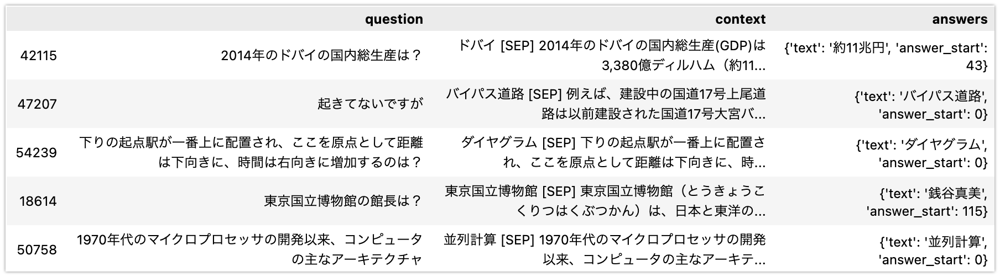
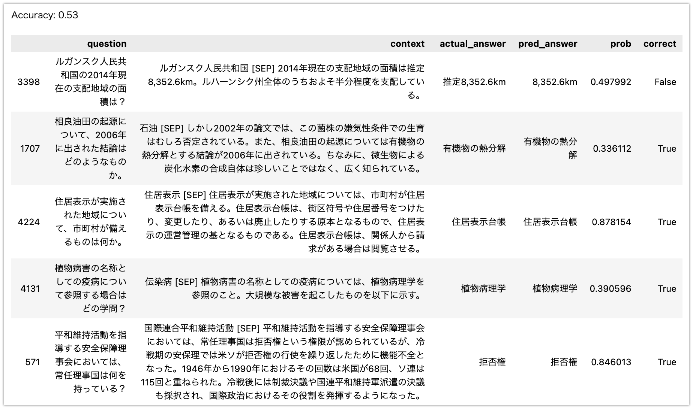

# Huggingface で公開されている日本語モデルを使って QA タスクをファインチューニングする

## TL;DR

Huggingface で公開されている事前学習済み日本語モデルを利用し、Question-Answering タスク用のデータセットでファインチューニングする際のサンプルコードです。

Question-Answering タスク用のデータセットは[JGLUE](https://github.com/yahoojapan/JGLUE)の`JSQuAD`を利用しています。

JSQuAD は以下のようなデータセットです。



事前学習モデル済み日本語モデルは以下を利用しています。

-   [ku-nlp/deberta-v2-base-japanese](https://huggingface.co/ku-nlp/deberta-v2-base-japanese)

### 2023/01/21: Tokenizer の使い方を修正しました

Qiita の方で`ku-nlp/deberta-v2-base-japanese`の Tokenizer の使い方が意図されたものではないとの御指摘をいただきました。具体的な使い方も提示いただき、記事に反映させています。[@KoichiYasuoka](https://qiita.com/hideki/items/394f120d8eea030cb552)さん、ありがとうございました。

意図した Tokenizer の使い方をすると、QA タスクの性能が改善されることを確認しています。以下は、3000 サンプルでの評価結果です(コードでは Accuracy としていますが正確には Exact Match となっています)。`ku-nlp/deberta-v2-base-japanese`を利用する際には、モデル ID から AutoTokenizer で取得した Tokenizer をそのまま利用するのではなく、PreTokenizer として juman++を使う形に変更することが必要という点にご注意ください。

-   修正前: 0.627
-   修正後: 0.703

## Juman++をインストールする

[ku-nlp/deberta-v2-base-japanese](https://huggingface.co/ku-nlp/deberta-v2-base-japanese)に書いてあるように、[ku-nlp/deberta-v2-base-japanese](https://huggingface.co/ku-nlp/deberta-v2-base-japanese)を使う場合は Tokenizer に入力する前に Juman++で分かち書きせよとのことです。Juman++は 1 系ではなく`v2.0.0-rc3`を使っているとあるため、以下のコードで Juman++の 2 系をインストールします。

これは Google Colab での実行例ですが、M1 Mac で Juman++の 2 系をコンパイルする場合は[Juman++ V2 を m1 mac にインストール](https://qiita.com/percipere/items/f5aa1d744724a4ae93c0)が参考になると思います。

```python
!test -d jumanpp-2.0.0-rc3 || curl -L https://github.com/ku-nlp/jumanpp/releases/download/v2.0.0-rc3/jumanpp-2.0.0-rc3.tar.xz | tar xJf -
!test -x /usr/local/bin/jumanpp || ( mkdir jumanpp-2.0.0-rc3/build && cd jumanpp-2.0.0-rc3/build && cmake .. -DCMAKE_BUILD_TYPE=Release && make install )
```

```python
!jumanpp --version
```

## モジュールを準備する

```python
!pip install -U pip
!pip install pandas
!pip install transformers
!pip install torch torchvision torchaudio
!pip install datasets
!pip install pytextspan
```

## データセットを読み込む

JGLUE の JSQuAD は`data`配下に準備してある前提です。

```python
import pandas as pd
import json
import numpy as np

train_filename = 'data/jsquad-v1.0/train-v1.0.json'
test_filename = 'data/jsquad-v1.0/valid-v1.0.json'

# JSQuADはSQuADと同じ形式であるため、SQuADからDataFrameに変換するコードを利用できます。
# https://www.kaggle.com/code/sanjay11100/squad-stanford-q-a-json-to-pandas-dataframe
def squad_json_to_dataframe_train(input_file_path, record_path=['data', 'paragraphs', 'qas', 'answers']):
    file = json.loads(open(input_file_path).read())
    m = pd.io.json.json_normalize(file, record_path[:-1])
    r = pd.io.json.json_normalize(file, record_path[:-2])

    # combining it into single dataframe
    idx = np.repeat(r['context'].values, r.qas.str.len())
    m['context'] = idx
    m['answers'] = m['answers'].apply(lambda x: x[0])

    return m[['question', 'context', 'answers']]


train_df = squad_json_to_dataframe_train(train_filename).sample(1000) # 全データで学習すると時間がかかるため1000だけ抽出しています。
test_df = squad_json_to_dataframe_train(test_filename).sample(100) # 評価用として100だけ取り出しています。

display(train_df)
display(test_df)
```

## 事前学習モデルを準備する

モデル ID で取得した Tokenizer をそのまま使用するのではなく、PreTokenizer を置き換えます。この影響でモデルの Save がそのままではできなくなります。現状の回避策は以下を参照ください。

-   [日本語で Hugging Face Tokenizers を動かす](https://tech.mntsq.co.jp/entry/2021/02/26/120013)

```python
model_ckpt = 'ku-nlp/deberta-v2-base-japanese'

model = AutoModelForQuestionAnswering.from_pretrained(model_ckpt)
tokenizer = DebertaV2TokenizerFast.from_pretrained(model_ckpt)
class JumanppPreTokenizer(JumanppTokenizer):
    def jumanpp_split(self, i, normalized_string):
        t = str(normalized_string)
        k = self.tokenize(t)

        return [normalized_string[s:e] for c in textspan.get_original_spans(k,t) for s,e in c]
    def pre_tokenize(self, pretok):
        pretok.split(self.jumanpp_split)
tokenizer._tokenizer.pre_tokenizer = Sequence([PreTokenizer.custom(JumanppPreTokenizer()), Metaspace()])
```

## データ形式を変換する

`max_length`はモデルが許容できる最大の sequence サイズを指定します。

```python
max_length = 512  # The maximum length of a feature (question and context)
doc_stride = (
    0  # The authorized overlap between two part of the context when splitting
)

# Huggingfaceのチュートリアルで提示されているコードで学習用のデータ形式に変換します。
# https://huggingface.co/docs/transformers/tasks/question_answering
def prepare_train_features(examples):
    #
    # Tokenize our examples with truncation and padding, but keep the overflows using a
    # stride. This results in one example possible giving several features when a context is long,
    # each of those features having a context that overlaps a bit the context of the previous
    # feature.
    examples['question'] = [q.strip() for q in examples['question']]
    examples['context'] = [c.strip() for c in examples['context']]
    inputs = tokenizer(
        text=examples['question'],
        text_pair=examples['context'],
        truncation='only_second',
        max_length=max_length,
        stride=doc_stride,
        return_offsets_mapping=True,
        padding='max_length',
    )

    offset_mapping = inputs.pop('offset_mapping')
    answers = examples['answers']
    start_positions = []
    end_positions = []

    for i, offset in enumerate(offset_mapping):
        answer = answers[i]
        start_char = answer['answer_start']
        end_char = answer['answer_start'] + len(answer['text'])
        sequence_ids = inputs.sequence_ids(i)

        # Find the start and end of the context
        idx = 0
        while sequence_ids[idx] != 1:
            idx += 1
        context_start = idx
        while sequence_ids[idx] == 1:
            idx += 1
        context_end = idx - 1

        # If the answer is not fully inside the context, label it (0, 0)
        if offset[context_start][0] > end_char or offset[context_end][1] < start_char:
            start_positions.append(0)
            end_positions.append(0)
        else:
            # Otherwise it's the start and end token positions
            idx = context_start
            while idx <= context_end and offset[idx][0] <= start_char:
                idx += 1
            start_positions.append(idx - 1)

            idx = context_end
            while idx >= context_start and offset[idx][1] >= end_char:
                idx -= 1
            end_positions.append(idx + 1)

    inputs['start_positions'] = start_positions
    inputs['end_positions'] = end_positions

    return inputs
```

```python
from datasets import Dataset

train_dataset = Dataset.from_pandas(train_df)
test_dataset = Dataset.from_pandas(test_df)
```

```python
tokenized_train_dataset = train_dataset.map(
    prepare_train_features,
    batched=True,
    remove_columns=train_dataset.column_names,
    num_proc=3,
)
tokenized_test_dataset = test_dataset.map(
    prepare_train_features,
    batched=True,
    remove_columns=test_dataset.column_names,
    num_proc=3,
)
```

## トレーニングする

```python
from transformers import DefaultDataCollator

data_collator = DefaultDataCollator()
```

```python
import os

os.environ['WANDB_DISABLED'] = 'true'

training_args = TrainingArguments(
    output_dir='./outputs',
    evaluation_strategy='epoch',
    learning_rate=2e-5,
    per_device_train_batch_size=8,
    per_device_eval_batch_size=8,
    num_train_epochs=3,
    save_strategy='no', # Custom PreTokenizerはそのままでは保存できないので、ここでは簡易のために保存しないようにします。
    weight_decay=0.01,
)

trainer = Trainer(
    model=model,
    args=training_args,
    train_dataset=tokenized_train_dataset,
    eval_dataset=tokenized_test_dataset,
    tokenizer=tokenizer,
    data_collator=data_collator,
)

trainer.train()
```

## 推論して評価する

```python
from transformers import pipeline

pipe = pipeline('question-answering', model=trainer.model,
                tokenizer=trainer.tokenizer)
```

pipeline で推論する際に`align_to_words=False`を指定するのは注意事項です。なお、`transformers==4.25.1`未満の場合`align_to_words=False`が機能しない事象を確認しているため、transformers のバージョンも注意が必要です。

```python
def predict(row):
    ret_df = pd.DataFrame()
    ret = pipe(question=row['question'], context=row['context'],
               top_k=1, handle_impossible_answer=False,  align_to_words=False)

    return ret['answer'], ret['score']


pred_df = test_df[['question', 'context', 'answers']].copy()
pred_df['actual_answer'] = pred_df['answers'].apply(lambda x: x['text'])
pred_df[['pred_answer', 'prob']] = pred_df.apply(
    predict, axis=1, result_type='expand')
pred_df = pred_df.drop('answers', axis=1)
pred_df['correct'] = pred_df.apply(
    lambda row: row['pred_answer'] == row['actual_answer'], axis=1)
```

```python
pd.set_option('display.max_colwidth', 300)

print(f'Accuracy: {len(pred_df[pred_df.correct]) / len(pred_df)}')
display(pred_df)
```



## 参考文献

-   [yasuoka の日記: ku-nlp/deberta-v2-base-japanese のトークナイザを DebertaV2TokenizerFast のままで Juman++に繋ぐには](https://srad.jp/~yasuoka/journal/659674/)
-   [日本語で Hugging Face Tokenizers を動かす](https://tech.mntsq.co.jp/entry/2021/02/26/120013)
-   [Juman++ V2 を m1 mac にインストール](https://qiita.com/percipere/items/f5aa1d744724a4ae93c0)
