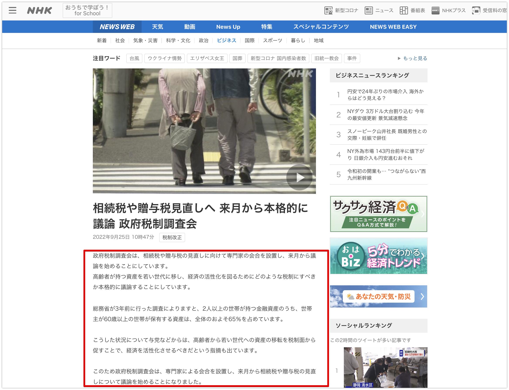

# OpenAI Whisper を使って音声から文書の要約を行ってみる

## TL;DR

話題の[OpenAI - Whisper](https://github.com/openai/whisper)で文字起こしをやっていました。単純に試すだけなら色々な記事がでているので、音声入力から文書要約までを行ってみました。以下のようなワークフローです。全てGoogle Colab上で実行しています。

1. ブラウザ経由で音声を録音
2. whisperで書き起こしと共に英語へ翻訳
3. 英語の要約モデルで要約
4. 英日翻訳モデルで日本語に翻訳


https://github.com/openai/whisper

## モジュールのロード

```python
!pip install git+https://github.com/openai/whisper.git
!pip install sentencepiece
```

## その場で発話して書き起こす

Google Colab 上でマイクから音声を入力して、書き起こす場合の例です。ブラウザの機能でマイクから音声を拾っています。以下の記事からの引用です。

-   [Google Colab 上で音声を録音するサンプル](https://gist.github.com/tam17aki/8bfa2a42dab0061ee2641aed32dd1d30)

```python
from IPython.display import Javascript
from google.colab import output
from base64 import b64decode

RECORD = """
const sleep = time => new Promise(resolve => setTimeout(resolve, time))
const b2text = blob => new Promise(resolve => {
  const reader = new FileReader()
  reader.onloadend = e => resolve(e.srcElement.result)
  reader.readAsDataURL(blob)
})
var record = time => new Promise(async resolve => {
  stream = await navigator.mediaDevices.getUserMedia({ audio: true })
  recorder = new MediaRecorder(stream)
  chunks = []
  recorder.ondataavailable = e => chunks.push(e.data)
  recorder.start()
  await sleep(time)
  recorder.onstop = async ()=>{
    blob = new Blob(chunks)
    text = await b2text(blob)
    resolve(text)
  }
  recorder.stop()
})
"""

def record(sec, filename='audio.wav'):
  display(Javascript(RECORD))
  s = output.eval_js('record(%d)' % (sec * 1000))
  b = b64decode(s.split(',')[1])
  with open(filename, 'wb+') as f:
    f.write(b)
```

以下のコードを実行すると 5 秒間録音し、入力された音声からテキストの書き起こしを行います。

```python
import whisper

audiofile = 'audio.wav'
second = 5
print(f'Speak to your microphone {second} sec...')
record(second, audiofile)
print('Done!')

model = whisper.load_model('medium')

# load audio and pad/trim it to fit 30 seconds
audio = whisper.load_audio(audiofile)
audio = whisper.pad_or_trim(audio)

# make log-Mel spectrogram and move to the same device as the model
mel = whisper.log_mel_spectrogram(audio).to(model.device)

# detect the spoken language
_, probs = model.detect_language(mel)
print(f'Detected language: {max(probs, key=probs.get)}')

# decode the audio
options = whisper.DecodingOptions()
result = whisper.decode(model, mel, options)

# print the recognized text
print(result.text)
```

入力した音声です。

<figure>
    <audio controls src="short.wav">
    </audio>
</figure>

whisper で書き起こした結果は以下のとおりです。音声が途中で途切れていますが、それっぽく補完されており、言語の検出も正しく行われています。

> Detected language: ja
>
> 今から5秒間話します。かなり早口ですけれども、これで聞き取りができるんでしょうか?書き取りができるんでしょうか?

## 音声から文書を要約する

以下のニュース記事を読み上げた音声を用意します。


* https://www3.nhk.or.jp/news/html/20220925/k10013836011000.html

利用する要約モデルの関係から、whisperのタスクとして英語への翻訳(`task=translate`)までを行っています。

```python
import whisper

audiofile = 'audio.wav'
second = 50
print(f'Speak to your microphone {second} sec...')
record(second, audiofile)
print('Done!')

model = whisper.load_model('medium')

# load audio and pad/trim it to fit 30 seconds
audio = whisper.load_audio(audiofile)
audio = whisper.pad_or_trim(audio)

# make log-Mel spectrogram and move to the same device as the model
mel = whisper.log_mel_spectrogram(audio).to(model.device)

# detect the spoken language
_, probs = model.detect_language(mel)
print(f'Detected language: {max(probs, key=probs.get)}')

# decode the audio
options = whisper.DecodingOptions(task='translate')
result = whisper.decode(model, mel, options)

# print the recognized text
print(result.text)
```

50秒間録音した音声です。

<figure>
    <audio controls src="long.wav">
    </audio>
</figure>

以下で英語テキストの要約を行います。

```python
from transformers import AutoTokenizer, AutoModelForSeq2SeqLM
from transformers import pipeline
import json

model_name = 'sshleifer/distilbart-cnn-12-6'

tokenizer = AutoTokenizer.from_pretrained(model_name)
model = AutoModelForSeq2SeqLM.from_pretrained(model_name)
nlp = pipeline('summarization', model=model, tokenizer=tokenizer)

summary_text = nlp(result.text, truncation=True, max_length=128, min_length=32, do_sample=True)[0]['summary_text']
print(summary_text)
```

要約された結果を日本語に戻します。

```python
translator = pipeline('translation', model='staka/fugumt-en-ja')
translated = translator(summary_text)[0]['translation_text']

print(translated)
```

要約結果は以下のとおりです。

> 税務・税務調査は、税務・脱税税の見直しを目的として設置されており、高齢者の資産を若い世代に移転し、経済の活性化を測定するためにどのような税金を使用するべきかを議論します。

## 参考文献

-   [OpenAI - Whisper](https://github.com/openai/whisper)
-   [Google Colab 上で音声を録音するサンプル](https://gist.github.com/tam17aki/8bfa2a42dab0061ee2641aed32dd1d30)
