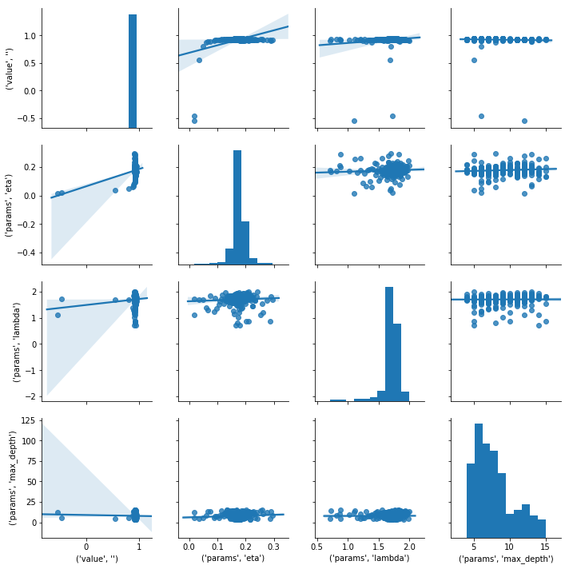

# XGBoostをOptunaでパラメータチューニングする

## TL;DR

[XGBoost](https://xgboost.readthedocs.io/en/latest/parameter.html)のパラメータを[Optuna](https://github.com/optuna/optuna)でチューニングします。
ベンチマーク用データとしては[ボストン住宅価格データセット](https://scikit-learn.org/stable/modules/generated/sklearn.datasets.load_boston.html)を使用します。

## データ準備

[scikit-learn](https://scikit-learn.org/stable/)の`datasets`を使ってデータをロードします。
学習データとテストデータの分割は8:2です。

```python
from sklearn import datasets

features, labels = datasets.load_boston(return_X_y =True)
```

```python
from sklearn import model_selection

train_features, test_features, train_labels, test_labels = model_selection.train_test_split(features, labels, test_size=0.2)
```

```python
print(train_features.shape)
print(train_labels.shape)
print(test_features.shape)
print(test_labels.shape)
```

```
> (404, 13)
> (404,)
> (102, 13)
> (102,)
```

```python
import xgboost as xgb

trains = xgb.DMatrix(train_features, label=train_labels)
tests = xgb.DMatrix(test_features, label=test_labels)
```

## ハイパーパラメータ最適化

Optunaでパラメータチューニングを行います。チューニング対象は以下としています。

* eta・・・学習率
* max_depth・・・木の深さ
* lambda・・・L2正則化項のペナルティ

目的はR2(決定係数)を使用します。R2は大きい方が性能が高いことを表すため`direction`を`maximize`にしています。

```python
base_params = {
    'booster': 'gbtree',
    'objective': 'reg:squarederror',
    'eval_metric': 'rmse',
}

watchlist = [(trains, 'train'), (tests, 'eval')]
```

```python
import optuna
from sklearn.metrics import r2_score
import copy

tmp_params = copy.deepcopy(base_params)

def optimizer(trial):
#     booster = trial.suggest_categorical('booster', ['gbtree', 'dart', 'gblinear'])
    eta = trial.suggest_uniform('eta', 0.01, 0.3)
    max_depth = trial.suggest_int('max_depth', 4, 15)
    __lambda = trial.suggest_uniform('lambda', 0.7, 2)

#     params['booster'] = booster
    tmp_params['eta'] = eta
    tmp_params['max_depth'] = max_depth
    tmp_params['lambda'] = __lambda

    model = xgb.train(tmp_params, trains, num_boost_round=50)
    predicts = model.predict(tests)

    r2 = r2_score(test_labels, predicts)
    print(f'#{trial.number}, Result: {r2}, {trial.params}')

    return r2
```

```python
study = optuna.create_study(direction='maximize')
study.optimize(optimizer, n_trials=500)
```

```
> #0, Result: 0.9153797234954849, {'eta': 0.21541259325117842, 'max_depth': 4, 'lambda': 1.7243766588775653}
> [I 2019-12-14 23:49:43,636] Finished trial#0 resulted in value: 0.9153797234954849. Current best value is 0.9153797234954849 with parameters: {'eta': 0.21541259325117842, 'max_depth': 4, 'lambda': 1.7243766588775653}.
> #1, Result: 0.9277796354008809, {'eta': 0.1678675361241897, 'max_depth': 7, 'lambda': 1.9228108973855251}
> [I 2019-12-14 23:49:43,734] Finished trial#1 resulted in value: 0.9277796354008809. Current best value is 0.9277796354008809 with parameters: {'eta': 0.1678675361241897, 'max_depth': 7, 'lambda': 1.9228108973855251}.
> #2, Result: 0.8903499007997161, {'eta': 0.07375873958103377, 'max_depth': 13, 'lambda': 1.841310013076201}
> [I 2019-12-14 23:49:43,856] Finished trial#2 resulted in value: 0.8903499007997161. Current best value is 0.9277796354008809 with parameters: {'eta': 0.1678675361241897, 'max_depth': 7, 'lambda': 1.9228108973855251}.
[省略]
> #499, Result: 0.9350409121311861, {'eta': 0.146374389194902, 'max_depth': 8, 'lambda': 1.731254194217149}
> [I 2019-12-14 23:51:08,655] Finished trial#499 resulted in value: 0.9350409121311861. Current best value is 0.9477310818026083 with parameters: {'eta': 0.16519267749243557, 'max_depth': 7, 'lambda': 1.72021507963037}.
```

以下が探索された中でベストのパラメータです。

```python
study.best_params
```

```
> {'eta': 0.16519267749243557, 'max_depth': 7, 'lambda': 1.72021507963037}
```

以下はSeabornのPairplotで表示したパラメータ間の相関です。

```python
%matplotlib inline
import seaborn as sns

study_df = study.trials_dataframe()[['value', 'params']]
sns.pairplot(study_df, kind='reg')
```



## 見つけたパラメータでモデル作成

最適化されたパラメータを使用して学習します。

```python
from sklearn.metrics import r2_score

def eval_model(params, trains, tests):
    model = xgb.train(params, trains, num_boost_round=100, verbose_eval=False, evals=watchlist)
    predicts = model.predict(tests)
    r2 = r2_score(test_labels, predicts)

    return r2
```

```python
base_r2 = eval_model(base_params, trains, tests)

merged_params = dict(base_params, **study.best_params)
best_r2 = eval_model(merged_params, trains, tests)

print(f'Base params: {base_params}')
print(f'Best params: {merged_params}')
print(f'Base: {base_r2}, Best: {best_r2}, Diff: {best_r2 - base_r2}')
```

```
> Base params: {'booster': 'gbtree', 'objective': 'reg:squarederror', 'eval_metric': 'rmse'}
> Best params: {'booster': 'gbtree', 'objective': 'reg:squarederror', 'eval_metric': 'rmse', 'eta': 0.16519267749243557, 'max_depth': 7, 'lambda': 1.72021507963037}
> Base: 0.8937800621867638, Best: 0.94643405613549, Diff: 0.052653993948726274
```

## まとめ

Optunaによりハイパーパラメータを探索することで以下の様に改善する事ができました。

* デフォルト: 0.89
* 最適化後: 0.95
* 改善値: 0.05

## 参考文献

* [XGBoost](https://xgboost.readthedocs.io/en/latest/parameter.html)
* [Optuna](https://github.com/optuna/optuna)