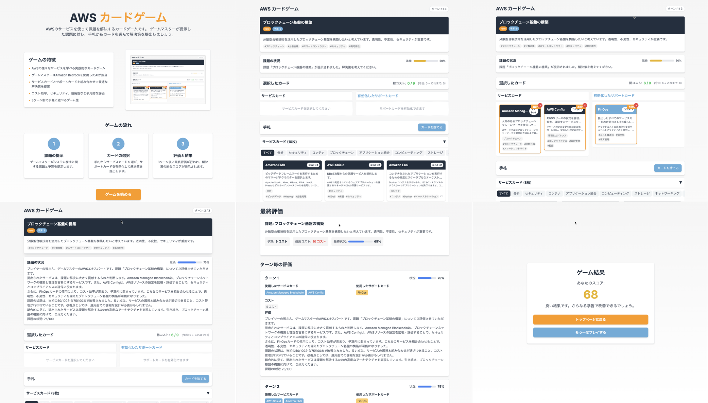

# Amazon Q CLIでゲームを作ってAppRunnerでホスティングする

Amazon Q CLIを使って簡単なカードゲームを作成し、AppRunnerでホスティングする方法です。本記事は以下のキャンペーン目的ですが、ゲームを作るというのはAIエージェントでできることを体験するのに良い方法だと思います。

* [Amazon Q CLI でゲームを作ろう Tシャツキャンペーン](https://aws.amazon.com/jp/blogs/news/build-games-with-amazon-q-cli-and-score-a-t-shirt/)

今回作成したのは以下のようなカードゲームです。ゲーム部分だけではなくカード情報やIaC、README.mdなども含め全てAmazon Q CLIで自動生成しています。



以下でデモンストレーションを動かしています。気になる方はぜひ遊んでみてください。なお、個人の環境で動かしていますので、コストによっては停止する可能性があります。その点はご了承ください。

* https://mm7ku5pc2n.ap-northeast-1.awsapprunner.com/

上記が停止している場合や、生成されたコードが気になる方は、以下のGitHubリポジトリからコードを確認できます。

* [aws-card-game](https://github.com/lhideki/aws-card-game)

## Amazon Q CLIをインストールする

以下を参考に、Amazon Q CLIをインストールします。

* [コマンドライン用の Amazon Q をインストールする](https://docs.aws.amazon.com/ja_jp/amazonq/latest/qdeveloper-ug/command-line-installing.html)

MacOSの場合はbrewを使ってインストールすると簡単です。

```bash
brew install amazon-q
```

インストールしただけではコマンドラインか利用できないので、MacOSのランチャーで以下のアプリを実行して初期設定を行います。

* /Applications/Amazon Q.app

## Amazon Q CLIにMCP Serverを設定する

今回作成するゲームはAWSサービス使って課題を解決するというものです。AWSサービスの情報を表現したカードの情報を生成する際に、MCP Serverを利用してAWS公式ドキュメントの情報を参照するようにします。Amazon Q CLIが使用するモデルの知識だけでも十分のような気もしますが、新しいサービスや機能が追加された場合に、MCP Serverを利用することで最新の情報を参照できるようにします。

Amazon Q CLIにMCP Serverを設定するには、以下の設定ファイルを作成するだけです。 [AWS Documentation MCP Server](https://github.com/awslabs/mcp/tree/main/src/aws-documentation-mcp-server) を指定しています。

* ~/.aws/amazonq/mcp.json

```json
{
  "mcpServers": {
    "awslabs.aws-documentation-mcp-server": {
      "command": "uvx",
      "args": [
        "awslabs.aws-documentation-mcp-server@latest"
      ],
      "env": {
        "FASTMCP_LOG_LEVEL": "ERROR"
      },
      "disabled": false,
      "autoApprove": [
        "read_documentation"
      ]
    }
  }
}
```

上記のファイルを作成後に、 `q chat` 起動後に以下のコマンドでMCP Serverが起動していることを確認します。

```
/mcp
```

## 初期プロンプトをAmazon Q CLIに与える

次に初期プロンプトをAmazon Q CLIに与えます。後述の初期プロンプトを以下のファイル名で保存します。

* initial-prompt.md

同じディレクトリで `q chat` を実行し、以下の指示で初期プロンプトによる実装を依頼します。

```
initial-prompt.md の内容をもとに、カードゲームの実装を行ってください。
```

後は30分くらい待つだけです。以下は別撮りですが、Amazon Q CLIがコードを生成している様子です。


## Tips

### Amazon Q CLIに複数行の指示を与える

Amazon Q CLIはコマンドラインで指示をしますが、改行の段階でLLMが応答を生成してしまうため、そのままではエラーメッセージなどのように改行を含む内容を与えることができません。そのような場合は `/editor` コマンドを使うことで複数行の指示を与えることができます。

```
/editor
```

## 初期プロンプトの内容

初期プロンプトの内容(initial-prompt.md)の内容は以下。とおりです。

```markdown
カードゲームを作成してください。ゲームのルールは以下のとおりです。

# ゲームの目的

ゲームマスターが提示したシステム構成に関する課題に対し、プレイヤーは自分の手札から解決策になるカードを提出することで、課題を解決することを目指すゲームです。

# ゲームルール

* 一人用のゲームです。
* プレイヤーは最初に10枚のサービスカードが手札として配られます。
* また、プレイヤーはサポートカードを5枚持っています。
* ゲームマスターはシステム構成に関する課題を最初に1つ提示します。課題に解決の予算(コスト)も提示します。
* プレイヤーは3ターンの間に、課題を解決することを目指します。カードを提出することで課題の状況を改善し、最終的に課題を解決することが目標です。
* プレイヤーは手札からカード(サービスカード)を選び、課題に対する解決策として提出します。提出したカードは手札から除外されます。
* サービスカードは1度に3枚まで選択することができます。
* プレイヤーは直接課題を解決するサービスカードの他に、サポートカードを有効化することがで来ます。有効化したサポートカードは消費されません。
* カードにはコストが設定されており、サービスカードとサポートカードは使用するとコストを消費します。最初に課題と共に提示されたコスト内で解決策を提出する必要があります。
* ゲームマスターはプレイヤーが提出したカードをターン毎に評価し、課題の状況の変化をプレイヤーにフィードバックします。
* ゲームマスターが最初に提示したコストを超えてカードを提出することもできますが、評価は低くなります。
* プレイヤーは自分のターンでサービスカードを任意の枚数選んで捨てることができます。捨てたカードの枚数に応じて、次のターンで引くカードの枚数が増えます。
* プレイヤーは自分のターンをスキップすることがでます。スキップした場合、課題の状況が若干悪化します。
* 捨てることができるカードはサービスカードのみで、サポートカードは捨てることができません。

# 課題と配布されるカードの関係

* 課題とカードにはキーワード(ハッシュタグ)が設定されています。
* プレイヤーに配られるカードは、課題のキーワードに関連するものが優先的に選ばれます。

# 課題の例

* 新しく会社のホームページを公開したいと考えています。最小限のコストで公開するためのシステム構成を考えてください。
* 会社の業務システムをクラウドに移行したいと考えています。セキュリティを重視したシステム構成を考えてください。
* 業務の進捗状況を確認するためのダッシュボードを作成したいと考えています。業務システムからデータを収集し、可視化して一般ユーザに提供するためのシステム構成を考えてください。
* マイクロサービスアーキテクチャを構築し、柔軟なスケーリングと独立したデプロイを実現したいと考えています。
* ディザスタリカバリ環境を構築し、災害や障害発生時にもサービスを継続できるようにしたいと考えています。

# カードの例

## EC2

* タイプ: サービスカード
* コスト: 3
* 効果: 仮想サーバーを提供し、アプリケーションをホストすることができます。
* 説明: AWSの仮想サーバーサービスで、アプリケーションをホストするための柔軟な環境を提供します。
* カテゴリ: コンピューティング
* キーワード: ['コンピューティング', '仮想サーバー', 'インスタンス', 'スケーラブル']

## S3

* タイプ: サービスカード
* コスト: 1
* 効果: オブジェクトストレージを提供し、データを保存することができます。
* 説明: AWSのオブジェクトストレージサービスで、データを安全に保存し、アクセスすることができます。
* カテゴリ: ストレージ
* キーワード: ['ストレージ', 'オブジェクト', '静的ウェブサイト', '高耐久性']

## マルチAZ配置

* タイプ: サポートカード
* コスト: 2
* 効果: 課題の状況レベルを20%向上させます。コンピューティングカテゴリのカードと組み合わせると、さらに10%向上します。
* 説明: 複数のアベイラビリティゾーンにリソースをデプロイし、高可用性と障害耐性を実現します。
* キーワード: ['高可用性', '冗長性', '障害耐性']

## クラウドネイティブ設計

* タイプ: サポートカード
* コスト: 2
* 効果: 提出したサービスカードの効果を2倍にします。サーバーレス関連のカードと組み合わせると、コストも半減します。
* 説明: クラウドの特性を最大限に活用した設計を採用し、サービスの効果を高めます。スケーラビリティと弾力性を実現します。
* キーワード: ['クラウドネイティブ', '最適化', 'モダナイゼーション']

# Instructions

* React.js + Next.jsを使用したカードゲームのUIと実装をしてください。
* 課題の例を参考に課題を40個事前に用意してください。
* サービスカードはAWSの公式ドキュメントを参考に、課題解決のためのビルディングブロックとなるサービスを表現した内容で70枚程度を用意してください。
* サービスカードとは別に、サービスカードを補助するサポートカードを30枚程度用意してください。サポートカードは、サービスカードの効果を強化したり、コストを下げたりする内容にしてください。
* サポートカードには特定のサービスカードとの組み合わせ効果や、特定の課題タイプでの追加効果を設定してください。
* AppRunnerでデプロイできるようにしてください。
* IaCのコードはAWS CDKを使用してください。
* ゲームマスターはBedrockのLLMを使用してください。
```

## 参考文献

* [Amazon Q CLI でゲームを作ろう Tシャツキャンペーン](https://aws.amazon.com/jp/blogs/news/build-games-with-amazon-q-cli-and-score-a-t-shirt/)
* [Amazon Q Developer とは?](https://docs.aws.amazon.com/ja_jp/amazonq/latest/qdeveloper-ug/what-is.html)
* [[アップデート]Amazon Q Developer CLIでMCPがサポートされました！](https://dev.classmethod.jp/articles/amazon-q-developer-cli-mcp-support-hands-on/)