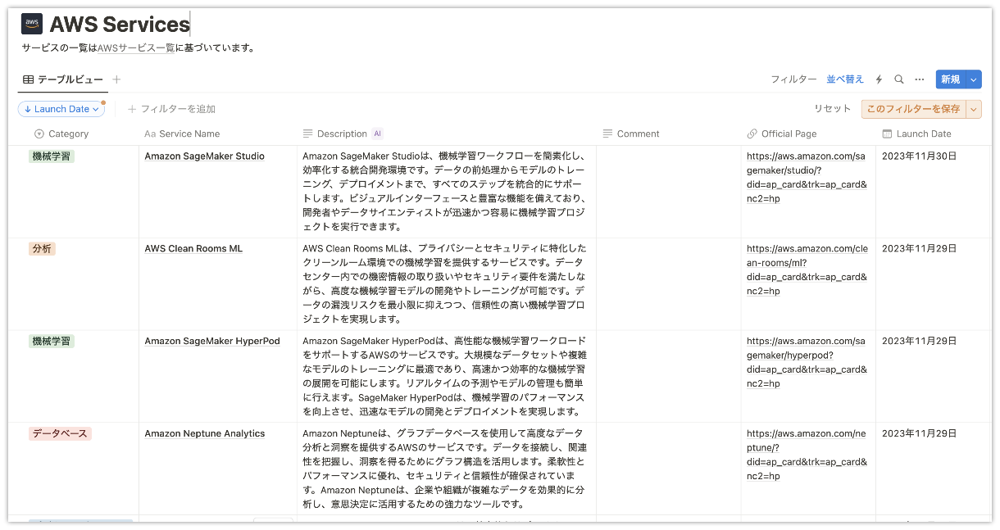
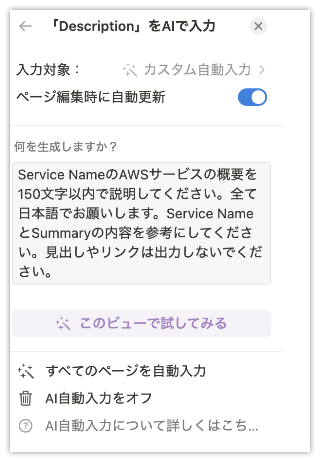

# AWSサービス一覧をNotionデータベースでまとめる

## TL;DR

AWS公式の[AWS クラウド製品](https://aws.amazon.com/jp/products/?nc1=h_ls&aws-products-all.sort-by=item.additionalFields.productNameLowercase&aws-products-all.sort-order=asc&awsf.re%3AInvent=*all&awsf.Free%20Tier%20Type=*all&awsf.tech-category=*all)からサービス一覧を取得し、NotionデータベースにAPIとして登録してみました。各サービスの簡単な説明は、[AWS クラウド製品](https://aws.amazon.com/jp/products/?nc1=h_ls&aws-products-all.sort-by=item.additionalFields.productNameLowercase&aws-products-all.sort-order=asc&awsf.re%3AInvent=*all&awsf.Free%20Tier%20Type=*all&awsf.tech-category=*all)でも記載されていますが、Notion AIを利用することでもう少し長めの説明を追記しています。



一覧は以下で公開しているので、興味があればご覧ください。

* [AWS Services](https://inoue-kobo.notion.site/90fa1b45ad7b4ba5b0a3d790f60c23a8?v=1d1110ae51d94edb92f4c32ffca9cf0a&pvs=4)

## モジュールの準備

```python
%pip install -U notion-sdk-py
%pip install python-dateutil
```

## AWSサービス一覧の取得

```python
import requests
from pprint import pprint

services_api = "https://aws.amazon.com/api/dirs/items/search?item.directoryId=aws-products&sort_by=item.additionalFields.productNameLowercase&sort_order=asc&size=1000&item.locale=ja_JP&tags.id=aws-products%23type%23service%7Caws-products%23type%23feature"
services_json = requests.get(services_api).json()
```

## Notionデータベースへの登録

Notion APIを利用するためのトークン発行方法は以下を参照してください。

* [Notion API利用のためのトークン取得・初期設定方法](https://programming-zero.net/notion-api-setting/)

```python
from dateutil.parser import parse


def _is_date(string, fuzzy=False):
    try:
        parse(string, fuzzy=fuzzy)
        return True

    except ValueError:
        return False

import pandas as pd

services_df = pd.DataFrame(
    [s["item"]["additionalFields"] for s in services_json["items"]]
)
display(services_df.head(5))

import os
from notion_client import Client
import numpy as np

TOKEN = "changeme-notion-token"
DATABASE_ID = "changeme-database-id"

client = Client(auth=TOKEN)
res = client.databases.query(database_id=DATABASE_ID)
results = res["results"]


def _is_exist_page(database_id, service_name, launch_date):
    filter = {
        "and": [
            {
                "property": "Service Name",
                "title": {"equals": service_name},
            }
        ]
    }
    if _is_date(str(launch_date)):
        filter["and"].append(
            {
                "property": "Launch Date",
                "date": {"equals": launch_date},
            }
        )

    res = client.databases.query(database_id=database_id, filter=filter)
    results = res["results"]

    if len(results) > 0:
        return True
    return False


for index, row in services_df.iterrows():
    product_name = row["productName"]
    launch_date = row["launchDate"]
    product_category = row["productCategory"]
    product_url = row["productUrl"]
    product_summary = row["productSummary"]

    if not product_name:
        continue
    if str(product_category) == "nan":
        product_category = "その他"
    if str(product_url) == "nan":
        product_url = ""
    if str(product_summary) == "nan":
        product_summary = ""

    if _is_exist_page(DATABASE_ID, row["productName"], row["launchDate"]):
        continue
    # print(
    #     row["productName"],
    #     row["launchDate"],
    #     row["productCategory"],
    #     row["productUrl"],
    #     row["productSummary"],
    # )

    prop = {
        "Service Name": {
            "title": [
                {
                    "text": {
                        "content": product_name,
                    }
                }
            ]
        },
        "Category": {
            "select": {
                "name": product_category,
            }
        },
        "Official Page": {
            "url": product_url,
        },
        "Summary": {"rich_text": [{"text": {"content": product_summary}}]},
    }

    if _is_date(str(launch_date)):
        prop["Launch Date"] = {
            "date": {
                "start": launch_date,
            }
        }

    res = client.pages.create(parent={"database_id": DATABASE_ID}, properties=prop)
```

## Notion AIによる説明の追加

AWSサービスの説明(Description)はNotion AIのカスタム自動入力を利用しています。設定画面とプロンプトは以下のとおりです。



> Service NameのAWSサービスの概要を150文字以内で説明してください。全て日本語でお願いします。Service NameとSummaryの内容を参考にしてください。見出しやリンクは出力しないでください。

## 参考文献

* [【保存版】Python Notion 操作 （notion-sdk-py編）](https://qiita.com/Yusuke_Pipipi/items/b44cb8442932019c52c9)
* [notion-sdk-py](https://github.com/ramnes/notion-sdk-py)
* [Notion API](https://developers.notion.com/)
* [AWS クラウド製品](https://aws.amazon.com/jp/products/?nc1=h_ls&aws-products-all.sort-by=item.additionalFields.productNameLowercase&aws-products-all.sort-order=asc&awsf.re%3AInvent=*all&awsf.Free%20Tier%20Type=*all&awsf.tech-category=*all)
* [Notion API利用のためのトークン取得・初期設定方法](https://programming-zero.net/notion-api-setting/)