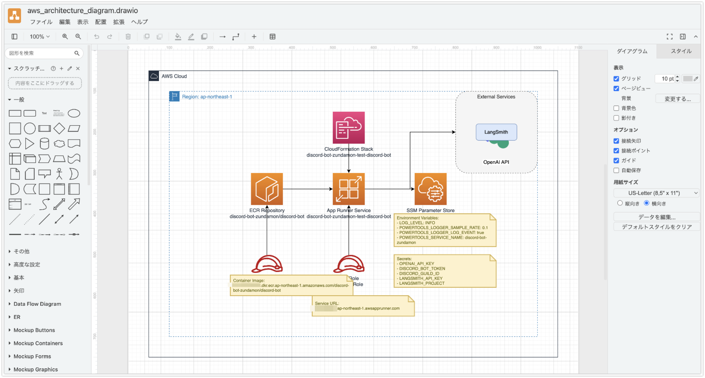

# AWS Strands Agentsを使ってAWSのシステム構成図を作成する

AWS Strands Agentsを使ってAWSのシステム構成図を作成する方法のご紹介です。AWSからはCloudFormationの情報を操作するためのMCP Serverが提供されています。これを利用して、AWSのシステム構成図を作成する方法を確認してみました。

## 対象とするシステム

以下のシステムを対象としています。AWS環境にデプロイした後のCloudFormationの情報を取得して、システム構成図を作成するというシナリオです。

* [discord-bot-zundamon](https://github.com/lhideki/discord-bot-zundamon)

## 前提条件

* Strands Agents: 0.1.2

## ソースコード

* agents-aws-architecture-diagram.py

```python
from strands import Agent
from strands.tools.mcp import MCPClient
from mcp import stdio_client, StdioServerParameters
from strands.models import BedrockModel

NAMING_SYSTEM_PROMPT = """
あなたはAWSリソースの情報を取得しdraw.io形式でAWSのシステム構成図を描画するアシスタントです。
ユーザが指定したStackの情報をツールを使って取得し、draw.io形式でAWSアーキテクチャ図を描画してください。

xml形式のみ出力してください。
"""

get_aws_resource_info_tools = MCPClient(
    lambda: stdio_client(
        StdioServerParameters(
            command="uvx",
            # CloudFormation MCP Serverを指定します。`--readonly`オプションを指定することでMCP ServerがAWSに書き込みを行わないようにします。
            args=["awslabs.cfn-mcp-server@latest", "--readonly"],
            # MCP ServerがAWSにアクセスできるように、ENVにAWS_PROFILEを指定します。
            env={"AWS_PROFILE": "your-aws-profile"},
        )
    )
)


bedrock_model = BedrockModel(
    model_id="apac.anthropic.claude-3-7-sonnet-20250219-v1:0", temperature=0.0
)

with get_aws_resource_info_tools:
    tools = get_aws_resource_info_tools.list_tools_sync()
    drawing_agent = Agent(
        system_prompt=NAMING_SYSTEM_PROMPT, tools=tools, model=bedrock_model
    )

    # Agentには、リポジトリの内容をデプロイした後のStack名を指定します。
    result = str(drawing_agent("discord-bot-zundamon-test-discord-bot"))
    # Agentからのレスポンスにはdraw.io形式以外の出力が含まれる可能性があります。
    # このため、resultから<mxfileから始まり、</mxfile>で終わる部分を抽出します。
    start = result.find("<mxfile")
    end = result.find("</mxfile>") + len("</mxfile>")
    result = result[start:end]

    with open("aws_architecture_diagram.drawio", "w") as f:
        f.write(result)
```

以下のように実行します。

```bash
python -u agents-aws-architecture-diagram.py
```

## 生成されたシステム構成図

以下のようなシステム構成図が生成されました。そのままを利用するのは微妙ですがdraw.io形式で出力されているので、draw.ioで開いて修正することができます。



## システム構成図の改善案

AWS MCP Serversには図を描画するためのMCP Serverもあります。これをAgentにToolとして組み込む事で、より良いシステム構成図を描画することができるかもしれません。

* [AWS Diagram MCP Server](https://github.com/awslabs/mcp?tab=readme-ov-file#aws-diagram-mcp-server)

## 参考文献

* [Strands Agents](https://github.com/strands-agents/sdk-python)
* [AWS MCP Servers](https://github.com/awslabs/mcp)