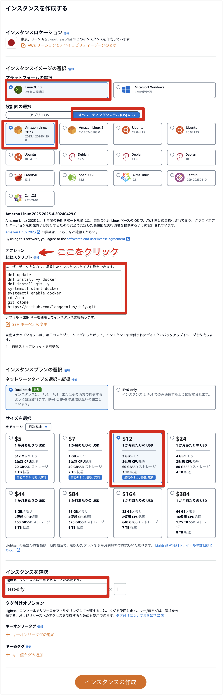
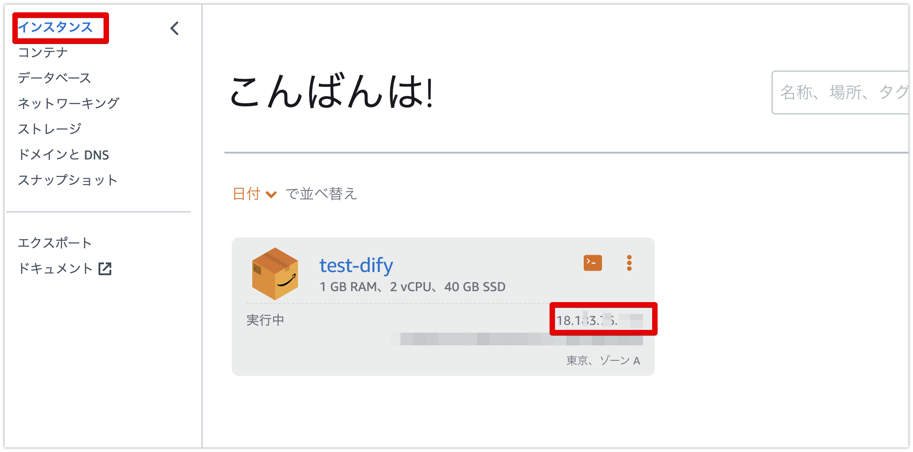
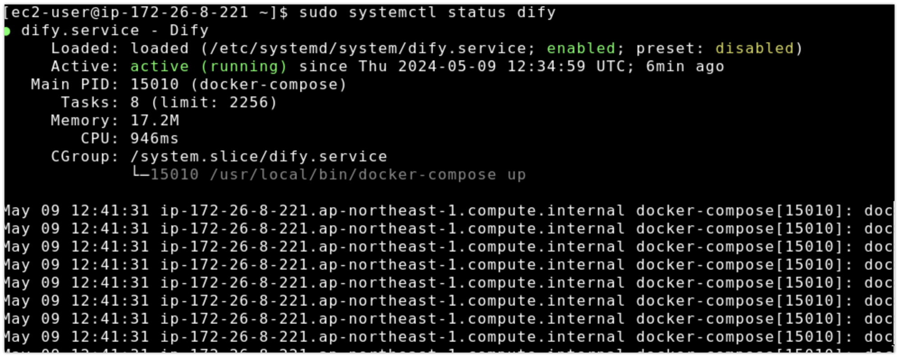

# DifyをAmazon Lightsailで動かす

[Dify](https://dify.ai/jp)をLightsailで動かす方法です。[絶対に失敗しないDifyデプロイの手順、AWS Lightsail編](https://note.com/sangmin/n/nbb4db69784e8)で紹介されているままですが、起動スクリプトを貼り付けるだけでDifyまで起動するようにしているため、必要な操作はLightsailの初期設定のみです。

## Lightsailインスタンスを作成する

Amazon Lightsailにて以下のようにインスタンスを作成します。インスタンスのサイズは2GBのものを選択してください。1GBだとメモリ不足で起動しないことがあります。



起動スクリプトの箇所には以下のスクリプトを貼り付けてください。

```bash
dnf update
dnf install -y docker
dnf install git -y
systemctl start docker
systemctl enable docker
cd /root
git clone https://github.com/langgenius/dify.git
cd dify/docker
curl -L "https://github.com/docker/compose/releases/download/v2.23.0/docker-compose-$(uname -s)-$(uname -m)" -o /usr/local/bin/docker-compose
chmod +x /usr/local/bin/docker-compose
ln -s /usr/local/bin/docker-compose /usr/bin/docker-compose
cat << EOF >> /etc/systemd/system/dify.service
[Unit]
Description=Dify
Requires=docker.service
After=docker.service

[Service]
WorkingDirectory=/root/dify/docker
ExecStart=/usr/local/bin/docker-compose up
ExecStop=/usr/local/bin/docker-compose down
TimeoutStartSec=0

[Install]
WantedBy=multi-user.target
EOF
systemctl enable dify
systemctl start dify
```

`インスタンスの作成`を押下して10分程度待ちます。

## Difyの起動を確認する

Lightsailのインスタンス一覧画面にて、パブリックIPを確認し、ブラウザでアクセスします。



以下のURLをブラウザで開いてください。

```
http://<パブリックIP>/install
```

この手順では`http`でアクセスする必要があることに注意してください。


## 起動しているか心配になった場合

初回の起動では各種コンテナのダウンロードも行うため結構時間がかかります。画面に変化がないので心配になった場合は、SSHで接続して以下のコマンドでサービスが起動していることを確認できます。`active`になっていれば大丈夫です。

```bash
sudo systemctl status dify
```



## 参考文献

* [絶対に失敗しないDifyデプロイの手順、AWS Lightsail編](https://note.com/sangmin/n/nbb4db69784e8)
* [Amazon Linux 2023にDockerとDocker Composeのインストール](https://zenn.dev/rock_penguin/articles/28875c7b0a5e30)
* [Dify](https://dify.ai/jp)