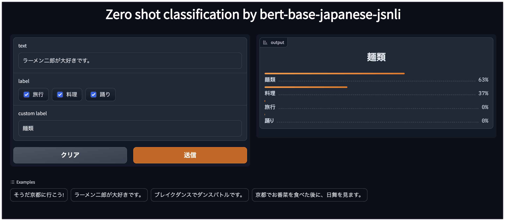

# Gradioを使った機械学習モデルのデモンストレーションをAWS App Runnerでサービスする

## TL;DR

[Gradio](https://gradio.app/)を利用すると機械学習モデルをデモンストレーションするためのWebアプリを簡単に作成することが可能です。Gradioを利用したWebアプリを他の人に使ってもらう方法として、クラウド上にデプロイすることが考えられますが、比較的安価かつ簡単にデプロイする環境として[AWS App Runner](https://aws.amazon.com/jp/apprunner/)を使ってみました。

App Runnerは(AWS Lambdaなどと違い)利用しない場合も維持費がかかりますが、ロードバランサーやVPCの設定を内包しているため、あまり細かい事を気にせずにインターネット上にWebアプリを公開することができます。さらに[AWS Copilot CLI](https://aws.github.io/copilot-cli/ja/)を使って構成管理することで、開発者はDockerfileを用意するだけでよく、インフラの準備や管理が不要になります。

今回の手順ではHugging Faceで公開されている機械学習モデルを利用し、Zero-shot Classificationをデモンストレーションするアプリを作ってみました。



## 前提条件

* [AWS Copilot CLI](https://aws.github.io/copilot-cli/ja/)が導入済みであることを前提としています。

## GradioによるWebアプリの準備

Hugging Face(transformers)とGradioを利用したWebアプリを準備します。注意事項としては以下の2点です。

* server_nameは`0.0.0.0`とする。
* server_portは何でもいいが、`8080`としておくとデフォルトのまま動くので便利。
* GradioのWebサーバが起動する前にモデルをロードすると、App Runnerが内部的に利用するロードバランサーのヘルスチェックに失敗するため、推論が呼び出された際にロードするようにする。

なお、Hugging Faceで公開されているモデルとして[Formzu/bert-base-japanese-jsnli](https://huggingface.co/Formzu/bert-base-japanese-jsnli)を利用させていただきました。

```python
from transformers import pipeline
import gradio as gr


def predict(text, labels, custom_label):
    global pipe
    if not pipe:
        pipe = pipeline('zero-shot-classification',
                        model='Formzu/bert-base-japanese-jsnli')
    if custom_label:
        labels.append(custom_label)

    pred = pipe(text, labels, hypothesis_template='この例は{}です。')
    out = {l: s for l, s in zip(pred['labels'], pred['scores'])}

    return out


demo = gr.Interface(fn=predict,
                    allow_flagging='never',
                    title='Zero shot classification by bert-base-japanese-jsnli',
                    inputs=[
                        gr.Textbox(label='text'),
                        gr.CheckboxGroup(label='label', choices=['旅行', '料理', '踊り'], value=[
                                         '旅行', '料理', '踊り']),
                        gr.Textbox(label='custom label')
                    ],
                    outputs='label',
                    examples=[
                        ['そうだ京都に行こう!'],
                        ['ラーメン二郎が大好きです。'],
                        ['ブレイクダンスでダンスバトルです。'],
                        ['京都でお番菜を食べた後に、日舞を見ます。'],
                    ])

pipe = None

if __name__ == '__main__':
    demo.launch(server_port=8080, server_name='0.0.0.0')
```

## Dockerfileの準備

App RunnerでサービスするためのDockerfileを用意します。必要なのはGradioを使ったWebアプリのソースコード(以下では`serve.py`)と依存モジュールをロードするための`requirements.txt`のみです。

```Dockerfile
FROM python:3.9

WORKDIR /workspace
ENV HOME=/workspace
ADD requirements.txt /workspace/requirements.txt
RUN pip install -U pip &&\
  pip install --no-cache-dir -r /workspace/requirements.txt
ADD serve.py /workspace/serve.py

EXPOSE 8080

CMD [ "python3" , "serve.py" ]
```

以下は`requirements.txt`の内容です。

```
transformers==4.24.0
torch==1.11.0
gradio==3.9.1
sentencepiece==0.1.97
fugashi==1.2.0
unidic-lite==1.0.8
```

## AWS Copoilot CLIによる初期化とデプロイ

AWS Copilotのinitで初期設定を行います。

```
copilot init
```

上記の中でアプリ名とサービス名が聞かれますが、今回は以下の様にしています。アプリ名とサービス名は同じでも構いませんが、あまり長いとデプロイに失敗することがあるため、それぞれ10文字程度に納めておくのが無難です。

* アプリ名(Application name): test-gradio
* サービス名(Service name): gradio

initの最後にtest environmentにデプロイするか否かを聞かれます。今回はそのままデプロイすることが可能ですので、`yes`で構いません。手順的に`copilot init`を先に行い、あとでソースコードやDockerfileを用意する場合は、一旦デプロイを見合わせ、準備ができたら以下のコマンドでデプロイを行います。

```bash
copilot deploy
```

## 起動したアプリの確認

デプロイが完了するとApp RunnerのAWSコンソールでステータスが`Running`となってなり、デフォルトドメインとしてアクセス可能になっています。


### App Runnerのアクセス制限

デフォルトドメインはホスト名部分でランダムな値を含んでいますが、知っていればインターネット上から誰でもアクセスが可能です。機密情報を含まないデモンストレーションであれば問題ありませんが、困る場合は(最近対応した)App RunnerをPrivate VPCで動かしたり、CloudFront + WAFでアクセス制限を行う(ただし、それでもデフォルトドメインへの迂回経路が存在します)必要があります。

## Copilotで作成した環境の削除方法

Copilotで作成したアプリケーションは以下の構成となっています。

* アプリ ⊃ 環境 ⊃ サービス

今回の手順でもそれぞれ作成されているため、以下のように個別に削除することが可能です。

* copilot svc delete --name [サービス名]
* copilot env delete --name [環境名(デフォルトはtest)]
* copilot app delete --name [アプリ名]

### 手動でCFnスタックを削除した場合のクリーンナップ方法

以下は公式の手順ではありません。自己責任かつリスクがあることを認識の上実行してください。Copilotが作ったCFnスタックを手動で削除してしまった場合、copilotを利用して環境の削除ができなくなるため、そのような状況に陥った場合の非常用です。

* copilotが作成したCFnスタックを削除し、関連リソースを削除します。
* copilotが作成したS3バケットを削除します。
* copilotが作成したSSM Parameterを削除します。
* copilotが作成したCodeCommitのリポジトリを削除します。

## まとめ

機械学習モデルのデモンストレーションとしてGradioは非常に便利ですが、他の人にも使ってもらう場合に、EC2だと準備に手間がかかりますし、Fargateだと若干高く感じます。そんな場合にApp Runnerがはまるかなと思います。但し、App Runnerで利用可能なリソースはvCPUが1〜2、Memoryが1〜4GBの制限があります。このため、この範囲で動作可能な機械学習モデル・Webアプリに制限されることは注意です。

とはいえ、Gradioを利用するユースケースでは個々の機械学習モデルを個別のWebアプリとしてサービスすることが多いと思いますので、単機能のサービスを複数立ち上げる前提であれば、適用できるシーンも多いかなと思います。

なお、[Lambda Function URL](https://docs.aws.amazon.com/ja_jp/lambda/latest/dg/lambda-urls.html)でも同じことはできるかなと思うので、今後トライしみようと思います。

## 参考文献

* [Gradio](https://gradio.app/)
* [AWS App Runner](https://aws.amazon.com/jp/apprunner/)
* [Your toolkit for containerized applications on AWS](https://aws.github.io/copilot-cli/ja/)