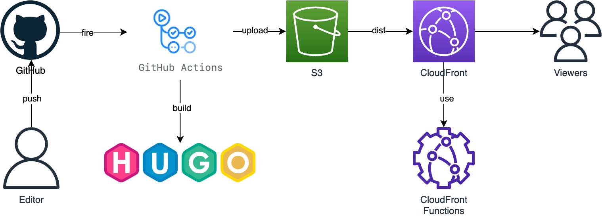
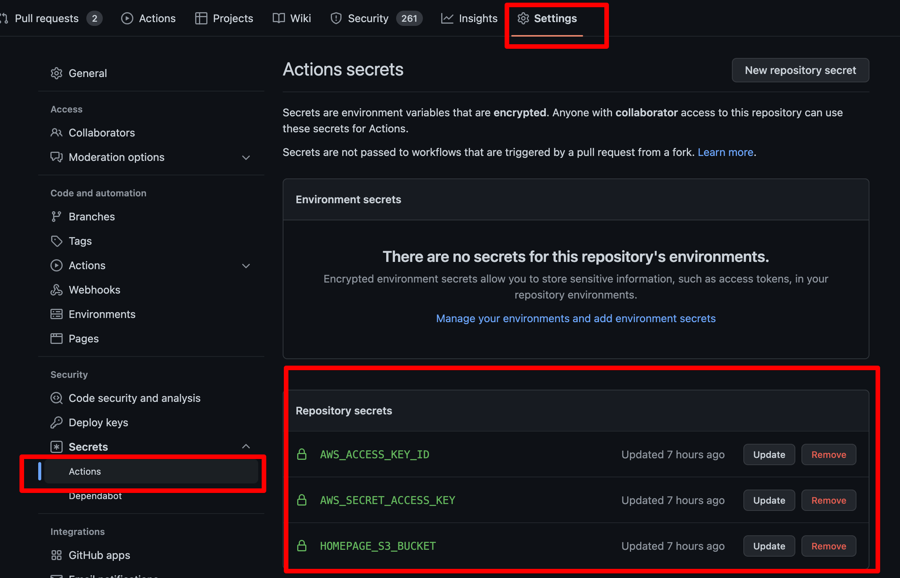
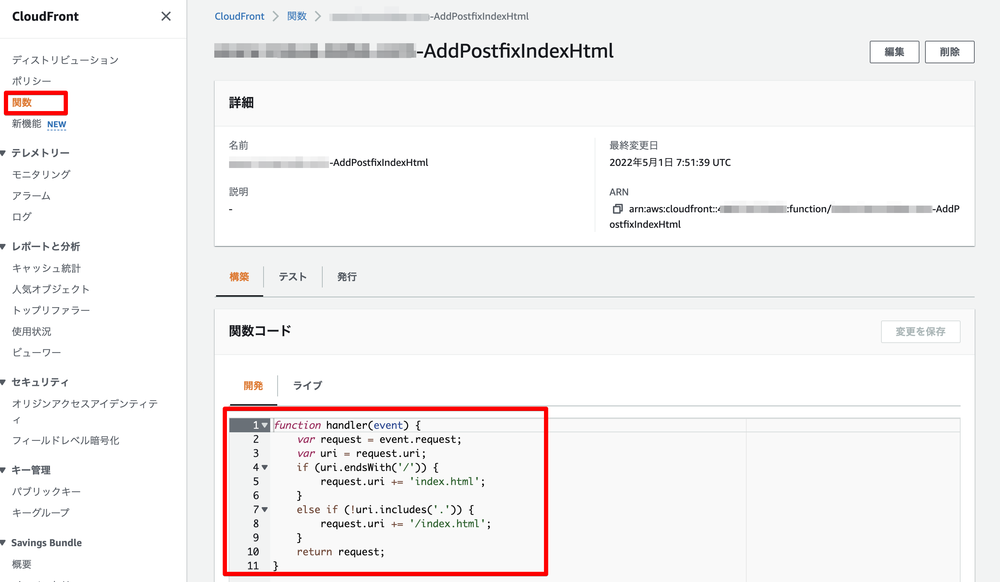

# GitHub Actions + Hugo + AWS S3 + CloudFrontでホームページをリニューアルしました

## TL;DR

[www.inoue-kobo.com](https://www.inoue-kobo.com)は静的サイトジェネレータにより生成しています。今までは[MkDocs](https://www.mkdocs.org/)で運用していたのですが、[Hugo](https://gohugo.io/)に乗り換えてみました。ついでにCI/CDパイプラインを[AWS CodeBuild](https://aws.amazon.com/jp/codebuild/)から[GitHub Actions](https://github.co.jp/features/actions)に変更しています。

以下の様な構成です。



Hugoのテーマは以下を利用しています。

* [Mainroad](https://github.com/Vimux/Mainroad)

## Hugoを設定する

Hugoでサイトの初期設定とテーマの取得を行います。

```bash
hugo new site www
git submodule add https://github.com/vimux/mainroad.git www/themes/mainroad
```

Hugoやテーマの設定(config.toml)については省略します。詳細は[Mainroad](https://github.com/Vimux/Mainroad)を参照してください。

## AWS IAM Userを作成する

GitHub ActionsからS3に生成したファイルをアップロードするために、AWS側にIAM Userを作成します。サービスアカウントとしての役割ですので、専用で作成するのが良いと思います。以下はIAM Userに必要なIAM Policyの例です。`[BUCKET_NAME]`はサイトコンテンツを配置するバケットの名前で置き換えてください。

なお、今回はIAM Userを作成してAccessKeyを使用していますが、[GitHub ActionsでAWSの永続的なクレデンシャルを渡すことなくIAM Roleが利用できるようになったようです](https://dev.classmethod.jp/articles/github-actions-without-permanent-credential/)のようにIAM Roleが利用できるようになっているので、現在はIAM UserではなくIAM Roleを利用することが推奨されます。

```json
{
    "Version": "2012-10-17",
    "Statement": [
        {
            "Action": [
                "s3:ListAllMyBuckets"
            ],
            "Effect": "Allow",
            "Resource": "arn:aws:s3:::*"
        },
        {
            "Action": "s3:*",
            "Effect": "Allow",
            "Resource": [
                "arn:aws:s3:::[BUCKET_NAME]",
                "arn:aws:s3:::[BUCKET_NAME]/*"
            ]
        },
        {
            "Effect": "Allow",
            "Action": [
                "cloudfront:CreateInvalidation"
            ],
            "Resource": "*"
        }
    ]
}
```

## GitHub Secretsを設定する

GitHub Secretsとして以下のパラメータを設定します。

* AWS_ACCESS_KEY_ID: 上記で作成したIAM UserのAccessKeyです。
* AWS_SECRET_ACCESS_KEY: 上記で作成したIAM UserのSecretAccessKeyです。
* HOMEPAGE_S3_BUCKET: コンテンツを配置するS3バケット名です。



## GitHub Actionsを設定する

`.github/workflows/main.yml`として以下を作成します。`cd www`としていますが、リポジトリ自体をHugoの管理ディレクトリとしている場合は不要です。なお、最後にCloudFrontのキャッシュ削除(create-invalidation)をしています。`distribution-id`は使用している環境の情報で設定してください。

```yaml
name: Deploy into www.inoue-kobo.com
on:
  push:
      branches:
        - master
jobs:
  build:
    runs-on: ubuntu-latest
    steps:
      - name: Checkout
        uses: actions/checkout@v2
        with:
          submodules: true

      - name: Setup Hugo
        uses: peaceiris/actions-hugo@v2
        with:
          hugo-version: "0.98.0"
          extended: true

      - name: Build Hugo
        run: |
          cd www
          hugo --environment production

      - name: Configure AWS credentials
        uses: aws-actions/configure-aws-credentials@v1
        with:
          aws-access-key-id: ${{ secrets.AWS_ACCESS_KEY_ID }}
          aws-secret-access-key: ${{ secrets.AWS_SECRET_ACCESS_KEY }}
          aws-region: ap-northeast-1

      - name: Upload file to S3
        env:
          AWS_ACCESS_KEY_ID: ${{ secrets.AWS_ACCESS_KEY_ID }}
          AWS_SECRET_ACCESS_KEY: ${{ secrets.AWS_SECRET_ACCESS_KEY }}
          HOMEPAGE_S3_BUCKET: ${{ secrets.HOMEPAGE_S3_BUCKET }}
        run: |
          aws s3 sync www/public s3://$HOMEPAGE_S3_BUCKET/www --delete
          aws cloudfront create-invalidation --region ap-northeast-1 --distribution-id XXXXXXXXXXXXX --paths "/*"
```

## CloudFront Functionsを設定する

S3 + CloudFrontでホームページをサービスする場合、ドメイン直下のルート以外はディレクトリまでのURL(http://www.example.com/public/など)ではコンテンツを表示することができません。Webサーバを利用している場合と異なり、自動的にindex.htmlに対してリクエストがされないためです。このため、Hugoで生成したコンテンツ内のリンクは全てindex.htmlまで付けておく(http://www.example.com/public/index.html)必要があります。

Hugo側でも調整ができると思いますが、今回はCloudFront Functionsを利用してCloudFront側でリクエストを書き換える設定を行いました。



```js
function handler(event) {
    var request = event.request;
    var uri = request.uri;
    if (uri.endsWith('/')) {
        request.uri += 'index.html';
    }
    else if (!uri.includes('.')) {
        request.uri += '/index.html';
    }
    return request;
}
```

## 参考文献

* [Github Actionsを使って、HugoサイトをS3にデプロイする方法](https://note.com/yiio/n/n246f58a71c1e)
* [AWS - index.html を追加してファイル名を含まない URL をリクエストする](https://docs.aws.amazon.com/ja_jp/AmazonCloudFront/latest/DeveloperGuide/example-function-add-index.html)