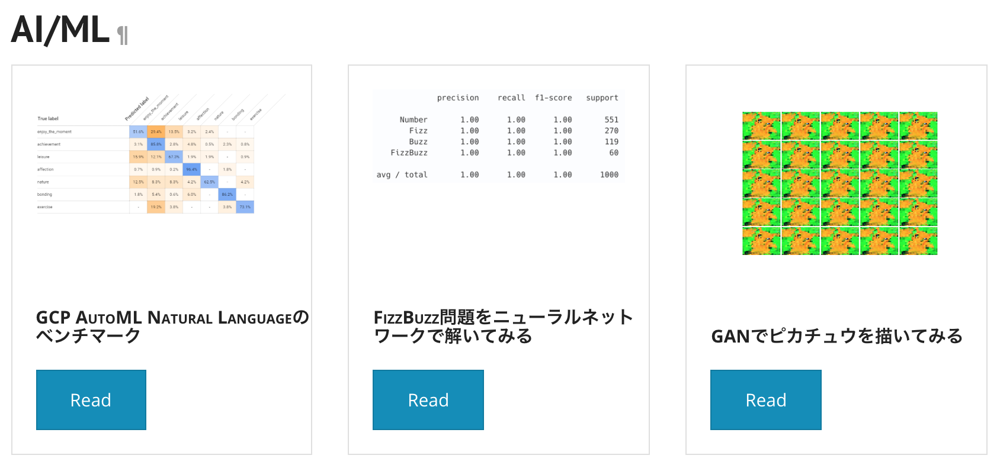

# mkdocs-macrosを利用してサムネイル表示する

## TL;DR

`MkDocs`のプラグインである[mkdocs-macros](https://github.com/fralau/mkdocs_macros_plugin)を利用してサムネイル表示します。
以下の様なサムネイルを自動的に表示できるようにします。



## mkdocs-macrosとは

`MkDocs`でMarkdownドキュメントをHTMLに変換する際に一部をPythonで変換するためのプラグインです。
`mkdocs-macros`を利用すると、以下のような記述ができます。

```markdown
## mkdocs-macrosのテスト

\{\% set greet = 'Hello' \%\}
\{\{ greet \}\}, World!
```

結果は以下の様に表示されます。

```markdown
## mkdocs-macrosのテスト

Hello, World!
```

上記はmacros用のコードを表示するために`\`でエスケープしていますが、実際には不要です。

macrosでは別途Pythonの関数として定義したmacros用の部品(マクロ)を指定します。
`\{\%`で始めた場合はマクロとして指定した関数の返値を出力しません。`\{\{`と`\}\}`で囲むと結果を表示します。

## mkdocs-macrosのインストール

```bash
pip install mkdocs-macros-plugin
```

## サムネイル表示用マクロの定義

`mkdocs.yml`と同じディレクトリに`main.py`という名前でファイルを用意すると`MkDocs`が自動で読み込みます。
`main.py`において、`declare_variables`関数の中に`@macro`でデコレーションした関数がマクロだと認識されます。

サムネイル表示するためのコードは以下の通りです。

```python
import glob
import os
import sys
import re

COL_NUM = 3

def get_thumbnail_element(dir, index_filename='index.md', thumbnail_filename='images/thumbnail.png'):
    html = '<div class="container-fluid">\n'
    filenames = glob.glob(f'{dir}/*/{index_filename}')
    basedir = os.path.basename(dir)
    for i, filename in enumerate(filenames):
        title = read_title(filename)
        content_dir = os.path.join(basedir, os.path.basename(os.path.dirname(filename)))
        thumbnail = os.path.join(content_dir, thumbnail_filename)

        if i == 0  or i % COL_NUM == 0:
            html += '  <div class="row" style="margin-bottom: 1.5em">\n'
        html += '    <div class="col-md-4">\n'
        card = get_card_element(title, content_dir, thumbnail)
        html += card
        html += '    </div>\n'

        if i > 0 and (i + 1) % COL_NUM == 0:
          html += '  </div>\n'
        elif i == len(filenames) - 1:
          html += '  </div>\n'
    html += '</div>'

    return html


def read_title(filename):
    with open(filename) as f:
        title = re.search('\# (.+)', f.readlines()[0]).group(1)
    return title


def get_card_element(title, dir, thumbnail):
    card = ''
    card += f'    <div class="card">\n'
    card += f'      \n'
    card += f'      <div class="card-body">\n'
    card += f'        <h5 class="card-title">{title}</h5>\n'
    card += f'        <a class="btn btn-primary" href="{dir}/index.html">Read</a>\n'
    card += f'      </div>\n'
    card += f'    </div>\n'

    return card


def declare_variables(variables, macro):
    @macro
    def print_thumbnail(dir):
      return get_thumbnail_element(dir)

if __name__ == '__main__':
    dir = sys.argv[1]
    element = get_thumbnail_element(dir)

    print(element)
```

各Markdownドキュメントは分類となるディレクトリ(awsやai_mlなど)を挟んだ上で、ディレクトリで毎に配置する構成を想定しています。
サムネイル画像は`images/thumbnail.png`というパスで固定です。

## 利用方法

各Markdownドキュメントで以下の様に記述します。

```
\{\{ print_thumbnail('docs/aws') \}\}
```

引数で指定するのは分類となるディレクトリのパスです。

## AWS CodeBuildを利用する場合の注意事項

[Mkdocs と S3/Cloudfront によるドキュメント公開システムの構築](../mkdocs-s3-cloudfront/index.md)の手順でAWS CodeBuildを作成した場合、
Build時に実行されるPythonのバージョンが2系になっています。

`mkdocs-macros`はPython3系ではないとインストール出来ないため、以下の様なイメージに変更する必要があります。


## 参考文献

* [MkDocs](https://www.mkdocs.org/)
* [mkdocs-macros](https://github.com/fralau/mkdocs_macros_plugin)