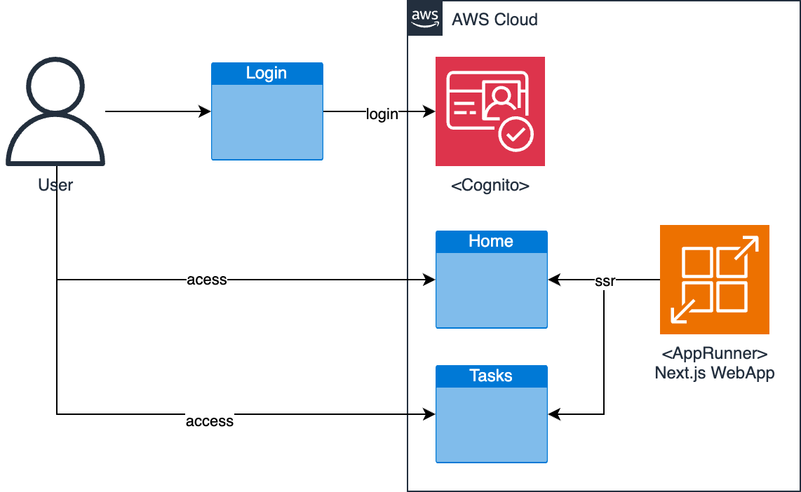

# Next.jsで作成したWebアプリをAppRunnerで動かす際のテンプレート

Next.jsで作成したWebアプリをAppRunnerで動かす際のテンプレートです。以下の構成を想定しています。



## なぜAppRunnerを利用するのか?

AWS環境でNext.jsで作成したWebアプリを動かす際にはAWS Amplifyを利用することが多いと思いますが、閉域網などでなるべくシンプルな構成で動かしたい場合には、AppRunnerを利用するのが便利です。本テンプレートはそのような環境でNext.js(で作成したWebアプリ)を動かすための最小限の構成を提供します。

なお、本テンプレートのAppRunnerはVPCを指定しないため、閉域網で利用する際にはCDK部分の変更が必要です。また、認証にCognitoを利用していますが、CognitoはVPC Endpointを利用できないため、完全に閉域内での通信にならない点は注意してください。

完全なコードは以下を参照してください。

* [Next.jsで作成したWebアプリをAppRunnerで動かす際のテンプレート(nextjs-on-apprunner-template)](https://github.com/lhideki/nextjs-on-apprunner-template)

## デプロイ手順

1. Cognitoのユーザープールを作成する
2. Cognitoのユーザープールに、アプリクライアントを作成する
3. aws-exports.jsを準備する
4. CDKでデプロイする

### Cognitoのユーザープールを作成する

AWSのコンソールからCognitoのユーザープールを作成します。

### Cognitoのユーザープールに、アプリクライアントを作成する

Cognitoのユーザープールに、アプリクライアントを作成します。

### aws-exports.jsを準備する

`aws-exports.js`を作成します。以下のような内容になります。

```javascript
const awsmobile = {
    aws_project_region: 'ap-northeast-1',
    aws_cognito_region: 'ap-northeast-1',
    aws_user_pools_id: '[作成したユーザープールのIDで置き換えてください]',
    aws_user_pools_web_client_id: '[作成したアプリクライアントのIDで置き換えてください]',
};

export default awsmobile;
```

`aws-exports.js`は以下に配置します。

* app/nextjs-on-apprunner-demo/src/aws-exports.js

### CDKでデプロイする

CDKを使用して、AppRunnerにデプロイします。

```bash
cd cdk
AWS_DEFAULT_REGION=ap-northeast-1 cdk synth # CFnが意図した通り出力されることを確認します。
AWS_DEFAULT_REGION=ap-northeast-1 cdk diff # 差分を確認します。
AWS_DEFAULT_REGION=ap-northeast-1 cdk deploy
```

## 補足事項

### Amplify UIのログイン画面利用する場合は、ClientComponentを使用する必要がある

Amplify UIのAuthenticatorを使用する場合、ServerComponentではなくClientComponentを使用する必要があります。

* [app/nextjs-on-apprunner-demo/src/app/login/page.tsx](https://github.com/lhideki/nextjs-on-apprunner-template/blob/main/app/nextjs-on-apprunner-demo/src/app/login/page.tsx)

### ServerComponentでCognitoの認証情報を取得する場合は、AmplifyのSSRを使用を指定する必要がある

ServerComponentで(Amplify UIのログイン画面利用を利用してログインをした)Cognitoの認証情報を取得する場合は、Amplifyのconfigureで、ssr=trueを指定する必要があります。これにより、認証情報がcookieに保存されるようになります。

```typescript
Amplify.configure({ ...awsExports }, { ssr: true }); // ssrをtrueにすることで、Cognitoの認証情報をSSRで取得できるようにします。
```

* [app/nextjs-on-apprunner-demo/src/app/login/page.tsx](https://github.com/lhideki/nextjs-on-apprunner-template/blob/main/app/nextjs-on-apprunner-demo/src/app/login/page.tsx)

### Amplify.jsをServerComponentで使用する場合は、Next.js Adapterを導入する必要がある

ServerComponentでAmplify.jsを使用する場合は、Next.js Adapterを導入する必要があります。

```
npm add aws-amplify @aws-amplify/adapter-nextjs
```

今回の環境では、Next.js AdapterのrunWithAmplifyServerContextをcookieに保存された認証情報と共に呼び出し、SSR版のAmplify.js関数を呼び出します。

```typescript
import { getCurrentUser } from 'aws-amplify/auth/server';
import { fetchAuthSession } from 'aws-amplify/auth/server';
import { fetchUserAttributes } from 'aws-amplify/auth/server';

export const { runWithAmplifyServerContext } = createServerRunner({
    config,
});

[省略]

export async function requireCurrentUser() {
    const currentUser = await runWithAmplifyServerContext({
        nextServerContext: { cookies },
        operation: (contextSpec) => getCurrentUser(contextSpec),
    });
    const session = await runWithAmplifyServerContext({
        nextServerContext: { cookies },
        operation: (contextSpec) => fetchAuthSession(contextSpec),
    });
    const attributes = await runWithAmplifyServerContext({
        nextServerContext: { cookies },
        operation: (contextSpec) => fetchUserAttributes(contextSpec),
    });

    return {
        currentUser,
        session,
        attributes,
    };
}
```

* [app/nextjs-on-apprunner-demo/src/utils/server-utils.ts](https://github.com/lhideki/nextjs-on-apprunner-template/blob/main/app/nextjs-on-apprunner-demo/src/utils/server-utils.ts)

### AppRunnerのデプロイでは、環境変数に`HOSTNAME=0.0.0.0`を指定しないとヘルスチェックに失敗する

node.jsが待ち受けるhostnameの影響で、環境変数に`HOSTNAME=0.0.0.0`を指定しないとAppRunnerのヘルスチェックに失敗します。

```python
apprunner_service.add_environment_variable(
            "HOSTNAME", "0.0.0.0"
        )  # node.jsが待ち受けるhostnameの影響で、この設定がないとAppRunnerのヘルスチェックに失敗します。
```

* [cdk/stacks/cdk_stack.py](https://github.com/lhideki/nextjs-on-apprunner-template/blob/main/cdk/stacks/cdk_stack.py)

## 参考文献

- [webpack4の記事を見ながら実装していくとエラーしたので載せておく](https://qiita.com/cygnu/items/edd19db7b68cfd5a3fcc)
- [AWS 規範ガイダンス - Amazon Cognito と AWS Amplify UI を使用して既存の React アプリケーションユーザーを認証する](https://docs.aws.amazon.com/ja_jp/prescriptive-guidance/latest/patterns/authenticate-react-app-users-cognito-amplify-ui.html)
- [Qiita - Next.jsとAWSで認証つきサイトを爆速でホストする(Next.js + Cognito + S3 + Cloudfront)](https://qiita.com/musutafakemaru/items/a00f4fe5448aa1969210)
- [Amplify UI - Authenticator](https://ui.docs.amplify.aws/react/connected-components/authenticator)
- [TypeScript と Amplify JavaScript v6 を利用して Next.js アプリを構築する](https://aws.amazon.com/jp/blogs/news/amplify-javascript-v6/)
- [Next.js - How to deploy your Next.js application](https://nextjs.org/docs/app/getting-started/deploying#docker)
- [Next.js v13.4をAWS App Runnerで動かそうとしてハマった話](https://qiita.com/Kanahiro/items/aaec2ddf5ffefecbbc31)