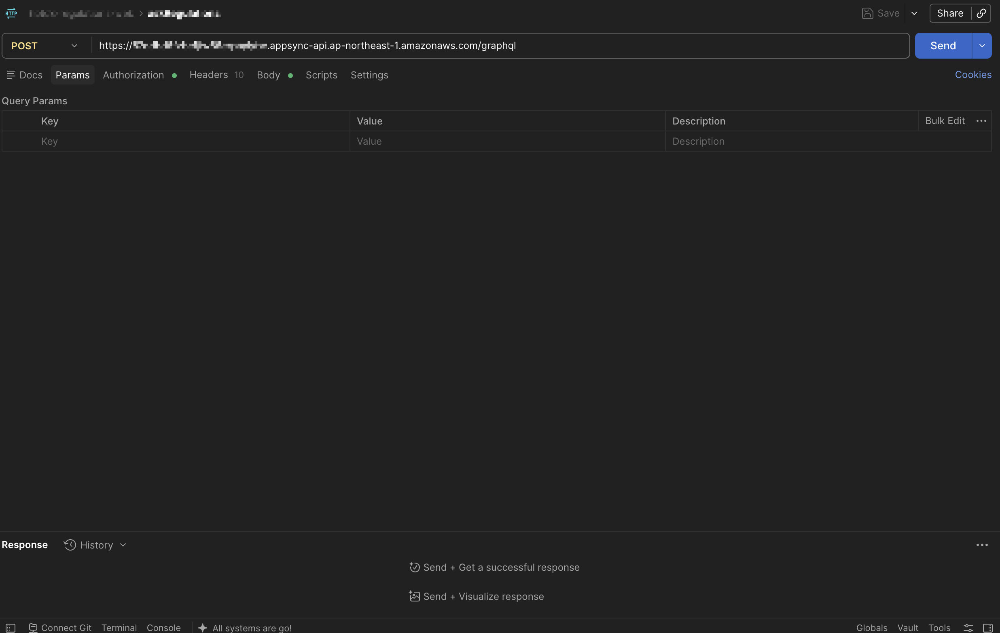
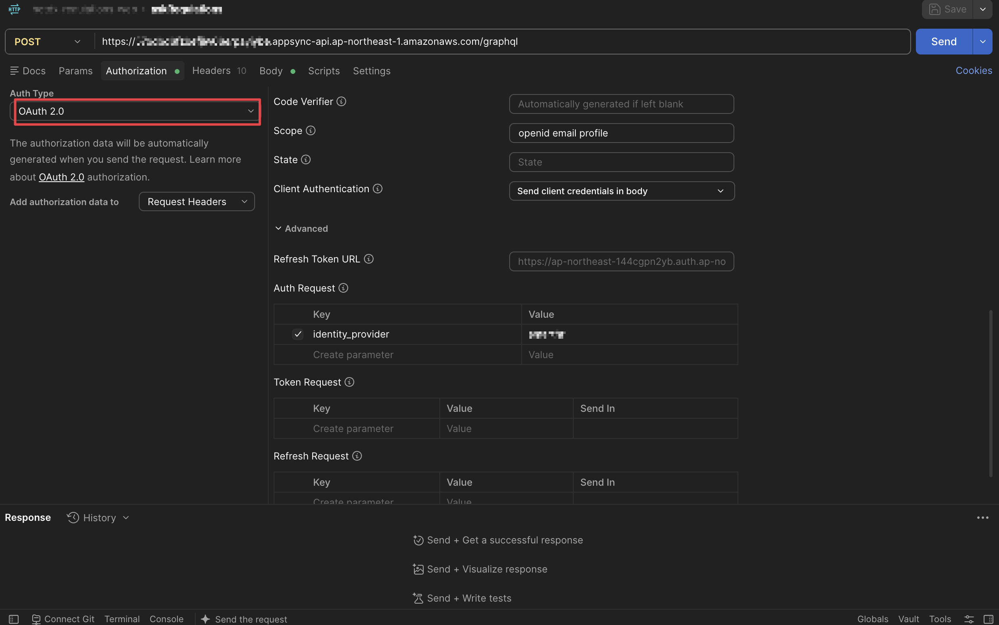
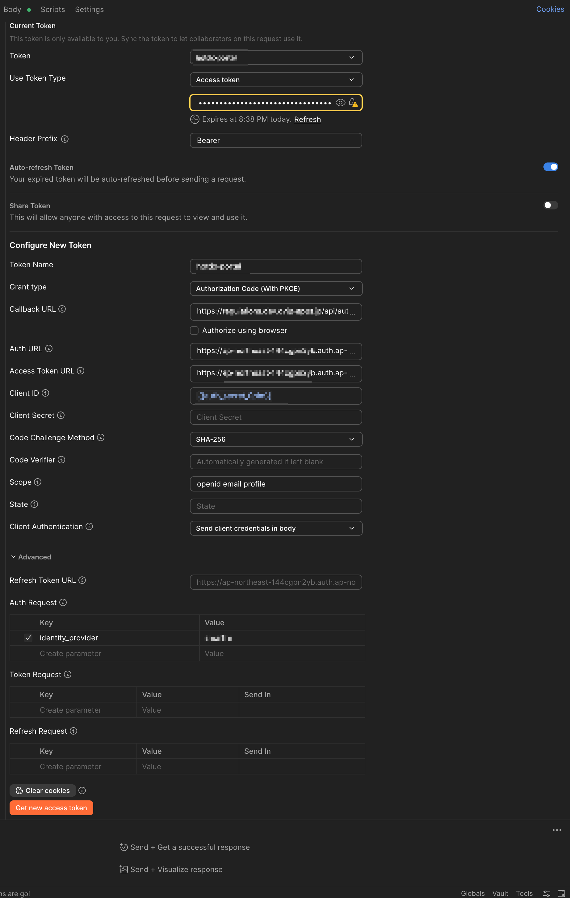
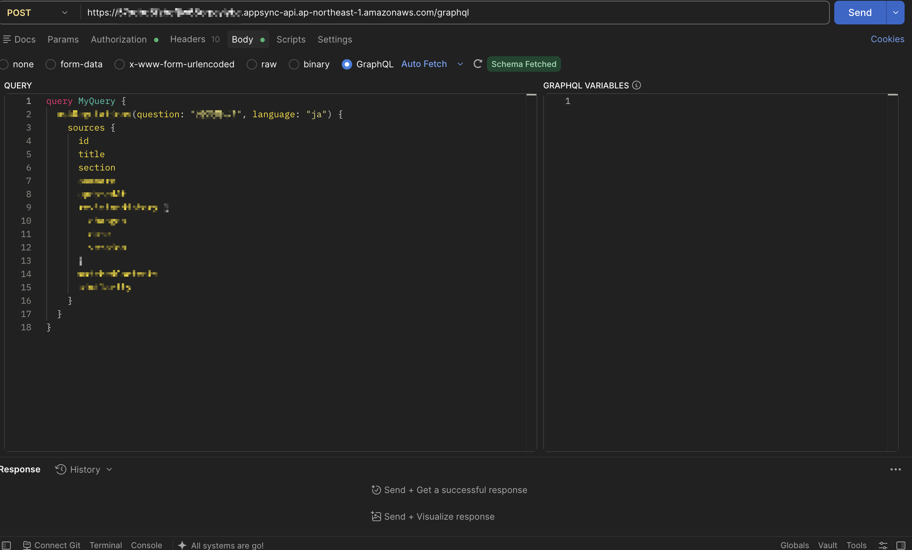
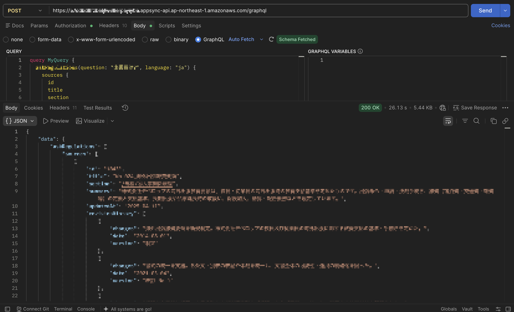

# SAML連携しているCognitoで認証して、PostmanからGraphQLリクエストを送信する

AWS AppSyncの認証にAmazon Cognitoを使用しており、さらにCognitoが社内IdPなどとSAML連携している構成の場合、AWSコンソールのAppSyncのクエリ画面(テストクエリ)からGraphQLリクエストを送信しようとしても、コンソール上で完結してテストすることができません。

[Postman](https://www.postman.com/)のAuthorization機能(OAuth 2.0 / Authorization Code With PKCE)を利用して、Cognitoの認証(SAML連携によるログイン)を行い、AppSyncにGraphQLリクエストを送信する方法を紹介します。

## 前提条件

* AppSyncの認証にAmazon Cognitoを使用していること。
* Cognitoのユーザープールに、SAML連携によるIdentity Providerが設定済みであること。
* Cognitoのユーザープールに、Postmanからのリダイレクトを受け付けるためのApp Clientが設定済みであること(コールバックURLにPostmanのコールバックURLを許可しておく必要があります)。

## Cognitoの認証情報を確認する

Postmanの設定に入る前に、Cognitoのユーザープール、およびApp Client(アプリクライアント)の設定画面から以下の情報を確認しておきます。

* ユーザープールドメイン(`https://xxxx.auth.ap-northeast-1.amazoncognito.com`の形式)
* App ClientのクライアントID
* App ClientのコールバックURL
* SAML連携で設定したIdentity Providerの名前

これらの情報を使って、Postman側でAuthorizationの設定を行います。

## Postmanでリクエストを作成する

まずは通常のGraphQLリクエストと同様に、AppSyncのエンドポイント(`https://xxxx.appsync-api.ap-northeast-1.amazonaws.com/graphql`)に対する`POST`リクエストを作成します。



## Authorizationタブを設定する

作成したリクエストの`Authorization`タブを開き、以下のとおり設定していきます。今回はSAML連携によるログインをブラウザ経由で行う必要があるため、`Auth Type`は`OAuth 2.0`を選択します。



設定項目は以下のとおりです。



| 項目 | 設定値 | 備考 |
| --- | --- | --- |
| Token Name | 任意の名前 | 識別用の名前なので何でも構いません。 |
| Grant type | `Authorization Code (With PKCE)` | Cognitoのホストされた UI 経由でSAML連携ログインを行うため、この設定を使用します。 |
| Callback URL | App Clientに設定したコールバックURL | Cognito側で許可しているコールバックURLと一致させる必要があります。 |
| Authorize using browser | 任意 | ブラウザ側でSAMLログインの画面を表示したい場合はチェックします。 |
| Auth URL | `https://xxxx.auth.ap-northeast-1.amazoncognito.com/oauth2/authorize` | 後述します。 |
| Access Token URL | `https://xxxx.auth.ap-northeast-1.amazoncognito.com/oauth2/token` | 後述します。 |
| Client ID | App ClientのクライアントID | - |
| Client Secret | (App Clientの設定による) | クライアントシークレットを発行していない場合は空欄のままにします。 |
| Code Challenge Method | `SHA-256` | PKCEの標準的な設定です。 |
| Scope | `openid email profile` | 必要に応じて調整してください。 |
| Client Authentication | `Send client credentials in body` | - |

さらに`Advanced`を開き、`Auth Request`に以下のパラメータを追加します。

| Key | Value | 備考 |
| --- | --- | --- |
| `identity_provider` | SAML連携で設定したIdentity Providerの名前 | 後述します。 |

設定が完了したら、画面下部の`Get New Access Token`を押下します。ブラウザ(またはPostman内蔵のブラウザ)がポップアップし、SAML連携先のログイン画面が表示されるので、資格情報を入力してログインします。ログインが成功すると、CognitoがPostmanのコールバックURLに認可コードを返却し、Postmanが自動的にアクセストークンを取得します。

## はまりどころ

実際に設定を行う際につまずいたポイントを3点紹介します。

### 1. Auth URLに`/oauth2/authorize`を付与する

CognitoのユーザープールドメインをそのままAuth URLに設定してしまうと正しく動作しません。ユーザープールドメイン(`https://xxxx.auth.ap-northeast-1.amazoncognito.com`)の末尾に、`/oauth2/authorize`を付与した以下の形式で指定する必要があります。

```text
https://xxxx.auth.ap-northeast-1.amazoncognito.com/oauth2/authorize
```

### 2. Access Token URLに`/oauth2/token`を付与する

Auth URLと同様に、Access Token URLについてもユーザープールドメインの末尾に`/oauth2/token`を付与した以下の形式で指定する必要があります。

```text
https://xxxx.auth.ap-northeast-1.amazoncognito.com/oauth2/token
```

### 3. Auth Requestに`identity_provider`を指定する

CognitoのApp Clientに複数のIdentity Provider(Cognitoユーザープール自体や、SAML連携先など)が設定されている場合、Auth Requestに`identity_provider`パラメータを指定しないと、Cognitoが提供するデフォルトのログイン画面(IdP選択画面やCognitoのユーザープール自体のログイン画面)が表示されてしまい、意図したSAML連携先のログイン画面に遷移しません。

`Advanced`の`Auth Request`に、`identity_provider`をキーとして、Cognitoのユーザープールで設定したSAML連携のIdentity Provider名を値として指定することで、SAML連携先のログイン画面に直接遷移させることができます。

## GraphQLリクエストを送信する

アクセストークンが取得できたら、`Body`タブを`GraphQL`に切り替え、クエリを入力して`Send`を押下します。取得したアクセストークンは`Authorization`タブの設定に従って、自動的に`Authorization`ヘッダに付与されます。



正しく認証・認可が行われていれば、以下のようにAppSyncからのレスポンスを確認することができます。



## まとめ

CognitoがSAML連携している環境では、AWSコンソールのAppSyncのテストクエリ機能からGraphQLリクエストを送信することができません。PostmanのOAuth 2.0(Authorization Code With PKCE)によるAuthorization機能を利用することで、SAML連携によるログインを経由してAppSyncにGraphQLリクエストを送信することができます。

特にAuth URL/Access Token URLへのパス付与や、`identity_provider`の指定は見落としがちなポイントですので、SAML連携環境でPostmanからAppSyncを操作する際の参考になれば幸いです。
