# SageMaker Canvasを使ってみた

## TL;DR

AWS re:Invent 2021でSageMakerの新機能である[SageMaker Canvas](https://aws.amazon.com/jp/blogs/aws/announcing-amazon-sagemaker-canvas-a-visual-no-code-machine-learning-capability-for-business-analysts/)が発表されました。GUIで操作を完結できるテーブルデータに対するAutoMLサービスです。

そこで`ボストン住宅価格データセット`を利用して実際の操作感を確認してみました。また、OSSのAutoMLであるPyCaretと推論精度についても比較してみました。結果は以下の通り、Stackingまで行った場合は若干PyCaretの方が精度が高くなりました。

| Application          | RMSE   | R2     |
| -------------------- | ------ | ------ |
| SageMaker Canvas     | 3.65      | 0.86      |
| PyCaret(Tuned Model) | 4.1225 | 0.7954 |
| PyCaret(Stacking)    | 2.9847 | 0.8927 |

SageMaker Canvasはコストも処理時間もかかりますが、GUIのみで操作が完結し、データセットのサイズによるコーディングの工夫やサーバスペックの選定も不要であるため、エンジニアであっても条件があえばはまるシーンがありそうです。選択肢として覚えておいて損は無いと思います。

## ボストン住宅価格データセットの概要

`ボストン住宅価格データセット`は、以下の要素を持ったボストンにおける住宅価格と、関連すると思われる情報のデータです。トイプロブレム(練習問題)として、データ分析に関するテキストで頻繁に利用されています。回帰分析のタスクとして`住宅価格(MEDV)`を予測します。

| カラム  | 説明                                                                 |
| ------- | -------------------------------------------------------------------- |
| CRIM    | 町ごとの一人当たりの犯罪率                                           |
| ZN      | 宅地の比率が25000平方フィートを超える敷地に区画されている。          |
| INDUS   | 町当たりの非小売業エーカーの割合                                     |
| CHAS    | チャーリーズ川ダミー変数（川の境界にある場合は1、それ以外の場合は0） |
| NOX     | 一酸化窒素濃度（1000万分の1）                                        |
| RM      | 1住戸あたりの平均部屋数                                              |
| AGE     | 1940年以前に建設された所有占有ユニットの年齢比率                     |
| DIS     | 5つのボストンの雇用センターまでの加重距離                            |
| RAD     | ラジアルハイウェイへのアクセス可能性の指標                           |
| TAX     | 10000ドルあたりの税全額固定資産税率                                  |
| PTRATIO | 生徒教師の比率                                                       |
| B       | 町における黒人の割合                                                 |
| LSTAT   | 人口当たり地位が低い率                                               |
| MEDV    | 所有者居住住宅価格の中央値(1000ドル単位)                             |

## SageMaker Canvasの起動

AWSコンソールよりSageMaker Canvasを起動します。SageMaker CanvasはSageMaker Studioと同様にリージョン毎のSageMaker Domainを作成し、その中にユーザプロファイルを作成して利用します。なお、現時点(2021/12/05)でSageMaker Canvasは東京リージョンで利用できないため、今回はバージニア北部リージョンを利用しています。

## モデル名の指定

作成するモデル名を指定します。

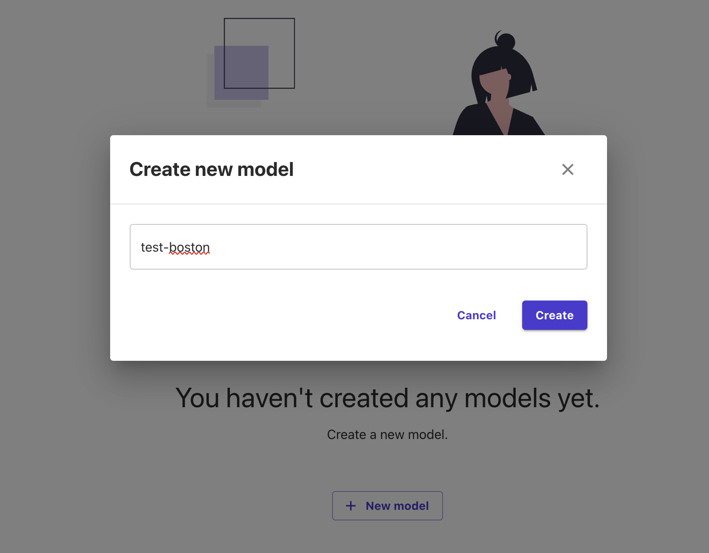

## データセットのアップロード

SageMaker CanvasからS3にデータセットのアップロードも可能な様ですが、有効にする方法が不明であったため、事前にS3にアップロードしておいたデータセットを指定します。

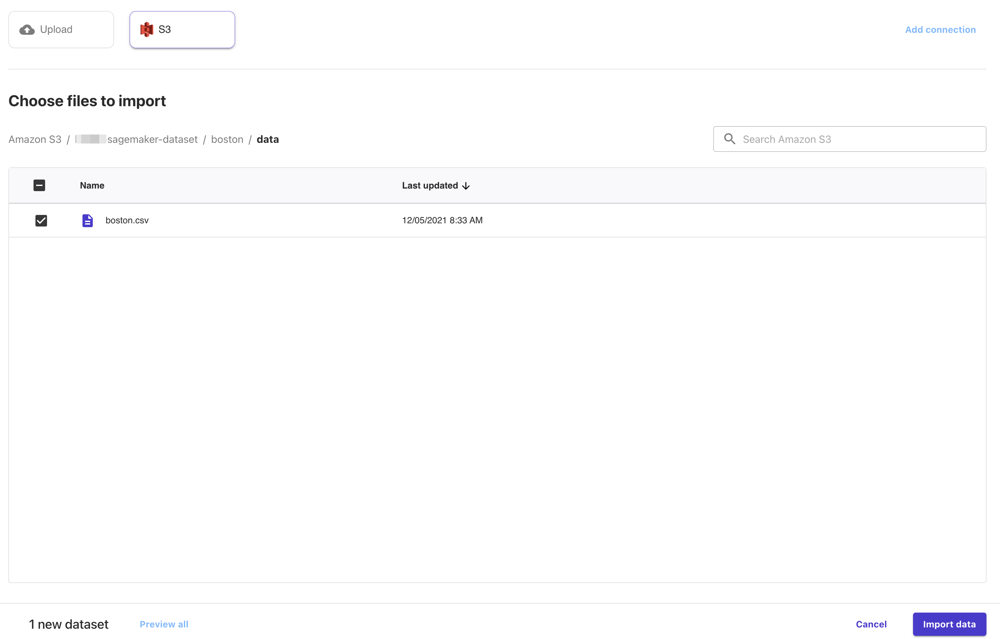

指定すると列数や行数が分析されます。今回は一つのファイルのみですが、複数ファイルを結合してデータセットとすることも可能です。また、データセットのソースとしては、S3上のファイル以外に、RedshiftやSnowflakeのテーブルも指定が可能なようです。

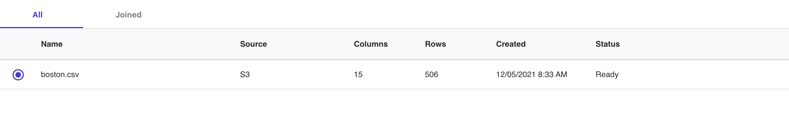

## データの確認とターゲットの指定

データセットから推論対象となるカラムとタスクのタイプを選択します。指摘できるターゲット(推論対象となる)カラムは現在の所1つだけです。ターゲットを指定するとタスクのタイプを自動的に判定してくれます。今回は`Number Prediction`、つまり回帰タスクです。

なお、カラム毎の型は自動的に推測されます。また、ヒストグラムや欠損値の割合なども表示されるため、データ特性の確認も可能です。

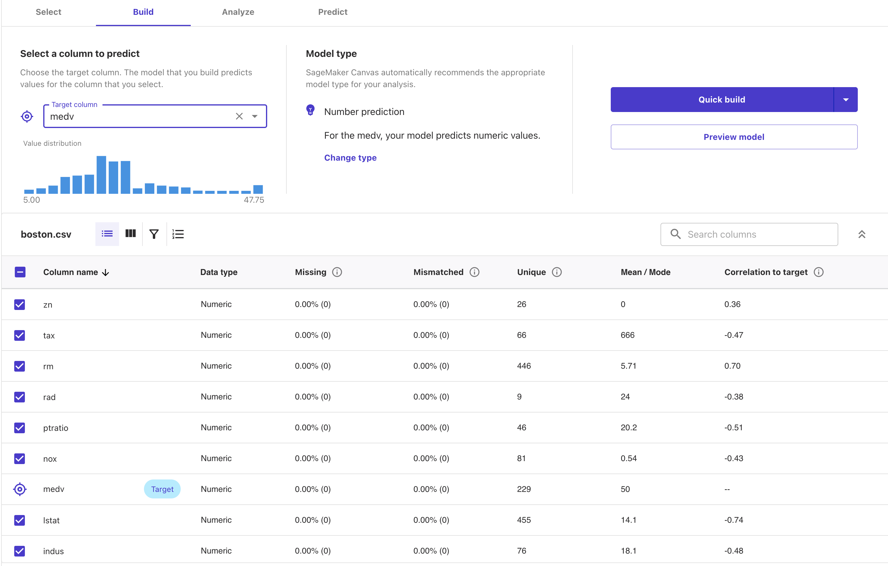

前述のようにタスクの種類は自動的に判別されますが、意図と異なる場合は変更することも可能です。現在対応しているタスクの種類は以下の通りです。

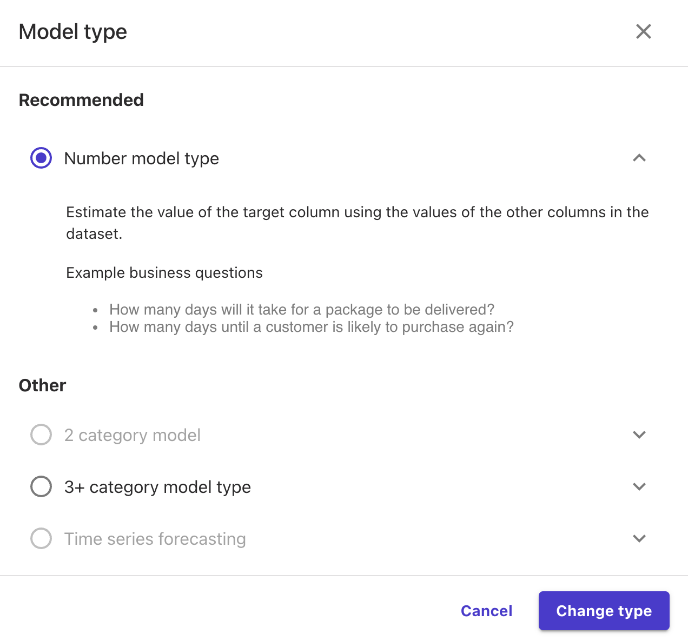

SageMaker Canvasの素晴らしい点として、`Preview Model`を押下することでサンプルデータを自動的に選択して生成するモデルの精度の予測を出してくれます。少し時間がかかりますし、あくまで一部のデータによる参考値ですが、できあがるモデルの性能を確認しながらターゲットを選択できるのは非常に便利です。

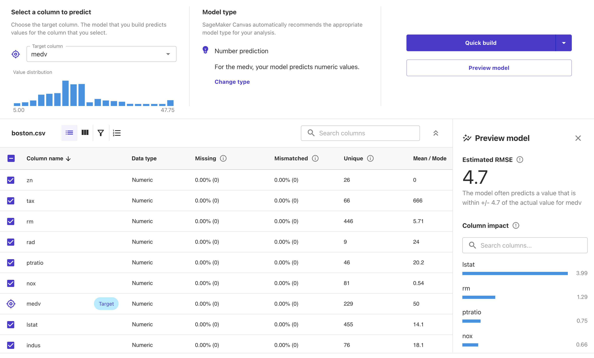

## モデルのビルド

ターゲットを選択し、タスクの種類を確認したらモデルをビルドします。後は全てSageMaker Canvasが自動的に行ってくれます。今回使用するデータセットは500行ぐらいですが、処理時間の予測として1時間45分となっており、データ量に対して処理時間が長いかな?と感じです。

ただし、何か作業が必要なわけでは無いので、全てお任せでいいのは楽ちんです。

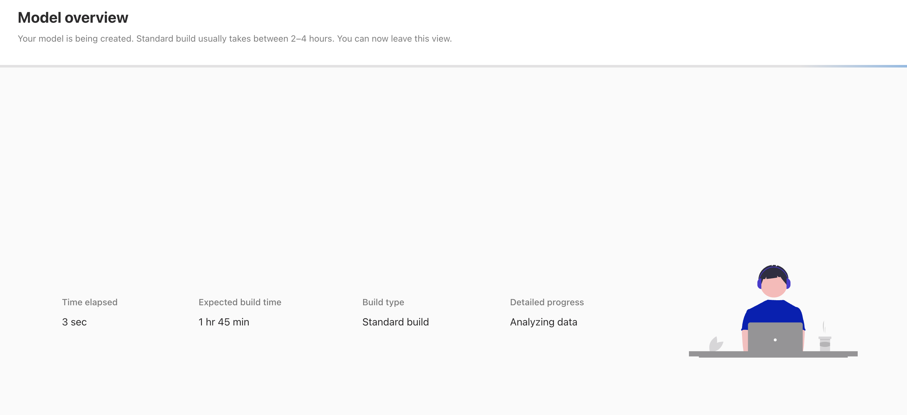

## モデルの性能確認

モデルの生成が完了すると精度が表示されます。今回は回帰タスクであるため指標はMSEが選択されています。なお、表示されている値はMSEなのですが、ツールチップではRMSEと表記されています。これは、恐らくRMSEの値を表示するのが意図した仕様だと思われるため注意です(すぐに修正されると思いますが)。

モデルの性能を確認する画面では、特徴量となるカラム毎のターゲットへの影響を確認することができます。

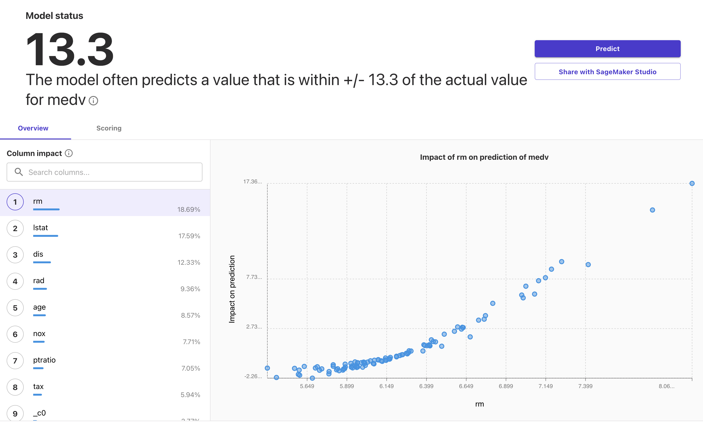

また、推論された値と実際の値の分布についても確認することが可能です。

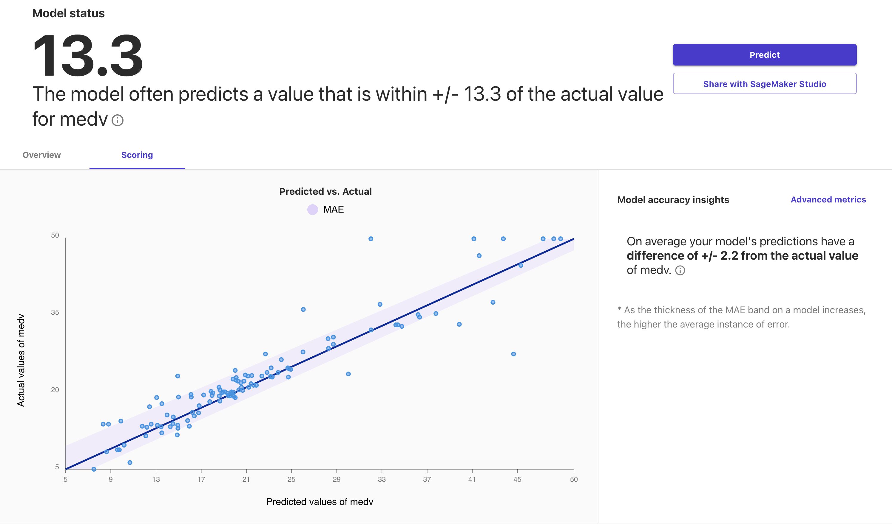

`Advanced metrics`ではMSE(RMSE)以外の指標を確認することが可能です。

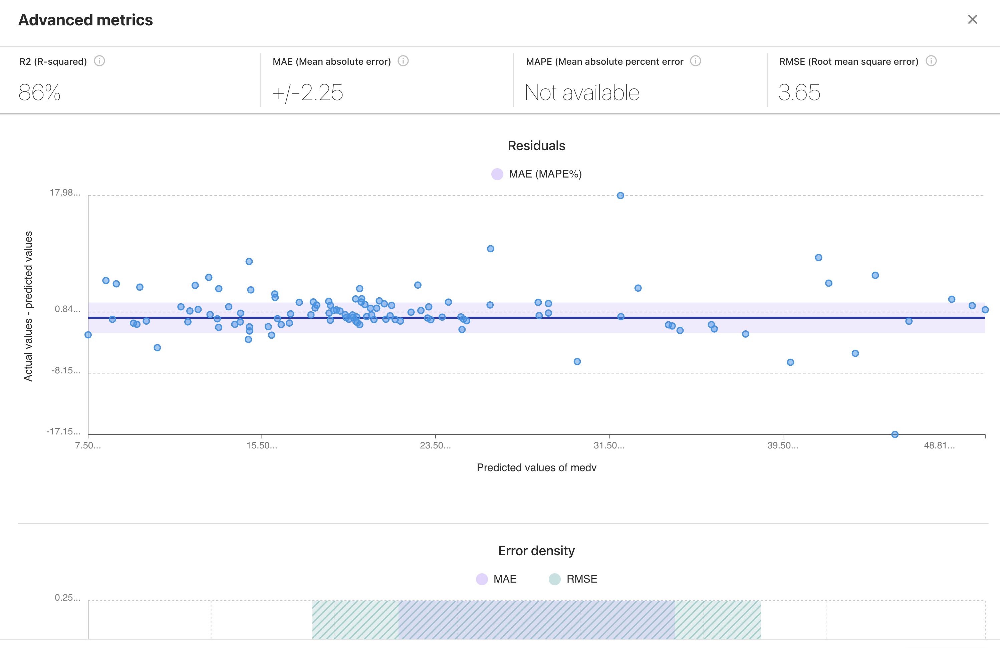

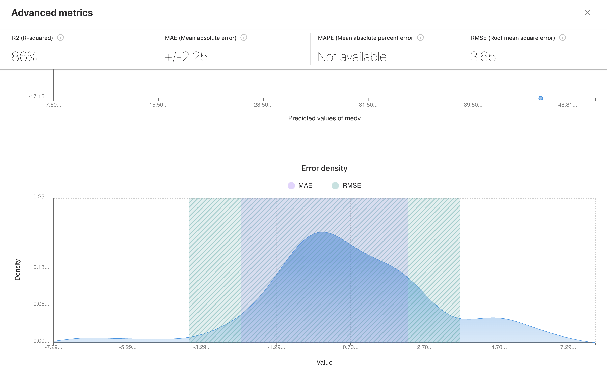

## オンライン推論

生成したモデルに対してはファイルをアップロードしてのバッチ推論や、特徴量となる値を入力してその場で推論することも可能です。以下はその場で推論する画面(Single prediction)の例です。

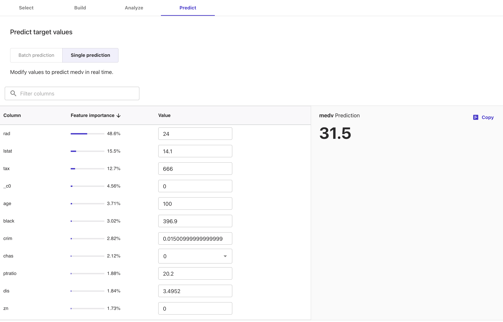

## PyCaretとの比較

PyCaretはプログラミングを伴いますが、同じようにデータセットを指定するだけでモデルの選択や生成を行ってくれるAutoMLです。以下は同じデータセット(ボストン住宅価格データセット)において、PyCaretとSageMaker Canvasで生成されたモデルの精度を比較した結果です。

なお、データセット全体は同一ですが、テスト用のデータセットを固定して比較したものではなく、細かな条件で結果は変化するため、あくまで実行例の一つとしてご理解ください。

| Application          | RMSE   | R2     |
| -------------------- | ------ | ------ |
| SageMaker Canvas     | 3.65      | 0.86      |
| PyCaret(Tuned Model) | 4.1225 | 0.7954 |
| PyCaret(Stacking)    | 2.9847 | 0.8927 |

PyCaretの性能指標は[PyCaretで学ぶデータ分析におけるAutoMLの利用](https://www.inoue-kobo.com/ai_ml/pycaret-basic/index.html)からの抜粋です。

## SageMaker Canvasの動作

SageMaker CanvasをGUI(コンソール)から利用していると意識することはありませんが、裏側ではSageMakerの各種機能が実行されています。例えば以下の様にSageMakerのトレーニングジョブが記録されています。

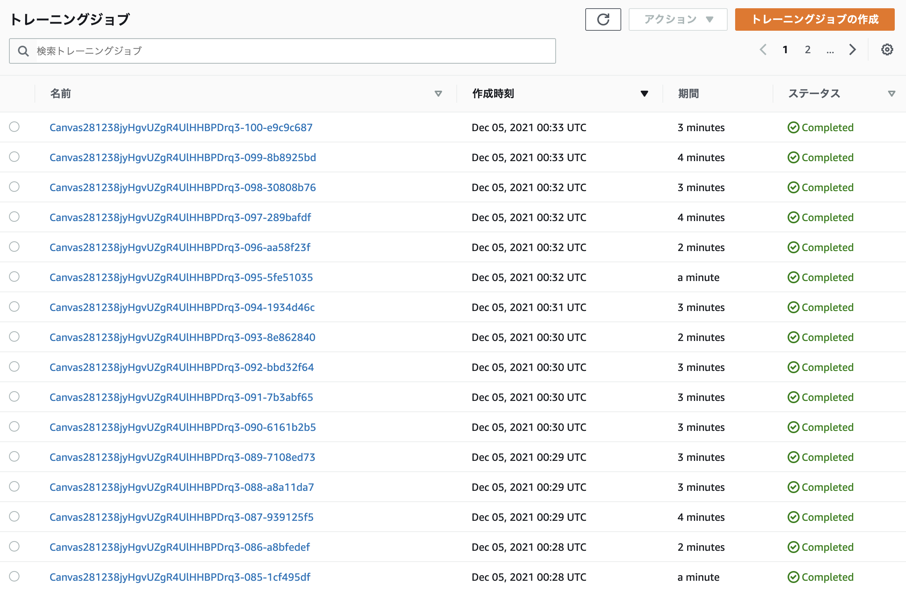

今回の実行では104個のトレーニングジョブが実行されていました。他にも前処理や特徴量分析(SageMaker Clarifyを利用)としてプロセッシングジョブ、ハイパーパラメータチューニングのジョブなども実行されていました。

SageMaker Canvasのコンソールからは生成されたモデルのアルゴリズムを確認することができませんが、SageMakerのコンソールからであればハイパーパラメータチューニングされたモデルをみることで、詳細を確認する事ができます(今回選択されたのはMXNetになっているため、コードの詳細をみないとニューラルネットワークであること以上の仕組みがわかりませんが)。

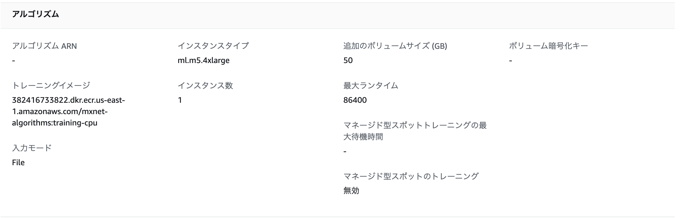
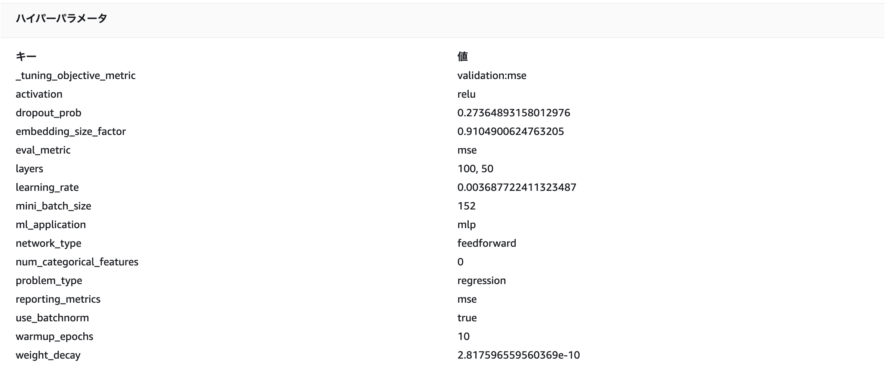

実装的にはSageMaker AutopilotのGUI版という感じです。

## まとめ

AutoMLは単純に精度を求めて使用する仕組みではないと思いますが、データ量に応じたコーディング上の工夫や推論エンドポイントの提供などを気にすることなく全てGUIで完結するため、手軽にデータを分析する手段としてエンジニアであっても利用するシーンがあると思われます。

特にSageMaker Canvasは裏の仕組みがSageMakerであるため、SageMaker Studioなどでそのまま再利用することができます。適用できるタスクは制限されますが、ベースラインの生成で活躍しそうです。

なお、気になる料金ですが、データセットのセル数とセッション時間の2つの合計です。恐らくトレーニング時間ではなく、データセットのデータ量で決定すると思うのですが、セッション時間の定義が今一理解できませんでした。今回の利用では少なくとも$30かかっており、個人で試される方はご注意ください。

## 参考文献

* [Announcing Amazon SageMaker Canvas – a Visual, No Code Machine Learning Capability for Business Analysts](https://aws.amazon.com/jp/blogs/aws/announcing-amazon-sagemaker-canvas-a-visual-no-code-machine-learning-capability-for-business-analysts/)
* [PyCaretで学ぶデータ分析におけるAutoMLの利用](https://www.inoue-kobo.com/ai_ml/pycaret-basic/index.html)